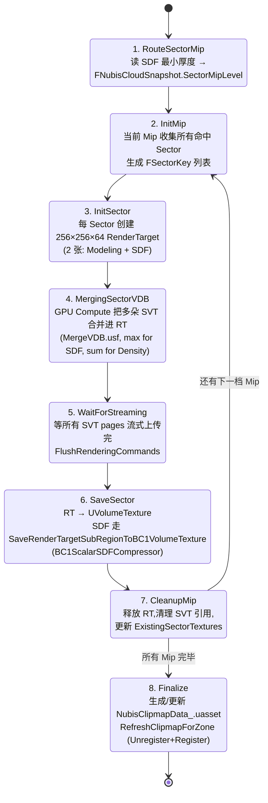

# 烘焙流水线 — Houdini → VDB → BC1 → Sector → Cook

NubisCloud 烘焙是**两阶段流水线**：阶段一 Houdini 通过 **Omniverse Python Bridge** 串行产 OpenVDB，阶段二 GPU Compute 状态机把 SVT 合并到 Sector 纹理 (`Modeling` 走 `TC_Default`、`SDF` 走 BC1 标量编码)。本页拆解每阶段每一步的资产、回调、状态机入口、磁盘落点，以及最容易踩坑的 BC1 SDF 压缩与 Mip Ring 路由细节，目标是让美术 / TA / 渲染程序员在不读源码的前提下，照着流程图把一张新关卡的云从 Houdini 推到 cooked `.uexp`[^bake]。

> 写新地图体积云的推荐顺序是 [第 1 页](1.%20总览%20—%204%20处分散位置与跨模块%20API.md) → [第 9 页](9.%20NubisCustom%20插件%20—%20新路径唯一;%20老路径是蓝图遗骸.md) → 本页 → [第 11 页](11.%20关卡放置%20Cookbook%20—%20给新地图加云的%208%20步流程.md)。本页是 **数据流主线**，第 11 页是 **手动操作清单**。

## 1. 流水线全景 (ASCII)

```
┌──────────────────────────────────────────────────────────────────┐
│ 阶段一: Houdini → VDB Cache                                     │
└──────────────────────────────────────────────────────────────────┘

  [Houdini Session + lop_openvdb HDA]
         │ (Omniverse Nucleus, USD Stage / Live Session [推测])
         ▼
  [BP_NubisTOmniversePythonActor]               ← Editor 内 Spawn
         │  PythonAsset = lop_openvdb_higame.lop_openvdb_higame
         │                (TUSDPythonAsset, 16 KB)
         │  SetupBluprint() → OnOmniverseInitFinished
         ▼
  [SNubisToolsPanel::ProcessNextBakeTask()]    ← 串行队列
         │  逐 ANubisHiCloud2Actor:
         │    收集 Transform + 16 个 HoudiniParams
         │    打包 FNubisCloudSnapshot
         │    Omniverse → Houdini → OpenVDB → SVT
         ▼
  [Content/Maps/<Lv>/NubisVDBCache/]
         │  Voxel{N}/{ActorLabel}_{GUID}.uasset
         │    (UStaticSparseVolumeTexture)
         │  NubisVDBCache_Config.uasset (UNubisVDBDataAsset)
         │    TMap<FGuid, FNubisCloudSnapshot> SavedClouds
         │    TMap<FSectorKey, TSoftObjectPtr<UVolumeTexture>>
         │      ExistingSectorTextures
         ▼
┌──────────────────────────────────────────────────────────────────┐
│ 阶段二: VDB Cache → Sector (GPU Compute 状态机)                  │
└──────────────────────────────────────────────────────────────────┘

  [SNubisToolsPanel::StartAsyncVDBMerge()]
         │  8 阶段:
         │  RouteSectorMip → InitMip → InitSector →
         │  MergingSectorVDB → WaitForStreaming → SaveSector →
         │  CleanupMip → Finalize
         ▼
  [Content/Maps/<Lv>/NubisQuickCloud/Sectors/]
         │  Mip{N}_Sector_{X}_{Y}_{Z}_Modeling.uasset (TC_Default)
         │  Mip{N}_Sector_{X}_{Y}_{Z}_SDF.uasset      (BC1 标量, 4 bpp)
         │  256×256×64 体素/张
         ▼
  [NubisQuickCloud/NubisClipmapData_<Zone>.uasset]
         │  UNubisClipmapDataAsset 软引用索引
         │  TMap<FSectorKey, FNubisClipmapCacheElement>
         ▼
┌──────────────────────────────────────────────────────────────────┐
│ 阶段三: Cook                                                     │
└──────────────────────────────────────────────────────────────────┘

         │  UE Cook → BC1ScalarVolumeTexture::Serialize
         │  (Override 阻止 UE 重压缩,blocks 原样写入)
         ▼
  [Cooked .uexp / .ubulk]
         │  NubisVDBCache/ 不入包 [推测]
         │  NubisQuickCloud/Sectors/ 全部入包
         ▼
  [运行时 NubisClipmapSubsystem::Tick]
         │  StreamableManager.RequestAsyncLoad(SoftPath)
         │  → CopyTexture → Clipmap VolumeTexture 环形位置
```

阶段边界很清楚：**阶段一只产 SVT 中间产物，阶段二把 SVT 化成 Sector 终产物**。两个阶段都在 Editor 内运行，而且必须先**全部完成阶段一**(整张地图所有 HiCloud 都烘完 VDB)，再触发阶段二的合并状态机。这是因为合并需要按 Sector 横向汇总多朵云的密度/SDF[^bake]。

## 2. 阶段一：Houdini → VDB Cache

### 2.1 入口资产 — `lop_openvdb_higame` 的真实身份

很多人第一眼以为 `lop_openvdb_higame.uasset` 是 Houdini Engine 的 HDA，但代码证据是它是 **TUSDPythonAsset**(16 KB)，通过 `UnrealOmniverse` 插件桥接[^bake]：

```cpp
// SNubisToolsPanel.cpp:1913
FString PythonAssetPath = TEXT(
  "/Script/TUSDEditor.TUSDPythonAsset'"
  "/Game/EditorOnly/NubisTools/lop_openvdb_higame.lop_openvdb_higame'");
```

桥接路径是：

| 层 | 资产 / 类 | 大小 | 角色 |
|---|---|---|---|
| Python 脚本 | `lop_openvdb_higame.uasset` | 16 KB | `UTUSDPythonAsset`，定义 LOP 网络如何从 Mesh + Params 产出 VDB |
| Bridge Actor | `BP_NubisTOmniversePythonActor.uasset` | 402 KB | `ATOmniversePythonActor` 蓝图子类，负责跟 Omniverse Nucleus 通信 |
| 编辑器面板 | `WBP_NubisEditorUtility.uasset` | 1.3 MB | 旧的 EditorUtilityWidget，与新 `SNubisToolsPanel` 共存 |
| Slate 面板 | `SNubisToolsPanel`(C++) | — | 真正的烘焙工作流入口，5254 行 cpp[^plugin-old] |

工具面板按下「烘焙 HiCloud」之后会做：

1. `World->SpawnActor<ATOmniversePythonActor>` — Editor 世界里临时落地一个 Omniverse Bridge Actor。
2. 反射 `SetPythonAsset(lop_openvdb_higame)`、`SetupBluprint()`。
3. 注册 `OnOmniverseInitFinished` 回调，**在回调里才开始消费烘焙队列**(避免 Houdini 还没握上手的时候推数据)。
4. 串行 `ProcessNextBakeTask()`：每次取一个 `ANubisHiCloud2Actor`，组装 `FNubisCloudSnapshot`，触发一次远程 Houdini 模拟，等回包，落盘 SVT。

> **[推测]** Houdini 内部的 LOP 网络具体用了哪些节点(`VDB From Polygons` ? `Pyro Solver` ? VDB advection ?)是黑盒，因为 `.uasset` 只存了 USD path 与参数 schema，Python 脚本本体在 Houdini Hip 工程里。本笔记不展开。

### 2.2 串行的原因 — Omniverse 单 Session

**为什么要串行而不是 N 路并行**：Omniverse Nucleus 到 Houdini 是一对一的 Live Session，**Houdini 每次只能同时跑一个 LOP 网络求解**。代码里 `ProcessNextBakeTask` 用 `BakeQueue.Dequeue()` 配合一个全局 `bIsBaking` flag 实现互斥。如果触发第二次烘焙时第一次还没完，按钮被 disable[^plugin-old]。

### 2.3 `FNubisCloudSnapshot` 字段对照表

每烘一朵云就把当时所有可影响产物的输入 freeze 成一个 Snapshot 存进 DataAsset，目的是**脏判定** —— 下一次再烘同一朵 HiCloud，对比 Snapshot 没变就跳过(`operator==` 用 `KINDA_SMALL_NUMBER` 容忍浮点抖动)[^plugin-new]。

| 字段 | 类型 | 作用 | 阶段 |
|---|---|---|---|
| `ActorUniqueID` | `FGuid` | HiCloud 唯一 ID，等于 `SavedClouds` 的 TMap key | 阶段一/二 |
| `CacheMipLevel` | `int32` | 由 Mesh 外接盒粗判路由到 `Voxel{N}/` 子目录 | 阶段一(决定 SVT 落盘) |
| `SectorMipLevel` | `int32` | SDF 厚度精判路由的 Mip(`[3, MipCount-1]` 或 `INDEX_NONE`) | 阶段二(决定写哪张 Clipmap VolumeTexture) |
| `WorldMeshBounds` | `FBox` | Snapshot 时刻的世界 AABB | 阶段二切 Sector 用 |
| `GlobalLocation/Scale/Rotation` | `FVector / FVector / FRotator` | Transform 三件套 | 阶段二把 SVT 投影回世界用 |
| `HoudiniParams` | `FNubisHoudiniParams`(16 floats) | `SDFOffset / DensityScale / NoiseFreq / …` | 阶段一发给 Houdini，阶段二只做脏判定 |
| `VDBFromHDA` | `TSoftObjectPtr<UStaticSparseVolumeTexture>` | Houdini 烘出的 SVT 软引用 | 阶段一写、阶段二读 |

> **关键事实 12**：`UNubisVDBDataAsset` **运行时零消费**(raw#7 §6 验证：`.cpp` 全文只一行 `#include`，没有 `PostLoad/Serialize`)。Snapshot 只在 Editor 烘焙时被读，运行时走 `UNubisClipmapDataAsset` 这条独立链路。

### 2.4 Mip 路由 — 为什么 Mip 0-2 不出 Sector

`SNubisToolsPanel.h` 顶端注释直接写明：「**只为 Mip3+ 创建 VolumeTexture**」。理由是物理体素与 Mip 的对应关系：

| Mip | VoxelSize (m) | SectorWorldSize (m) | 行为 |
|---:|---:|---:|---|
| 0 | 1 | 256 | **不产 Sector**[开放问题] |
| 1 | 2 | 512 | **不产 Sector** |
| 2 | 4 | 1024 | **不产 Sector** |
| 3 | 8 | 2048 | 产 Sector — Mip Ring 内层起点 |
| 4 | 16 | 4096 | 产 Sector |
| 5 | 32 | 8192 | 产 Sector — Mip Ring 外层 |

`BaseVoxelSize = 1m`、`SectorSize = 256×256×64`(关键事实 18)。Mip 0-2 的体素小、单 Sector 体素覆盖范围小，但 LV_KTD / LV_ZC_YLD 实际烘出的所有 Sector **都从 Mip3 起**。运行时近距离观察(Near pipeline，`MipRingCrossoverCm = 500cm`，关键事实 7)实际采的是 `VoxelCloudModelingDataTexture_Mip3`，更精细的 Mip 0-2 没有产物可采。

> **[开放问题]** Mip 0-2 的精度数据是否完全不使用？还是说 Near pipeline 用 Reconstruct 高频补偿了？raw#8 §8 留白。

## 3. 阶段二：VDB Merge 状态机

### 3.1 8 阶段状态机

`SNubisToolsPanel::StartAsyncVDBMerge()` 是合并的总入口，烘焙完成后默认延迟 2 秒触发。状态机本身是 GT 串行，但每步内部会 enqueue render command 到 RT 跑 Compute。



### 3.2 每 Sector 两张纹理

阶段二每个命中 Sector 至少产出 2 张 `UVolumeTexture`：

| 类型 | 纹理格式 | 压缩 | 存什么 | 运行时绑定 |
|---|---|---|---|---|
| Modeling | `UVolumeTexture`(BC6H) | `TC_Default`(标准 UE 压缩) | 颜色 + Density + Detail | Material Param `VoxelCloudModelingDataTexture_MipN` |
| SDF | `UBC1ScalarVolumeTexture` | **BC1 标量(DXT1, 4 bpp)** | 距离场 16-bit scalar | Material Param `VoxelCloudSDFTexture_MipN` |

文件命名固定为 `Mip{N}_Sector_{X}_{Y}_{Z}_{Modeling|SDF}.uasset`，其中 `{X,Y,Z}` 是世界空间 SectorIndex(`floor(WorldPos / SectorWorldSize)`，全局对齐，跨 Zone 同公式)，所以理论上**两个物理重叠的 Zone 在同 Mip 同 Sector 上产出会冲突** — 但项目内部约定 Zone 不重叠，所以没看到冲突处理代码[^plugin-new]。

### 3.3 BC1 SDF 压缩(本页核心小节)

SDF 用普通的 `R16F` 存其实只要 16 bpp，BC1 之后压到 4 bpp，**省 4 倍显存**。这套算法来自 Guerrilla Games《Horizon Forbidden West》的 BCn-for-Scalar Trick[^bake]：

#### 3.3.1 编码思想

BC1 本来是为 RGB 设计的：每 4×4 块两个端点 RGB(`color0`、`color1`)各 16-bit，再加 16 个 2-bit 索引。把 RGB 三个通道当成「同一个标量的三段冗余表达」，按一个**固定的解码 dot 向量**线性组合就能把 R+G+B 还原成一个高精度 scalar。Guerrilla 给的最优向量是：

```hlsl
// 解码: 在 Material / Compute Shader 内
float Decode(float3 RGB)
{
    return dot(RGB, float3(0.96414679, 0.03518212, 0.00067109));
}
```

#### 3.3.2 量化约束 — Undershoot

体积云 SDF 的物理含义是「到云表面的距离」，raymarch 时 `step = SDF(p)`，**SDF 必须 ≤ 真实距离**才不会穿透。BC1 量化是有损的，所以编码器追加一个硬约束：

```
∀ block, ∀ voxel: Decode(BC1 reconstructed RGB) ≤ Source 16-bit scalar
```

也就是 **永远 undershoot**，宁可 step 偏小、走更多步、也不允许 step 偏大、刺穿表面。最大误差 ~`2e-5`(~1/50000，对 R16 单位 1.0 量化级)。

#### 3.3.3 编码器入口

| 入口 | 作用 | 调用方 |
|---|---|---|
| `Nubis::SDFCompress::CompressR16VolumeToBC1(UVolumeTexture*)` | 高层 API，`UVolumeTexture` → `UBC1ScalarVolumeTexture` | `BP_NubisToolLibrary::SaveRenderTargetSubRegionToBC1VolumeTexture` |
| `Nubis::SDFCompress::BC1Scalar::BuildTexture3D` | 底层逐块编码 | 上层 |
| `BC1Scalar::BuildBlock(16 floats, UnpackDot) → uint64` | 单块 8 字节输出 | 上层 |
| `BC1Scalar::GetDefaultUnpackDot()` | 返回 Guerrilla 最优向量 | — |

参数控制：

```cpp
struct FSDFCompressOptions {
    float SourceMin = 0.0f;
    float SourceMax = 1.0f;
    bool  bAutoDetectRange = true;     // 默认开,扫源数据自动求 Min/Max
    FVector UnpackDot = GetDefaultUnpackDot();
    bool  bParallel = true;
    bool  bClampOutOfRange = true;
};
```

`bAutoDetectRange = true` 是默认路径；运行时 Shader 怎么拿到 remap 参数？raw#8 §8 把这条留为 [开放问题]。本页 **[推测]**：要么固定常数 baked 进 Shader、要么作为 MaterialParameter 由 Manager 推到 MID(`UMaterialInstanceDynamic`)。

#### 3.3.4 自定义子类阻止 UE 重压缩

`UBC1ScalarVolumeTexture` 是引擎级自定义子类(`Engine/Source/Runtime/Engine/Classes/Engine/BC1ScalarVolumeTexture.h`)，**override 了 3 个虚函数**[^bake]：

| 虚函数 | 改写目的 |
|---|---|
| `Serialize` | Cook 时直接写 BC1 blocks 到 `.uexp`，不走 `UTexture::Serialize` 默认路径 |
| `PostLoad` | Load 时跳过引擎 derived data 重建 |
| `UpdateResource` | 直接把 BC1 blocks 当 `PF_DXT1` 上 GPU，不让 `FTexture3DResource` 找原始未压缩 mip |

不这么做会被 UE 默认 `TC_Default` pipeline 当 RGB 重压一遍，Guerrilla 的 undershoot 约束就被破坏了 — 你的 raymarch 会随机穿模。

## 4. 阶段三：Cook

### 4.1 NubisVDBCache 是 EditorOnly 吗？

**[推测]** 是。证据链：

1. `NubisVDBCache_Config.uasset`(`UNubisVDBDataAsset`)的 `.cpp` 全文只有一行 `#include`，**没有 PostLoad / Serialize / OnPreCook hook**(raw#7 §6)。
2. 运行时 `UNubisClipmapSubsystem` 只引用 `UNubisClipmapDataAsset`，没有任何路径查找 `UNubisVDBDataAsset`。
3. SVT 资产单文件可达 30 MB+，整张 LV_ZC_YLD 的 VDBCache 是 **4.7 GB**(下表)，把这部分入包会让 PS5 包大到不可接受。
4. 但代码里没有显式 `bIsEditorOnlyObject = true` 或者 `EditorOnlyDefault` 包名前缀 — 推断是依赖**没有被运行时引用**这一点，让 Cook 自然丢弃。

> 如果将来重构出现「运行时也要回 VDBCache 取参数」的需求，必须显式加 `IsEditorOnlyObject` 覆写，否则 4 GB 资产会爆包[^plugin-new]。

### 4.2 资产体积对比

| 关卡 | VDBCache 总大小 | QuickCloud 总大小 | Sector 数 | 格式 |
|---|---:|---:|---:|---|
| LV_KTD | 1.2 GB | 148 MB | 88 | 新 Sector |
| LV_ZC_YLD | 4.7 GB | 383 MB | 402 | 新 Sector |
| LV_FGD_01 | 4 KB(几乎空) | 34 MB | 0 | 旧 per-Zone |
| LV_WD_FAHN | 44 KB | 1.9 MB | 0 | 旧 per-Zone |
| WeatherSystem/Maps/NubisQuickCloud | — | 9.4 MB | 0 | 旧 per-Zone |

观察：

- **新 Sector 格式压缩比 ~12×~32×**：LV_ZC_YLD 4.7 GB SVT 中间产物压成 383 MB Sector 终产物。
- LV_FGD_01 / LV_WD_FAHN VDBCache **几乎为空** — 烘焙完只剩 Snapshot Config，SVT 已被清理；产物是旧格式 per-Zone 单张 VolumeTexture。
- WeatherSystem 全局云层与关卡级云层并存。两者运行时叠加方式见 [开放问题](#5-开放问题)。

### 4.3 旧 / 新格式并存

| 维度 | 旧格式 | 新 Sector 格式 |
|---|---|---|
| 适配关卡 | LV_FGD_01, LV_WD_FAHN, WeatherSystem | LV_KTD, LV_ZC_YLD |
| Modeling 文件 | `NubisModelingDataBP_NubisZone_C_{N}.uasset`(per-Zone 单张) | `Sectors/Mip{N}_Sector_{X}_{Y}_{Z}_Modeling.uasset` |
| SDF 文件 | `NubisSDFDataBP_NubisZone_C_{N}.uasset`(per-Zone 单张) | `Sectors/Mip{N}_Sector_{X}_{Y}_{Z}_SDF.uasset`(BC1) |
| 索引方式 | 直接 `TObjectPtr` 硬引用 | `UNubisClipmapDataAsset` 软引用，运行时按需流式 |
| 流式策略 | 关卡加载时全部进显存 | `StreamableManager.RequestAsyncLoad`，仅 Clipmap 窗口内 Sector |
| 显存占用 | 整 Zone 一次性 | 仅当前 6×2×2×2 = 48 个 Sector(理论上限) |
| 迁移工具 | `SNubisToolsPanel::OnMigrateOldActorToNew`(SNubisToolsPanel.cpp:505) | — |

LV_KTD 还有一种**过渡态产物** `NubisModelingData_NubisZone2_Mip{0-5}.uasset` — 按 Mip 整体出一张，与新 Sector 并存(raw#8 §4)。这是迁移到一半的状态[^plugin-new]。

### 4.4 触发链 — 烘焙完 2 秒自动 Merge

```
SNubisToolsPanel::OnBakeHiCloud
  └─ FBakeQueue 累积 N 朵云
  └─ Spawn BP_NubisTOmniversePythonActor
  └─ for each Snapshot:
       ├─ ProcessNextBakeTask (Omniverse → Houdini → SVT)
       └─ Save Snapshot to UNubisVDBDataAsset.SavedClouds
  └─ AllBakeComplete delegate
       └─ FTSTicker::AddTicker(2.0s) → PerformVDBMerge()
            └─ StartAsyncVDBMerge()
                └─ 8 阶段状态机 (§3.1)
                     └─ Finalize:
                          ├─ Save NubisClipmapData_<Zone>.uasset
                          └─ RefreshClipmapForZone()
                               └─ NubisClipmapSubsystem::Unregister + Register
```

`RefreshClipmapForZone` 是为了让正在 Editor 里运行的 `UNubisClipmapSubsystem` **立刻看到新产物**：先 `Unregister(Zone)` 销毁旧的 Manager(走 §3.5 安全顺序 Flush + ReleaseVolumeTextures)，再 `Register(Zone)` 重建，新 Manager 读最新的 `UNubisClipmapDataAsset` 软引用表。这一步保证「点完按钮立刻能在 Editor 视口看到新云」，不需要重启 PIE[^plugin-new]。

## 5. 开放问题

下面 5 条与 raw#8 §8 同步保留：

1. **Houdini 内部黑盒**：`lop_openvdb_higame` 用了哪些 Houdini 节点？是 `VDB From Polygons` + Detail Noise，还是 `Pyro Solver` 模拟？只看 UE 端 .uasset 看不出来，需要 Houdini Hip 工程。
2. **Omniverse 通信协议**：UE → Omniverse → Houdini 是 USD Stage 同步还是 Nucleus Live Session？延迟和稳定性如何？这条决定了能否把烘焙摆到 CI 机器上跑。
3. **旧 → 新格式迁移完成度**：`OnMigrateOldActorToNew` 按钮存在意味着还有未迁移的 LV_FGD_01 / LV_WD_FAHN。`FOutlineFilter_NubisMeshActor` 同时过滤 4 种 Actor 类(raw#1 §3)也佐证场景里仍有老 Actor。
4. **WeatherSystem/Maps/NubisQuickCloud 与关卡 QuickCloud 如何叠加**：通过两个独立 `ANubisZone2Actor` 各跑一份 Clipmap？还是通过统一 Clipmap 的额外 layer？raw#1 §3.5 说渲染端按 Scene 内所有 NubisVolumeProxy 各自一遍 RDG passes，意味着是物理叠加(两次 raymarch 后期 composite)。
5. **`TestVDBMesh/CloudShape_Group.uasset` (90.8 MB) 用途**：该资产暗示 VDB → StaticMesh 的转换实验路径，但主流水线没有调用。**[推测]** 远景云 LOD：把 8 km 外的低频云用 mesh 代替 raymarch，但本笔记没有证据。

## 6. 18 条已知事实速查

> 与 [第 1 页 §3 速查表](1.%20总览%20—%204%20处分散位置与跨模块%20API.md#3-18-条事实) 一一对齐。**全 wiki 共享**，本页用 ★ 标注与烘焙流水线直接相关的 7 条：

| # | 事实 | 本页位置 |
|---|---|---|
| 1 | `HIGAME_ENABLE_NUBIS` 在 `Build.h:1152` 硬编码 = 1 | — |
| 2 | Shader 共 15 个文件(`Engine/Shaders/Private/NubisVolumes/`) | — |
| 3 | Sparse Voxel cvar 全是空壳(4 条 `r.NubisVolumes.SparseVoxel.*` 0 消费) | — |
| 4 | HardwareRayTracing 未接通(cvar 存在但 0 消费) | — |
| 5 | Visualize 模式共 5 个(Radiance / Depth / LightingCache / FarTracing / Reconstruct) | — |
| 6 | Two-Pass: LCache `4→0`, Scattering `0→5` | — |
| 7 ★ | `MipRingCrossoverCm = 500cm` | §2.4 解释 Mip 0-2 不产 Sector 的理由 |
| 8 | LightingCache EMA `β=0.97` | — |
| 9 | Bilateral 4 mode + Far under Near | — |
| 10 ★ | NubisCustom2 是唯一生产路径 | §4.3 旧/新对比 |
| 11 ★ | NubisCustom 4 模块全 Linux deny | §1 阶段一只跑 Win64 Editor |
| 12 ★★ | **`UNubisVDBDataAsset` 运行时零消费 — 本页核心** | §2.3 Snapshot 表 + §4.1 Cook 推断 |
| 13 | Plugin 直接 `ENQUEUE_RENDER_COMMAND`(共 4 处) | — |
| 14 ★ | 多 Zone 不合并 Atlas(per-Zone 独立 6 级 Clipmap + Component) | §3.2 Sector 命名同公式不冲突的隐式约定 |
| 15 ★ | Sector 按需流式(`MaxLoadsPerFrame=8`,首帧 ×4=32,`MaxConcurrentLoads=16`) | §4.3 流式策略 |
| 16 | 渲染顺序: VolumetricFog → NubisVolumes → VolumetricCloud | — |
| 17 | SM5 + Deferred only(`!IsForwardShadingEnabled` 弱过滤) | — |
| 18 ★ | NubisDefaults: `MipCount=6`, `BaseVoxelSize=1m`, `TextureSize=512×512×128`, `SectorSize=256×256×64` | §2.4 Mip 表 + §3.2 Sector 尺寸 |

## 7. 交叉引用

| 想看什么 | 跳哪一页 |
|---|---|
| `SNubisToolsPanel` 按钮全清单与 BP Library 用法 | [第 9 页 NubisCustom 插件](9.%20NubisCustom%20插件%20—%20新路径唯一;%20老路径是蓝图遗骸.md) |
| 关卡放置 step-by-step 实操 | [第 11 页 Cookbook](11.%20关卡放置%20Cookbook%20—%20给新地图加云的%208%20步流程.md) |
| BC1 解码在 Shader 内的真实使用(MipSelector + Slab-Skip) | [第 6 页](6.%20MipSelector%20与%20Sector%20Slab-Skip%20等价方案.md) |
| 调试 / cvar / 平台降级 | [第 12 页 调试与陷阱](12.%20调试%20性能%20平台%20陷阱.md) |
| `FNubisCloudSnapshot` 的 GT/RT 归属 | [第 9 页 §6](9.%20NubisCustom%20插件%20—%20新路径唯一;%20老路径是蓝图遗骸.md) |
| `UNubisClipmapSubsystem::Tick` 的运行时消费链 | [第 4 页 Clipmap 调度](4.%20Clipmap%206%20级调度%20—%20Mip%20Ring%20与%20Two-Pass.md) |

---

[^bake]: raw 笔记 `D:\BranKM\BranKM\raw\higame-nubis-bake-pipeline.md` — 烘焙流水线全景，含 BC1 算法、Sector 状态机、资产体积对比、Cookbook。引用源 `Plugins/NubisCustom/Source/NubisEditorTools/Private/SNubisToolsPanel.cpp`、`Plugins/NubisCustom/Source/SDFCompressEditor/`、`Engine/Source/Runtime/Engine/Classes/Engine/BC1ScalarVolumeTexture.h`。
[^plugin-new]: raw 笔记 `D:\BranKM\BranKM\raw\higame-nubis-plugin-nubiscustom2.md` — NubisCustom2 新路径类层次。引用源 `Plugins/NubisCustom/Source/NubisCustom2/`(`NubisClipmap.cpp/h`、`NubisVDBDataAsset.h`、`NubisClipmapDataAsset.h`、`NubisClipmapSubsystem.cpp`)。
[^plugin-old]: raw 笔记 `D:\BranKM\BranKM\raw\higame-nubis-plugin-nubiscustom.md` — NubisEditorTools / SDFCompressEditor / 老路径 NubisCustom 模块。引用源 `Plugins/NubisCustom/Source/NubisEditorTools/`(`SNubisToolsPanel.cpp/h`、`BP_NubisToolLibrary.h`、`NubisActorFilter.cpp`、`NubisZoneEditorSubsystem.cpp`)。
[^debug]: raw 笔记 `D:\BranKM\BranKM\raw\higame-nubis-debug-and-platforms.md` — 材质函数库 / Visualize / cvar / 平台矩阵。引用源 `Engine/Source/Runtime/Renderer/Private/NubisVolumes/`、`Projects/HiGame/Content/Material/(MaterialFunction|Volumetric)/Nubis/`。
