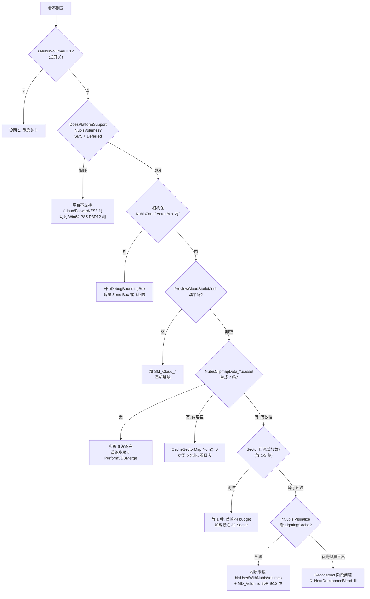

# 第 11 页 · 关卡放置 Cookbook — 给新地图加云的 8 步标准流程

本页是给新地图 `LV_NEW` 添加体积云的端到端 Cookbook,**8 步走完即可在游戏内看到云**。每一步给出工具面板按钮、底层 C++/资产产物、验证方法与常见报错诊断手段。整页面向**美术 / TA / 关卡策划**视角,假设读者已经读过 [第 9 页(NubisCustom 插件结构)](9.%20NubisCustom%20插件%20—%20新路径唯一;%20老路径是蓝图遗骸.md) 与 [第 10 页(烘焙流水线)](10.%20烘焙流水线%20—%20Houdini%20→%20VDB%20→%20BC1%20→%20Sector%20→%20Cook.md);如果只是想快速给新地图把云铺起来,**只看本页就够了**。

> ⚠️ **唯一推荐路径**: 全程使用 **NubisCustom2 新路径** (Zone2/HiCloud2 + ClipmapDataAsset + Sector 流式加载),这也是项目目前**唯一的生产路径**。老路径 (`ANubisHiCloudActor` / `ANubisZoneActor` + `UNubisDataAsset`) 仍能编译,但请不要在新地图使用 — 见 [步骤 0 · 老格式迁移](#步骤-0--老格式迁移lv_fgd_01--lv_wd_fahn) 与 [第 9 页](9.%20NubisCustom%20插件%20—%20新路径唯一;%20老路径是蓝图遗骸.md)。

---

## 0. 流程总览

```mermaid
flowchart LR
    S1["①<br/>放 NubisZone2Actor<br/>(关卡地基)"]
    S2["②<br/>放 HiCloud2Actor<br/>(云朵代理)"]
    S3["③<br/>启 Omniverse<br/>+ Houdini 桥"]
    S4["④<br/>烘焙HiCloud<br/>→ NubisVDBCache"]
    S5["⑤<br/>VDB 合并<br/>→ Sector"]
    S6["⑥<br/>ClipmapData<br/>软引用索引"]
    S7["⑦<br/>刷新 Clipmap<br/>(自动 / 手动)"]
    S8["⑧<br/>Cook + 打包<br/>验证"]

    S1 --> S2 --> S3 --> S4 --> S5 --> S6 --> S7 --> S8

    classDef level fill:#fff4c2,stroke:#d4ae2a,color:#000;
    classDef bake  fill:#e8d3ff,stroke:#8e4fbf,color:#000;
    classDef merge fill:#d3ffd8,stroke:#4fbf63,color:#000;
    classDef rt    fill:#d3ecff,stroke:#4f8ebf,color:#000;
    class S1,S2 level
    class S3,S4 bake
    class S5,S6 merge
    class S7,S8 rt
```



**ASCII 同图(无 Mermaid 渲染时使用)**:

```
[关卡 Outliner]
    ① ANubisZone2Actor      ②  ANubisHiCloud2Actor (×N)
        |                       |
        | (BeginPlay 注册)       | (Snapshot 输入源)
        v                       v
    [UNubisClipmapSubsystem]   [SNubisToolsPanel "烘焙HiCloud"]
        |                       |
        |                       v
        |                   ③ ATOmniversePythonActor
        |                       |  PythonAsset = lop_openvdb_higame
        |                       v
        |                   ④ Houdini → SVT
        |                       |  → NubisVDBCache/Voxel{N}/{Actor}_{GUID}.uasset
        |                       v
        |                   ⑤ StartAsyncVDBMerge 状态机
        |                       |  → NubisQuickCloud/Sectors/Mip{N}_Sector_{X}_{Y}_{Z}_{Type}.uasset
        |                       v
        |                   ⑥ NubisClipmapData_{Zone}.uasset
        |                       |  TMap<FSectorKey, TSoftObjectPtr<UVolumeTexture>>
        |                       v
        +---------------------- ⑦ RefreshClipmapForZone
                                |
                                v
                            ⑧ Cook → Sector 按需流式加载 (×8/帧, 首帧×4 budget)
```

---

## 步骤 1 · 关卡 → 放置 ANubisZone2Actor

### 操作

`ANubisZone2Actor` 是云的"地基" — 它定义了 Clipmap 在世界空间中的覆盖范围、Mip 层数、Sector 尺寸,并在 `BeginPlay` 时把自己注册给 `UNubisClipmapSubsystem`。**一个关卡只允许一个 NubisZone2Actor**(工具面板按钮里也是这么假设的)。

两种放置方法,都行:

1. **Outliner 右键 → 添加 → ANubisZone2Actor** — 经典手工法。
2. **工具面板按钮"查找或创建 NubisZone"**(推荐)— `OnAddOrCreateNubisZone` 回调会先 `TActorIterator<ANubisZone2Actor>` 扫一遍当前 Level,如果已经有就选中并 focus,否则新建。**自动避免重复放置**。

放置后调整以下属性:

| 属性 | 默认 | 含义 |
|---|---|---|
| `ClipmapMipCount` | 6 | Mip 0 → Mip 5 共 6 级,Mip0 体素=1m,Mip5=32m |
| `ClipmapDataAsset` | 空 | 步骤 6 自动写入,不要手动设 |
| Zone Box (BoundingBox) | (0,0,0)~默认大小 | 必须包住关卡 playable 区域,否则相机走出 Zone 没云 |
| `bDebugBoundingBox` | false | 工具面板按钮"显示 NubisZone 边界框"切换 |
| `ClipmapDownsampleFactor / ClipmapVoxelSize` | 引擎默认 | **一般不改**,改了之后所有 Sector 烘焙都得推倒重来 |

### 产物

- 关卡 `.umap` 内多了 1 个 `ANubisZone2Actor` 实例,持有 1 个 `UHeterogeneousUBSVolumeComponent` 子组件。
- `ClipmapDataAsset` 字段为空(下一步会指向"还不存在"的资产路径)。

### 验证

- Outliner 出现 `ANubisZone2Actor`(Outliner 过滤器 `FOutlineFilter_NubisMeshActor` 红色图标会高亮 — 见 [第 9 页 · NubisActorFilter](9.%20NubisCustom%20插件%20—%20新路径唯一;%20老路径是蓝图遗骸.md#noubisactorfilter))。
- 编辑器视口此时不应有云 — Sector 数据还没生成。

### 常见报错

- ❌ **"World already has a NubisZone2Actor"**: 工具面板把这种情况当 idempotent 操作处理,只 focus 不重建。手动用 Outliner 法时要自己防重复。
- ❌ **"Zone Box 比关卡还小"**: 视觉表现 = 走出 Zone 区相机切到没云。**调试要点**: 打开 `bDebugBoundingBox` 看绿色框,若相机不在框内就走错位置。

---

## 步骤 2 · 关卡 → 放置 ANubisHiCloud2Actor (云朵代理)

### 操作

`ANubisHiCloud2Actor` 是**单朵云**的烘焙单元。一个 Zone 可以放多个 HiCloud(项目里 LV_KTD 有 88 朵 / Sector,LV_ZC_YLD 有 402 朵 / Sector,见 [第 10 页 · 资产量级表](10.%20烘焙流水线%20—%20Houdini%20→%20VDB%20→%20BC1%20→%20Sector%20→%20Cook.md#资产量级对比))。

放置方法:

1. **工具面板按钮"添加 HiCloud"** (`OnAddHiCloud`) — `SpawnActor<ANubisHiCloud2Actor>` 在相机前方,然后 `OnSelectLastHiCloud` 自动选中便于继续配置。
2. **Outliner 复制现有 HiCloud2Actor 并改 Transform** — 也行,继承所有 HoudiniParams 配置。

放置后必填:

| 字段 | 来源 | 含义 |
|---|---|---|
| `PreviewCloudStaticMesh` | `Content/Developers/wenxiangzuo/CustomNubisVolume/VDBs/SM_*` | 云形状代理 Mesh,Houdini 用它的外接盒决定 voxel 体积 |
| Transform (Location/Rotation/Scale) | 手动 | 确定云在世界中的位置 + 大小 + 朝向 |
| `FNubisHoudiniParams` (16 floats) | 手动 / 复制其他 HiCloud | SDFOffset / DensityScale / NoiseAmpl / 等等(见 [第 10 页](10.%20烘焙流水线%20—%20Houdini%20→%20VDB%20→%20BC1%20→%20Sector%20→%20Cook.md)) |
| `CloudPresetType` | `EHiCloud2PresetType::MeshAttached` | 三档:`MeshAttached`(默认,Mesh 形状) / `PureVisual` / `Custom` |

`PreviewCloudStaticMesh` 推荐选三种**真实云类型 VDB 模板**:

| 模板 | 资产 | 用途 |
|---|---|---|
| 积云 (Cumulus) | `VDBs/Altocumulus.uasset` (3.9 MB) / `Altocumulus_20.uasset` | 蓬松日常云 |
| 卷层云 (Cirrostratus) | `VDBs/cirrostratus.uasset` (7.9 MB) | 薄高云,大 trace 距离 |
| 跑酷云 | `CustomNubisVolume/ParkouringCloud.uasset` (8.1 MB) | 跑酷玩法专用,可踩踏 |

### 产物

- 关卡 `.umap` 内多 N 个 `ANubisHiCloud2Actor`,每个持有 1 个 `UStaticMeshComponent`(`SetCanEverAffectNavigation=false` 已默认禁用导航影响)。
- `ActorUniqueID` (`FGuid`) 在 SpawnActor 时生成,后续作为 `UNubisVDBDataAsset.SavedClouds` 的 Key。

### 验证

- 编辑器视口看到 PreviewCloudStaticMesh 形状(白模)。
- 工具面板"显示 / 隐藏 HiCloudMesh"按钮可切换可见性;"启用/禁用/切换 HiCloud 碰撞"按钮可控制碰撞(默认禁用,导航不受影响)。
- HiCloud 还没烘焙 → **此时不会有云的体积渲染**,只能看到 PreviewMesh。

### 常见报错

- ❌ **"PreviewCloudStaticMesh is None"**: 烘焙时 `CalcMeshWorldBounds` 直接返回零盒 → Houdini 无输入 → 报错或产出空 SVT。**预防**: 工具面板烘焙前先扫一遍 PreviewCloudStaticMesh 字段是否填了。
- ⚠️ **HoudiniParams 全 0**: 不会报错,但 Houdini 输出云非常稀疏甚至空。**预防**: 复制现有可用 HiCloud 的参数模板。
- ⚠️ **HiCloud 在 NubisZone 范围外**: 烘焙仍能跑,但**生成的 Sector 落到 Zone 外的 SectorKey 上,运行时永远不会被流式加载** → 看不到云。**预防**: 拖到 Zone Box 内,`bDebugBoundingBox` 配合查。

---

## 步骤 3 · 启动 Omniverse + Houdini 连接

### 操作

烘焙阶段把 HiCloud 的 Mesh + HoudiniParams 通过 **Omniverse Python Bridge** 喂给 **本地运行的 Houdini Session**,Houdini 跑 LOP 网络生成 OpenVDB,再回传到 UE 落成 `UStaticSparseVolumeTexture`。

前置条件:

1. **本地启动 Houdini** — 任意支持 Omniverse Connector 的 Houdini 版本(项目内未硬编码版本,见 [开放问题 #1](#开放问题))。
2. **连接 Omniverse Nucleus** — Houdini 端登录到 Nucleus 服务,UE 端通过 UnrealOmniverse 插件连同一个 Nucleus 实例。
3. **`lop_openvdb_higame.uasset`(16 KB,TUSDPythonAsset)** 在 `/Game/EditorOnly/NubisTools/` 下 — 工具面板会自己 `LoadObject` 加载,不需要手动 reference:

   ```cpp
   FString PythonAssetPath = TEXT(
     "/Script/TUSDEditor.TUSDPythonAsset'"
     "/Game/EditorOnly/NubisTools/lop_openvdb_higame.lop_openvdb_higame'");
   ```
   (`SNubisToolsPanel.cpp:1913`)

工具面板"烘焙 HiCloud"按钮被点击时会自动:

1. `SpawnActor<ATOmniversePythonActor>` (蓝图子类 `BP_NubisTOmniversePythonActor.uasset`,402 KB)
2. 设置 `PythonAsset = lop_openvdb_higame`
3. 调用蓝图函数 `SetupBluprint()`(`UBP_NubisToolLibrary::SetPropertiesForOmniverse` 等)
4. 等 `OnOmniverseInitFinished` 回调

### 产物

- 关卡内**临时** spawn 1 个 `ATOmniversePythonActor`(烘焙完成后会被清理 [推测])。
- Output Log 出现 "Omniverse Init Finished" / 类似字样。

### 验证

- Output Log: `LogNubis:` 类下出现 `OnOmniverseInitFinished` 等事件。
- 工具面板"📋 输出日志"框出现握手成功记录。
- Houdini 端 Session 收到来自 Omniverse 的 Stage 更新(Nucleus Live Session 下能在 Houdini 端 Network View 看到节点)。

### 常见报错

- ❌ **"Houdini Session not found"**:
  - 检查 Houdini 是否启动,Nucleus 是否登录。
  - 检查 UE 端 UnrealOmniverse 插件 `Project Settings → Plugins → Omniverse` 配置。
  - 重启 Houdini + UE Editor 各一次。
- ❌ **"Failed to load lop_openvdb_higame asset"**:
  - 检查资产路径 `/Game/EditorOnly/NubisTools/lop_openvdb_higame` 是否存在。
  - 资产丢失需从 Perforce 拉(可能在最近的 changelist 里被人 revert)。
- ⚠️ **OnOmniverseInitFinished 永不触发**:
  - 多数是 Nucleus 网络问题,先 ping Nucleus host;
  - 也可能是 `BP_NubisTOmniversePythonActor` 蓝图被 break(继承链断了),用 `Reload Blueprint` 重新编译。

---

## 步骤 4 · 一键烘焙 (工具面板"烘焙 HiCloud"按钮)

### 操作

进入 NubisTools 面板(从 HiGame 主菜单 → "Nubis Tools" 启动 Slate 面板,见 [第 9 页 · NubisEditorTools](9.%20NubisCustom%20插件%20—%20新路径唯一;%20老路径是蓝图遗骸.md#nubiseditortools-模块))。

点 **"烘焙 HiCloud"** 按钮,触发 `SNubisToolsPanel::OnBakeHiCloud()` (`SNubisToolsPanel.cpp` 阶段一回调)。状态机简述:

```
1. GetOrCreateVDBCacheConfig
   → 加载或新建 NubisVDBCache_Config.uasset (UNubisVDBDataAsset)
   → 路径: Content/Maps/LV_NEW/NubisVDBCache/NubisVDBCache_Config.uasset

2. CollectBakeQueue
   → TActorIterator<ANubisHiCloud2Actor>
   → 每个 Actor 算 FNubisCloudSnapshot
       ├─ ActorUniqueID = FGuid (持久 GUID)
       ├─ WorldMeshBounds = CalcMeshWorldBounds(LOD0 vertices)
       ├─ GlobalLocation/Scale/Rotation
       ├─ HoudiniParams (16 floats)
       ├─ CacheMipLevel = 由 Mesh 外接盒决定
       └─ SectorMipLevel = ComputeRecommendedMipForVDB (基于 SDF 厚度)

3. ProcessNextBakeTask (串行,逐 Actor)
   ├─ Snapshot 脏判定: 与 SavedClouds[GUID] 对比 (operator==, KINDA_SMALL_NUMBER)
   │     → 若未变化跳过, 直接复用旧 SVT 资产
   ├─ SetPropertiesForOmniverse → Houdini 算
   ├─ 等 Houdini 输出 SVT
   ├─ 写入 NubisVDBCache/Voxel{CacheMipLevel}/{ActorLabel}_{GUID}.uasset
   └─ SavedClouds[GUID] = Snapshot (含 VDBFromHDA: TSoftObjectPtr)

4. 全部完成 → 等 2 秒 → 触发 PerformVDBMerge (步骤 5)
```

### 产物

| 路径 | 类型 | 含义 |
|---|---|---|
| `Content/Maps/LV_NEW/NubisVDBCache/NubisVDBCache_Config.uasset` | `UNubisVDBDataAsset` | 缓存索引,`SavedClouds: TMap<FGuid, FNubisCloudSnapshot>` |
| `Content/Maps/LV_NEW/NubisVDBCache/Voxel{N}/{ActorLabel}_{GUID}.uasset` | `UStaticSparseVolumeTexture` | 单朵云的 OpenVDB 数据(SVT 格式) |

`Voxel{N}` 子目录 N = `CacheMipLevel`,LV_KTD 实测有 Voxel0-Voxel6 七档,LV_ZC_YLD 类似。资产量级:LV_ZC_YLD `NubisVDBCache` ≈ **4.7 GB**(~400+ 朵云 × 几 MB)。

### 验证

- 工具面板"📋 输出日志"逐条打印每个 Actor 烘焙耗时。
- `Content/Maps/LV_NEW/NubisVDBCache/` 出现配置 + 多个子目录。
- Asset Registry 里看到 `UNubisVDBDataAsset` 实例,字段 `SavedClouds.Num()` 等于已烘焙 HiCloud 数量。

### 常见报错

- ❌ **"GPU 显存不够"**:
  - SVT 解码到 GPU 需要显存;大场景 HiCloud 数量多时,串行烘焙仍然有显存压力。
  - **缓解**: 关掉所有 PIE / 其他视口预览,先烘焙完再开;必要时分批选中 HiCloud 烘焙。
- ❌ **"Houdini Solver 失败"**:
  - 通常是 HoudiniParams 极端值(SDFOffset 巨大、DensityScale=0 等)导致 LOP 网络求解失败。
  - **诊断**: 查 Houdini 端 console,Network View 看哪个节点 error。
- ❌ **"Source Control checkout 失败"**:
  - `UBP_NubisToolLibrary::PrepareAssetForSave` 会 P4 Checkout / MarkForAdd / MakeWritable,任何一步失败都会跳过保存。
  - **预防**: 工具面板用前先 `p4 status` 看 changelist 状态;权限不够找 P4 admin。
- ⚠️ **"中间断电 / Editor 崩溃"**:
  - 由于是串行,断电时只丢失最后一个未完成的 Actor。
  - **恢复**: 重新点"烘焙 HiCloud",Snapshot 脏判定会跳过已完成的,只补未完成的。
- ⚠️ **"Voxel{N} 子目录命中错档"**:
  - `SectorMipLevel` 推导依赖 `ComputeRecommendedMipForVDB` 看 SDF 最小值。如果 PreviewMesh 的 BoundingBox 异常细长,可能命中错档。
  - **诊断**: 工具面板的"📋 输出日志"会写出每个 Actor 推导出的 MipLevel,核对是否合理(平面云薄 → 高 Mip,日常云 → Mip3-4)。

---

## 步骤 5 · VDB 合并 (自动,烘焙完成后 2 秒触发)

### 操作

烘焙最后一个 HiCloud 完成后,**`SNubisToolsPanel::PerformVDBMerge()` 自动触发**(2 秒延迟,确保 SVT 资产保存完成)。状态机有 8 个阶段(详见 [第 10 页 · VDB 合并状态机](10.%20烘焙流水线%20—%20Houdini%20→%20VDB%20→%20BC1%20→%20Sector%20→%20Cook.md#vdb-合并状态机)):

```
RouteSectorMip       — 给每个 Snapshot 分配 SectorMipLevel
       ↓
InitMip              — 为当前 Mip 创建临时 RT (256×256×64)
       ↓
InitSector           — 找出当前 Sector 内所有重叠的 HiCloud
       ↓
MergingSectorVDB     — GPU Compute 合并 (SVT → RT)
       ↓
WaitForStreaming     — 等 SVT pages 流入 GPU
       ↓
SaveSector           — 把 RT 写成 UVolumeTexture (Modeling) +
                       BC1 ScalarVolume (SDF, BC1 压缩)
       ↓
CleanupMip           — 释放 RT,清理 Mip 状态
       ↓
Finalize             — 写 ClipmapDataAsset, 触发 RefreshClipmap
```

**手动触发**: 也可以单独烘焙若干个 HiCloud 后,通过工具面板"生成 Mipmap (Modeling Average / SDF Min)"按钮重新合并 — 但通常 PerformVDBMerge 自动跑完就 OK。

### 产物

```
Content/Maps/LV_NEW/NubisQuickCloud/
├── Sectors/
│   ├── Mip3_Sector_0_0_0_Modeling.uasset   (UVolumeTexture, BC6H, 256×256×64)
│   ├── Mip3_Sector_0_0_0_SDF.uasset        (UBC1ScalarVolumeTexture, PF_DXT1)
│   ├── Mip3_Sector_0_0_1_Modeling.uasset
│   ├── Mip3_Sector_0_0_1_SDF.uasset
│   ├── ... (Mip3 全部 Sector)
│   ├── Mip4_Sector_0_0_0_Modeling.uasset
│   └── Mip5_Sector_0_0_0_Modeling.uasset
└── NubisClipmapData_NubisZone2.uasset       (UNubisClipmapDataAsset, 步骤 6)
```

**重要**: 仅 **Mip 3-5** 产 Sector(头文件 `SNubisToolsPanel.h` 注释:"只为 Mip3+ 创建 VolumeTexture",[开放问题 #4](#开放问题))。Mip 0-2 数据不参与 Sector 化,只在 Houdini 烘焙阶段以"高精度但小覆盖"的 Voxel{N} 形式存在(运行时不消费)。

**SDF 的 BC1 压缩** — 来自 Guerrilla Games (Horizon Forbidden West) 的标量 BC1 编码:

- 16-bit scalar (R16F / G16) → BC1 (DXT1) 4bpp 编码
- 解码 dot 常量: `dot(RGB, float3(0.96414679, 0.03518212, 0.00067109))` (R 主导)
- **保证 GPU 采样值 <= 源值** (undershoot constraint),raymarch 不穿透
- 最大误差 ~2e-5 (~1/50000)
- 实现在 `SDFCompressEditor` 模块,API 为 `Nubis::SDFCompress::CompressR16VolumeToBC1()`,蓝图入口 `UBP_NubisToolLibrary::SaveRenderTargetSubRegionToBC1VolumeTexture`(详见 [第 9 页 · SDFCompressEditor](9.%20NubisCustom%20插件%20—%20新路径唯一;%20老路径是蓝图遗骸.md#sdfcompresseditor-模块))。

输出类型 **不是**普通 `UVolumeTexture`,而是引擎级自定义子类 `UBC1ScalarVolumeTexture`,**override 了 Serialize/PostLoad/UpdateResource 阻止 UE 重压缩**(见 [第 10 页](10.%20烘焙流水线%20—%20Houdini%20→%20VDB%20→%20BC1%20→%20Sector%20→%20Cook.md))。

### 验证

- Asset Registry: `Content/Maps/LV_NEW/NubisQuickCloud/Sectors/` 出现 `Mip{N}_Sector_{X}_{Y}_{Z}_Modeling.uasset` 与 `Mip{N}_Sector_{X}_{Y}_{Z}_SDF.uasset` **配对**(数量相等)。
- 工具面板"📋 输出日志"打印阶段切换:`[VDBMerge] State=InitMip Mip=3` / `State=SaveSector Sector=(0,0,1)` ...
- 单个 SDF 资产打开后能看到 `PixelFormat=PF_DXT1`(BC1)、`Source=` 空(已是 cooked 状态),验证 BC1 编码生效。

### 常见报错

- ❌ **"GPU Compute 失败 / RHI 异常"**:
  - 通常是 RT 池压力 + Compute Shader bind 出错,合并阶段会创建大量 256×256×64 RT。
  - **诊断**: 用 `RenderDoc` 或 `GPU PIX dump` 抓帧,看 Dispatch 是否 fire。
  - **缓解**: 降低 `r.RenderTargetPool.MinUsedKB`,或重启编辑器。
- ❌ **"BC1 压缩输出 0 字节"**:
  - 很可能 RT subregion 越界,或 R16F 源全 0(SDF 全 0 = 没有距离场信号)。
  - **诊断**: 查上一步 SVT 是否真的有 SDF 数据(SVT 资产开 `Vista` 看密度直方图)。
- ⚠️ **"WaitForStreaming 超时"**:
  - SVT pages 异步上传 GPU,慢盘+大 SVT 可能超时。
  - **缓解**: 等等再点;或减少同时合并的 HiCloud 数量。

---

## 步骤 6 · ClipmapDataAsset 生成 (合并阶段自动)

### 操作

合并状态机的 **`Finalize` 阶段** 会自动生成 `UNubisClipmapDataAsset` (`UBP_NubisToolLibrary::GenerateClipmapFromVDB` 内部实现):

1. 遍历所有 `NubisQuickCloud/Sectors/` 下的 .uasset
2. 解析文件名 `Mip{N}_Sector_{X}_{Y}_{Z}_{Type}` → `FSectorKey + Type`
3. 写入 `FNubisClipmapCacheElement`:
   - `CachedSectorColorTexture: TSoftObjectPtr<UVolumeTexture>` (Modeling)
   - `CachedSectorSDFTexture:   TSoftObjectPtr<UVolumeTexture>` (SDF, BC1)
   - `MinSectorMipLevel: int32` (烘焙时记录的最细 Mip,运行时写入 MipSelector Atlas)
4. 嵌套结构: `ClipmapLevelCacheMap (TMap<int32 MipLevel, FNubisClipmapSectorCache>)`,内层再 `CacheTextureMap (TMap<FIntVector SectorIdx, FNubisClipmapCacheElement>)`
5. 保存为 `Content/Maps/LV_NEW/NubisQuickCloud/NubisClipmapData_{ZoneLabel}.uasset`

### 产物

```
Content/Maps/LV_NEW/NubisQuickCloud/NubisClipmapData_NubisZone2.uasset
```

字段全景(摘自 `NubisClipmapDataAsset.h`):

```cpp
UPrimaryDataAsset
└── UNubisClipmapDataAsset
    ├── ClipmapLevelCacheMap: FNubisClipmapLevelCache
    │   └── CacheSectorMap: TMap<int32, FNubisClipmapSectorCache>   // Mip → Sectors
    │       └── CacheTextureMap: TMap<FIntVector, FNubisClipmapCacheElement>
    │           ├── CachedSectorColorTexture: TSoftObjectPtr<UVolumeTexture>
    │           ├── CachedSectorSDFTexture:   TSoftObjectPtr<UVolumeTexture>
    │           └── MinSectorMipLevel: int32
    └── (其他元数据)
```

写入完成后,Finalize 阶段会回写 `ANubisZone2Actor::ClipmapDataAsset` 字段为这个新资产的引用 — **这一步是 Zone Actor 第一次知道自己有数据**。

### 验证

- `NubisClipmapData_NubisZone2.uasset` 出现在内容浏览器。
- 双击打开,Detail 面板能看到 `ExistingSectorTextures` / `CacheSectorMap` 内填充了 N 个 Sector 软引用。
- `ANubisZone2Actor.ClipmapDataAsset` 自动指向这个资产。

### 常见报错

- ❌ **"DataAsset 是空的"**(CacheSectorMap.Num() = 0):
  - 步骤 5 没生成 Sector → 自然没数据可索引。
  - **回滚**: 回步骤 5 看合并日志哪里失败。
- ⚠️ **"DataAsset 只有 Mip3 没有 Mip4/Mip5"**:
  - 多数情况是关卡尺度太小,所有云都落入 Mip3 Sector,Mip4/Mip5 自然空。**正常,不影响渲染**(高 Mip 留给远景视野)。
- ⚠️ **"Sector 软引用指向错误路径"**:
  - 极偶发,通常是关卡 rename 之后旧 DataAsset 残留。**修复**: 删 DataAsset 重跑步骤 5 Finalize。

---

## 步骤 7 · 刷新 Clipmap (自动 + 可手动)

### 操作

Finalize 阶段最后一步会自动调用 `RefreshClipmapForZone()` — 内部实际是给 `UNubisClipmapSubsystem` 做一次 **Unregister + Register**,触发 `NubisClipmapManager::Shutdown()` → `Initialize(NewDataAsset)` → 重建 12 张 VolumeTexture(2 Type × 6 Mip)+ MipSelector Atlas + 6 张 LightingCache RT(详见 [第 10 页 · Clipmap Manager 生命周期](10.%20烘焙流水线%20—%20Houdini%20→%20VDB%20→%20BC1%20→%20Sector%20→%20Cook.md))。

**手动触发**: 工具面板"🔄 刷新 Clipmap"按钮 (`OnRefreshClipmap`) — 例如手动改了 ClipmapDataAsset、或者从 P4 拉了别人新烘的 Sector,可以单独点这个按钮重建 Manager,**不需要重新烘焙**。

### 产物

无新文件产物,**只是运行时状态更新**:

| 资源 | 数量 | 类型 |
|---|---|---|
| Clipmap VolumeTexture | 12 张 (Modeling×6 + SDF×6) | `UVolumeTexture` (Transient) |
| MipSelector Atlas | 1 张 | `UVolumeTexture` PF_R8_UINT |
| EmptySectorTexture | 2 张 | `UVolumeTexture` (Transient) |
| PerLevelLightingCacheRT | 6 张 | `UTextureRenderTargetVolume` PF_R16F |
| ClipmapMIDs | 6 个 | `UMaterialInstanceDynamic` |

这些都是 **Plugin 内部 GPU 资源**,通过 `AddToRoot` 防 GC,Manager 析构时 `RemoveFromRoot`。详见 [第 10 页 · GPU 资源生命周期](10.%20烘焙流水线%20—%20Houdini%20→%20VDB%20→%20BC1%20→%20Sector%20→%20Cook.md)。

### 验证

- 编辑器视口**立即看到云**(若相机在 Zone Box 内且对应 Sector 已加载)。
- Output Log: `LogNubis: Manager Initialize() … Levels created` 等。
- `r.Nubis.Visualize.ClipmapLevel=0` + `r.Nubis.Visualize.LightingCacheTiled=1` 可看到 Clipmap 各级 LightingCache 的 3D 切片(Visualize 模式 3,见 [第 12 页](12.%20调试%20性能%20平台%20陷阱.md))。

### 常见报错

- ⚠️ **"刷新后还是没云,过几秒才出现"**:
  - **正常**: Sector 是按需流式加载,首帧 budget=8×4=**32 个 Sector**,后续每帧 8 个。视口对应 Sector 数多时需要几帧到 1 秒。
  - 等等就好。
- ❌ **"刷新后云的位置错位 / 接缝"**:
  - 通常是 ClipmapScrollUVOffset 没及时同步到 SceneProxy。
  - **诊断**: 摁 `~` 输 `r.NubisVolumes.Jitter 0` 关 Bayer 抖动,看接缝是否还在;或 `r.Nubis.LightingCache.ReseedFromParent 1`(默认开)确保 reseed 生效。
- ❌ **"刷新后崩溃 (Use-After-Free)"**:
  - 多见于工具开发期。Shutdown 顺序错了:必须先 `MarkRenderStateDirty + FlushRenderingCommands` 再 `RemoveFromRoot`(详见 [第 10 页 · Shutdown 安全顺序](10.%20烘焙流水线%20—%20Houdini%20→%20VDB%20→%20BC1%20→%20Sector%20→%20Cook.md))。生产代码已修,日常使用不会触发。

---

## 步骤 8 · Cook + 打包验证

### 操作

走标准 UE Cook 流程(`RunUAT BuildCookRun -platform=Win64 -clientconfig=Development`,或 HiGame 项目 `Build/BatchFiles/BuildClientWin64.bat`)。Cook 时的资产分类:

| 路径 | Cook 行为 |
|---|---|
| `Content/Maps/LV_NEW/NubisQuickCloud/Sectors/*.uasset` | **进 Cook** — 运行时按需流式加载 |
| `Content/Maps/LV_NEW/NubisQuickCloud/NubisClipmapData_*.uasset` | **进 Cook** — Zone Actor 直接引用 |
| `Content/Maps/LV_NEW/NubisVDBCache/Voxel{N}/*.uasset` | **EditorOnly 中间产物** [推测,需确认 Cook 配置] |
| `Content/Maps/LV_NEW/NubisVDBCache/NubisVDBCache_Config.uasset` | **EditorOnly** [推测] |

> **[开放问题 #3]**: `NubisVDBCache/` 下资产**代码中未见显式 EditorOnly 标记**(详见 [第 10 页 · 开放问题 #3](10.%20烘焙流水线%20—%20Houdini%20→%20VDB%20→%20BC1%20→%20Sector%20→%20Cook.md)),需要确认 Cook 配置(`DefaultEngine.ini` `[/Script/UnrealEd.ProjectPackagingSettings] DirectoriesToNeverCook` 或 `bCookEditorOnly` 之类)是否真的把它排除。

**`UBC1ScalarVolumeTexture` 的 Serialize override** 确保 BC1 blocks 原样写入 cooked asset(不被 UE 重压缩 / 重编码),运行时直接 `RHIUpdateTexture3D` 上 GPU。这是 SDF 纹理能在 Cook 后保持 4bpp 的关键。

### 产物

打包后的客户端 `.pak` 内含:
- `NubisQuickCloud/Sectors/Mip{N}_Sector_*_{Modeling,SDF}.uasset`
- `NubisQuickCloud/NubisClipmapData_*.uasset`
- 关卡 `.umap` 含 `ANubisZone2Actor` + N 个 `ANubisHiCloud2Actor` (HiCloud 在运行时基本是死的,见 [开放问题 #4](#开放问题))

运行时 `UNubisClipmapSubsystem`:

```
UTickableWorldSubsystem::Tick (每帧 GT) →
    Manager::Update(CamPos) →
        EnqueueLoadRequest(Type, Mip, SectorIdx)  → PendingLoadQueue
            ↓
        ProcessPendingLoads (MaxLoadsPerFrame=8, 首帧×4=32)
            ↓
        StreamableManager.RequestAsyncLoad(SoftPath, Delegate)
            ↓ (回调到 GT)
        HandleTextureLoadComplete → MergeLoadedTexture →
            ENQUEUE_RENDER_COMMAND(CopyClipmapSectorTexture)
                ↓ (RT)
            RHICmdList.CopyTexture (Sector → 环形 Clipmap VolumeTexture)
                ↓
            UpdateMipSelectorEntry (RHIUpdateTexture3D 1×1×1)
                ↓
            ✅ Sector 在 GPU 就绪
```

### 验证

1. **本地 Cook**: `RunUAT BuildCookRun -map=LV_NEW -platform=Win64`,确保不报 `MissingPackage` / `Reference to EditorOnly`。
2. **打包后启动**: 进 LV_NEW,相机入 Zone Box → 1 秒内云逐渐出现(首帧 ×4 budget 加载最近 32 个 Sector)。
3. **Visualize 校验**: Standalone / Test 构建可用 cvar `r.NubisVolumes.Visualize 5` (Visualize 模式列表见 [第 12 页](12.%20调试%20性能%20平台%20陷阱.md)) 看 Reconstruct 输出是否正确。
4. **平台白名单**: `DoesPlatformSupportNubisVolumes(Platform)` = `IsFeatureLevelSupported(Platform, ERHIFeatureLevel::SM5) && !IsForwardShadingEnabled(Platform)`。**Linux/Forward/ES3.1 直接返回 false** — 不支持渲染,但**不影响打包**,只是看不到云。

### 常见报错

- ❌ **"Cook 时报 'Reference to NubisVDBCache' from PIE"**:
  - 关卡里有 dev-only Actor 引用了 VDBCache 资产 — **检查 HiCloud2Actor 是否被设成 EditorOnly Component**(应为运行时也保留,用于 Outliner 调试)。
- ❌ **"打包后云完全没出现"**:
  - 排查清单见下面"调试小节"。
- ⚠️ **"PS5 / 主机平台云正常,但 Forward Shading 测试机看不到"**:
  - 期望行为,Forward 不支持 Nubis,见平台支持矩阵([第 12 页](12.%20调试%20性能%20平台%20陷阱.md))。

---

## 调试小节 · 看不到云?

按优先级从上到下排查,90% 的 case 在前 3 项命中:



详细 cvar 检查 / Visualize 模式 / 平台支持表 → 见 **[第 12 页 · 调试与平台降级](12.%20调试%20性能%20平台%20陷阱.md)**。

### 快速排查 cvar 命令清单

```
~ (打开 console)

# 1. 总开关
r.NubisVolumes 1

# 2. 看 LightingCache
r.Nubis.Visualize.ClipmapLevel 0
r.Nubis.Visualize.LightingCacheTiled 1
r.Nubis.Visualize.LightingCacheSlice 0

# 3. 关闭抖动看接缝
r.NubisVolumes.Jitter 0

# 4. 强制小 Mip 看近景
r.NubisVolumes.DebugMipMask 0x07   # 只渲染 Mip 0-2

# 5. 终极降级,确认管线本身能跑
r.NubisVolumes.MaxStepCount 64
r.NubisVolumes.MaxTraceDistance 50000   # 500m
```

---

## 测试样例参考(直接打开学习)

`wenxiangzuo` 在 `Content/Developers/wenxiangzuo/` 下放了 3 个独立测试关卡,**新人入门最佳路径**:

| 样例目录 | 关卡资产 | 学到什么 |
|---|---|---|
| `TestNubisLight/` | `TestNubisLightMap.umap` | **灯光投射云**(定向光 + Nubis volumetric shadow) — 关卡内 1 个 Zone + 几朵 HiCloud,Sectors 完整,适合 LightingCache reseed 测试 |
| `TestNubisPlane/` | `TestNubisPlaneMap.umap` | **平面化云**(薄层) — 用来测试 Mip 0 近距离采样,旧版 Sector 命名(`NubisModelingDataBP_NubisZone_C_0` / `NubisSDFDataBP_NubisZone_C_0`),可作为旧→新格式迁移对照 |
| `CustomNubisVolume/` | `TestNubisVolume.umap`, `BP_TestBounds.uasset`, `ParkouringCloud.uasset` (8 MB), 4 个 Zone 实例 + DebugQuickCloud + 三档 VDB 模板 | **跑酷云 / 调试 NVDB / SDF 数据** — 含真实 Cumulus / Cirrostratus 模板,推荐先打开看 HoudiniParams 数值范围参考 |

打开方式: 内容浏览器 → 打开关卡 → 工具面板"🔄 刷新 Clipmap"(已经 cook 过一次的话不需要重新烘焙)。

---

## 步骤 0 · 老格式迁移(LV_FGD_01 / LV_WD_FAHN)

> 本节适用于**仅有遗留 LV_FGD_01 / LV_WD_FAHN 等老关卡**需要升级到新路径的情况;新关卡 LV_NEW 不需要做这一步。

### 老格式特征

`LV_FGD_01` / `LV_WD_FAHN` 仍使用旧的 **per-Zone 整体 VolumeTexture**(没有 Sector 化):

```
NubisQuickCloud/NubisModelingDataBP_NubisZone_C_{N}.uasset   (Modeling, 整张)
NubisQuickCloud/NubisSDFDataBP_NubisZone_C_{N}.uasset        (SDF, 整张)
```

并且关卡里放的是**老 `ANubisHiCloudActor` / `ANubisZoneActor`**(无 "2" 后缀),这两个 Actor 在 C++ 层只有 BlueprintImplementableEvent 壳子,实际渲染走蓝图侧的 `UHeterogeneousVolumeComponent` 手挂(详见 [第 9 页 · 老路径数据流](9.%20NubisCustom%20插件%20—%20新路径唯一;%20老路径是蓝图遗骸.md))。

### 迁移操作

工具面板"⚠️ 迁移老 Actor 数据到新 Actor"按钮 (`OnMigrateOldActorToNew`) 会:

1. `GEditor->BeginTransaction("Migrate Nubis Actors")` 包事务
2. `TActorIterator<ANubisHiCloudActor>` 扫老 Actor
3. 对每个 `Old`,`World->SpawnActor<ANubisHiCloud2Actor>(Old->GetActorTransform())`
4. **复制匹配字段**(同名 UPROPERTY 自动迁移)
5. `World->DestroyActor(Old)`
6. `GEditor->EndTransaction()`(失败可 Ctrl+Z)

> **[开放问题]**: HoudiniParams 16 个浮点字段在新老 Actor 之间命名是否对齐?目前推断是按 UProperty 名字匹配,如不匹配会留默认值,需要烘焙完看效果。代码内 `AutoMigrateAllMatchingProperties` 已被整段注释掉,逻辑内联进 `OnMigrateOldActorToNew`(详见 [第 9 页](9.%20NubisCustom%20插件%20—%20新路径唯一;%20老路径是蓝图遗骸.md))。

### 后续

迁移完成后,继续走 [步骤 1-8] 标准流程。**Zone 也需要单独迁移**: 删老 `ANubisZoneActor`,用工具面板"查找或创建 NubisZone"创建新 `ANubisZone2Actor`(已经包含老格式数据自动 ignore,以新 Sector 为准)。

---

## 18 条已知事实(与全员一致)

整理于本研究主线、与其他页内容保持一致:

| # | 事实 | 涉及本页步骤 |
|---|---|---|
| 1 | `HIGAME_ENABLE_NUBIS` 在 `Build.h:1152` 硬编码 = 1 | 步骤 8 |
| 2 | NubisVolumes Shader 共 15 个 .usf 文件 | (引用,不本页消费) |
| 3 | Sparse Voxel cvar 全是空壳(空 register) | 调试小节 |
| 4 | HardwareRayTracing 未接通(getter 保留,下游 0 消费) | 调试小节 |
| 5 | Visualize 模式 5 个(Radiance / Depth / LightingCache / FarTracing / Reconstruct) | 调试小节 / 步骤 8 |
| 6 | Two-Pass: LightingCache 4→0,Scattering 0→5 | 步骤 7 |
| 7 | MipRingCrossoverCm = 500 cm(Mip 环带重叠宽度) | (引用) |
| 8 | LightingCache EMA β = 0.97 | 步骤 7 |
| 9 | Bilateral 4 mode + Far under Near | 调试小节 |
| 10 | **NubisCustom2 是唯一生产路径** | 全页 |
| 11 | NubisCustom 插件 4 模块全 `PlatformDenyList=[Linux]` | 步骤 8 |
| 12 | `UNubisVDBDataAsset` 运行时零消费(EditorOnly 烘焙输入) | 步骤 4 / 8 |
| 13 | Plugin 直接 `ENQUEUE_RENDER_COMMAND`(共 4 处),不 RDG | 步骤 7 |
| 14 | 多 Zone 不合并 Atlas(per-Zone 独立 6 级 Clipmap) | (引用) |
| 15 | **Sector 按需流式**(`StreamableManager.RequestAsyncLoad`,首帧 ×4 budget) ★ 本页关键 | 步骤 7 / 8 |
| 16 | 渲染顺序 VolumetricFog → NubisVolumes → VolumetricCloud | 步骤 8 |
| 17 | SM5 + Deferred only(`!IsForwardShadingEnabled`) | 步骤 8 / 调试小节 |
| 18 | NubisDefaults: MipCount=6, BaseVoxelSize=1m, TextureSize=512×512×128, SectorSize=256×256×64 | 步骤 1 / 5 |

---

## 交叉引用

- **烘焙细节** → [第 10 页 · 烘焙流水线](10.%20烘焙流水线%20—%20Houdini%20→%20VDB%20→%20BC1%20→%20Sector%20→%20Cook.md) (覆盖 Houdini→OpenVDB→SDF→Clipmap 全链 + VDB 合并 8 阶段状态机 + BC1 编码细节)
- **NubisCustom 插件结构** → [第 9 页 · NubisCustom 插件结构](9.%20NubisCustom%20插件%20—%20新路径唯一;%20老路径是蓝图遗骸.md) (覆盖老/新模块、4 个模块依赖、SNubisToolsPanel 全按钮)
- **看不到云时的 cvar / 平台支持矩阵 / 降级决策树** → [第 12 页 · 调试与平台降级](12.%20调试%20性能%20平台%20陷阱.md) (覆盖 42 条 cvar 全表 + 平台矩阵 + Visualize 5 模式)
- **自定义云形材质 / 材质函数** → [第 9 页 · 材质函数](9.%20NubisCustom%20插件%20—%20新路径唯一;%20老路径是蓝图遗骸.md) 与 [第 12 页 · 材质函数](12.%20调试%20性能%20平台%20陷阱.md) (覆盖 9 个 MF + M_NubisCloud Master Material)
- **Engine 端 NubisVolumeInterface** → 第 1-3 页(覆盖 INubisVolumeInterface / FNubisVolumeData / SceneProxy 构造)

---

## 开放问题

1. **Houdini 内部 LOP 网络黑盒** — `lop_openvdb_higame.uasset` 是 TUSDPythonAsset,Python 脚本内容无法从 .uasset 读取。具体使用了哪些 Houdini 节点(VDB From Polygons? Pyro Solver?)?— 需 Houdini 工程师介入(见 [第 10 页 · 开放问题 #1](10.%20烘焙流水线%20—%20Houdini%20→%20VDB%20→%20BC1%20→%20Sector%20→%20Cook.md))。
2. **Omniverse 通信协议** — UE → Omniverse → Houdini 是通过 USD Stage 还是 Nucleus Live Session?延迟和稳定性如何?
3. **NubisVDBCache 是否真 EditorOnly** — Cook 配置中未见显式 `DirectoriesToNeverCook` 标注,需确认 `[/Script/UnrealEd.ProjectPackagingSettings]` 配置 [推测]。
4. **Mip 0-2 为何不产 Sector** — `SNubisToolsPanel.h` 注释"只为 Mip3+ 创建 VolumeTexture",但 LV_KTD `NubisVDBCache/Voxel0..6` 仍生成 — 这些精度数据是否完全不消费?如果是,为何要生成?
5. **`ANubisHiCloud2Actor` 在运行时是否真的"死"了** — `BeginPlay()` 内为空(`NubisHiCloud2Actor.cpp:57-60`),只有 PreviewCloudStaticMesh 还在场景里(可能影响碰撞/导航)。是否应该在 Shipping 中剔除 HiCloud Actor?(详见 [第 10 页 · 开放问题 #4](10.%20烘焙流水线%20—%20Houdini%20→%20VDB%20→%20BC1%20→%20Sector%20→%20Cook.md))
6. **老格式迁移的 HoudiniParams 字段对齐** — 老 `ANubisHiCloudActor` 与新 `ANubisHiCloud2Actor` 的 16 个浮点字段命名是否完全一致?不一致的字段是否有 fallback?
7. **`WeatherSystem/Maps/NubisQuickCloud`** 与关卡级 QuickCloud 的叠加策略 — 是通过不同 NubisZone2Actor 还是独立 Clipmap 系统?
8. **多 Zone 物理重叠时的渲染顺序** — Plugin 端确认 per-Zone 独立维护 12 张 VolumeTexture,但 RT 端 `RenderNubisVolumes` 调度循环对 N 个 NubisVolumeProxy 是合成还是先后覆盖,本页 grep 范围未覆盖。

---

## 附录 A · 工具面板按钮速查表

按 [第 9 页 · SNubisToolsPanel 按钮清单](9.%20NubisCustom%20插件%20—%20新路径唯一;%20老路径是蓝图遗骸.md#snubistoolspanel-按钮清单) 整理,本 Cookbook 涉及到的:

| 按钮 | 步骤 | 回调 | 用途 |
|---|---|---|---|
| 查找或创建 NubisZone | 1 | `OnAddOrCreateNubisZone` | 当前 Level 唯一 Zone2Actor |
| 显示 NubisZone 边界框 | 1 / 调试 | `OnToggleDebugBoundingBox` | 切换绿色 Box 可视化 |
| 添加 HiCloud | 2 | `OnAddHiCloud` | SpawnActor 在相机前 |
| 选中新创建的 HiCloud | 2 | `OnSelectLastHiCloud` | 恢复 selection |
| 显示/隐藏 HiCloudMesh | 2 | `OnShowHiCloudMesh`/`OnHideHiCloudMesh` | 切 PreviewMesh 可见性 |
| 启用/禁用/切换 HiCloud 碰撞 | 2 | `OnEnable…/Disable…/Toggle…HiCloudCollision` | 控制碰撞 |
| **烘焙 HiCloud** | 4 | `OnBakeHiCloud` | 阶段一入口 |
| 停止烘焙 | 4 | `OnStopBakeClicked` | 保存已有产物退出状态机 |
| 生成 Mipmap (Modeling Average / SDF Min) | 5 | `OnGenerateMipmaps` | 重新生成 Mip 链 |
| **🔄 刷新 Clipmap** | 7 | `OnRefreshClipmap` | Manager Unregister + Register |
| ⚠️ 迁移旧 Actor 到新 Actor | 步骤 0 | `OnMigrateOldActorToNew` | 老→新 Actor 单向迁移 |
| 冻结 Clipmap 原点 | 调试 | `OnToggleFreezeClipmap` | 固定 Clipmap 中心 |

继续阅读 → [第 12 页 · 调试与平台降级](12.%20调试%20性能%20平台%20陷阱.md)。

---

[^1]: [[higame-nubis-bake-pipeline|HiGame NubisCloud 烘焙流水线]] · 本地代码考古 · 2026-05-11
[^2]: [[higame-nubis-plugin-nubiscustom|NubisCloud 老路径插件 NubisCustom + Editor Tools + SDFCompress]] · 本地代码考古 · 2026-05-11
[^3]: [[higame-nubis-plugin-nubiscustom2|NubisCloud 新路径插件 NubisCustom2 — 类层次与 GPU 资源]] · 本地代码考古 · 2026-05-11
[^4]: [[higame-nubis-debug-and-platforms|NubisCloud 调试 / 平台 / 降级 / 材质 / 对比]] · 本地代码考古 · 2026-05-11

## Sources

| # | Title | Raw Note | Original |
|---|-------|----------|----------|
| 1 | HiGame NubisCloud 烘焙流水线 | [[higame-nubis-bake-pipeline]] | p4://Plugins/NubisCustom/Source/NubisEditorTools/Private/SNubisToolsPanel.cpp |
| 2 | NubisCloud 老路径插件 | [[higame-nubis-plugin-nubiscustom]] | p4://Plugins/NubisCustom/Source/NubisCustom/ |
| 3 | NubisCloud 新路径插件 | [[higame-nubis-plugin-nubiscustom2]] | p4://Plugins/NubisCustom/Source/NubisCustom2/ |
| 4 | NubisCloud 调试与平台 | [[higame-nubis-debug-and-platforms]] | p4://Engine/Source/Runtime/Renderer/Private/NubisVolumes/ |
