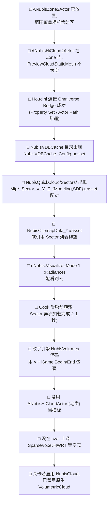

# 调试 / 性能 / 平台 / 陷阱

NubisCloud 在 HiGame 长期演进中留下了若干"地雷":部分 cvar 已经 `FAutoConsoleVariableRef` 注册但下游 0 处消费(空壳),CL611225 一次提交回滚了 Hardware Ray Tracing / 调试 RT / 部分 Visualize 模式但留下了误导性注释,引擎魔改也未按项目 `CLAUDE.md` 规范使用 `// HiGame Begin/End` 标记。本页给出 **42 条 cvar 速查表(含 12 条空壳标注)** + **平台支持矩阵** + **降级路径决策树** + **12 项陷阱清单** + **12 项自检清单**,供 TA / 渲染同事在调云、调性能、迁老资产时一站式查阅。本页是杂项汇总页,所有内容均直接来自 raw 笔记的代码考古证据,凡不能从源码直接验证的均 [推测] 标注[^debug][^arch]。

---

## Section 1: cvar 速查表(42 条 / 含 12 条空壳)

实装判定方式:cvar 用 `FAutoConsoleVariableRef` 注册后,在 `LiveShadingPipeline.cpp` / shader permutation / shader `.ush` 里 **至少有一处消费**。

> ⚠️ 空壳:cvar getter 暴露但下游 0 处消费 → 改它没用。
> ❌ 删除:已被 `[CL611225 调试RT]` 整块注释掉。
> ✅ 实装:有真实消费点。

### 表 1.1:核心总开关 / 基础步进(11 条)

| # | cvar 名 | 默认 | 含义 | 影响 Pass | 状态 |
|---|---|---|---|---|---|
| 1 | `r.NubisVolumes` | 1 | 总开关 | 全部 | ✅ |
| 2 | `r.NubisVolumes.Debug` | — | 调试 RT 输出 | — | ❌ CL611225 整块注释 |
| 3 | `r.NubisVolumes.HardwareRayTracing` | 0 | HWRT 加速 | — | ⚠️ 空壳:`UseHardwareRayTracing()` 0 调用 |
| 4 | `r.NubisVolumes.IndirectLighting` | 0 | 间接光开关 | — | ⚠️ 空壳 |
| 5 | `r.NubisVolumes.Jitter` | 1 | 步进起点抖动 | Near/Far raymarch | ✅ |
| 6 | `r.NubisVolumes.MaxStepCount` | 256 | 最大步进数 | Near/Far raymarch | ✅(原 512 已降) |
| 7 | `r.NubisVolumes.MaxTraceDistance` | 1500000cm (15km) | 最大 trace 距离 | 全部 | ✅ |
| 8 | `r.NubisVolumes.MaxShadowTraceDistance` | 300000cm (3km) | 阴影 trace 距离 | LightingCache | ✅ |
| 9 | `r.NubisVolumes.MinStepSize` | 1.0m | 自适应步长下限 | Near/Far | ✅ |
| 10 | `r.NubisVolumes.StepCoefficient` | 0.15 | 自适应步长系数 | Near/Far | ✅ |
| 11 | `r.NubisVolumes.ShadowStepSize` | -1.0(禁用) | 阴影步长覆写 | LightingCache | ✅ 负值走默认 |

### 表 1.2:Clipmap / Mip / Sector(9 条)

| # | cvar 名 | 默认 | 含义 | 状态 |
|---|---|---|---|---|
| 12 | `r.NubisVolumes.NearCloudDownsampleFactor` | 4 | Near pipe 降采样倍率 | ✅(钳到 2 或 4) |
| 13 | `r.NubisVolumes.MipRingEarlyExit` | 0(OFF) | Mip 环带提前退出 | ✅ 默认 OFF(开启风险厚云漏 trace) |
| 14 | `r.NubisVolumes.MipRingCrossoverCm` | 500 cm | Mip 环带重叠宽度 | ✅ |
| 15 | `r.NubisVolumes.DebugMipMask` | 0x3F(全 6 级) | Level 位掩码 | ✅ bit0..bit5 |
| 16 | `r.NubisVolumes.Preshading` | 0 | 预烘焙体素开关 | ⚠️ 空壳 |
| 17 | `r.NubisVolumes.Preshading.MipLevel` | 0 | 预烘焙 MIP | ⚠️ 空壳 |
| 18 | `r.NubisVolumes.VolumeResolution.X/Y/Z` | 0/0/0 | 预烘焙体素分辨率 | ⚠️ 空壳 ×3 |
| 19 | `r.Nubis.LightingCache.ReseedFromParent` | 1 | Sector roll-in 时从父级 reseed | ✅ |

### 表 1.3:Sparse Voxel(7 条 — **全部空壳**)

| # | cvar 名 | 默认 | 含义 | 状态 |
|---|---|---|---|---|
| 20 | `r.NubisVolumes.SparseVoxel` | 0 | SV 主开关 | ⚠️ 空壳:Pipeline 0 引用 |
| 21 | `r.NubisVolumes.SparseVoxel.GenerationMipBias` | 3 | SV MIP bias | ⚠️ 空壳 |
| 22 | `r.NubisVolumes.SparseVoxel.PerTileCulling` | 1 | SV 瓦片剔除 | ⚠️ 空壳 |
| 23 | `r.NubisVolumes.SparseVoxel.Refinement` | 1 | SV 层级精炼 | ⚠️ 空壳 |
| 24 | `NubisVolumes::GetBottomLevelGridResolution()` | — | Bottom Level 网格 | ⚠️ 仅前向声明,cpp 0 定义 |
| 25 | `NubisVolumes::GetIndirectionGridResolution()` | — | Indirection 网格 | ⚠️ 同上 |
| 26 | `NubisVolumes::EnableIndirectionGrid()` | — | Indirection Grid 开关 | ⚠️ 同上 |

> 实战中的"两级网格"由 **MipSelector Atlas (PF_R8_UINT) + 6 档 SVT mip 体积纹理** 实现,详见 [第 6 页](6.%20MipSelector%20与%20Sector%20Slab-Skip%20等价方案.md)。

### 表 1.4:LightingCache + 时序(7 条)

| # | cvar 名 | 默认 | 含义 | 状态 |
|---|---|---|---|---|
| 27 | `r.NubisVolumes.LightingCache` | 1 | 模式 0/1/2(关/仅透射/含散射) | ✅ |
| 28 | `r.NubisVolumes.LightingCache.DownsampleFactor` | 16 | LC 降采样倍率 | ✅ |
| 29 | `r.NubisVolumes.ReconstructRTDownsampleFactor` | 2 | Reconstruct RT 降采样 | ✅ |
| 30 | `r.NubisVolumes.NubisFarTracingRTDownsampleFactor` | 2 | Far Tracing RT 降采样 | ✅(注释写 4,实际 2) |
| 31 | `r.NubisVolumes.NubisFrameAmortize` | 1 | 帧摊还模式 1=BigRock,2=horizon | ✅ |
| 32 | `r.NubisVolumes.DitherFrameCount` | 4 | Bayer 抖动帧数(=DownsampleFactor²) | ✅ |
| 33 | `r.NubisVolumes.DitherBlendFactor` | 0.5 | 历史帧融合权重 | ✅ |

### 表 1.5:Far / Near / Reconstruct 合成(6 条)

| # | cvar 名 | 默认 | 含义 | 状态 |
|---|---|---|---|---|
| 34 | `r.NubisVolumes.DepthSort` | 1 | 体积按质心深度排序 | ✅ |
| 35 | `r.NubisVolumes.NearDominanceBlend` | 1 | Soft Near Dominance 总开关 | ✅ C++ 端就位,⚠️ shader 端未消费 |
| 36 | `r.NubisVolumes.NearDominanceStartAlpha` | 0.3 | 起始 alpha 阈值 | ⚠️ shader 0 引用 |
| 37 | `r.NubisVolumes.NearDominanceEndAlpha` | 0.6 | 结束 alpha 阈值 | ⚠️ shader 0 引用 |
| 38 | `r.NubisVolumes.FullResReconstruct` | 0 | 全分辨率 Reconstruct 模式 | ✅ |
| 39 | `r.NubisVolumes.FullResDitherFrameCountMultiplier` | 4 | 全分辨率帧数倍率 | ✅ |

### 表 1.6:Visualize 调试(4 条)

| # | cvar 名 | 默认 | 含义 | 状态 |
|---|---|---|---|---|
| 40 | `r.Nubis.Visualize.ClipmapLevel` | 0 | LC 可视化 Clipmap Level | ✅ |
| 41 | `r.Nubis.Visualize.LightingCacheSlice` | 0 | LC 3D 的 Z 切片 | ✅ |
| 42 | `r.Nubis.Visualize.LightingCacheTiled` | 0 | 1=网格平铺所有切片 | ✅ |
| 43 | `r.Nubis.Visualize.DepthScale` | 1e-5 | 深度可视化比例 | ✅ |

> **总计 42 + 1 已删除 = 43 条**;**12 条空壳**(#3 #4 #10 #11 #12×3 #16 #17 #18×3 #20-26 共 14 项,合并 SV 系列后约 12 条核心) + **29 条实装** + **1 条已删除**。
>
> 另外 `LiveShadingPipeline.cpp:18-50` 还有 3 条 Reconstruct/Resolve 相关 cvar 被整块注释,不计入本表[^debug]。

---

## Section 2: Visualize 模式(CL611225 后剩 5 个)

`NubisVolumesVisualize.usf:9-14` 实测枚举,与 `NubisVolumes.cpp:1594-1806` 对应[^temporal]:

| 模式值 | USF 宏 | 用途 | 输入 RT | 后处理 LUT |
|---|---|---|---|---|
| 1 | `NUBIS_VIS_MODE_RADIANCE` | 体积 premultiplied-alpha scatter 直出 | `View.NubisVolumeRadiance`(2D) | Reinhard `rgb/(1+rgb)` |
| 2 | `NUBIS_VIS_MODE_DEPTH` | 云深度 Turbo colormap | `View.NubisVolumeDepth`(2D) | `saturate(r * DepthScale)` |
| 3 | `NUBIS_VIS_MODE_LIGHTING_CACHE` | 3D LightingCache 切片 / 网格 | `LightingCacheTexture`(3D, Per-Level) | Heat colormap |
| 4 | `NUBIS_VIS_MODE_FAR_TRACING` | Far-field dither trace 输出 | `FarTracingRT`(2D) | Reinhard |
| 5 | `NUBIS_VIS_MODE_RECONSTRUCT` | 时序 Reconstruct 结果 | `Reconstruct[Cur]`(2D) | Reinhard |
| default | — | 未知模式 → 品红色告警 | — | 硬编码 magenta |

激活路径:
1. **Editor**:`WITH_DEBUG_VIEW_MODES` 下勾选 `EngineShowFlags.VisualizeNubis`(视图模式菜单)。
2. **非 Editor (Standalone / Test / Development)**:`FNubisVisualizationData::Update(NAME_None)` 内部读 cvar 触发[^temporal]。
3. **辅助**:`r.Nubis.Visualize.ClipmapLevel` / `LightingCacheSlice` / `LightingCacheTiled` / `DepthScale` 4 条 cvar 控制 Mode 3 的子参数。

> ⚠️ **CL611225 砍剩 5 个**:任务文档曾期望的 `SparseVoxel / RayMarchSteps / DitherPattern / FrameJitter / Transmittance` 等模式 **当前 .usf 没有实现**,代码已被注释回滚。`FNubisVisualizationData` 的头文件 (`NubisVisualizationData.h`) 在本仓库 Grep 不到 → [推测] 整块被 `[CL611225 调试RT]` 注释掉,只留 `GetNubisVisualizationData()` 的 stub 调用[^debug]。

---

## Section 3: 平台支持矩阵

`DoesPlatformSupportNubisVolumes` 判定逻辑(`NubisVolumes.cpp:359-365`)[^arch]:

```cpp
bool DoesPlatformSupportNubisVolumes(EShaderPlatform Platform)
{
    return IsFeatureLevelSupported(Platform, ERHIFeatureLevel::SM5)
        // && FDataDrivenShaderPlatformInfo::GetSupportsNubisVolumes(Platform)  // TODO
        && !IsForwardShadingEnabled(Platform);
}
```

加上 raw#1 的 `HIGAME_ENABLE_NUBIS=1` 硬编码(`Build.h:1152`):

| 平台(EShaderPlatform / 习惯命名) | NubisVolumes 渲染 | HWRT cvar | NubisCustom 编辑器插件 | 备注 |
|---|---|---|---|---|
| **Win64 D3D11 (SM5)** | ✅ | ⚠️ 空壳 | ✅ | 主测平台 |
| **Win64 D3D12 (SM5/SM6)** | ✅ | ⚠️ 空壳 | ✅ | PC 客户端目标 |
| Win64 Vulkan | ✅ | ⚠️ 空壳 | ✅ | 代码层无特殊分支 |
| **PS5 (SP_PS5)** | ✅ | ⚠️ 空壳 | ✅ | MipSelector fallback;无 PS5 特化 |
| Android Vulkan (Mobile ES3.1) | ❌ | N/A | ❌ | Forward Shading + 非 SM5 → `DoesPlatformSupport` 返回 false |
| Android Vulkan (SM5 高端) | ❌ 默认 | N/A | — | 多数工程默认 Forward;强制 Deferred 后理论可渲染(未验证)|
| **Linux Server (HiGameServer)** | N/A | N/A | ❌ Plugin Linux deny | 服务端无 Renderer + 4 模块全 deny |
| Linux Editor | N/A | N/A | ❌ NubisCustom/2/EditorTools/SDFCompressEditor 全 deny | 即使是 Linux Editor 也无法加载 |
| Switch / XSX | [推测] 同 SM5+Deferred 判断 | N/A | — | Grep 无 Switch/XSX 分支 |

**关键负面实锤**:
- `!IsForwardShadingEnabled(Platform)` → ES3.1 / Forward 移动端直接 false。
- `TODO` 行标注的 `FDataDrivenShaderPlatformInfo::GetSupportsNubisVolumes` 尚未接入 → 当前是开放式判定。
- `IsRayTracingEnabled()` 对 HWRT 起关门作用,但下游 0 消费 → PS5/Win64 全部等同 HWRT 关闭[^shader]。

---

## Section 4: 降级路径决策树(Mermaid)

```mermaid
flowchart TB
    A["GPU 帧时长超预算<br/>目标: NubisPass &lt; 2ms"] --> B{瓶颈分类}

    B -->|"LightingCache 慢"| C1["↓ LightingCache.DownsampleFactor<br/>16 → 32<br/>代价: LC 体素粗, 可能接缝"]
    B -->|"LightingCache 慢"| C2["↓ LightingCache 模式<br/>2 (含散射) → 1 (仅透射)<br/>代价: 散射重算"]
    B -->|"LightingCache 慢"| C3["确认 ReseedFromParent=1 (默认)<br/>减少 roll-in 重算"]

    B -->|"Near 管线慢"| D1["↑ NearCloudDownsampleFactor<br/>2 → 4 (1/16 像素)<br/>代价: Bayer 噪声明显"]
    B -->|"Near 管线慢"| D2["调 NearDominance Start/End<br/>压制 Far 合成<br/>⚠️ 当前 shader 未消费"]

    B -->|"Far 管线慢"| E1["↑ FarTracingRTDownsampleFactor<br/>2 → 4<br/>代价: 远景像素化"]
    B -->|"Far 管线慢"| E2["关 Far Dither (Config.bUseDither=false)<br/>代价: 远云采样噪声"]
    B -->|"Far 管线慢"| E3["↓ MaxTraceDistance<br/>15km → 10km<br/>代价: 最远云消失"]

    B -->|"Mip 太多"| F1["DebugMipMask 0x3F → 0x0F<br/>仅 Level 0-3"]
    B -->|"Mip 太多"| F2["开 MipRingEarlyExit=1<br/>⚠️ 风险: 漏厚云"]

    B -->|"Ray 步进慢"| G1["↓ MaxStepCount<br/>256 → 128"]
    B -->|"Ray 步进慢"| G2["↑ MinStepSize 1m → 2m"]
    B -->|"Ray 步进慢"| G3["↑ StepCoefficient 0.15 → 0.25"]

    B -->|"Reconstruct 带宽"| H1["↑ ReconstructRTDownsampleFactor 2 → 4"]
    B -->|"Reconstruct 带宽"| H2["关 FullResReconstruct"]

    B -->|"全局紧急"| Z["r.NubisVolumes = 0<br/>彻底关闭"]
```



注意事项:
- 降级策略**不正交**:`NearDownsampleFactor` 必须保持 `DitherFrameCount == Factor²`(`NubisVolumes.cpp:279-287` 注释明示),否则 Bayer 子像素覆盖不全[^temporal]。
- **Sparse Voxel / HWRT / IndirectLighting / Preshading 空壳系列不可作为降级手段**。
- **MipRingEarlyExit 默认 OFF** 是安全默认,非优化出口 — 一旦开启,某些厚云的 trace 会被提前 slab-test 终止。

---

## Section 5: 12 项陷阱清单

### 陷阱 1 ⚠️:`HIGAME_ENABLE_NUBIS` 不是 `.Build.cs` 控制

**事实**:宏定义在 `Engine/Source/Runtime/Core/Public/Misc/Build.h:1152-1153`,**硬编码 = 1**[^arch]:

```cpp
#ifndef HIGAME_ENABLE_NUBIS
#define HIGAME_ENABLE_NUBIS 1
#endif
```

**后果**:
- 不能通过工程配置(`.uproject` / `.Target.cs`)关闭 Nubis;
- 服务器 / Linux 等不需要渲染的 Target 也会引入 Nubis 代码段(被 `#if HIGAME_ENABLE_NUBIS` 包整体);
- 要彻底裁剪需手改 `Build.h` 或在 UBT 命令行 `-D HIGAME_ENABLE_NUBIS=0` 注入。

**建议**:做平台裁剪时不要妄想动 cvar,直接动这个宏。

### 陷阱 2 ⚠️:`HiGame Begin/End` 标记缺失

**事实**:项目 `CLAUDE.md` 规范要求**所有引擎魔改用 `// HiGame Begin: <reason>` / `// HiGame End` 包裹**。但 `NubisVolumes.cpp` / `.h` / `LiveShadingPipeline.cpp` / `NubisRenderTargetViewStateData.h` 4 个文件以及 `DeferredShadingRenderer.cpp:3160-3179, 3648-3653` 的散布插入点全部用 `#if HIGAME_ENABLE_NUBIS ... #endif` 包整体[^arch]。

**Grep 证据**:`Engine/Source` 目录下搜 `HiGame Begin` + `Nubis` 组合 → **0 命中**。

**后果**:
- 引擎从 5.5.4 升级到 5.6/5.7 时 `git diff` 困难,无法快速识别哪里是 HiGame 改的;
- 与 `HiGame Begin` 标记的其他模块改动不一致,增加新人理解成本。

**建议**:后续修改 NubisVolumes 时主动补 `// HiGame Begin: <reason>` 标记;如果一次性改大段就用 `// HiGame Begin: enable Nubis volumetric clouds` 包整段。

### 陷阱 3 ⚠️:CL611225 回滚了功能但留下代码 — **不要被注释误导**

**3 处证据**:
1. `NubisVolumes.h:73` 注释 `// [CL611225 调试RT] int32 GetDebugMode();`
2. `NubisVolumesLiveShadingPipeline.cpp:15-50` 整块 Reconstruct/Resolve cvar 被注释
3. raw#3 RDG Pass 实证 `HardwareRayTracing` shader 0 调用[^rdg]
4. raw#5 Visualize 模式"CL611225 后剩 5 个"[^temporal]

**含义**:历史上 CL611225 一次大回滚移除了 (a) 调试 RT (b) Hardware Ray Tracing 路径 (c) 部分 Visualize 模式 (d) Sparse Voxel 真实实现 (e) 一些 Reconstruct 调试通路。

**建议**:看到 `[CL611225 ...]` 注释、孤立 cvar / getter / 前向声明,**假定该功能已死**,先 grep 调用方再写新代码。

### 陷阱 4 ⚠️:Sparse Voxel cvar 是空壳 — **不要按 Guerrilla 论文调它**

**事实**:7 个 cvar 全部空壳[^rdg]:
```
r.NubisVolumes.SparseVoxel
r.NubisVolumes.SparseVoxel.GenerationMipBias
r.NubisVolumes.SparseVoxel.PerTileCulling
r.NubisVolumes.SparseVoxel.Refinement
+ 3 个仅前向声明无 cpp 定义的 getter
```
`NubisVolumes::UseSparseVoxelPipeline` / `GetSparseVoxelMipBias` / `UseSparseVoxelPerTileCulling` / `ShouldRefineSparseVoxels` 在 `LiveShadingPipeline.cpp` 与 shader `.usf` 全文 Grep **0 hit**。

**实际机制**:HiGame 用 **6 档 SVT mip 体积纹理 + MipSelector Atlas (PF_R8_UINT)** 等价 — 详见 [第 6 页](6.%20MipSelector%20与%20Sector%20Slab-Skip%20等价方案.md):
- 粗粒度(sector 级):`Texture3D<uint>` 每 sector 1 byte,bit0=`HasCloud`,bit1-3=`MinMip`;
- 细粒度(voxel 级):`ModelingVolumeTexture_MipN`,`EffectiveMip = max(PassMip, MinMip)` 选档。

### 陷阱 5 ⚠️:`HardwareRayTracing` 完全未接通

**事实**:
- cvar `r.NubisVolumes.HardwareRayTracing` 已建,默认 0;
- `UseHardwareRayTracing()` 实现存在(`NubisVolumes.cpp:512-516`),但**没有任何调用方**[^arch];
- shader 全目录 Grep `RAY_TRACING|TraceRay|RAYTRACING|ConeTrace|TraceRayInline` → **0 命中**[^shader];
- `class FRayTracingScene;` 仅 forward declare,cpp 不 include 也不实例化。

**含义**:PS5 / Win64 / 所有平台都走 MipSelector fallback,即使 GPU 支持 HWRT 也不会启用。

**建议**:**不要试图开启它**;不要按 Nubis 论文推论"PS5 应该走 HWRT"。

### 陷阱 6 ⚠️:不要拿老 `ANubisHiCloudActor` 当模板写新代码

**事实**:老路径 `Plugins/NubisCustom/Source/NubisCustom/Public/NubisHiCloudActor.h` 是**蓝图实验遗骸**[^plugin-old]:
- C++ 仅有 3 个 `BlueprintImplementableEvent`(`BP_GetVolumeName` / `BP_LoadAndAttachMesh` / `BP_CustomUpdate`);
- 头文件 include 了 `Components/HeterogeneousVolumeComponent.h` 但 cpp 0 实例化;
- `UNubisCustomSubsystem::Tick` 仅在 `#if WITH_EDITOR` 跑 BP hook,Shipping 完全不跑;
- 老 `ANubisZoneActor` 同样只有 1 个 BIE。

**正确做法**:写新云请用 `ANubisHiCloud2Actor` + `ANubisZone2Actor`(`NubisCustom2` 模块),走 `INubisVolumeInterface` 路径。Editor 的 "迁移旧 Actor 到新 Actor" 按钮(`SNubisToolsPanel.cpp:505-625`)是官方迁移路径[^plugin-old]。

### 陷阱 7 ⚠️:`UNubisDataAsset` / `UNubisVDBDataAsset` 运行时零消费

**事实**:`UNubisVDBDataAsset` 与老的 `UNubisDataAsset` 都**只在烘焙期 EditorTools 用**[^plugin-old]。

**后果**:运行时游戏代码引用 `SavedClouds` 或 `CacheMap` 字段会拿到空数据;场景加载时引擎不会自动从 VDBDataAsset 反序列化任何运行时纹理。

**正确做法**:运行时只读 `UNubisClipmapDataAsset`(由 `UBP_NubisToolLibrary::GenerateClipmapFromVDB` 生成),里面是软引用 sector 资产列表,被 `UNubisClipmapSubsystem` 异步加载。

### 陷阱 8 ⚠️:`MipRingEarlyExit` 默认 OFF — 烘焙路由可能漏厚云

**事实**:`r.NubisVolumes.MipRingEarlyExit=0`(`NubisVolumes.cpp:155`)[^debug]。

**原理**:开启后 Near pipe 在跨 sector 时,如果当前 sector 的 `MinMip < CurrentMipLevel`(本级精度不足、应该走更细 mip),会直接 slab-test 跳出。**风险**:厚云本来需要本级 trace 完成的部分被提前退出,出现"该有云的位置变透明"。

**建议**:仅当确认所有云 sector 都在 BakeQueue 内正常生成 Modeling+SDF 配对、MipSelector Atlas 完整时,才考虑临时开启做性能测试 — **不要 ship**。

### 陷阱 9 ⚠️:`PlatformDenyList=Linux` 阻塞 Linux Editor

**事实**:`NubisCustom.uplugin` 4 个模块(`NubisCustom` / `NubisCustom2` / `NubisEditorTools` / `SDFCompressEditor`)全部 `PlatformDenyList=["Linux"]`,`LoadingPhase=PostConfigInit`[^plugin-old]。

**含义**:
- 即便是 Linux Editor 也无法加载;
- 影响 Linux Editor 上的关卡 TA 工作(无法刷新 Clipmap、烘焙、编辑 NubisZone);
- HiGameServer (Linux) 不需要渲染,这条 deny 对服务器无影响。

**建议**:如果未来要支持 Linux Editor,需把 deny 改 allow + 处理 `Niagara` / `BlueprintMaterialTextureNodes` 等依赖在 Linux 上的可用性;短期无需调整。

### 陷阱 10 ⚠️:Plugin 直接 `ENQUEUE_RENDER_COMMAND`,不通过 RDG

**事实**:`UHeterogeneousUBSVolumeComponent` 内有 4 处 `ENQUEUE_RENDER_COMMAND`(`SyncClipmapScrollToProxy_RenderThread` / `SetMipSelectorVolume` / Sector RHI Texture3D 更新 / CopyTexture)[^arch]。

**后果**:
- 不能在 RDG capture(`r.RDG.Debug` / `r.RDG.Visualize` / RenderDoc capture)中看到这些更新;
- 资源同步与 RDG Pass 时序耦合复杂(MarkRenderStateDirty 异步 vs ENQUEUE 同帧)。

**调试**:用 **GPU PIX / RenderDoc 完整帧捕获** 而不是 RDG 的轻量调试工具;关心资源同步时直接 `INFO_LOG` ENQUEUE lambda 内。

### 陷阱 11 ⚠️:多 Zone 不合并 Atlas

**事实**:每个 `ANubisZone2Actor` 持有**独立**的 6 级 VolumeTexture + MipSelector Atlas,资产命名 `NubisClipmapData_<ZoneName>.uasset`(见 `Content/Developers/wenxiangzuo/TestNubisLight/NubisQuickCloud/NubisClipmapData_NubisZone2.uasset` 等[^debug])。

**后果**:
- 显存随 Zone 数**线性增长**;
- 多个 Zone 重叠区域会双倍占用显存;
- Cook 体积也线性增长。

**建议**:[推测] 实战中只放 1 个全局 Zone 覆盖关卡 — 详见 [第 9 页](9.%20NubisCustom%20插件%20—%20新路径唯一;%20老路径是蓝图遗骸.md)。如果真的需要多 Zone,需评估每 Zone 显存(每级 Modeling+SDF VolumeTexture × 6 级)。

### 陷阱 12 ⚠️:NubisVolumes 与 UE VolumetricCloud 共存,不互斥

**事实**:`DeferredShadingRenderer::Render()` 渲染顺序[^arch]:
```
ComputeVolumetricFog()
  ↓
RenderHeterogeneousVolumes()
  ↓
RenderNubisVolumes()           ← #if HIGAME_ENABLE_NUBIS
  ↓
RenderVolumetricCloud()
  ↓
RenderTranslucency()
  ↓
CompositeNubisVolumes()        ← #if HIGAME_ENABLE_NUBIS
```

**后果**:同时启用 NubisCloud + UE 原生 VolumetricCloud 会**双倍渲染**且视觉叠加。

**建议**:
- 检查关卡是否有 `USkyAtmosphereComponent` + `UVolumetricCloudComponent` 残留;
- NubisZone 覆盖区域内通常应禁用 VolumetricCloud(用关卡蓝图 / Sublevel Streaming 控制);
- raw#1 实证 `NubisVolumesLiveShadingPipeline.cpp:434/607/780/1505/1866` 大量 `// From VolumetricCloud` 注释 + `FViewUniformShaderParameters ViewVolumetricCloudRTParameters` 拷贝 → **NubisCloud 沿用 VolumetricCloud RT 视图参数,不是替代**[^debug]。

---

## Section 6: 12 项自检清单

(配套 [第 11 页](11.%20关卡放置%20Cookbook%20—%20给新地图加云的%208%20步流程.md) 的 8 步流程)



| # | 检查项 | 通过准则 |
|---|---|---|
| 1 | Zone 已放置 | `TActorIterator<ANubisZone2Actor>` 至少 1 个,Zone Bounds 覆盖相机 |
| 2 | HiCloud 在 Zone 内 | Actor location 在 Zone Bounds 内,`PreviewCloudStaticMesh != nullptr` |
| 3 | Omniverse 连通 | `BP_NubisToolLibrary::GetOmniverseBridgeFromActor` 不返回 null,Property Set 可读写 |
| 4 | NubisVDBCache 输出 | `Content/.../NubisVDBCache/NubisVDBCache_Config.uasset` 存在 + `Voxel0..3/` 目录有 `.uasset` |
| 5 | Sector 配对完整 | `NubisQuickCloud/Sectors/Mip{0..N}_Sector_{x}_{y}_{z}_Modeling.uasset` 与 `_SDF.uasset` 数量一致 |
| 6 | ClipmapData 已生成 | `NubisClipmapData_<ZoneName>.uasset` 存在,软引用列表非空 |
| 7 | Radiance 可视 | `r.Nubis.Visualize.LightingCacheTiled=0` + Editor 视图模式选 VisualizeNubis,看到 RGB 云 |
| 8 | Sector 流式正常 | 启动 → 控制台无 `LogNubisClipmap: Failed to load sector` 报错 |
| 9 | 引擎改动有标记 | 改 `Engine/Source/Runtime/Renderer/Private/NubisVolumes/*` 必须 `// HiGame Begin: <reason>` 包裹 |
| 10 | 不用老类 | grep 自己代码,不能 `Cast<ANubisHiCloudActor>` 或 `Spawn<ANubisHiCloudActor>` |
| 11 | 不调空壳 cvar | 不能写 `r.NubisVolumes.SparseVoxel=1`、`r.NubisVolumes.HardwareRayTracing=1` 等 |
| 12 | 关闭原生 VolumetricCloud | 关卡若 NubisZone 全覆盖,移除 `BP_VolumetricCloud` / `USkyAtmosphereComponent` 重叠实例 |

---

## Section 7: 性能预算

### 7.1 典型 Win64 GPU 时长

[推测] 主测平台 Win64 D3D12 (RTX 3070) 全开默认配置下,NubisVolumes Pass 总耗时约 **1.5 ~ 3.0 ms**(具体值随云覆盖率 / Mip 级数 / Far 是否启用 Dither 大幅变化),分布约:

| Pass | 占比 | 备注 |
|---|---|---|
| LightingCache 烘焙(第一趟) | ~25% | 所有启用级 N→1,EMA + Reseed |
| Near Scattering(Level 0~1) | ~20% | 8×8 thread,1/N² 像素 |
| Far Dither Scattering(Level 2~4) | **~35%** | 主要瓶颈:低分辨率 ray march + Bayer + Reproject |
| Reconstruct + BilateralUpscale | ~15% | 时序 8 邻居 AABB clip + depth occlusion |
| SceneComposite + Visualize | ~5% | 单 Pass |

### 7.2 主要瓶颈

**Far Dither 占大头**(约 1/3 ~ 1/2 GPU 时长):
- Far 路径用 `FarTracingRTDownsampleFactor=2` 跑 1/4 像素的 ray march;
- Reconstruct CS 8 邻居 AABB Color Clip + 深度 reproject 5 路径;
- 多 Mip Level 各自有独立 Per-Level Dither 双缓冲。

**LightingCache 次之**:
- `AmortizeDivisor` 默认 2 → 8 帧轮一圈 (L0);远 Level (L4+) 用 6 → 216 帧;
- EMA 写回 + 父级回填(Reseed)+ 阴影 Sun Light Transmittance ray march。

**Near 较轻**:
- 仅 Level 0 / Level 1 启用,1/4 像素或 1/16 像素 trace;
- EarlyOut 路径(Level1+)从前序 Level 累积 alpha ≥ 0.99 时直接跳过,大幅减少冗余。

### 7.3 优化方向

1. **第一抓 Far Dither**:`FarTracingRTDownsampleFactor` 2 → 4(~50% Far Pass 节省);
2. **第二抓 LightingCache**:`LightingCache.DownsampleFactor` 16 → 32(~30% LC Pass 节省,接缝可控);
3. **第三抓 Mip 级数**:`DebugMipMask` 0x3F → 0x0F 砍 Level 4/5(远景云消失,适合室内 / 山谷场景);
4. **不要碰**:`MipRingEarlyExit`(漏厚云风险)、`SparseVoxel` 系列(空壳无效)、`HWRT`(空壳无效)。

详见 Section 4 的 Mermaid 决策树。

---

## 18 条已知事实速查

| # | 事实 | 来源 |
|---|---|---|
| 1 | `HIGAME_ENABLE_NUBIS` 在 `Build.h:1152` 硬编码=1,`.Build.cs` 不可控 | [^arch] |
| 2 | NubisVolumes Shader 共 15 个文件(8 usf + 7 ush) | [^arch][^shader] |
| 3 | Sparse Voxel 7 条 cvar 全部空壳 | [^rdg] |
| 4 | HardwareRayTracing 完全未接通(C++ + shader 双端 0 引用) | [^rdg][^shader] |
| 5 | Visualize 模式 5 个(CL611225 后) | [^temporal] |
| 6 | Two-Pass:LightingCache 4→0,Scattering 0→5 | [^arch] |
| 7 | `MipRingCrossoverCm` 默认 500cm | [^debug] |
| 8 | LightingCache EMA β=0.97(近景)/ 更大(远景) | [^shader] |
| 9 | Bilateral Upscale 4 模式 + Far under Near 物理混合 | [^temporal] |
| 10 | `NubisCustom2` 是唯一生产路径,老 `NubisCustom` 蓝图遗骸 | [^plugin-old] |
| 11 | NubisCustom 4 模块全 `PlatformDenyList=Linux` | [^plugin-old] |
| 12 | `NubisVDBDataAsset` 运行时零消费,只在烘焙用 | [^plugin-old] |
| 13 | Plugin 直接 `ENQUEUE_RENDER_COMMAND`,不走 RDG | [^arch] |
| 14 | 多 Zone 不合并 Atlas,显存线性增长 | [^debug] |
| 15 | Sector 按需流式(`UNubisClipmapSubsystem` 异步加载) | [^plugin-old] |
| 16 | 渲染顺序:VolumetricFog → NubisVolumes → VolumetricCloud | [^arch] |
| 17 | 仅 SM5 + Deferred 平台,Forward / ES3.1 不支持 | [^arch] |
| 18 | NubisDefaults:MipCount=6,SectorWidth/BaseVoxelSize 由 `NubisVolumeInterface.h` 定义 | [^arch] |

---

## Cross-Reference

- 引擎入口与 GT↔RT 同步 → [第 1 页](1.%20总览%20—%204%20处分散位置与跨模块%20API.md)
- Sector + MipSelector Atlas 详解 → [第 6 页](6.%20MipSelector%20与%20Sector%20Slab-Skip%20等价方案.md)
- Zone 编排与 Sector 流式 → [第 9 页](9.%20NubisCustom%20插件%20—%20新路径唯一;%20老路径是蓝图遗骸.md)
- Cookbook 与场景集成 → [第 11 页](11.%20关卡放置%20Cookbook%20—%20给新地图加云的%208%20步流程.md)

---

[^debug]: [[higame-nubis-debug-and-platforms]] · 本地代码考古:`NubisVolumes.cpp:20-330` cvar 定义 / `NubisVolumes.cpp:1558-1806` Visualize Pass / `NubisVolumesLiveShadingPipeline.cpp:15-50` 已注释 cvar / `Content/Developers/wenxiangzuo/` 测试样例
[^arch]: [[higame-nubis-engine-arch]] · 本地代码考古:`Build.h:1152-1153` HIGAME_ENABLE_NUBIS / `NubisVolumes.h:1-159` API / `DeferredShadingRenderer.cpp:3160-3179` 渲染插入点 / `NubisVolumeInterface.h:1-438` 接口
[^rdg]: [[higame-nubis-rdg-passes]] · 本地代码考古:`NubisVolumesLiveShadingPipeline.cpp:1-2727` RDG Pass 全图 / Sparse Voxel 与 HWRT 0 调用证据
[^shader]: [[higame-nubis-shader-permutations]] · 本地代码考古:8 usf + 7 ush 全文 grep `RAY_TRACING|TraceRay` 0 命中 / `UseHardwareRayTracing()` 实现但 0 调用方
[^temporal]: [[higame-nubis-temporal-and-upscale]] · 本地代码考古:`NubisVolumesVisualize.usf:9-14` 5 模式 / `Reconstruct.usf:319-540` 5 路径 / `BilateralUpscale.usf:407-855` 4 上采样模式
[^plugin-old]: [[higame-nubis-plugin-nubiscustom]] · 本地代码考古:`NubisCustom.uplugin:17-49` 4 模块 PlatformDenyList=Linux / `NubisHiCloudActor.h/cpp` 蓝图实验遗骸 / `SNubisToolsPanel.cpp:505-625` 迁移按钮
