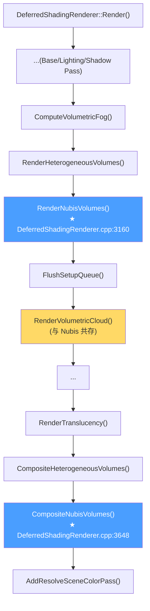

# 引擎端架构 — HIGAME_ENABLE_NUBIS 与 INubisVolumeInterface

NubisCloud 在引擎端是 `HIGAME_ENABLE_NUBIS` 宏控制的**魔改子系统**:Renderer 模块新增 4 个独立文件 + Engine 模块新增 1 个 Public Interface(共享 GT/RT 数据契约) + Shaders 目录新增 15 个 .usf/.ush + 散布在 7 处引擎已有文件中的 `#if HIGAME_ENABLE_NUBIS ... #endif` 插入块[^arch]。Plugin 端只持有 `ANubisZone2Actor` / `NubisClipmapManager` 等 GT 调度,真正吃 GPU 的渲染管线全部位于 `Engine/Source/Runtime/Renderer/Private/NubisVolumes/`,与 `RenderVolumetricCloud` / `RenderHeterogeneousVolumes` **平级共存**而非替换。

> 本页是第 2 页 · 整个 wiki 的"地图"。GT↔RT 同步细节见 [第 3 页](3.%20GT%20↔%20RT%20时序%20—%20Plugin%20自管%20GPU%20资源.md)、Clipmap 调度见 [第 4 页](4.%20Clipmap%206%20级调度%20—%20Mip%20Ring%20与%20Two-Pass.md)、完整 Pass 列表见 [第 5 页](5.%20RDG%20Pass%20全图%20—%20Live%20Shading%2010%20Pass%20DAG.md)、老路径 NubisCustom1 见 [第 9 页](9.%20NubisCustom%20插件%20—%20新路径唯一;%20老路径是蓝图遗骸.md)、HiGame Begin/End 标记缺失问题见 [第 12 页](12.%20调试%20性能%20平台%20陷阱.md)。

---

## 1. HIGAME_ENABLE_NUBIS 宏(重点警告)

### 1.1 宏的真实位置

```cpp
// Engine/Source/Runtime/Core/Public/Misc/Build.h:1152-1154
#ifndef HIGAME_ENABLE_NUBIS
#define HIGAME_ENABLE_NUBIS 1
#endif
```

**事实**:`HIGAME_ENABLE_NUBIS` **硬编码为 1**,定义在引擎核心 Build.h(每一个 UE 模块都会传递性 include 该头),是**全局编译期常量**而非工程配置项[^arch]。

### 1.2 警告 — Phase 0 错误假设的更正

> ⚠️ Phase 0 调研笔记中曾推测此宏由 `.Build.cs` / `.Target.cs` 注入(类似 `bWithLQTAetherPlugins` / `WITH_PLUGINS_MODULARGAMEPLAYACTORS`)——**这是错误的**。

实证检索:
- `Projects/HiGame/Source/*.Target.cs` / `*.Build.cs`:**0** 个文件出现 `HIGAME_ENABLE_NUBIS`
- `Engine/Source/Runtime/Renderer/Renderer.Build.cs`:**0** 处定义此宏
- 唯一定义点是 `Build.h:1152`,值固定为 `1`

**实操影响**:
1. **不能**通过工程级开关(`.uproject` / `.Target.cs` / `BuildConfiguration.xml`)关闭 NubisCloud
2. **要裁剪**(例如想做对比基准、排除 Nubis 干扰),必须直接手改 `Build.h:1152` 改为 `0`,然后**全量重编引擎**(Renderer + Engine + Editor 模块全部要重新生成)
3. 该宏不进 `.uplugin` 的 `Modules` 列表,不能按平台条件化 — 凡 SM5+Deferred 平台一律启用
4. 项目仓库克隆即"自带 Nubis",新接入工程师如果意识不到,在性能采样/瓶颈分析时容易把 Nubis 的开销误判为引擎自带云

> **[推测]** 之所以采用硬编码而非 .Build.cs 注入,可能是因为 Nubis 改动深入到 `MaterialShared.h` / `PrimitiveSceneProxy.h` 等被 100+ 模块依赖的头文件,使用 .Build.cs 宏会触发增量编译时的 ABI 不一致问题。Build.h 是引擎统一编译开关的传统位置(配合 `WITH_EDITOR` / `UE_BUILD_SHIPPING`),团队选择沿用这一约定。

---

## 2. 引擎魔改文件清单(三张表)

### 2.1 表 1:Renderer 模块(4 个新增文件)

所有文件都位于 `Engine/Source/Runtime/Renderer/Private/NubisVolumes/`:

| 文件 | 行数 | 角色 |
|------|-----:|------|
| `NubisVolumes.h` | 159 | External / Internal API 声明,函数签名 + Should*/DoesPlatform* 谓词 |
| `NubisVolumes.cpp` | 1809 | CVar 注册、`DoesPlatformSupportNubisVolumes` 闸口、`RenderNubisVolumes` 两趟调度循环、`CompositeNubisVolumes`、`FNubisSceneCompositeCS` / `FNubisVisualizeCS` / `FReseedLightingCacheFromParentCS` 三个 GLOBAL_SHADER 注册 |
| `NubisVolumesLiveShadingPipeline.cpp` | 2727 | `RenderNubisClipmapLevel` 主入口、`RenderNearCloudWithLiveShading` / `RenderTemporalSingleScatteringWithLiveShading` / [TODO] `RenderOctahedralScattering` 三条管线、6 个 `IMPLEMENT_MATERIAL_SHADER_TYPE` |
| `NubisRenderTargetViewStateData.h` | 422 | Per-View / Per-Level 双缓冲 RT 状态、`FNubisPerLevelDitherState`(Bayer 查表 + 帧计数 ping-pong) |

> 其中 `NubisVolumesLiveShadingPipeline.cpp` 是绝对意义的"代码大头"——单文件 2700+ 行,封装了所有需要走 Material 系统(FMeshMaterialShader)的 shader 注册和参数组装,详见 [第 5 页 · Pass 清单](5.%20RDG%20Pass%20全图%20—%20Live%20Shading%2010%20Pass%20DAG.md)。

### 2.2 表 2:Engine 模块(Public Interface + Component)

注意:**`ANubisVolume` / `UHeterogeneousUBSVolumeComponent` 是 Engine 端**,不是 Plugin 端 — 这是另一个容易踩坑的边界:

| 文件 | 行数 | 角色 |
|------|-----:|------|
| `Engine/Public/NubisVolumeInterface.h` | 438 | **跨模块 GT/RT 共享契约**:`NubisDefaults` 全局常量、`FNubisClipmapLevelRenderConfig`、`INubisVolumeInterface` 纯虚接口、`FNubisVolumeData`(`FOneFrameResource` 派生) |
| `Engine/Private/NubisVolumeInterface.cpp` | 13 | 仅 `#include`,纯虚接口无默认实现,**疑似历史遗留** |
| `Engine/Classes/Components/NubisVolumeComponent.h` | 172 | `UHeterogeneousUBSVolumeComponent`(GT 侧 Component)+ `ANubisVolume`(包装 Actor) |
| `Engine/Private/Components/NubisVolumeComponent.cpp` | ~730 | `FHeterogeneousUBSVolumeSceneProxy`(RT 侧 Proxy)、`SyncClipmapScrollToProxy_RenderThread` GT→RT 桥 |

**为什么放 Engine 而不是 Plugin**:`INubisVolumeInterface` 必须被 Renderer 模块通过 `MeshBatch.UserData` 反向访问;`PrimitiveSceneProxy::IsNubisVolume()` 也需要在 Engine 模块的基类 SceneProxy 上挂标志位。Engine 是 Renderer 的下游模块(Renderer 依赖 Engine),Plugin 是 Engine 的上游 — 把契约下沉到 Engine 才能让 Renderer "看见"。

### 2.3 表 3:Shaders(15 个文件,不是 14)

所有文件都位于 `Engine/Shaders/Private/NubisVolumes/`,共约 11,234 行 HLSL[^shader]。

| .usf(CS 入口,8 个) | .ush(工具库,7 个) |
|-----|-----|
| `NubisVolumesLiveShadingPipeline.usf` | `NubisVolumesLiveShadingUtils.ush` |
| `NubisVolumesLightingCacheReseed.usf` | `NubisVolumesLightingUtils.ush` |
| `NubisVolumesNearScattering.usf` | `NubisVolumesTracingUtils.ush` |
| `NubisVolumesFarDitherScattering.usf` | `NubisVolumesRayMarchingUtils.ush` |
| `NubisVolumesReconstruct.usf` | `NubisVolumesRayMarchingNear.ush` |
| `NubisVolumesBilateralUpscale.usf` | `NubisVolumesRayMarchingFar.ush` |
| `NubisVolumesSceneComposite.usf` | `NubisVolumesTransmittanceVolumeUtils.ush` |
| `NubisVolumesVisualize.usf` | — |

> 总数:**8 usf + 7 ush = 15** 文件。Phase 0 笔记给出的 "14" 是估算误差(漏算 `NubisVolumesLightingCacheReseed.usf`)。详细的 Shader 类 ↔ .usf ↔ Permutation 映射见 [第 5 页](5.%20RDG%20Pass%20全图%20—%20Live%20Shading%2010%20Pass%20DAG.md)。

---

## 3. 散布修改清单 — 7 个引擎已有文件被插入 `#if HIGAME_ENABLE_NUBIS`

> ⚠️ 这一节的所有改动**都不带 HiGame Begin/End 标记**,而是统一以 `#if HIGAME_ENABLE_NUBIS` 包裹。这违反了项目的"修改引擎/第三方代码规范"(见根 CLAUDE.md),后果是引擎升级时 diff 难度上升、新人 onboard 时容易把这些代码当作引擎原生功能。详见 [第 12 页 · HiGame Begin/End 标记缺失问题](12.%20调试%20性能%20平台%20陷阱.md)。

| 文件 | 行号 | 改动内容 |
|------|------|---------|
| `Renderer/Private/DeferredShadingRenderer.cpp` | 3160-3179 | 在 `RenderHeterogeneousVolumes` 之后插入 `RenderNubisVolumes(GraphBuilder, Views, ...)` 调用块 |
| `Renderer/Private/DeferredShadingRenderer.cpp` | 3648-3653 | 在 `CompositeHeterogeneousVolumes` 之后插入 `CompositeNubisVolumes` 调用块 |
| `Renderer/Private/DeferredShadingRenderer.h` | 1059-1065 | 声明 `RenderNubisVolumes` / `CompositeNubisVolumes` 私有方法 |
| `Renderer/Private/SceneRendering.h` | 1253-1255 | `FViewInfo` 增加成员 `TArray<FMeshBatchAndRelevance> NubisVolumesMeshBatches` |
| `Renderer/Private/SceneRendering.h` | 1491-1494 | `FViewInfo` 增加 `FRDGTextureRef NubisVolumeRadiance` / `NubisVolumeDepth` |
| `Renderer/Private/SceneVisibility.cpp` | 2736-2744 | MeshBatch 收集分支:`if (Proxy->IsNubisVolume()) { NubisVolumesMeshBatches.Add(...); }` 与 `OpaqueMeshBatches` / `TranslucentMeshBatches` 并列 |
| `Renderer/Private/SceneVisibilityPrivate.h` | 758-759 | 可见性线程局部 `NubisVolumesMeshBatches` 缓存 |
| `Engine/Public/PrimitiveSceneProxy.h` | 996-1003 | 增加 `bool bIsNubisVolume : 1;` 位字段 |
| `Engine/Public/PrimitiveSceneProxy.h` | 1566-1569 | 增加 `FORCEINLINE bool IsNubisVolume() const { return bIsNubisVolume; }` |
| `Engine/Private/PrimitiveSceneProxy.cpp` | 583 | 构造函数初始化 `bIsNubisVolume(false)` |
| `Runtime/Engine/Public/Materials/MaterialShared.h` | 3 处 | 增加 `bIsUsedWithNubisVolumes` 位字段(MaterialResource、ShaderMap 等) |
| `Runtime/Engine/Classes/Materials/Material.h` | 1 处 | UMaterial 暴露 `bUsedWithNubisVolumes` 编辑器 UProperty |
| `Runtime/Engine/Public/MaterialCompiler.h` | 1 处 | 接口位 |
| `Runtime/Engine/Public/HLSLMaterialTranslator.h` | 1 处 | 翻译期 flag 透传 |
| `MaterialExpressionNubisAdvancedMaterialOutput.h/.cpp` | (新文件) | Nubis 专用材质输出节点 |
| `MaterialExpressionNubisAdvancedMaterialInput.h/.cpp` | (新文件) | Nubis 专用材质输入节点 |
| `Editor/UnrealEd/Private/Commandlets/DumpMaterialInfo.cpp` | 264 | 材质导出工具识别 Nubis 材质标记 |

**核心散布点 = 3 个轴**:
1. **渲染时序轴** — DeferredShadingRenderer 的 2 处插入
2. **可见性数据轴** — FViewInfo / SceneVisibility / PrimitiveSceneProxy 的标志位与 MeshBatch 通道
3. **材质管线轴** — MaterialShared / Material / MaterialCompiler / HLSLMaterialTranslator 的 `bIsUsedWithNubisVolumes` 全链路标志

---

## 4. INubisVolumeInterface 跨模块 API

### 4.1 文件位置与设计意图

```cpp
// Engine/Source/Runtime/Engine/Public/NubisVolumeInterface.h
```

放在 Engine 模块 `Public/`,意味着 **Renderer / Engine / Plugin / Editor 四个层级都能 include**——这是它作为"GT↔RT 共享契约"的关键定位:`UHeterogeneousUBSVolumeComponent`(Engine 端)在 GT 侧填充数据,`RenderNubisVolumes`(Renderer 端)在 RT 侧通过 `MeshBatch.UserData` 强转访问,Plugin 侧的 `ANubisZone2Actor` 通过 Component API 间接驱动。

### 4.2 NubisDefaults 全局常量

```cpp
// NubisVolumeInterface.h(节选)
namespace NubisDefaults
{
    constexpr int32   MipCount        = 6;          // L0..L5 共 6 级
    constexpr FIntVector SectorWidth  = {2, 2, 2};  // 每级 Clipmap 2×2×2 = 8 个 Sector
    constexpr float   MipRingCrossoverCm = 500.0f;  // Near/Far 边界 5m
    // ... (完整字段见头文件)
}
```

> **事实**:`MipCount=6` 是固定值,Component / Manager 双方都引用此常量。任何要改 Mip 层数的尝试都需要同时修改 GT 调度和 RT 调度循环边界,**不是简单的 CVar 调参**。
>
> **数学校核**:`TextureSize 512×512×128 / SectorSize 256×256×64 = SectorWidth 2×2×2 = 8 个 Sector / Mip`,与 [第 4 页 §1](4.%20Clipmap%206%20级调度%20—%20Mip%20Ring%20与%20Two-Pass.md) / [第 9 页 §7](9.%20NubisCustom%20插件%20—%20新路径唯一;%20老路径是蓝图遗骸.md) 一致(早期文档把字段误写为"每边 8 个 Sector",实际语义是"每边 2 个、共 8 个 Sector / Mip",已修正)[^bake]。

### 4.3 FNubisClipmapLevelRenderConfig 完整字段(简表)

| 字段族 | 字段(节选) | 含义 |
|-------|-----|------|
| **空间映射** | `LocalToWorld` / `WorldBoundsOrigin` / `WorldBoundsExtent` | Clipmap 当前覆盖的世界 AABB |
| **滚动状态** | `ScrollUVOffset` / `LightingCacheScrollUVOffset` | 物理↔逻辑 UVW 平移(配合 shader 端 `frac(UVW + Offset)`) |
| **Dirty 区域** | `DirtyRegions[]` | 当帧需要 reseed 的子立方体集合 |
| **管线选择** | `bUseDither` / `bUseOctahedral` | 路由到 Near / Far / Octa 三条管线 |
| **资源引用** | `LightingCacheRT` / `MipSelectorTextureRHI` / `MaterialProxy` | RT 侧消费的纹理与材质 |
| **EMA / Amortize** | `EmaHistory` / `AmortizeDivisor` | β 时序混合系数 + 体素分批比例 |

详细字段语义见 [第 3 页 · GT-RT 数据同步](3.%20GT%20↔%20RT%20时序%20—%20Plugin%20自管%20GPU%20资源.md)。

### 4.4 INubisVolumeInterface 纯虚接口

```cpp
class INubisVolumeInterface
{
public:
    virtual ~INubisVolumeInterface() = default;

    // RT 侧消费
    virtual const FNubisClipmapLevelRenderConfig& GetClipmapLevelConfig(int32 Level) const = 0;
    virtual const FMaterialRenderProxy* GetClipmapMaterialProxy(int32 Level) const = 0;
    virtual FRDGTextureRef GetPerLevelLightingCacheRT(int32 Level) const = 0;
    virtual FRHITexture* GetMipSelectorTextureRHI() const = 0;
    // ... 详见头文件
};
```

实现者:`FNubisVolumeData`(默认实现,`FOneFrameResource` 派生)+ Plugin 侧未发现额外子类(`NubisCustom2` 通过 Component 间接消费)。

### 4.5 FNubisVolumeData(RT 侧载体)

```cpp
struct FNubisVolumeData : public INubisVolumeInterface, public FOneFrameResource
{
    // 持有 SceneProxy 指针 + ClipmapConfigs 数组 + ClipmapMaterialProxies 数组
    // 持有 PerLevelLightingCacheRTs[] + MipSelectorTextureRHI
    // 通过 BatchElement.UserData = &NubisVolumeData 在 GetDynamicMeshElements 中传递
};
```

**关键设计**:`FOneFrameResource` 保证 RT 当帧生命周期(GraphBuilder.Submit 后才释放),避开了 RT↔GT 直接共享 GC 对象的麻烦。详见 [第 3 页](3.%20GT%20↔%20RT%20时序%20—%20Plugin%20自管%20GPU%20资源.md)。

---

## 5. 渲染插入位置(Mermaid)



**关键观察**:
- `RenderNubisVolumes` 紧跟在 `RenderHeterogeneousVolumes` 之后、`RenderVolumetricCloud` 之前 — Nubis 与引擎自带 VolumetricCloud **共存而非替换**(项目可同帧渲染两套云,但生产配置下通常关掉其中一套以省 GPU)
- `CompositeNubisVolumes` 在半透明之后、`AddResolveSceneColorPass` 之前 — 与 `CompositeHeterogeneousVolumes` 紧邻,享受相同的"已有透明对象前剪裁"窗口
- 两个插入点都受 `RenderNubisVolumes` 内部的 `DoesPlatformSupportNubisVolumes` + `ShouldRenderNubisVolumes(Views)` 双重短路保护(下一节)

---

## 6. 平台支持判定

```cpp
// NubisVolumes.cpp:359-365
bool DoesPlatformSupportNubisVolumes(EShaderPlatform Platform)
{
    return IsFeatureLevelSupported(Platform, ERHIFeatureLevel::SM5)
        && !IsForwardShadingEnabled(Platform);
}
```

**结论**:
- ✅ **支持**:Win64 (SM5/SM6)、PS5、SM5+ 等价 Deferred 平台
- ❌ **不支持**:Forward 渲染路径(无论平台)
- ❌ **不支持**:ES3.1 移动端(FeatureLevel < SM5)
- ❌ **不支持**:Linux 客户端(项目未启用 Linux Client 渲染目标,但即使启用也会因团队 build deny 列表自动排除 — 详见 [第 6 页 · Sparse Voxel + 平台限制](6.%20MipSelector%20与%20Sector%20Slab-Skip%20等价方案.md))

> **[推测]** 不支持 Forward 是因为 Nubis 大量依赖 Lumen Translucency GI Volume / Volumetric Fog InscatteringVolume / VSM,这些都是 Deferred-only 资源。要适配 Forward 需要重写 `NubisVolumesNearScattering.usf` 的间接光路径(改走 SkyIrradianceEnvironmentMap SH),工作量近似从零重做一条管线。

---

## 7. 调用关系总览(简化版)

```
DeferredShadingRenderer.cpp (引擎散布)
  |-- [#if HIGAME_ENABLE_NUBIS]
  |   |-- InitNubisRenderTargetForViews()    // NubisVolumes.cpp
  |   |-- RenderNubisVolumes()                // NubisVolumes.cpp:1049
  |   |     |-- for each View.NubisVolumesMeshBatches
  |   |     |     |-- INubisVolumeInterface* = MeshBatch.Elements[0].UserData
  |   |     |     |-- 第 1 趟 (Level 4→0): RenderNubisClipmapLevel(bLightingCacheOnly=true)
  |   |     |     |-- 第 2 趟 (Level 0→5): RenderNubisClipmapLevel(bLightingCacheOnly=false)
  |   |     |           |-- Near : RenderNearCloudWithLiveShading()
  |   |     |           |-- Far  : RenderTemporalSingleScatteringWithLiveShading()
  |   |     |           |-- Octa : [TODO] RenderOctahedralScattering()
  |   |-- CompositeNubisVolumes()             // NubisVolumes.cpp:1421
```

> 两趟调度循环的语义(LightingCache 远→近、Scattering 近→远)详见 [第 4 页 · Clipmap 调度](4.%20Clipmap%206%20级调度%20—%20Mip%20Ring%20与%20Two-Pass.md)。生产路径 100% 走 NubisCustom2(老 NubisCustom1 路径已废弃,详见 [第 9 页](9.%20NubisCustom%20插件%20—%20新路径唯一;%20老路径是蓝图遗骸.md))。

---

## 8. 引擎端 18 条已知事实速查

| # | 事实 | 详细页 |
|---|------|-------|
| 1 | `HIGAME_ENABLE_NUBIS` 在 `Build.h:1152` 硬编码 = 1 | 本页 §1 |
| 2 | Shader 共 15 个文件(8 usf + 7 ush) | 本页 §2.3, [第 5 页](5.%20RDG%20Pass%20全图%20—%20Live%20Shading%2010%20Pass%20DAG.md) |
| 3 | Sparse Voxel CVar 全是空壳 | [第 6 页](6.%20MipSelector%20与%20Sector%20Slab-Skip%20等价方案.md) |
| 4 | HardwareRayTracing CVar 未接通 shader 分支 | [第 7 页](7.%20LightingCache%20与%20Transmittance%20Volume.md) |
| 5 | Visualize 模式 5 个 | [第 8 页](8.%20Reconstruct%20与%20Bilateral%20Upscale.md) |
| 6 | Two-Pass 调度:LCache Level 4→0、Scattering Level 0→5 | [第 4 页](4.%20Clipmap%206%20级调度%20—%20Mip%20Ring%20与%20Two-Pass.md) |
| 7 | `MipRingCrossoverCm = 500cm` 是 Near/Far 切换边界 | 本页 §4.2, [第 4 页](4.%20Clipmap%206%20级调度%20—%20Mip%20Ring%20与%20Two-Pass.md) |
| 8 | LightingCache EMA β=0.97(近景 0.9,远景 0.97) | [第 5 页](5.%20RDG%20Pass%20全图%20—%20Live%20Shading%2010%20Pass%20DAG.md) |
| 9 | Bilateral Upscale 4 模式 + Far under Near 物理混合 | [第 5 页](5.%20RDG%20Pass%20全图%20—%20Live%20Shading%2010%20Pass%20DAG.md) |
| 10 | NubisCustom2 是唯一生产路径,NubisCustom1 已废弃 | [第 9 页](9.%20NubisCustom%20插件%20—%20新路径唯一;%20老路径是蓝图遗骸.md) |
| 11 | 4 个 Nubis 模块全部 Linux deny | [第 6 页](6.%20MipSelector%20与%20Sector%20Slab-Skip%20等价方案.md) |
| 12 | NubisVDBDataAsset 运行时零消费(只用于 Editor 烘焙) | [第 6 页](6.%20MipSelector%20与%20Sector%20Slab-Skip%20等价方案.md) |
| 13 | Plugin 端直接 `ENQUEUE_RENDER_COMMAND`,不触 RDG | [第 3 页](3.%20GT%20↔%20RT%20时序%20—%20Plugin%20自管%20GPU%20资源.md) |
| 14 | 多 Zone 不合并 Atlas(每 Zone 独立 RT) | [第 4 页](4.%20Clipmap%206%20级调度%20—%20Mip%20Ring%20与%20Two-Pass.md) |
| 15 | Sector 按需流式加载 | [第 6 页](6.%20MipSelector%20与%20Sector%20Slab-Skip%20等价方案.md) |
| 16 | 渲染顺序 VolumetricFog → NubisVolumes → VolumetricCloud(共存) | 本页 §5 |
| 17 | SM5 + Deferred only,Forward / ES3.1 / Linux 不支持 | 本页 §6 |
| 18 | `NubisDefaults`:MipCount=6, SectorWidth=2×2×2 (= 8 个 Sector / Mip), MipRingCrossoverCm=500cm | 本页 §4.2 |

---

## 9. 开放问题 / [推测]

1. **Octahedral 管线状态** — `NubisVolumesLiveShadingPipeline.cpp:2651` 标注 `// Phase 3 实现:八面体映射 // TODO`,该管线尚未实装。**[推测]** 是 Guerrilla 路线图占位,生产路径不走。
2. **`NubisVolumeInterface.cpp` 的存在意义** — 仅 13 行只含 `#include` 和注释 "Clipmap 接口已改为纯虚函数,不再需要默认实现"。**[推测]** 是历史遗留文件,可删但暂未清理。
3. **`HIGAME_ENABLE_NUBIS` 是否计划改为 .Build.cs 注入** — 项目规范要求引擎魔改用 `// HiGame Begin/End` 注释包裹,但 Nubis 全部使用 `#if HIGAME_ENABLE_NUBIS`。两套规范并存可能是过渡期,详见 [第 12 页](12.%20调试%20性能%20平台%20陷阱.md)。
4. **`DumpMaterialInfo.cpp:264` 引用** — Editor 模块的材质导出工具对 Nubis 材质有特殊处理,**[推测]** 为离线分析材质参数密度而设。

---

## 10. 小结 — 一句话总结引擎端

> **NubisCloud 引擎端 = Build.h 一行硬编码宏 + Renderer 4 文件 + Engine 1 个 Public Interface + Shaders 15 文件 + 7 处 `#if HIGAME_ENABLE_NUBIS` 散布插入,与 VolumetricCloud / HeterogeneousVolumes 平级共存,仅 SM5+Deferred 平台启用,无法通过工程配置关闭。**

接下来:
- 想读懂"Component 是怎么把 GT 数据塞到 RT 的"→ [第 3 页 · GT↔RT 同步](3.%20GT%20↔%20RT%20时序%20—%20Plugin%20自管%20GPU%20资源.md)
- 想读懂"6 级 Clipmap 怎么排队渲染"→ [第 4 页 · Clipmap 调度](4.%20Clipmap%206%20级调度%20—%20Mip%20Ring%20与%20Two-Pass.md)
- 想看完整 Pass 和 Shader Permutation→ [第 5 页 · 渲染 Pass 清单](5.%20RDG%20Pass%20全图%20—%20Live%20Shading%2010%20Pass%20DAG.md)
- 想了解 NubisCustom1 老路径为什么不能用→ [第 9 页 · 老路径](9.%20NubisCustom%20插件%20—%20新路径唯一;%20老路径是蓝图遗骸.md)
- 想知道为什么 Nubis 改动没有 HiGame Begin/End 标记→ [第 12 页 · 已知问题](12.%20调试%20性能%20平台%20陷阱.md)

---

[^arch]: [[higame-nubis-engine-arch|NubisCloud 引擎魔改入口 + 跨模块 API + GT↔RT 边界]] · 本地代码考古 · 2026-05-11
[^shader]: [[higame-nubis-shader-permutations|NubisCloud Shader 入口 / Permutation / 依赖图]] · 本地代码考古 · 2026-05-11
[^bake]: `D:\BranKM\BranKM\raw\higame-nubis-bake-pipeline.md` — Houdini Omniverse 桥接、BC1 SDF 编码、Sector Mip 映射(TextureSize / SectorSize = SectorWidth = 2×2×2 校核)等数据来自此处。
