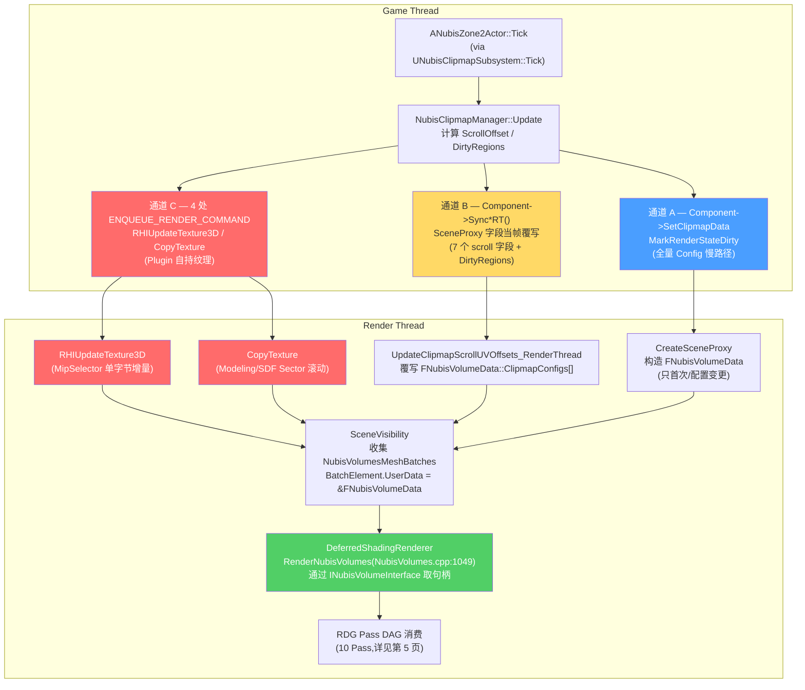

# GT ↔ RT 时序 — Plugin 自管 GPU 资源,不触 RDG

NubisCloud 数据从 Game Thread (GT) 走到 Render Thread (RT) **不是经典的 "Plugin → SceneProxy → RDG"**——`NubisCustom2` 自己 `ENQUEUE_RENDER_COMMAND` 直接调 RHI 写 `UVolumeTexture::TextureRHI`,然后通过 `UHeterogeneousUBSVolumeComponent::Set*` 系列把**资源句柄**(不是数据)推给 SceneProxy,RT 在 RDG 内只消费句柄[^plugin-new] [^arch]。结果是一条"两段式"链路:**Plugin↔Engine 边界 8 个 Component 方法/字段** + **Engine↔RDG 边界 4 个 INubisVolumeInterface 纯虚方法**。Plugin 自己没有一处 `FRDGBuilder` / `SHADER_PARAMETER` / `BeginInitResource`——RDG 调度全部在 Engine 端 `NubisVolumesLiveShadingPipeline.cpp` 内。

> 本页是第 3 页 · GT/RT 同步细节。Phase 0 笔记曾推测 "Plugin 通过 INubisVolumeInterface 把数据推给 RDG"——**这是错误假设**,Phase 1 实证已经更正(详见 §1)。Clipmap 的 6 级时间调度见 [第 4 页](4.%20Clipmap%206%20级调度%20—%20Mip%20Ring%20与%20Two-Pass.md);完整 Pass DAG 见 [第 5 页](5.%20RDG%20Pass%20全图%20—%20Live%20Shading%2010%20Pass%20DAG.md);LightingCache + ScrollUVOffset 三端镜像数学见 [第 7 页](7.%20LightingCache%20与%20Transmittance%20Volume.md);Plugin 不触 RDG 的工程后果见 [第 12 页](12.%20调试%20性能%20平台%20陷阱.md)。

---

## 1. 主题修正 — 从 Phase 0 假设到 Phase 1 实证

| 维度 | Phase 0 假设(错) | Phase 1 实证(对) |
|------|---------------------|---------------------|
| Plugin → RDG 路径 | Plugin 通过 INubisVolumeInterface 把**数据**推给 RDG | Plugin **不触 RDG**,自己 `ENQUEUE_RENDER_COMMAND` 直接写 RHI,把**资源句柄**通过 Component 推 SceneProxy |
| GPU 资源所有权 | RDG 临时 RT(Transient Pool) | Plugin 自持 `UVolumeTexture` / `UTextureRenderTargetVolume`(`AddToRoot` 防 GC) |
| ENQUEUE 数量 | 0(全走 RDG) | **4 处**(NubisClipmap.cpp:1220 / 1344 / 1689 / 2085) |
| Plugin↔Engine 契约面 | INubisVolumeInterface(读) | **8 个** Component 方法/字段(写)+ **4 个** Interface 方法(读) |
| RDG 端消费 | RDG Pass 直接拿 Plugin 数据 | RDG Pass 通过 `MeshBatch.UserData → INubisVolumeInterface*` 拿**资源句柄** |

**关键事实**:`grep ENQUEUE_RENDER_COMMAND` 在整个 NubisCustom2 模块内总命中 **4 次**,`grep BeginInitResource` 命中 **0 次**,`grep FRDGBuilder` 命中 **0 次**——Plugin 完全不接 RDG[^plugin-new]。

---

## 2. 三层数据流总图(Mermaid)



**三色对应三条数据通道(下一节展开)**:🔴 通道 C(Plugin 直接 GPU)、🟡 通道 B(SceneProxy 字段当帧)、🔵 通道 A(SceneProxy 重建慢路径)。所有 RT 操作的资源所有权都在 Plugin 自己持有的 `UVolumeTexture` 上,Engine 只透过句柄读。

---

## 3. Section 1:三条数据通道

`NubisCustom2 → Engine → RDG` 不是单一路径,而是**三条并行通道**,各自负责不同时延等级的数据同步。理解三通道的分工是吃透"为什么 Plugin 不触 RDG"的关键。

### 3.1 通道 A — 慢路径:`MarkRenderStateDirty` → 重建 SceneProxy

```
GT: Component->SetClipmapData(MipCount, Configs, MIDs)
       └─ MarkRenderStateDirty()
                ↓ (次帧 Render)
RT: CreateSceneProxy()
       └─ 构造 FNubisVolumeData
       └─ 拷贝 ClipmapConfigs[] / ClipmapMaterialProxies[]
       └─ 多个 ENQUEUE_RENDER_COMMAND 同步:
           - NubisTransmittanceCacheRenderTarget
           - PerLevelLightingCacheRTs[]
           - MipSelectorTextureRHI
```

| 项 | 值 |
|---|---|
| **触发条件** | 首次 / `ClipmapDataAsset` 改 / `ClipmapMipCount` 改 / Editor 拖动 Actor |
| **入口** | `Manager::InitClipmapLevels()`(NubisClipmap.cpp:2576-2753)调 `Component->SetClipmapData()` |
| **底层** | `MarkRenderStateDirty()` (NubisVolumeComponent.cpp:670) |
| **时延** | **次帧**(SceneProxy 异步重建) |
| **拷贝量** | 全量 `FNubisClipmapLevelRenderConfig[6]` + `MaterialProxy[6]` + 多个 RT 句柄 |
| **频率** | 极低(BeginPlay 一次,Editor 编辑时偶发) |

**实证**:Editor 模式下 `ANubisZone2Actor::OnConstruction` (NubisZone2Actor.cpp:67-88) 在 `!IsGameWorld` 路径下触发 `Unregister + Register`,任何属性面板编辑都会重走完整通道 A[^plugin-new]。

### 3.2 通道 B — 快路径:`ENQUEUE_RENDER_COMMAND` 当帧覆写

```
GT: Component->SyncClipmapScrollToProxy_RenderThread()
       └─ ENQUEUE_RENDER_COMMAND
                ↓ 当帧
RT: FHeterogeneousUBSVolumeSceneProxy::UpdateClipmapScrollUVOffsets_RenderThread()
       └─ 覆写 7 个 scroll 字段 + DirtyRegions:
           - WorldBoundsOrigin
           - ClipmapScrollUVOffset
           - ClipmapOriginSectorIdx
           - ScrollOffsetSectors
           - ParentWorldBoundsOrigin
           - ParentClipmapScrollUVOffset
           - bHasParentLightingCache
           - LightingCacheDirtyRegions
```

| 项 | 值 |
|---|---|
| **触发条件** | 每帧 `Manager::Update()` 内任意 Mip 滚动 OR 上帧 `bHadLightingCacheDirtyLastFrame` |
| **入口** | `Manager::Update()` 末尾 (NubisClipmap.cpp:720) 调 `Component->SyncClipmapScrollToProxy_RenderThread()` |
| **底层** | `ENQUEUE_RENDER_COMMAND` (NubisVolumeComponent.cpp:75-100) |
| **时延** | **当帧**(与 CopyTexture 共享同一 FIFO 队列) |
| **拷贝量** | 7 个标量/向量 + `LightingCacheDirtyRegions`(`TInlineAlloc<8>`,常 1-3 段) |
| **频率** | 每帧 GT(只要任意级滚动) |

**为什么必须是当帧而非 `MarkRenderStateDirty` 次帧**:`Manager::Update()` 当帧已经把新 sector 通过 `MergeLoadedTexture → CopyTexture` 写入了 `Levels[].VolumeTexture` 的新物理槽位[^clipmap]。如果 SceneProxy 还在用旧 `ScrollUVOffset` 解读这张已经更新的物理纹理,**渲染端读到的会是错位一个 sector 的内容**——视觉上表现为云朵突然瞬移。所以通道 B 的 ENQUEUE 必须**与 CopyTexture 共享同一 FIFO**,保证 RT 拿到新句柄前已先看到新 ScrollUVOffset。

### 3.3 通道 C — Plugin 直接 GPU 更新(本页核心实证)

```
GT: Manager::Update / MergeLoadedTexture / RecomputeMipSelectorEntry
       └─ ENQUEUE_RENDER_COMMAND  ←─ Plugin 自己 enqueue,不经 Component
                ↓ 当帧
RT: 直接调 RHI:
       - RHIUpdateTexture3D(MipSelectorVolume->Resource->TextureRHI, 1×1×1, 1byte)
       - RHIUpdateTexture3D(MipSelectorVolume->Resource->TextureRHI, full, init)
       - RHICmdList.CopyTexture(EmptySector / LoadedSector → Levels[].VolumeTexture)
       - RHISetDebugName
```

| 项 | 值 |
|---|---|
| **触发条件** | sector 上线/下线 / 滚动换入新 sector / Manager 初始化 |
| **入口** | 4 处 `ENQUEUE_RENDER_COMMAND` 在 `NubisClipmap.cpp` 内 |
| **底层** | 直接 RHI 操作 — **不经过 SceneProxy / Component / RDG** |
| **时延** | 当帧(若 RT 未饱和) |
| **资源所有权** | **Plugin 自持**(`UVolumeTexture` + `AddToRoot`) |
| **RDG 关系** | 与 RDG **解耦** — RDG Pass 在下一帧通过 SceneProxy 句柄读这些被更新的 RHI |

**关键实证(NubisCustom2 内 ENQUEUE_RENDER_COMMAND 4 处全清单)**:

| # | 文件:行号 | 调用点 | RHI 操作 | 影响资源 |
|---|----------|-------|---------|---------|
| 1 | NubisClipmap.cpp:1220 | `CreateSingleVolumeTexture` 内 | `RHIBindDebugLabelName` | Per-Mip Clipmap VolumeTexture(debug 名,截帧用) |
| 2 | NubisClipmap.cpp:1344 | `CreateMipSelectorVolume` 内 | `RHIUpdateTexture3D`(全张哨兵填 0x0E) | MipSelector Atlas(初始化,**唯一一处批量上传**) |
| 3 | NubisClipmap.cpp:1689 | `RecomputeMipSelectorEntry / PropagateMipSelectorChange` | `RHIUpdateTexture3D`(1×1×1 单字节增量) | MipSelector Atlas(sector 上线/下线时局部更新 entry) |
| 4 | NubisClipmap.cpp:2085 | `MergeLoadedTexture / CopySectorToClipmap` | `RHICmdList.CopyTexture` | Modeling/SDF Sector → `Levels[].VolumeTexture` 环形位置 |

**实证 grep 命令**(可复现):
```bash
$ grep -rn "ENQUEUE_RENDER_COMMAND" Projects/HiGame/Plugins/NubisCustom/Source/NubisCustom2/
NubisClipmap.cpp:1220:  ENQUEUE_RENDER_COMMAND(SetNubisVolumeTextureDebugName) ...
NubisClipmap.cpp:1344:  ENQUEUE_RENDER_COMMAND(InitMipSelectorAtlas) ...
NubisClipmap.cpp:1689:  ENQUEUE_RENDER_COMMAND(UpdateMipSelectorEntry) ...
NubisClipmap.cpp:2085:  ENQUEUE_RENDER_COMMAND(CopyClipmapSectorTexture) ...

$ grep -rn "FRDGBuilder\|SHADER_PARAMETER\|BeginInitResource" \
        Projects/HiGame/Plugins/NubisCustom/Source/NubisCustom2/
(0 matches)
```

> **设计意图 [推测]**:Plugin 端选择直接 RHI 而非 RDG,是因为这些操作要么是**初始化**(filling 整张 atlas,生命周期跨多帧),要么是**离散增量**(单 sector copy / 单 voxel update),不需要 RDG 的 Transient Pool 复用、也不参与 Pass 间依赖图。RDG 的强项是同帧内多 Pass 的资源别名与 Barrier 推断,对 Plugin 的"持续累积型纹理"反而是负担。

---

## 4. Section 2:关键接口表

### 4.1 表 4-A:`INubisVolumeInterface` 纯虚方法(RT 读)

| 方法 | 线程 | 调用点 | 返回 | 职责 |
|------|------|-------|------|------|
| `GetClipmapLevelConfig(int32 Level)` | RT | NubisVolumes.cpp:1219 | `const FNubisClipmapLevelRenderConfig&` | 读 6 级 Clipmap 配置(每级 30+ 字段) |
| `GetClipmapMaterialProxy(int32 Level)` | RT | NubisVolumes.cpp:1221 | `const FMaterialRenderProxy*` | 读云朵材质(MID GPU 副本) |
| `GetPerLevelLightingCacheRT(int32 Level)` | RT | NubisVolumes.cpp:1189 | `FRDGTextureRef` | 读 LightingCache RT(双缓冲源/目标在 Engine 端拼接) |
| `GetMipSelectorTextureRHI()` | RT | [推测] PassParameters 绑定时 | `FRHITexture*` | 读 MipSelector Atlas(整 Zone 一张) |

**实现者**:`FNubisVolumeData`(`NubisVolumeInterface.h:306-436`,继承 `FOneFrameResource` + `INubisVolumeInterface`)。`FOneFrameResource` 保证生命周期到 `GraphBuilder.Submit` 才释放,**避开 RT↔GT 共享 GC 对象**。

**唯一访问入口**:`MeshBatch.Elements[0].UserData = &FNubisVolumeData`(在 `FHeterogeneousUBSVolumeSceneProxy::GetDynamicMeshElements` 内填),`RenderNubisVolumes` 通过 `static_cast<INubisVolumeInterface*>(UserData)` 反向取出[^arch]。

### 4.2 表 4-B:`UHeterogeneousUBSVolumeComponent` 的 `Set*` 系列(GT 写)

Plugin↔Engine 唯一的写入接口面 = **8 个 Component 方法/字段**:

| # | 方法/字段 | 触发通道 | Plugin 调用点 | 同步对象 |
|---|----------|---------|--------------|---------|
| 1 | `SetClipmapData(MipCount, Configs, MIDs)` | A 慢路径 | NubisClipmap.cpp:711, 2745 | 全量 ClipmapConfigs + Material 数组 → Component 字段(下一帧 SceneProxy 拷贝) |
| 2 | `SetMipSelectorVolume(UVolumeTexture*)` | A+B 混合 | NubisClipmap.cpp:2744 | MipSelector Atlas 句柄(Component 内部走 ENQUEUE 同步 RHI 到 SceneProxy) |
| 3 | `SetPerLevelLightingCacheRTs(TArray<UTextureRenderTargetVolume*>)` | A 慢路径 | NubisClipmap.cpp:2703 | 6 张 LightingCache RT(每级一张) |
| 4 | `SyncClipmapScrollToProxy_RenderThread()` | B 当帧 | NubisClipmap.cpp:720 | 7 个 scroll 字段 + DirtyRegions(直接 ENQUEUE 覆写 SceneProxy 字段) |
| 5 | `MarkRenderStateDirty()` | A 触发器 | NubisClipmap.cpp:201, 712 | 触发 SceneProxy 重建 |
| 6 | `ClipmapLevelCount`(字段) | A 慢路径 | NubisClipmap.cpp:706 | int32,Shutdown 时置 0 让 SceneProxy 不进 Clipmap 循环 |
| 7 | `ClipmapConfigs`(字段)| A 慢路径 | NubisClipmap.cpp 间接 | 数组本体,Set 接口内部 `Empty() + Append` |
| 8 | `ClipmapMaterialProxies`(字段) | A 慢路径 | NubisClipmap.cpp 间接 | Material proxy 数组 |

**注意**:第 4 个 `SyncClipmapScrollToProxy_RenderThread` 名称中有 `_RenderThread` 后缀但实际**入口在 GT 调用**,内部 `ENQUEUE` 才到 RT——这是 UE 代码风格里"接受 GT 调用、内部跨线程"的常见命名约定。

### 4.3 表 4-C:Plugin 内 4 处 `ENQUEUE_RENDER_COMMAND` 详细

详见 §3.3 的 4 处清单。这里补一行"是否走 Engine 转发":

| # | RHI 操作 | Plugin 自己 enqueue | 走 Component 转发 |
|---|---------|--------------------:|:-----------------|
| 1 SetDebugName | `RHIBindDebugLabelName` | ✅ | — |
| 2 InitMipSelectorAtlas | `RHIUpdateTexture3D` 整张 | ✅ | — |
| 3 UpdateMipSelectorEntry | `RHIUpdateTexture3D` 1×1×1 | ✅ | — |
| 4 CopyClipmapSectorTexture | `RHICmdList.CopyTexture` | ✅ | — |
| (Component) SetMipSelectorVolume 内部 | 推 RHI 句柄到 SceneProxy | — | ✅ |
| (Component) SyncClipmapScrollToProxy | 推 7 字段到 SceneProxy | — | ✅ |

**核心结论**:**直接走 RHI 的 4 处都是 Plugin 自持纹理的内容更新**;**走 Component 转发的全是把 Plugin 自持纹理的句柄推给 SceneProxy**——两类操作泾渭分明,**RDG Pass 在下一帧或当帧晚些时候通过句柄读这些已经被 Plugin 更新过的 RHI**。

---

## 5. Section 3:ASCII 时序图 — 一帧的完整 GT↔RT 流程

```
────────────────────── 帧 N 开始 (FEngineLoop::Tick) ──────────────────────
GT (Game Thread)                     │ RT (Render Thread, 落后 0~1 帧)
─────────────────────────────────────┼────────────────────────────────────
[GT-Tick 阶段]                       │
ANubisZone2Actor::Tick               │
  └─ UNubisClipmapSubsystem::Tick    │
       └─ for each Zone:             │
            CamPos = GetCameraWorld..│
            Manager::Update(CamPos)  │
              ├─ DirtyRegions.Reset  │
              ├─ for(L,Type)         │
              │   计算 SectorDelta   │
              │   if 滚动:           │
              │     ScrollOffset+=Δ  │
              │     PendingLoad.Add  │
              │     fill DirtyRegions│
              │                      │
              ├─ ProcessPendingLoads │
              │   StreamableManager  │
              │     .RequestAsyncLoad│
              │     (回调发到 GT)    │
              │                      │
              ├── ★ 通道 C-1 ★ ─────►│ ENQUEUE: CopyClipmapSectorTexture
              │     CopyTexture       │   RT: RHICmdList.CopyTexture
              │     (Sector→VolTex)   │       (Modeling phys 槽位写入)
              │                      │
              ├── ★ 通道 C-2 ★ ─────►│ ENQUEUE: UpdateMipSelectorEntry
              │     1×1×1 byte        │   RT: RHIUpdateTexture3D
              │                      │       (MipSelector atlas 单字节)
              │                      │
              ├─ MID->SetVectorParam  │  (材质参数,RT 端材质代理同帧消费)
              │     ClipmapScrollUV   │
              │     OriginSectorIdx   │
              │                      │
              ├─ if 任意级变化:      │
              │   Component->SetClip  │
              │     mapData(...)      │
              │   ► MarkRenderStateDi │ [次帧 RT 重建 SceneProxy]
              │     rty (慢路径 A)    │
              │                      │
              └── ★ 通道 B ★ ───────►│ ENQUEUE: SyncClipmapScrollToProxy
                  Component->SyncCli  │   RT: SceneProxy::UpdateClipmap
                  pmapScrollToProxy_  │       ScrollUVOffsets_RT
                  RenderThread        │       FNubisVolumeData::Configs[]
                  (7 字段)            │       的 7 个字段当帧覆写 ★
                                      │       (与 CopyTexture 同 FIFO!)
                                      │
[GT 其他系统]                        │
                                     │
                                     │  ┌── 帧 N RT 开始 ──
                                     │
                                     │ SceneVisibility::ProcessVisibility
                                     │   收集 NubisVolumesMeshBatches
                                     │   GetDynamicMeshElements
                                     │     BatchElement.UserData =
                                     │       &FNubisVolumeData
                                     │
                                     │ DeferredShadingRenderer::Render
                                     │   ...VolumetricFog...
                                     │   RenderHeterogeneousVolumes
                                     │   ┌─ RenderNubisVolumes ─────────┐
                                     │   │ for View, for VolumeMesh:    │
                                     │   │  NubisVolume = (INubisVol*)  │
                                     │   │       UserData               │
                                     │   │  Pass1 LCache 远→近 (L4..L0):│
                                     │   │   AddReseedLightingCachePass │
                                     │   │   RenderNubisClipmapLevel    │
                                     │   │     (bLightingCacheOnly=true)│
                                     │   │  Pass2 Scattering 近→远(L0~5)│
                                     │   │   RenderNubisClipmapLevel    │
                                     │   │     (bLightingCacheOnly=false│
                                     │   │     ├ Near                   │
                                     │   │     ├ Far Dither             │
                                     │   │     └ Octa [TODO]            │
                                     │   └──────────────────────────────┘
                                     │   FlushSetupQueue
                                     │   RenderVolumetricCloud
                                     │   ...RenderTranslucency...
                                     │   CompositeHeterogeneousVolumes
                                     │   CompositeNubisVolumes
                                     │   AddResolveSceneColorPass
                                     │
─────────────────────── 帧 N 结束 ───────────────────────
```

**关键时序约束**:
1. 通道 C-1 / C-2 / 通道 B 三者都用 `ENQUEUE_RENDER_COMMAND`,**同 FIFO** → 严格按 GT 调用顺序到达 RT。`Manager::Update` 内部把 CopyTexture 排在 SyncScroll 前面,RT 拿到新句柄前已先更新 ScrollUVOffset。
2. 通道 A 的 `MarkRenderStateDirty` 走另一条路径(`UActorComponent::DoDeferredRenderUpdates`),**次帧才生效** — 通道 A 永远不和 C/B 在同一帧竞争。
3. RDG Pass(`RenderNubisVolumes`)只在 Render Pass 阶段执行,**与 GT 完全解耦** — 它读的是 SceneProxy 字段(已被通道 B 当帧更新)+ `UVolumeTexture::Resource->TextureRHI`(已被通道 C 当帧更新)。

---

## 6. Section 4:ScrollUVOffset 三端镜像 — 为什么数据更新要"三端镜像"

> 本节是事实 #8 的延伸:**LightingCache EMA β=0.97;ScrollUVOffset 三端镜像** ★ 本页关键。

`ScrollUVOffset` 是 `Manager` 内 `Levels[].ScrollOffset / SectorWidth` 计算出的 `FVector3f ∈ [0,1)³`。它在**三个端点**被消费:

| 消费端 | 文件 | 用途 |
|--------|-----|------|
| **Reseed Pass**(LightingCache 父→子回填) | `NubisVolumesLightingCacheReseed.usf:57-63` | `ChildLogicalUV = frac(ChildPhysUV - ChildClipmapScrollUVOffset + 1.0)`<br/>`ParentPhysUV = frac(ParentLogicUV + ParentClipmapScrollUVOffset + 1.0)` |
| **Write Pass**(LightingCache CS 写入) | `NubisVolumesLiveShadingPipeline.cpp` LCache CS | 用 `LightingCacheScrollUVOffset` 把 logical voxel 坐标映射到物理 phys 槽位 |
| **Sample Pass**(RayMarch 时采样) | `NubisVolumesLiveShadingPipeline.usf:380-388` | `PhysicalUVW = frac(LogicUVW + ClipmapScrollUVOffset + 1.0)` |

**三端共享同一帧的 `ScrollUVOffset`**——但 `ScrollUVOffset` 在 GT 端 `Manager::Update` 计算后,要走**三条路径**到达三端:
1. **Reseed Pass** ← `FNubisClipmapLevelRenderConfig::ClipmapScrollUVOffset`(通道 B 当帧覆写)
2. **Write Pass** ← 同上(LCache CS 用同一 Config)
3. **Sample Pass(RayMarch)**:
   - 有走 Config 路径(RDG Pass 内取),
   - 也有走 **Material 参数**(`MID->SetVectorParameterValue("ClipmapScrollUVOffset")`,NubisClipmap.cpp:675)——经材质代理 Proxy 到达 PixelShader

**为什么任何一处错位 → 闪烁伪影**:
- LightingCache 是 EMA 累积量(β=0.97 → ~33 帧才衰半)
- 如果 Reseed Pass 用 ScrollUV-A,Write Pass 用 ScrollUV-A',Sample Pass 用 ScrollUV-A''
- `frac(LogicUVW + ScrollUV-A) ≠ frac(LogicUVW + ScrollUV-A')` → 同一物理 voxel 被三端解读为**三个不同的逻辑位置**
- 表现为:LightingCache 的"历史"与世界位置脱钩,在视图边界出现棋盘格闪烁、薄云边缘抖动

**实证 — 三端如何保证一致**:
- 通道 B 一次 ENQUEUE 把所有 7 个 scroll 字段当帧覆写到 SceneProxy → Reseed/Write/Sample 用同一份 Config
- Material 参数(MID 路径)与 Config(SceneProxy 路径)在同一帧 GT 写入,**MID 走材质代理 GPU 副本上传** vs **Config 走 ENQUEUE 直接覆写字段**——两条路 RT 端在同一 RDG 帧内被消费 [推测:同帧到达,但 RT 端实际命中时间在 PassParameter 装配时刻,需 PIX 确认]

> **详细数学和 USF 三段实证** → [第 7 页 LightingCache + 阴影](7.%20LightingCache%20与%20Transmittance%20Volume.md)

---

## 7. Section 5:多 Zone 并发 — 不合并 Atlas

> 事实 #14:多 Zone 不合并 Atlas ★ 本页关键。

**实现现状**(`UNubisClipmapSubsystem::ClipmapManagers : TMap<ANubisZone2Actor*, TUniquePtr<NubisClipmapManager>>`):
- 1 Zone : 1 NubisClipmapManager : 1 UHeterogeneousUBSVolumeComponent : 1 SceneProxy
- 每 Zone 独立持有:
  - **2×6 张** Modeling/SDF VolumeTexture(`Levels[Type][Mip].VolumeTexture`)
  - **1 张** MipSelector Atlas(`MipSelectorVolume`,SectorWidth × MipCount 段)
  - **6 张** PerLevelLightingCacheRT(`UTextureRenderTargetVolume`)
  - **2 张** EmptySectorTexture(BC6H + DXT1)
  - **6 个** UMaterialInstanceDynamic(每级一个)

**4 处 ENQUEUE_RENDER_COMMAND 在多 Zone 时如何并发**:
- `Subsystem::Tick` 串行遍历 `for each (Zone, Mgr)`,**GT 端是串行的**
- 每 Zone 各自独立 enqueue 4 处 ENQUEUE_RENDER_COMMAND → RT FIFO 拿到的是 `Zone1.4 → Zone2.4 → Zone3.4 ...` 的串行流
- **RHI 操作在 RT 上仍是串行执行**(RHI command list 单线程 dispatch),不并行
- 但 GPU 上不同 Zone 的纹理是**完全独立的资源**,不存在锁/同步等待

**显存随 Zone 数线性增长**:

| 资源 | 单 Zone 大小 | 备注 |
|-----|-------------|------|
| Modeling VolumeTextures × 6 | ~6 × N MB(BC6H,SectorSize 决定) | per-Mip 不同分辨率(累加为常数) |
| SDF VolumeTextures × 6 | ~6 × N MB(DXT1) | 同上 |
| LightingCacheRT × 6 | ~6 × M MB(PF_R16F,LightingCacheRes) | 远小于 Modeling |
| MipSelector Atlas | SectorWidth × MipCount × 1B(PF_R8_UINT) | 微小(KB 量级) |
| EmptySector × 2 | SectorSize × 2 | 共享单 Zone 内 |

**N Zone 时**:总显存 ≈ N × 单 Zone 总和。**没有**跨 Zone 共享 atlas / 共享空 sector 的优化路径——这是 Phase 0 后被实证修正的关键点[^plugin-new]。

> **多 Zone 物理重叠时的渲染顺序**:RT 端 `RenderNubisVolumes` 调度循环对每 View 收集到的 N 个 NubisVolumesMeshBatches **逐个串行处理**(`for VolumeIndex` 内层循环),按相机距排序。**[推测]** 后渲染的 Zone 通过 BlendMode=1 在前一个 Zone 的结果之上 blend-under 合成,但本笔记没在 NubisVolumes.cpp:1077-1366 范围内验证 N>1 的合成数学。详见 [第 12 页 · 已知问题](12.%20调试%20性能%20平台%20陷阱.md)。

---

## 8. Section 6:调试技巧

### 8.1 不能用什么

| 工具 | 是否适用于 NubisCloud Plugin 路径? |
|------|-----------------------------------|
| `r.RDG.Debug` / `r.RDG.Validation` | ❌ **不适用** Plugin 的 ENQUEUE 路径 — 它不在 RDG 里 |
| `r.RDG.ImmediateMode` | ❌ 同上 |
| `r.RDG.Events` | ⚠️ 只能看 `RenderNubisVolumes` 内部的 RDG Pass(Engine 端),看不到 Plugin 4 处 ENQUEUE |

### 8.2 应该用什么

| 工具 | 看什么 |
|------|-------|
| **GPU PIX / RenderDoc** | Plugin 自己的 `RHIUpdateTexture3D` / `RHICmdList.CopyTexture` 全程可见 — 截帧后 Resource Timeline 上能找到 4 处 RHI 操作。`SetNubisVolumeTextureDebugName` (NubisClipmap.cpp:1220) 给的 debug 名是关键定位点 |
| `stat scenerendering` | NubisVolumes MeshBatch 数 — 多 Zone 时确认是否每 Zone 一个 batch |
| `stat gpu` | NubisVolumes 整段渲染时间(`SCOPED_DRAW_EVENT(NubisVolumes)`) |
| `r.NubisVolumes.DebugMipMask` | 屏蔽某些 Mip 不渲染(只对 Pass 2 Scattering 生效,不影响 Pass 1 LCache) |
| `r.NubisVolumes.Visualize` | 5 个可视化模式之一,详见 [第 8 页](8.%20Reconstruct%20与%20Bilateral%20Upscale.md) |
| `r.Nubis.Clipmap.ZUpdateStretch` | Z 轴各向异性死区(Plugin 端 Update 内读) |

### 8.3 PIX 截帧时的视觉特征

- **通道 C 4 处 RHI 操作** 在 `Frame Captured` 的 GPU Timeline 顶部独立显示,**没有 RDG SetupPass / ExtractPass 包裹**
- **RDG 段** 在中间,所有 NubisVolumes 的 Compute Pass 都在 `RenderNubisVolumes` 一个 SCOPED_DRAW_EVENT 内
- 资源标签:`Levels[Modeling][3].VolumeTexture` 在 RHI Resources 列表里能直接搜到(因为有 SetDebugName)

### 8.4 常见误诊与对策

| 现象 | 误诊 | 实际根因 |
|------|------|---------|
| 云朵突然瞬移一个 sector | RDG Pass 顺序错乱 | 通道 B 的 ENQUEUE 没排在 CopyTexture 之后 → 检查 `SyncClipmapScrollToProxy_RenderThread` 调用次序 |
| 视觉边界闪烁 | LightingCache β 太低 | ScrollUVOffset 三端不一致(§6 详述) |
| 多 Zone 时 OOM | 地图太大 | 每 Zone 独立持纹理,显存 N 倍线性增长 — 见 [第 12 页 · 多 Zone 显存陷阱](12.%20调试%20性能%20平台%20陷阱.md) |
| Editor 拖动 Actor 卡顿 | Editor 渲染开销 | `OnConstruction` 触发完整通道 A 重建 — 12 张 VolumeTexture + 6 张 LCacheRT 全部重新创建 |

---

## 9. 18 条已知事实速查(本页相关项)

| # | 事实 | 本页定位 |
|---|------|---------|
| 1 | `HIGAME_ENABLE_NUBIS` 在 Build.h:1152 硬编码=1 | 引用,详见 [第 2 页](2.%20引擎端架构%20—%20HIGAME_ENABLE_NUBIS%20与%20INubisVolumeInterface.md) |
| 2 | Shader 共 15 个文件 | 引用 |
| 3 | Sparse Voxel cvar 全是空壳 | 引用 |
| 4 | HardwareRayTracing 未接通 | 引用 |
| 5 | Visualize 模式 5 个 | §8.2 提及 |
| 6 | Two-Pass: LCache 4→0, Scattering 0→5 | §5 时序图 |
| 7 | MipRingCrossoverCm 500cm | 引用 |
| 8 | LightingCache EMA β=0.97;**ScrollUVOffset 三端镜像** | **§6 本页关键** |
| 9 | Bilateral 4 mode + Far under Near | 引用 |
| 10 | NubisCustom2 是唯一生产路径 | §3.3 实证基础 |
| 11 | 4 模块全 Linux deny | 引用 |
| 12 | NubisVDBDataAsset 运行时零消费 | 引用 |
| 13 | **Plugin 直接 ENQUEUE_RENDER_COMMAND,不触 RDG** | **§3.3 §4.3 本页核心** |
| 14 | **多 Zone 不合并 Atlas** | **§7 本页关键** |
| 15 | Sector 按需流式 | §3.3 通道 C 触发条件 |
| 16 | VolumetricFog → NubisVolumes → VolumetricCloud | §5 时序图 |
| 17 | SM5+Deferred only | 引用 |
| 18 | NubisDefaults: MipCount=6 | §7 多 Zone 显存计算依据 |

---

## 10. 交叉引用

- 渲染管线插入位置(`RenderNubisVolumes` 在 `DeferredShadingRenderer` 中的位置)→ [第 2 页 §5](2.%20引擎端架构%20—%20HIGAME_ENABLE_NUBIS%20与%20INubisVolumeInterface.md)
- Clipmap 6 级调度细节(Two-Pass 顺序的级联依赖) → [第 4 页](4.%20Clipmap%206%20级调度%20—%20Mip%20Ring%20与%20Two-Pass.md)
- 完整 RDG Pass DAG 与 Permutation → [第 5 页](5.%20RDG%20Pass%20全图%20—%20Live%20Shading%2010%20Pass%20DAG.md)
- LightingCache + ScrollUVOffset 三端镜像数学详解 → [第 7 页](7.%20LightingCache%20与%20Transmittance%20Volume.md)
- 类层次细节(NubisClipmapManager / Subsystem / DataAsset) → [第 9 页](9.%20NubisCustom%20插件%20—%20新路径唯一;%20老路径是蓝图遗骸.md)
- Plugin 不触 RDG 等陷阱(显存陷阱、Editor 重建抖动) → [第 12 页](12.%20调试%20性能%20平台%20陷阱.md)

---

## 11. 小结 — 一句话总结 GT↔RT 时序

> **NubisCloud Plugin 端通过 4 处 `ENQUEUE_RENDER_COMMAND` 直接调 RHI 维护自持的 Modeling/SDF/MipSelector 纹理(通道 C),通过 Component 8 个 Set* 接口把这些纹理的句柄推给 SceneProxy(慢路径 A 重建 SceneProxy + 快路径 B 当帧覆写 7 个 scroll 字段),RT 在 RDG Pass 内通过 INubisVolumeInterface 4 个纯虚方法读出句柄消费——Plugin 与 RDG 完全解耦,资源所有权在 Plugin 一侧,Engine 只负责合成调度。**

---

[^arch]: [[higame-nubis-engine-arch|NubisCloud 引擎魔改入口 + 跨模块 API + GT↔RT 边界]] · 本地代码考古 · 2026-05-11
[^plugin-new]: [[higame-nubis-plugin-nubiscustom2|NubisCloud 新路径插件 NubisCustom2 — 类层次与 GPU 资源]] · 本地代码考古 · 2026-05-11
[^clipmap]: [[higame-nubis-clipmap-scheduling|NubisCloud Clipmap 调度 — Mip Ring / Sector 滚动 / Two-Pass]] · 本地代码考古 · 2026-05-11
