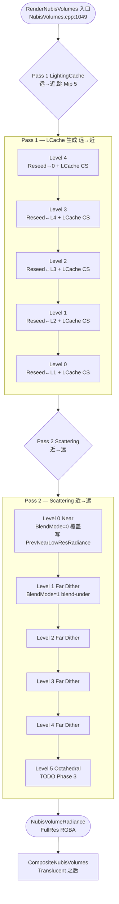
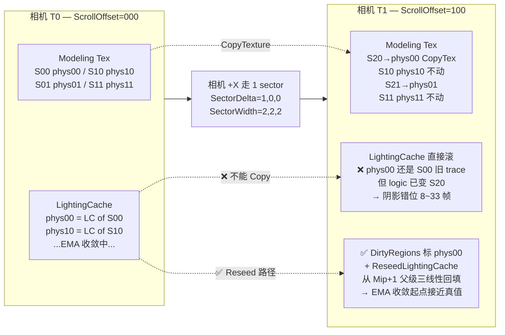

# Clipmap 6 级调度 — Mip Ring / Sector 滚动 / Two-Pass

NubisCloud 用 6 级 Clipmap 表达不同距离的云细节,每帧 **Two-Pass 串行调度**:Pass 1 远→近(Level 4→0,跳 Mip 5)生成 LightingCache,Pass 2 近→远(0→5)做 Scattering[^clipmap][^rdg]。本页拆解每一级的 Mip Ring 边界、Sector 滚动机制、跳 Mip 5 的原因、LightingCache EMA 与 Reseed 的耦合策略,以及 GT 端 `NubisClipmapSubsystem` / `NubisClipmapManager` 如何把 6 个 `FNubisClipmapLevelRenderConfig` 推到 RT 让 `RenderNubisVolumes()` 消费。

> 本页是第 4 页 · 整个 wiki 的"调度时序大图"。GT↔RT 完整时序见 [第 3 页](3.%20GT%20↔%20RT%20时序%20—%20Plugin%20自管%20GPU%20资源.md)、每个 Pass 的 SRV/UAV 见 [第 5 页](5.%20RDG%20Pass%20全图%20—%20Live%20Shading%2010%20Pass%20DAG.md)、MipSelector 与 Slab-Skip 见 [第 6 页](6.%20MipSelector%20与%20Sector%20Slab-Skip%20等价方案.md)、LightingCache EMA + Scroll 三端镜像 见 [第 7 页](7.%20LightingCache%20与%20Transmittance%20Volume.md)、Reconstruct + Bilateral 见 [第 8 页](8.%20Reconstruct%20与%20Bilateral%20Upscale.md)、跳 Mip 5 等陷阱见 [第 12 页](12.%20调试%20性能%20平台%20陷阱.md)。

---

## 1. NubisDefaults 常量回顾

Clipmap 调度的所有几何尺寸都来自 `Engine/Public/NubisVolumeInterface.h` 的 `NubisDefaults` 命名空间(完整字段表见 [第 2 页](2.%20引擎端架构%20—%20HIGAME_ENABLE_NUBIS%20与%20INubisVolumeInterface.md))。本节只复列**调度逻辑直接依赖**的 5 个常量[^arch]:

| 常量 | 值 | 含义 |
|------|-----|------|
| `MipCount` | **6** | Mip 0~5,Pass 1 LCache 烘焙最多到 Mip 4(`MaxLightingCacheLevels=5`,见 §2.1) |
| `BaseVoxelSize` | **1 m** | Mip 0 体素 = 1 m,每升一级 ×2 → Mip 5 体素 = 32 m |
| `TextureSize` | **512×512×128** voxel | 全 Clipmap **Modeling 体素**总数(实际是 `TransmittanceVoxelResolution`) |
| `SectorSize` | **256×256×64** voxel | 单 Sector 体素数(同时也是单级 LCache 体素总数,即 `ScatteringCacheVoxelResolution`) |
| `SectorWidth` | **2×2×2** sector | 每 Mip 共 8 个 Sector,环形缓冲基础维度 |

关键关系:`TextureSize = SectorSize × SectorWidth`,即每一级 Modeling Texture 在每个轴上正好被切成 2 个 Sector;LCache 不再切 Sector(因为 LCache 本身就是按 Sector 大小分配的)。

> Mip N 的体素物理尺寸(米) = `BaseVoxelSize × 2^N`;Mip N 的 AABB 边长 = `SectorSize × BaseVoxelSize × SectorWidth × 2^N`(单轴)。Mip 0 单轴覆盖 = 256×1×2 = **512 m**;Mip 5 单轴覆盖 = 256×32×2 = **16 384 m**(约 16 km),足以盖住整张 8×8 km 的开放世界主图加远景天空盒。

---

## 2. Two-Pass 调度概览

`FDeferredShadingSceneRenderer::RenderNubisVolumes()`(`NubisVolumes.cpp:1049`)在每个 View / 每个 Volume Mesh 内部串行展开两趟 for 循环[^arch]:

```cpp
// 简化伪码,完整实现 NubisVolumes.cpp:1077-1366
RDG_EVENT_SCOPE(GraphBuilder, "NubisVolumes");
for (ViewIndex)
  for (VolumeIndex)  // 按相机距排序的 NubisVolumesMeshBatches
  {
    // ─── Pass 1: LightingCache 远→近(L4..L0,跳 L5)──────
    for (Level = MaxLightingCacheLevels-1; Level >= 0; --Level)
    {
      AddReseedLightingCachePasses(Cfg, ParentCfg);          // dirty regions 父级回填
      RenderNubisClipmapLevel(..., bLightingCacheOnly=true); // EMA + amortize
    }
    // ─── Pass 2: Scattering 近→远(L0..L5)─────────────
    for (Level = 0; Level < ClipmapLevelCount; ++Level)
    {
      if (!(ScatterDebugMipMask & (1<<Level))) continue;     // 调试位掩码
      RenderNubisClipmapLevel(..., bLightingCacheOnly=false,
                                   PrevNearLowResRadiance,
                                   &CurNearLowResRadiance);
    }
  }
```

两趟 for 循环 **互不重叠**:Pass 1 全部完成才进入 Pass 2(单线程渲染线程顺序 enqueue 到 RDG)[^clipmap]。

### 2.1 Pass 1: LightingCache 生成(远→近,Level 4→0,跳 Mip 5)

| 字段 | 值 |
|------|---|
| 入口 | `NubisVolumes.cpp:1049` `RenderNubisVolumes()` 内层第一趟循环 |
| 顺序 | **Level 4 → 3 → 2 → 1 → 0** |
| 每级动作 | ① `AddReseedLightingCachePasses(Cfg, ParentCfg)`<br/>② `RenderNubisClipmapLevel(bLightingCacheOnly=true)` |
| 跳过的级 | **Mip 5** —— 因 `MaxLightingCacheLevels=5`(`NubisVolumes.cpp:1208` 硬编码)截断为 0..4 |
| 是否受 DebugMipMask 影响 | **否** —— 第一趟无视 `r.NubisVolumes.DebugMipMask`(`cpp:1212-1215`),全级烘焙保证级联完整 |

#### 2.1.1 跳 Mip 5 的原因

代码事实:Mip 5 在两个地方被特殊化处理:
1. **不烘 LCache**:`MaxLightingCacheLevels=5` 让 Pass 1 只跑 L4..L0
2. **走 Octahedral 路径**(目前 TODO):`NubisVolumesLiveShadingPipeline.cpp:2649` `if (Config.bUseOctahedral)` 分支只有 `// TODO: RenderOctahedralScattering(...)`,Mip 5 实际 Pass 2 走的是 Far Dither 还是直接掉帧——见 [第 12 页 · 已知问题](12.%20调试%20性能%20平台%20陷阱.md)

[推测] 跳 Mip 5 是因为 L5 是远景"天空云",物理上单体素 32 m,落在 LCache 上做 amortize+EMA 收益极低(8 帧填一遍 + EMA β=0.97 ≈ 33 帧衰半,合计百帧级延迟,而玩家相机移动 1 km 才跨一个 Mip 5 体素);加上 Octahedral 路径设计上是把"远场云壳"压扁到 2D 八面体贴图采样,根本不需要 3D LCache。详细推测见第 12 页。

#### 2.1.2 父子级联依赖

LCache 远→近的根本原因是**级联读父级**:Mip N 的 LCache CS 在 local-space ray-march 完本级 AABB 内段后,如果光线终点超出本级 AABB,会跳到父级 Mip N+1 的 LCache 里 `SampleLevel` 三线性查询光学深度并累加(`NubisVolumes.cpp:1232-1260` 注入 `ParentLightingCacheTexture`)[^rdg]。

所以**父级 LCache 必须先于子级生成**,否则子级会采到上一帧的脏数据 → 阴影错位。L4 因为没有父级(L5 不烘),`bHasParentLightingCache=false`,Reseed 写 0(`NubisVolumesLightingCacheReseed.usf:69`),后续 EMA 稳态收敛。

### 2.2 Pass 2: Scattering 渲染(近→远,Level 0→5)

| 字段 | 值 |
|------|---|
| 入口 | `NubisVolumes.cpp:1049` 内层第二趟循环 |
| 顺序 | **Level 0 → 1 → 2 → 3 → 4 → 5** |
| 受 DebugMipMask 控制 | **是** —— `if (!(ScatterDebugMipMask & (1<<Level))) continue;`(调试时只渲染部分 Mip) |
| 路由 | 见 §2.2.1 三分支表 |
| BlendMode | Level 0 = `0`(覆盖)、Level 1+ = `1`(blend-under,Far under Near) |
| EarlyOut 链 | `PrevNearLowResRadiance` 给 Near 管线做基于前序 Level 累积 alpha 的早退 |

#### 2.2.1 三分支路由(`RenderNubisClipmapLevel` 内部决策)

来自 `NubisVolumesLiveShadingPipeline.cpp:2556-2722`[^rdg]:

| 条件 | 分支 | 入口函数 |
|------|------|---------|
| `bLightingCacheOnly == true` | LightingCache 烘焙 | `RenderLightingCacheWithLiveShading` (cpp:1098) |
| `bUseDither && bUseOctahedral == true` | **Phase 3 Octahedral**(TODO) | `// TODO: RenderOctahedralScattering` |
| `bUseDither == true` | **Far Dither** | `RenderTemporalSingleScatteringWithLiveShading` (cpp:2245) |
| 其它 | **Near Live Shading** | `RenderNearCloudWithLiveShading` (cpp:2418) |

`Config.bUseDither` / `Config.bUseOctahedral` 在 GT 端 `NubisClipmapManager` 填 Config 时按 Level 配置(详见 §6 字段表):L0 = Near、L1..L4 = Far Dither、L5 = Octahedral(TODO)。

#### 2.2.2 BlendMode 与 Composite

Pass 2 每级渲染的最终输出是同一张 `NubisVolumeRadiance`(全分辨率 RGBA Float),但 Bilateral Upscale 阶段(详见 [第 8 页](8.%20Reconstruct%20与%20Bilateral%20Upscale.md))用不同 BlendMode 写入:

```hlsl
// Bilateral.usf 等价伪码
if (CompositeBlendMode == 0)  // Level 0
    OutColor = NewSample;
else                           // Level 1+
    OutColor.rgb = Existing.rgb + NewSample.rgb * Existing.a;  // Far under Near
    OutColor.a   = Existing.a * NewSample.a;
```

近景(L0)先入 RT 占据 alpha,远景(L1+)被 alpha 压制。`NearDominanceEnabled` cvar 进一步可调"近景抢戏"曲线(`NearDominanceStartAlpha / EndAlpha`)。

#### 2.2.3 EarlyOut 链:`PrevNearLowResRadiance`

Near 管线的 Level N(N≥1)CS 实际是 `FRenderNubisSingleScatteringWithLiveShadingEarlyOutCS`(`NubisVolumesNearScattering.usf:635`)的 EarlyOut 版本,接收前一 Level 的低分辨率 Radiance 作为 SRV,如果该像素已经累积到不透明度阈值就早退。Level 0 用普通版本(无前序),Level 1..4 串成一条早退链。Far Dither 不参与该链(`OutNearLowResRadiance` 仅 Near 写出)[^rdg]。

---

## 3. Two-Pass Mermaid 调度图



> Pass 1 的箭头方向(L4→L3→...→L0)代表**调度顺序**;父子级联依赖方向相反(L0 读 L1、L1 读 L2、...、L3 读 L4),这就是为什么必须远→近调度——父级先生成才能被子级采到。

---

## 4. Mip Ring Crossover

Mip Ring 是 NubisCloud 控制 **Near 和 Far 管线分工距离** 的两个 cvar 组合,由 `NubisVolumes.cpp:155-172` 注册[^clipmap]:

| Cvar | 默认 | 作用 | 入口 |
|------|------|------|------|
| `r.NubisVolumes.MipRingCrossoverCm` | **500.0** cm | 环带交叠带宽,Mip N 截断内边界 = `Mip(N-1).halfExtent − CrossoverCm`,做 lerp 过渡避免硬接缝 | `cpp:165-172, :419-422` |
| `r.NubisVolumes.MipRingEarlyExit` | **0**(关) | =1 时 Mip N 的 ray 进入 Mip(N-1) AABB 即截断;**默认关防漏厚云** | `cpp:155-163, :414-417` |

### 4.1 注入位置(关键)

**只在 Pass 2 三种 Scattering CS 中注入**[^rdg],Pass 1 LCache CS **不接收** `MipRingCrossoverCm` / `MipRingEarlyExitEnabled` 任何参数:

```cpp
// LiveShadingPipeline.cpp:1441 / 1813 模板(Near/FarDither 共用)
const bool bHasPrevLevel = (PassParameters->CurrentMipLevel >= 1);
PassParameters->MipRingEarlyExitEnabled =
    (NubisVolumes::GetMipRingEarlyExit() && bHasPrevLevel) ? 1u : 0u;
PassParameters->MipRingCrossoverCm = NubisVolumes::GetMipRingCrossoverCm();
```

LCache 不接收的逻辑原因:LCache 是被多级共享/级联采样的低频量,残缺会污染所有上层(Mip N 的 LCache 被 Mip N-1 当父级回读)。环带分工是 Pass 2 的路由问题,不能"侵入"基础数据生成。

### 4.2 EarlyExit 默认关闭的原因

代码注释(`NubisVolumes.cpp:158`)直白写明:**"烘焙路由可能漏 trace 厚云"**。具体场景:

[推测,需 PIE 截帧验证] 假设 Mip 0 是单体素 1 m 的近景管线,Mip 1 是单体素 2 m 的远景管线。某根视线从相机出发先穿过 Mip 0 的 AABB 内,如果 Mip 0 当前 Sector 的 MipSelector 标记 `MinMip=2`(意思是该 Sector 没烘 Mip 0/1 的 SVT 数据,只有 Mip 2 的粗模型),那么 Mip 0 CS 实际上是 slab-skip 跳过 → 这段距离的厚云不会被 Mip 0 trace 到。如果 EarlyExit=1,Mip 1 CS 进 Mip 0 AABB 就截断 → 厚云中段彻底漏掉。

EarlyExit=0 时,Mip 1 CS 即使进入 Mip 0 AABB 也继续 march(直到本身 alpha 满或 max distance),用 `MipRingCrossoverCm=500` 做 lerp 过渡淡化与 Mip 0 结果的接缝。**所以 CrossoverCm 与 EarlyExit 是 OR 关系而非 AND**——只关 EarlyExit、保留 Crossover lerp 是当前生产配置。

陷阱:开启 EarlyExit 的潜在漏 trace 风险写在 [第 12 页](12.%20调试%20性能%20平台%20陷阱.md);CVar 默认值不要轻改。

---

## 5. Sector 滚动 — Modeling 与 LightingCache 的不同策略

Sector 滚动是 Clipmap 表达"相机移动"的核心机制:相机在世界空间走过 1 个 sector 距离时,旧 sector 在 ScrollOffset 决定的物理槽位被新 sector 覆盖[^clipmap]。但 **Modeling Texture 与 LightingCache 走完全不同的滚动策略**——这是本节最关键的事实。

### 5.1 公共部分:ScrollOffset 与 ScrollUVOffset

`NubisClipmap.cpp:388-400, 655-670` 核心式:

```
ScrollOffset          = (ScrollOffset + SectorDelta) mod SectorWidth   // 整数,(2,2,2) 内循环
ClipmapScrollUVOffset = ScrollOffset / SectorWidth                      // 浮点 [0,1)³
ScrollOffsetSectors   = ScrollOffset                                    // 整数副本,MipSelector 用
```

`Levels[i].VolumeTexture` 是 **AM_Wrap 寻址 + 物理环形缓冲**;`PhysicalUV = frac(LogicUV + ScrollUVOffset)` 做 logic↔physical 映射。

### 5.2 Modeling 滚动:直接 CopyTexture

`NubisClipmap.cpp:1647-1649` `MergeLoadedTexture`:

```
ENQUEUE_RENDER_COMMAND →→ RHICmdList.CopyTexture(NewSectorRT, ClipmapTexture, PhysicalSlot)
```

新 Sector 通过 StreamableManager 异步加载完成后,`HandleTextureLoadComplete` 回调直接 `CopyTexture` 把新 sector 写入 ScrollOffset 决定的物理槽位。**Modeling Texture 不重建,只增量 Copy**;旧 sector 内容被**就地覆盖**。

为什么 Modeling 可以直接 Copy?因为 Modeling Texture 存的是"该体素位置的云密度/SDF",这是**本征属性**,不依赖于此前任何帧的状态——新 sector 的体素值与旧 sector 的体素值毫无关系,CopyTexture 即原子替换。

### 5.3 LightingCache 不能简单滚动(关键)

LightingCache 体素存的是**世界位置的 ray-march 光学深度**(沿光照方向 trace 出来的累积 OpticalDepthToLight)[^rdg]。这是**带历史的统计量**,有两个时序成分:

1. **AmortizeDivisor=2** ⇒ N×N×N=8 体素中每帧只更新 1 个,8 帧填一遍(L4 高一些是 27/64/216 帧)
2. **EMA 历史** ⇒ `LC_new = lerp(NewSample, LC_old, β)`,β∈[0.9, 0.97](L0=0.9 → L4=0.97)

**直接 CopyTexture 旧 sector 到新物理槽位会出大事**:旧物理槽位存的是上一帧 trace 的 **旧 logic 含义** 下的光学深度;sector 滚动后这些值被新 logic 含义"读取"——内容与世界完全脱钩,EMA 历史污染未来 8~33 帧[^clipmap]。

#### 5.3.1 解决:Reseed + DirtyRegions + 父级三线性回填

`AddReseedLightingCachePasses`(`NubisVolumes.cpp:947-1043`)+ `NubisVolumesLightingCacheReseed.usf`,在 LCache CS **之前** 对滚动换入的 voxel 区域(`LightingCacheDirtyRegions`)从父级 Mip 三线性回填,无父级写 0[^rdg]:

```hlsl
// LightingCacheReseed.usf:55-70 简化版
if (DIM_HAS_PARENT) {
    ChildPhysUV    = ((ChildVoxel + 0.5) / ChildResolution);
    ChildLogicalUV = frac(ChildPhysUV - ChildClipmapScrollUVOffset + 1.0);
    ParentLogicalUV = ChildLogicalUV * 0.5 + ChildToParentBias;  // 父级 2× scale
    ParentPhysUV    = frac(ParentLogicalUV + ParentClipmapScrollUVOffset + 1.0);
    RWChildLightingCacheTexture[ChildVoxel] = ParentLC.SampleLevel(s, ParentPhysUV, 0).r;
} else {
    RWChildLightingCacheTexture[ChildVoxel] = 0.0f;  // L4 无父级写 0
}
```

#### 5.3.2 ScrollUVOffset 三端镜像

LCache 滚动的关键约束:**写入端 / 读取端 / Reseed 端必须严格镜像 ScrollUVOffset**(三端任何一端公式不对就闪烁):

| 端 | 公式 | 文件:行 |
|----|------|---------|
| 写入 (LCache CS) | `PhysicalUVW = frac(LogicUVW + ClipmapScrollUVOffset + 1.0)` | `LiveShadingPipeline.usf:388` |
| 读取 (Near/Far Scatter) | `PhysicalUVW = frac(UVW + LightingCacheScrollUVOffset + 1.0)` | `TransmittanceVolumeUtils.ush:84` |
| Reseed 父级回填 | `frac((ChildPhys − ChildScroll) → ParentLogic → frac(ParentLogic + ParentScroll))` | `LightingCacheReseed.usf:57/63` |

`+ 1.0` 是为了避免负数 frac 行为不一致;Wrap 硬件本身就 frac,显式 frac 是防边界精度抖动。三端镜像详细推导见 [第 7 页](7.%20LightingCache%20与%20Transmittance%20Volume.md)。

### 5.4 EMA 时间常数(为什么需要 Reseed)

| 字段 | L0 默认 | L4 默认 | 说明 |
|------|---------|---------|------|
| `LightingCacheEmaHistory` (β) | **0.9** | **0.97** | 历史权重,`α=1-β=0.1`(L0)/ `0.03`(L4)新值权重 |
| `AmortizeDivisor` | **2** | 2~6 | 时序分摊,N=2 → 8 体素一组每帧填 1 个 |
| 单 voxel 完整衰减 | ~6 帧(α=0.1) | **~33 帧**(α=0.03) | β 越大历史越粘,L4 大瞬移后历史完全退化要 33 帧 |
| 整级填一遍耗时 | 8 帧 | 8/27/64/216 帧 | AmortizeDivisor 升级则乘方 |

**EMA + Amortize 联合**:大瞬移后 L4 LCache 收敛需要 ~33 帧 × 8 帧 amortize = **数百帧级**(理论上界)。不 Reseed 直接靠 EMA 追赶 → 玩家会看到 5+ 秒的色差/残影[^clipmap]。Reseed 把"父级粗结果"作为 EMA 的初值,把首帧错位降到接近 0。

---

## 6. Sector 滚动 → Reseed Mermaid 图



> 关键直觉:Modeling 是"无状态" → 直接 Copy;LightingCache 是"带 EMA 历史" → 必须先 Reseed 给 EMA 一个合理初值,否则历史污染未来数十帧。

---

## 7. ASCII 一帧调度图

下面这张 ASCII 图展示**单 View / 单 Volume / 6 个 Level / Two-Pass** 完整一帧的 RDG 节点序(忽略 RDG 拓扑并行,按 enqueue 顺序展开):

```
帧 N (RT)
└─ FDeferredShadingSceneRenderer::RenderNubisVolumes (NubisVolumes.cpp:1049)
   └─ RDG_EVENT_SCOPE("NubisVolumes")
      │
      ├──── Pass 1: LCache 生成(远→近,跳 L5)──────────────────
      │   Level 4: ┌─ AddReseedLightingCachePasses (无父级,DirtyRegions 写 0)
      │           └─ FRenderNubisLightingCacheWithLiveShadingCS  [bLightingCacheOnly=true]
      │   Level 3: ┌─ AddReseedLightingCachePasses (从 L4 三线性回填 DirtyRegions)
      │           └─ FRenderNubisLightingCacheWithLiveShadingCS
      │   Level 2: ┌─ AddReseedLightingCachePasses (从 L3 回填)
      │           └─ FRenderNubisLightingCacheWithLiveShadingCS
      │   Level 1: ┌─ AddReseedLightingCachePasses (从 L2 回填)
      │           └─ FRenderNubisLightingCacheWithLiveShadingCS
      │   Level 0: ┌─ AddReseedLightingCachePasses (从 L1 回填)
      │           └─ FRenderNubisLightingCacheWithLiveShadingCS
      │
      ├──── Pass 2: Scattering 渲染(近→远,DebugMipMask 控制)──
      │   Level 0: ClearUAV(LowResRadiance/Depth)
      │            FRenderNubisSingleScatteringWithLiveShadingCS  [Near, BlendMode=0]
      │            FNubisBilateralUpscaleCS  [覆盖 NubisVolumeRadiance]
      │            └─ 写 PrevNearLowResRadiance(给 L1 EarlyOut 用)
      │   Level 1: FRenderNewDitherNubisSingleScatteringWithLiveShadingCS  [Far Dither]
      │            FNubisResolveFarVolumetricRenderTargetCS  [双缓冲 Reconstruct]
      │            FNubisBilateralUpscaleCS  [BlendMode=1, Far under Near]
      │   Level 2: ... 同 L1 ...
      │   Level 3: ... 同 L1 ...
      │   Level 4: ... 同 L1 ...
      │   Level 5: [TODO Octahedral] 当前暂回退或跳过
      │
      └─ (退出 Scope,RDG 提交本帧 NubisVolumes 子图)

   后续:CompositeNubisVolumes (DeferredShadingRenderer.cpp:3648,Translucent 之后)
        └─ FNubisSceneCompositeCS [VolumetricTexture → SceneColor]
```

**对应 RDG 资源生命周期**(简化):

| 资源 | 创建于 | 写入 Pass | 读取 Pass | 销毁于 |
|------|--------|-----------|-----------|--------|
| `PerLevelLightingCacheRT[6]` | View 初始化(双缓冲,跨帧持久) | Pass 1 LCache CS + Reseed | Pass 2 Near/Far CS | Subsystem 析构 |
| `NubisNearLowResRadiance` | Pass 2 L0 入口 ClearUAV | L0 Near CS | L1 EarlyOut CS | 帧末 RDG GC |
| `NubisVolumeRadiance` | Pass 2 第一次 Bilateral | Bilateral 全级 | CompositeNubisVolumes | 帧末 RDG GC |
| `MipSelectorTexture` | InitClipmapLevels 时 | GT(LoadComplete 时) | Pass 1+Pass 2 全 CS SRV | Subsystem 析构 |

---

## 8. NubisClipmapSubsystem 与 Manager(GT 端调度)

### 8.1 类层级与生命周期

来源 `Plugins/NubisCustom/Source/NubisCustom2/Public/NubisClipmapSubsystem.h:1-99` + `NubisClipmap.h:13-398`[^clipmap][^arch]:

| 组件 | 类型 | 角色 |
|------|------|------|
| `UNubisClipmapSubsystem` | **`UTickableWorldSubsystem`** | World 级 Subsystem(非 GameInstance 级)→ 跨 World 不共享 Manager |
| `IsTickableInEditor()` | **`true`** | Editor 也 Tick(用于 Sequencer 预览 / 蓝图测试) |
| `NubisClipmapManager` | **`FGCObject` 裸类**(非 UCLASS) | Subsystem 持 `TUniquePtr<NubisClipmapManager>` 表(每 Zone 一个) |
| 内存策略 | `AddToRoot` 防 GC | Manager 内部持有 `UMaterialInstanceDynamic*` 数组,需 GC 锚点 |
| 1 Zone : 1 Manager | **不合并** | 多 Zone 不合并 Atlas(每 Zone 独立 6 级 Clipmap)[^clipmap] |

### 8.2 注册路径

```
ANubisZone2Actor::BeginPlay
  └─ Subsystem::RegisterZone(Zone)
       └─ new NubisClipmapManager(Zone)
       └─ Manager->Initialize(Zone->NubisDataAsset)
            └─ CreateSingleVolumeTexture × N      (Modeling/SDF/...)
            └─ CreateMipSelectorVolume
            └─ Build ClipmapConfigs[6] / MIDs[6] / PerLevelLightingCacheRTs[6]
            └─ Component->SetClipmapData(...) → MarkRenderStateDirty()
                 (次帧 SceneProxy 重建)

ANubisZone2Actor::EndPlay
  └─ Subsystem::UnregisterZone(Zone)
       └─ Manager->Shutdown()
       └─ TUniquePtr<Manager> 析构 → AddToRoot 解除
```

### 8.3 Tick 频率与每帧动作

`Tick(DeltaTime)` 每渲染帧触发一次,对**每个注册的 Zone & Manager** 执行(`Subsystem.cpp:59`)[^clipmap]:

```cpp
for (auto& [Zone, Manager] : Zones)
{
    FVector CameraPos = GetCameraWorldPosition();  // PIE: PlayerCamera; Editor: ViewportClient
    if (Zone->bFreezeClipmapOrigin)
        Manager->Update(FrozenCameraPositions[Zone]);  // 调试冻结
    else
        Manager->Update(CameraPos);
}
```

### 8.4 Manager::Update() 完整流程(6 步)

`NubisClipmap.cpp:220-447` 完整步骤:

```
Manager::Update(CameraPos):
  1. LightingCacheDirtyRegions.Reset()        // 全 6 级清 dirty
  2. for (TextureType, Level):                // Modeling/SDF... × 6 级
       OldSectorPos = ScrollOffset
       NewSectorPos = WorldToSectorIdx(CameraPos, Level)
       if 滚动:
         SectorDelta = NewSectorPos - OldSectorPos
         ScrollOffset = (ScrollOffset + SectorDelta) mod SectorWidth
         填 PendingLoads (新进入视野的 Sector)
         填 LightingCacheDirtyRegions (TInlineAlloc<8>,三轴 slab)
  3. ProcessPendingLoads(bIsFirstFrame):
       MaxLoadsPerFrame = 8 限流
       StreamableManager.RequestAsyncLoad(SectorAsset)
       (异步回调 HandleTextureLoadComplete → MergeLoadedTexture
        → ENQUEUE_RENDER_COMMAND → RHICmdList.CopyTexture)
  4. if 任意级变化 OR 上帧 dirty:
       重算 ScrollUVOffset / ScrollOffsetSectors / Parent*
       MID->SetVectorParameterValue(...)         (材质参数)
       Component->SetClipmapData(...)             → MarkRenderStateDirty
                                                     (次帧重建 SceneProxy)
       Component->SyncClipmapScrollToProxy_RenderThread()
                                                  → ENQUEUE_RENDER_COMMAND
                                                     当帧覆写 Proxy::NubisVolumeData
  5. Component->SetMipSelectorVolume()           → ENQUEUE_RENDER_COMMAND
  6. bHadLightingCacheDirtyLastFrame = (any DirtyRegions)
```

**4 处 ENQUEUE_RENDER_COMMAND**(详见 [第 3 页 GT-RT 同步](3.%20GT%20↔%20RT%20时序%20—%20Plugin%20自管%20GPU%20资源.md)):
1. `MergeLoadedTexture` 内部:`CopyTexture(NewSector, ClipmapTexture, PhysicalSlot)`
2. `SyncClipmapScrollToProxy_RenderThread`:覆写 `WorldBoundsOrigin / ScrollUVOffset / ScrollOffsetSectors / OriginSectorIdx / Parent* / DirtyRegions / bHasParent`
3. `SetMipSelectorVolume`:更新 MipSelector RHI 引用
4. `SetPerLevelLightingCacheRTs`:首次/重建时同步 6 级 LCache RT 句柄

> 4 处 ENQUEUE 的设计意图:**ScrollOffset 的 GT 改动与 CopyTexture 的 RT 执行必须共享 FIFO 队列**——否则中间一帧 SceneProxy 用旧 ScrollUVOffset 解读新物理 sector,UV 错一格 → 系统性采样错位[^clipmap]。`MarkRenderStateDirty` 是"配置级"重建(慢路径,次帧),`ENQUEUE_RENDER_COMMAND` 是"数据级"增量(快路径,当帧)。

---

## 9. FNubisClipmapLevelRenderConfig 部分字段(本页相关)

完整字段表见 [第 5 页](5.%20RDG%20Pass%20全图%20—%20Live%20Shading%2010%20Pass%20DAG.md)。本节只列与**调度逻辑**直接相关的 11 个字段(总计 30+ 字段)[^clipmap]:

| 字段 | 类型 | L0 默认 | L4 默认 | 含义 |
|------|------|---------|---------|------|
| `MipLevel` | int32 | 0 | 4 | Level 编号 |
| `bUseDither` | bool | false | true | Far Dither 路径开关 |
| `bUseOctahedral` | bool | false | false (L5=true) | Octahedral 路径(TODO) |
| `WorldBoundsOrigin` | FVector3f | Sector 对齐世界中心 | 同 | ClipmapCenter,GT Manager 计算 |
| `ClipmapScrollUVOffset` | FVector3f | `ScrollOffset / SectorWidth` | 同 | 环形缓冲偏移 ∈[0,1)³ |
| `ClipmapOriginSectorIdx` | FIntVector | 窗口左下角 Global Sector Idx | 同 | MipSelector 用 |
| `ScrollOffsetSectors` | FIntVector | 整数副本 | 同 | MipSelector 物理坐标换算 |
| `LightingCacheAmortizeDivisor` | int32 | **2** | 2~6 | 时序分摊基 N(N×N×N 个体素一组) |
| `LightingCacheEmaHistory` | float | **0.9** | **0.97** | EMA β |
| `bHasParentLightingCache` | bool | true (有 L1 父) | **false** (无 L5 父) | 级联开关 |
| `LightingCacheDirtyRegions` | `TArray<FDirtyRegion, TInlineAlloc<8>>` | 滚动换入区域 | 同 | 单帧 ≤8 段(三轴 ring-buffer wrap) |

**已废弃字段**(注释保留供 diff):`bHasPreviousLevel / Prev*`(被 `MipRingCrossoverCm` 替代,Previous-Level Bounds Cull)、`MinTraceDistance`(被 `RayTraceBoundsExtent` 替代)。

---

## 10. 18 条已知事实清单(再贴)

为方便交叉对照,本节列出全 wiki 共享的 18 条已验证事实。**★ 标注本页核心相关事实**:

| # | 事实 | 本页相关性 |
|---|------|------|
| 1 | `HIGAME_ENABLE_NUBIS` 在 `Build.h:1152` 硬编码 = 1 | 第 2 页 |
| 2 | Shader 共 15 个文件 | 第 5 页 |
| 3 | Sparse Voxel cvar 全是空壳 | 第 6 页 |
| 4 | HardwareRayTracing 未接通 | 第 6 页 |
| 5 | Visualize 模式 5 个 | 第 11 页 |
| 6 | **Two-Pass: LCache 4→0, Scattering 0→5** | ★ 本页 §2 |
| 7 | **MipRingCrossoverCm 500cm** | ★ 本页 §4 |
| 8 | LightingCache EMA β=0.97;ScrollUVOffset 三端镜像 | 本页 §5;第 7 页 |
| 9 | Bilateral 4 mode + Far under Near | 第 8 页 |
| 10 | NubisCustom2 是唯一生产路径 | 第 9 页 |
| 11 | 4 模块全 Linux deny | 第 1 页 |
| 12 | NubisVDBDataAsset 运行时零消费 | 第 10 页 |
| 13 | Plugin 直接 ENQUEUE_RENDER_COMMAND | 本页 §8;第 3 页 |
| 14 | **多 Zone 不合并 Atlas** | ★ 本页 §8.1 |
| 15 | Sector 按需流式 | 本页 §8.4;第 10 页 |
| 16 | VolumetricFog → NubisVolumes → VolumetricCloud | 第 5 页 |
| 17 | SM5+Deferred only | 第 2 页 |
| 18 | **NubisDefaults: MipCount=6, BaseVoxelSize=1m, TextureSize=512×512×128, SectorSize=256×256×64** | ★ 本页 §1 |

---

## 11. 交叉引用速查

| 想了解 | 跳转到 |
|--------|--------|
| GT↔RT 完整时序(MarkRenderStateDirty vs ENQUEUE_RENDER_COMMAND) | [第 3 页](3.%20GT%20↔%20RT%20时序%20—%20Plugin%20自管%20GPU%20资源.md) |
| 每个 Pass 的 SRV/UAV/Permutation/GroupCount | [第 5 页](5.%20RDG%20Pass%20全图%20—%20Live%20Shading%2010%20Pass%20DAG.md) |
| Sparse Voxel 在哪?(实际是 MipSelector + Slab-Skip) | [第 6 页](6.%20MipSelector%20与%20Sector%20Slab-Skip%20等价方案.md) |
| LightingCache EMA + Scroll 三端镜像 USF 端公式 | [第 7 页](7.%20LightingCache%20与%20Transmittance%20Volume.md) |
| Reconstruct + Bilateral 双缓冲与 Bayer Dither | [第 8 页](8.%20Reconstruct%20与%20Bilateral%20Upscale.md) |
| 跳 Mip 5 / Octahedral TODO / EarlyExit 关闭等陷阱 | [第 12 页](12.%20调试%20性能%20平台%20陷阱.md) |
| Sector 按需流式 + StreamableManager 限流 | [第 10 页](10.%20烘焙流水线%20—%20Houdini%20→%20VDB%20→%20BC1%20→%20Sector%20→%20Cook.md) |

---

## 12. 开放问题(本页相关)

1. **Mip 5 在 Pass 2 实际行为**:`bUseOctahedral=true` 路径目前是 TODO,真实运行时是回退 Far Dither 还是直接掉帧?需 PIE 截帧确认 RDG 是否真的 enqueue 了 L5 的某个 CS。[推测] 当前可能没有任何 CS 被 enqueue,L5 直接被天空盒 / Atmosphere fog 接管。
2. **`LightingCacheReseedFromParent` 在 L4(无父级)时写 0,但 EMA β=0.97**:大瞬移后 L4 LCache 收敛 ~33 帧,是否会导致 L4 远景云在快速移动时出现明显残影?是否需要 force-clear 而非写 0 让 EMA 从 0 慢慢拉?
3. **`MipRingEarlyExit` 默认 0,但 `MipRingCrossoverCm=500` 始终生效**:[推测] 即使 EarlyExit 关闭,USF 端也会用 CrossoverCm 做 lerp 过渡——需 USF 端确认是否有 `if (MipRingEarlyExitEnabled == 0u)` 兜底分支跳过 lerp。
4. **`bFreezeClipmapOrigin` 是 Editor-only 字段,但 `IsTickableInEditor()=true`** 会在无 PIE 时也 Tick:无相机 Editor Viewport 下 `GetCameraWorldPosition()` 行为?是否会读到上一次有相机时的旧值?
5. **多 View(分屏 / VR)下 6 个 LCache RT 是否每 View 独立**:本页统一假设单 View;分屏需要每 View×每 Level 一份 LCache,内存占用 6×N×96MB(`512×512×128×4B`)增长——大概率分屏不可用,需在 [第 12 页](12.%20调试%20性能%20平台%20陷阱.md) 验证。
6. **L0~L2 的 `LightingCacheDirtyRegions` 是否始终为空**:raw#1 提到 Sector 烘焙仅 Mip 3+,L0~L2 可能没有 Sector 概念(整级 Modeling Texture 一次性创建)。但 `DirtyRegions` 填充对所有 Level 都跑(仅 `TypeIdx==0` 去重)。需交叉验证 `Levels[0~2].SectorStates` 是否始终空。

---

## Footnotes

[^clipmap]: [[higame-nubis-clipmap-scheduling|NubisCloud Clipmap 调度 — Mip Ring / Sector 滚动 / Two-Pass]] · 本地代码考古 · 2026-05-11 · 关键源:`NubisVolumes.cpp:152-172,316-330,887-1043,1049-1367` / `NubisClipmap.cpp:130-145,220-236,388-447,617-722,2434-2502,2560-2750` / `NubisClipmapSubsystem.h:1-99` / `NubisClipmapSubsystem.cpp:32-110`
[^rdg]: [[higame-nubis-rdg-passes|NubisCloud RDG Pass 全图 — Live Shading Pipeline]] · 本地代码考古 · 2026-05-11 · 关键源:`NubisVolumesLiveShadingPipeline.cpp:1-2727` / `NubisVolumes.cpp:200-1809` / `NubisVolumesLightingCacheReseed.usf:1-75` / `NubisVolumesNearScattering.usf:185-797` / `NubisVolumesRayMarchingNear.ush:51-160`
[^arch]: [[higame-nubis-engine-arch|NubisCloud 引擎魔改入口 + 跨模块 API + GT↔RT 边界]] · 本地代码考古 · 2026-05-11 · 关键源:`NubisVolumes.cpp:1049 RenderNubisVolumes` / `NubisVolumeInterface.h:1-438 NubisDefaults+FNubisClipmapLevelRenderConfig` / `Build.h:1152-1154` / `NubisVolumeComponent.cpp:1-730 SyncClipmapScrollToProxy_RenderThread`
