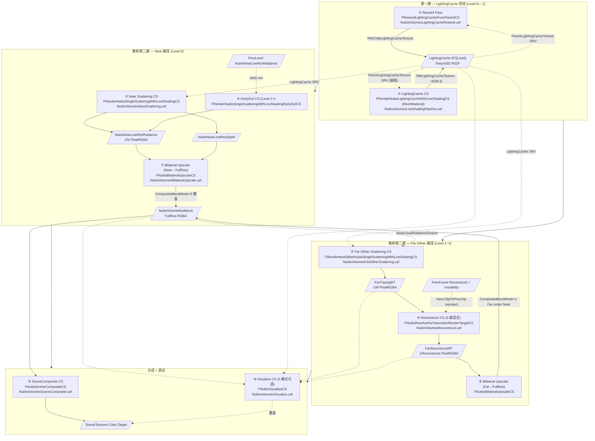
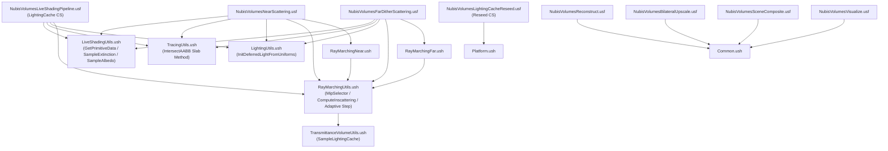

# RDG Pass 全图 — Live Shading 10 Pass DAG

NubisCloud 的渲染主体是 `NubisVolumesLiveShadingPipeline.cpp`(2727 行)。该文件以 `RenderNubisClipmapLevel` 为枢纽,在 `RenderNubisVolumes` 大循环内被反复调用,按 `Config.bUseDither / bUseOctahedral / bLightingCacheOnly` 三组开关分流出 **LightingCache 烘焙 / Near / Far Dither / (TODO Octahedral)** 四类子管线[^rdg]。本页把这条主线**展平为一个有向无环图**,逐 Pass 给出 RDG 调度名、Shader 入口、Permutation Domain、SRV/UAV、GroupCount、上下游;并把 `Reseed → LightingCache → Near/Far → Reconstruct → BilateralUpscale → SceneComposite → Visualize` 这 **10 个 Pass** 摆到一张表里——读完本页应当能在不打开 IDE 的前提下口述出"一帧 NubisCloud 在 RDG 里发生了哪 10 件事、每件事吃哪些纹理吐哪些 UAV"[^shader]。

> 本页是 wiki 中**密度最大**的一页。如果只看一处,直接跳 §2 的 10 Pass 大表;如果要做性能剖析,读完 §1 DAG + §2 大表;如果要改 shader,读 §3 PassParameters + §4 .ush 依赖图 + §5 关键代码摘录。Sparse Voxel(A5)、Hardware Ray Tracing(A7)、Reconstruct 5 路与 Bilateral 4 mode(A8)等专题各有独立子页,本页只**指路**。

---

## 0. 入口路由(对照前序页)

```
FDeferredShadingSceneRenderer::RenderNubisVolumes        // NubisVolumes.cpp:1049
  └── RDG_EVENT_SCOPE("NubisVolumes")  +  RDG_GPU_STAT_SCOPE(NubisVolumesStat)
       └── for each View → for each NubisVolume MeshBatch (depth-sorted)
            ├── 第一趟  Level=N..1  (远→近, bLightingCacheOnly=true)
            │     RDG_EVENT_SCOPE("LightingCache Pass Level [%d]")
            │     ├── AddReseedLightingCachePasses(Config, ParentConfig)
            │     └── RenderNubisClipmapLevel(..., bLightingCacheOnly=true)
            │
            └── 第二趟  Level=0..N  (近→远, by Config.bUseDither/Octahedral 分流)
                  RDG_EVENT_SCOPE("Scattering Pass Level [%d] (Near|FarDither|Octa)")
                  └── RenderNubisClipmapLevel(..., bLightingCacheOnly=false,
                                              PrevNearLowResRadiance, &CurNearLowResRadiance)
```

`RenderNubisClipmapLevel`(NubisVolumesLiveShadingPipeline.cpp:2556)按 `Config` 分流:

| 条件 | 分支 | 入口函数 |
|---|---|---|
| `bLightingCacheOnly=true && UseLightingCacheForTransmittance() && bApplyShadowTransmittance` | LightingCache 烘焙 | `RenderLightingCacheWithLiveShading` (cpp:1098) |
| `bUseOctahedral` | Phase 3 [TODO] | `// TODO: RenderOctahedralScattering` |
| `bUseDither` | Far Dither 路径 | `RenderTemporalSingleScatteringWithLiveShading` (cpp:2245) |
| 其它 (Near) | Near 路径 | `RenderNearCloudWithLiveShading` (cpp:2418) |

> 调度顺序 / Two-Pass 设计动机 / `LightingCacheDirtyRegions` 填充时机请参考 [第 4 页](4.%20Clipmap%206%20级调度%20—%20Mip%20Ring%20与%20Two-Pass.md);本页只关注**单 Level 内的 Pass 拓扑**,即"Level N 真正下了哪些 RDG_PASS"。

---

## 1. RDG Pass DAG(单 Volume / 6 个 Clipmap Level / Far+Near 混排)

下面 Mermaid 图展开**最复杂的一种情况**:`Level0 走 Near + Level1~4 部分走 Far Dither`,LightingCache 由前序帧链式 reseed→烘焙到位。Octahedral 暂未实装。



**读图三个要点**:

1. **LightingCache 烘焙是全 Level 共享**(最多前 5 级,Level 5 Octahedral 不烘),而 Near/Far/Octahedral 是**按 Level 分别选一个**分支;
2. **Reconstruct 与 Bilateral 是两个独立的 Compute Pass**——Reconstruct 在低分辨率(Reconstruct RT 尺寸)上做时序混合,Bilateral 才把低分辨率结果上采样到全分辨率,**两者不可合并**;
3. **Near 与 Far 的 Composite 共用同一张 `NubisVolumeRadiance` RT**——Near 先以 `CompositeBlendMode=0`(覆盖)写入,Far 以 `CompositeBlendMode=1`(`Result = Near + Far × (1-Near.a)`,即 Far under Near)叠加。Visualize 是条件路径,默认关闭。

---

## 2. 10 Pass 大表(本页核心)

以下 10 行**按调度顺序**列出。`#` 列为本 wiki 内部编号,与 Mermaid 图中圆圈编号对应。Pass 名取 `RDG_EVENT_NAME / RDG_EVENT_SCOPE` 实际字串,`%d / %s` 处保留占位符。

| # | Pass 名 (RDG_EVENT 实际字串) | Shader 文件 / 入口 | Shader 类 | Permutation | 主要 SRV 输入 | 主要 UAV 输出 | GroupCount | 备注 |
|---|---|---|---|---|---|---|---|---|
| ① | `NubisLightingCacheReseed Level=%d Parent=%d Region(...)` | `NubisVolumesLightingCacheReseed.usf` / `ReseedLightingCacheFromParentCS` | `FReseedLightingCacheFromParentCS` (NubisVolumes.cpp:901) | `FHasParent` (BOOL 0/1) | `ParentLightingCacheTexture` (Texture3D R32F) | `RWChildLightingCacheTexture` | `DivUp(Region.Extent, 4)`,4³ 线程组 | 仅 Sector 滚动产生 dirty region 时跑;CVar `r.Nubis.LightingCacheReseedFromParent` |
| ② | `RenderNubisLightingCacheWithLiveShadingCS [In-Scattering\|Transmittance] (Light=%s)` | `NubisVolumesLiveShadingPipeline.usf:349` / `RenderNubisLightingCacheWithLiveShadingCS` | `FRenderNubisLightingCacheWithLiveShadingCS` (cpp:189) **MeshMaterial CS** | `DIM_LIGHTING_CACHE_MODE 0/1` | `MipSelectorTexture`、`ParentLightingCacheTexture`、ShadowDepth/VSM、ModelingVolumeTexture (材质) | `RWLightingCacheTexture` | `DivUp(CacheRes / AmortizeDivisor, 4)`,4³ 线程组 | 实际只跑 1/N³ voxel 之后做 EMA 写入;级联读父级 LC |
| ③ | `RenderSingleScatteringWithLiveShadingCS` | `NubisVolumesNearScattering.usf:461` / `RenderSingleScatteringWithLiveShadingCS` | `FRenderNubisSingleScatteringWithLiveShadingCS` (cpp:337) | `FUseTransmittanceVolume / FUseInscatteringVolume / FUseLumenGI` (3 BOOL → 8 排列) | `LightingCacheTexture`、`MipSelectorTexture`、`SceneDepthCheckboardTexture`、`SceneDepthMinAndMaxTexture`、ShadowDepth/VSM、FogStruct、LumenGIVolume | `RWLightingTexture (RGBA)`、`RWSecondaryLightingTexture`、`RWCloudDepthTexture` | `DivUp(NearRes, 8)` 8×8 | Level 0 走此 Pass;`r.NubisVolumes.NearCloudDownsampleFactor=2/4` |
| ④ | `EarlyOut` | `NubisVolumesNearScattering.usf:635` / `RenderSingleScatteringWithLiveShadingEarlyOutCS` | `FRenderNubisSingleScatteringWithLiveShadingEarlyOutCS` (cpp:510) | 同 ③ (3 BOOL) | 同 ③ + `PreviousLevelsRadianceTexture` (前序 Level low-res 累积 alpha ≥0.99) | 同 ③ | 同 ③ | Level 1+ 用此 Pass,从前序 Level low-res 累积 alpha 早退,优化空气段 |
| ⑤ | `RenderNewFarDitherSingleScatteringWithLiveShading (Light=%s)` | `NubisVolumesFarDitherScattering.usf` / `RenderNewDitherSingleScatteringWithLiveShadingCS` | `FRenderNewDitherNubisSingleScatteringWithLiveShadingCS` (cpp:680-857) | 同 ③ (3 BOOL);强制 `CLOUD_MIN_AND_MAX_DEPTH=1` | `LightingCacheTexture`、`MipSelectorTexture`、`SceneDepthCheckboardTexture`、`SceneDepthMinAndMaxTexture`、**`NearCloudRadianceTexture`** (近景遮挡剔除)、ShadowDepth/VSM、FogStruct、LumenGIVolume | `RWLightingTexture`、`RWSecondaryLightingTexture`、`RWCloudDepthTexture` (写入 FarTracingRT) | `DivUp(FarTracingRes, 8)` 8×8 | Bayer pattern 子像素抖动;`DitherFrameIndex/Count`;`NubisFarVolumeDitherOffset` |
| ⑥ | `ResolveFarDitherSingleScatteringWithLiveShading` | `NubisVolumesReconstruct.usf:349` / `ResolveNubisVolumetricRenderTargetCS` | `FNubisResolveFarVolumetricRenderTargetCS` (cpp:860) | `PERMUTATION_HISTORY_AVAILABLE / SHADER_RECONSTRUCT_VOLUMETRICRT / CLOUD_MIN_AND_MAX_DEPTH` (cpp 强制全 1) | `TracingVolumetricTexture / ...Depth`、`PreviousFrameVolumetricTexture / ...Depth / ...Instability`、`HalfResDepthTexture`、`SceneDepthTexture` | `RWTracingVolumetricTexture (Reconstruct RT)`、`RWTracingVolumetricDepthTexture`、`RWInstabilityTexture (R16F)` | `DivUp(ReconstructRes, 8)` 8×8 | per-Level Dither 双缓冲;`DitherBlenderFactor` 控制历史混合;5 路 A/B/C1/C2/C3/D 见 [第 8 页](8.%20Reconstruct%20与%20Bilateral%20Upscale.md) |
| ⑦ | `NubisBilateralUpscale_NearLowResToFullRes (1/%d)` | `NubisVolumesBilateralUpscale.usf:786` / `NubisVolumesBilateralUpscaleCS` | `FNubisBilateralUpscaleCS` (cpp:957) | `FHistoryAvailable / FReprojectionBoxConstraint / FCloudMinAndMaxDepth` (恒 1);**`UPSCALE_MODE` 用 `#define` 切 4 mode** | `FarReconstructVolumetricTexture (NubisNearLowResRadiance)`、`FarReconstructCloudDepthTexture`、`SceneDepthTexture` | `RWCombinedVolumetricTexture` | `DivUp(FullRes, 8)` 8×8 | `CompositeBlendMode`:Level0=0(覆盖),Level1+=1(Far under Near);`NearDominanceEnabled/StartAlpha/EndAlpha` 已绑定但 shader 未消费(WIP) |
| ⑧ | `NubisBilateralUpscale_FarReconstructToFullRes` | 同 ⑦ | 同 ⑦ (Pass 类共享) | 同 ⑦ | `FarReconstructVolumetricTexture (Reconstruct RT)`、`FarReconstructCloudDepthTexture`、`SceneDepthTexture` | `RWCombinedVolumetricTexture` (`NubisVolumeTexture` Full-res) | `DivUp(FullRes, 8)` 8×8 | `CompositeBlendMode=1` Far under Near;一定在 Near Upscale 之后调度 |
| ⑨ | `NubisSceneComposite` | `NubisVolumesSceneComposite.usf` / `NubisVolumesSceneCompositeCS` | `FNubisSceneCompositeCS` (cpp:1369-1418, 全局 CS) | 无 | `VolumetricTexture (View.NubisVolumeRadiance)` | `RWColorTexture (SceneTextures.Color.Target)` | `DivUp(View.ViewRect, 8)` 8×8 | 在 Translucent 之后调度(`CompositeNubisVolumes`,cpp:1421) |
| ⑩ | `NubisVisualize Mode=%d` | `NubisVolumesVisualize.usf` / `NubisVisualizeCS` | `FNubisVisualizeCS` (cpp:1594-1637, 全局 CS) | 无(运行时 `VisualizationMode`) | `RadianceTexture / DepthTexture / LightingCacheTexture(3D) / FarTracingTexture / ReconstructTexture` | `RWOutputTexture (覆盖 SceneColor)` | `DivUp(View.ViewRect, 8)` 8×8 | 仅 `ShouldVisualizeNubis(View)=true` 时;5 模式见 [第 8 页](8.%20Reconstruct%20与%20Bilateral%20Upscale.md) §E |

> **三条阅读须知**:
> 1. **Pass ② 是 MeshMaterial Shader**(不是 GlobalShader),所以 `GraphBuilder.AddPass` 由 `AddComputePass<bWithLumen>` 模板包装,内部调用 `UE::MeshPassUtils::Dispatch(...)`(LiveShadingPipeline.cpp:1048-1093)。这意味着 LightingCache 烘焙阶段会受材质图(Modeling 体积纹理 σt / albedo 节点)影响,而 Reseed/Reconstruct/Bilateral 等纯 GlobalShader Pass 不会。
> 2. **所有 Light pass 都过滤 `LightType == LightType_Directional`**(cpp:2623)——当前只支持太阳光。点光 / 聚光不参与 NubisCloud 散射。
> 3. **ClearUAVPass 仅在 Near 路径里显式调用**(cpp:2468 / 2475);Far 路径 ClearTracing/ReconstructRT 是 per-level DitherState 内部生命周期管理,不在 RDG 里显式 Clear。

---

## 3. PassParameters Shader 结构体(关键 4 个 Pass)

### 3.1 `FRenderNubisLightingCacheWithLiveShadingCS::FParameters`(LiveShadingPipeline.cpp:196-269)

| 字段(分组) | 类型 | 含义 |
|---|---|---|
| `View / SceneTextures / Scene` | UB | View Uniform / SceneTextures / FSceneUniformParameters |
| `bApplyEmissionAndTransmittance / bApplyDirectLighting / bApplyShadowTransmittance` | int | Light branch 三态 |
| `LightType / DeferredLight / VolumetricScatteringIntensity` | UB / scalar | Sun light 数据(LightType_Directional 常量) |
| `ForwardLightData / VolumeShadowingShaderParameters / VirtualShadowMapSamplingParameters / VirtualShadowMapId` | UB | CSM/VSM 联合 |
| `LocalToWorld / WorldToLocal / LocalBoundsOrigin / LocalBoundsExtent / RayTraceBoundsExtent` | matrix/vec | 当前 Level 包围盒(Local 含 Scale + Offset) |
| `PrimitiveId / CurrentMipLevel` | int | 当前 Level Mip 编号 (0~5) |
| `ClipmapScrollUVOffset` | float3 | 本级环形缓冲偏移 |
| `LocalToWorldArray[6] / WorldToLocalArray[6] / ClipmapScrollUVOffsetArray[6]` | matrix×6 / vec×6 | 6 套 per-mip 数据(材质图按 EffectiveMip 切坐标系) |
| `MipSelectorTexture (Texture3D<uint>) / NubisSectorSize / NubisSectorWidth / NubisBaseVoxelSizeCm / NubisMipCount / NubisClipmapOriginSectorIdxArray[6] / NubisScrollOffsetSectorsArray[6]` | tex/uniform | per-sector 最细可用 mip 查询表 + 物理坐标换算 |
| `MaxShadowTraceDistance / MaxStepCount / bJitter` | scalar | Ray data |
| `AmortizedIndex / AmortizeDivisor / EmaHistory` | int/float | 时序分摊 + EMA β |
| `VoxelResolution / LightingCache (FNubisLightingCacheParameters)` | inc | 本级 transmittance/lighting cache 参数 |
| `bHasParentLightingCache / ParentLocalToWorld / ParentClipmapScrollUVOffset / ParentLightingCacheTexture / ParentLightingCacheTextureSampler` | flag/matrix/tex | **级联**:Level N 采父级 Level N+1 LC |
| `RWLightingCacheTexture (RWTexture3D<float>)` | UAV | 输出(EMA 写回点) |

### 3.2 `FNubisLightingCacheParameters`(NubisVolumes.h:107-112)

```cpp
BEGIN_SHADER_PARAMETER_STRUCT(FNubisLightingCacheParameters, )
    SHADER_PARAMETER(FIntVector, LightingCacheResolution)        // 本级 LC 3D 纹理分辨率
    SHADER_PARAMETER(float,      LightingCacheVoxelBias)         // CalcShadowBias 用
    SHADER_PARAMETER(FVector3f,  LightingCacheScrollUVOffset)    // 环形缓冲偏移
    SHADER_PARAMETER_RDG_TEXTURE(Texture3D, LightingCacheTexture)
END_SHADER_PARAMETER_STRUCT()
```

USF 端读取入口在 `NubisVolumesTransmittanceVolumeUtils.ush:36-93`。**写入 / 读取 / Reseed 三端镜像**的物理↔逻辑 UV 换算公式详见 [第 7 页 · LightingCache](7.%20LightingCache%20与%20Transmittance%20Volume.md)。

### 3.3 `FNubisBilateralUpscaleCS::FParameters`(LiveShadingPipeline.cpp:968-986)

| 字段 | 含义 |
|---|---|
| `FarReconstructVolumetricTextureSizeAndInvSize / FarReconstructToVolumetricBufferResolutionScale` | 上采样比例 (1/N, N) |
| `FarReconstructVolumetricTexture / FarReconstructCloudDepthTexture / SceneDepthTexture` | 输入(上一 Pass 的低分辨率 RT + 全分辨率深度) |
| `CompositeBlendMode` | 0=覆盖,1=Far under Near |
| `NearDominanceEnabled / NearDominanceStartAlpha / NearDominanceEndAlpha` | Soft Near Dominance Blend(C++ 已绑定,**shader 端 0 引用**——WIP) |
| `RWCombinedVolumetricTexture` | 全分辨率输出 |

### 3.4 `FNubisResolveFarVolumetricRenderTargetCS::FParameters`(LiveShadingPipeline.cpp:869-896)

含 `TracingVolumetric / SecondaryTracingVolumetric / TracingVolumetricDepth`、`PreviousFrame*` 三件套(Tex + Depth + Instability)、`HalfResDepthTexture / SceneDepthTexture`、`DitherBlenderFactor`、`CurrentTracingPixelOffset`、`NubisFarTracingRTDownsampleFactor / VolumetricReconstructRTDownsampleFactor`、`DebugResolveMode`,输出 `RWTracingVolumetricTexture / RWTracingVolumetricDepthTexture / RWInstabilityTexture`[^temporal]。

---

## 4. .usf / .ush 工具库依赖图(从 `#include` 实证)



**几条不可错认的依赖事实**:

- 主路径 `LSP / NS / FDS` 三入口共用 `LSU + TU + LU + RMU` **4 件套**
- `RMU`(RayMarchingUtils.ush)是中枢——下挂 `TVU`(光照缓存采样)+ Lumen GI + DeferredLighting + SHCommon + ForwardShadowingCommon
- `RMN` 与 `RMF` **互斥**:Near 链只 include RMN,Far 链只 include RMF——注释明确"两个文件可独立调整参数互不影响"
- `LightingCacheReseed.usf` 是**孤立模块**,只 include `Platform.ush`(没有 RayMarching,只是 frac 三段链)
- `Reconstruct / BilateralUpscale / SceneComposite / Visualize` 都是后处理,只依赖 `Common.ush`——**这意味着这 4 个 Pass 完全不读 SVT、不读 LightingCache 主体**,仅吃前序 Pass 的 RT(Reconstruct 例外:它额外吃 `View.PrevClipToClip` 等 ViewState 历史)

> 工具库内的关键函数(`QueryMipSelectorEntry / RayMarchSunLightTransmittance / ComputeSunLightTransmittance / CalcStepSize / MultiScatteringApproximate`)清单见 raw#2 表 3,本页不再展开。

---

## 5. 关键代码摘录(3 段 + 1 段 Pass DAG 注解)

### 5.1 摘录 A — LightingCache EMA 主循环(NubisVolumesLiveShadingPipeline.usf:348-486)

```hlsl
[numthreads(THREADGROUP_SIZE_3D, THREADGROUP_SIZE_3D, THREADGROUP_SIZE_3D)]
void RenderNubisLightingCacheWithLiveShadingCS(uint3 DispatchThreadId : SV_DispatchThreadID)
{
    if (any(DispatchThreadId >= uint3(LightingCacheResolution) / uint(AmortizeDivisor))) return;

    // 时序分摊:N×N×N 中选 1 个偏移 (AmortizeDivisor=2 → 8 帧轮转)
    int AmortizeTotal  = AmortizeDivisor * AmortizeDivisor * AmortizeDivisor;
    int TemporalIndex  = AmortizedIndex % AmortizeTotal;
    int3 TemporalOffset = int3(
        TemporalIndex % AmortizeDivisor,
        (TemporalIndex / AmortizeDivisor) % AmortizeDivisor,
        (TemporalIndex / (AmortizeDivisor * AmortizeDivisor)) % AmortizeDivisor);
    float3 LogicVoxelIndex = float3(DispatchThreadId * AmortizeDivisor + TemporalOffset);

    // logic→physical 换算 (sector 滚动后 EMA 历史不会错位)
    float3 LogicUVW    = (LogicVoxelIndex + VoxelJitter) / float3(GetLightingCacheResolution());
    float3 PhysicalUVW = frac(LogicUVW + ClipmapScrollUVOffset + 1.0);
    uint3  PhysicalVoxelIndex = uint3(floor(PhysicalUVW * float3(GetLightingCacheResolution())));

    // MipSelector 决定实际可采的 mip (空洞兜底)
    float MipLevel    = (float)CurrentMipLevel;
    uint  MinMip      = QueryMinSectorMipAtWorldPos(WorldRayOrigin, (int)MipLevel);
    float EffectiveMip = (float)max((int)MipLevel, (int)MinMip);
    float3 Extinction = SampleExtinction(CreateVolumeSampleContext(..., EffectiveMip));
    if (all(Extinction < 1e-7)) { RWLightingCacheTexture[PhysicalVoxelIndex] = 0.0f; return; }

    // 沿光照方向 raymarch 出 OpticalDepthToLight
    ComputeSunLightTransmittance(WorldRayOrigin, ToLight, MipLevel,
        TransmittanceToLight, OpticalDepthToLight);

    // 级联:终点落在父级 AABB 内时,把父级 OD 直接累加(避免本级跑全程)
    if (bHasParentLightingCache && bEndInParent) {
        float3 ParentUVW = frac((ParentLocalPos - ParentBoundsMin) / (ParentBoundsMax - ParentBoundsMin)
                              + ParentClipmapScrollUVOffset);
        OpticalDepthToLight += ParentLightingCacheTexture.SampleLevel(
            ParentLightingCacheTextureSampler, ParentUVW, 0).r;
    }

    // EMA: New = lerp(NewSample, OldHistory, β),β = EmaHistory(per-Level,近景 0.9,远景 0.97)
    float OriOpticalDepthToLight = RWLightingCacheTexture[PhysicalVoxelIndex];
    RWLightingCacheTexture[PhysicalVoxelIndex] = lerp(OpticalDepthToLight, OriOpticalDepthToLight, EmaHistory);
}
```

> EMA 公式核心:`LC_new = lerp(NewOpticalDepth, LC_old, β)` ⇒ 等价 `α = 1−β`(新值权重)。Per-Level β 由 `Config.LightingCacheEmaHistory` 注入(LiveShadingPipeline.cpp:1227);近景 0.9 / 远景更大可减少时序闪烁[^arch]。

### 5.2 摘录 B — Near 主循环 + MipSelector 跨 sector 跳过(NubisVolumesRayMarchingNear.ush:114-160)

```hlsl
void RayMarchSingleScattering(FRayMarchingContext RayMarchingContext, ...) {
    int3 PrevSectorIdx     = int3(-INT_MAX, -INT_MAX, -INT_MAX);
    uint CurSectorMinMip   = NUBIS_MIPSELECTOR_EMPTY_MIP;  // 7 = 空 sector 哨兵
    bool bCurSectorHasCloud= false;

    while (any(Transmittance > Epsilon) &&
           LocalViewTracedDistance < LocaViewMaxTraceDistance &&
           StepCount < MaxSteps)
    {
        ++StepCount;
        float3 LocalPosition = ...;  float3 WorldPosition = ...;

        // ---- MipSelector:跨 sector 边界才重新 Load Texture3D<uint> ----
        int3 CurSectorIdx = WorldPosToSectorIndex(WorldPosition, RayMarchingContext.MipLevel);
        if (any(CurSectorIdx != PrevSectorIdx)) {
            uint Packed = QueryMipSelectorEntry(CurSectorIdx, RayMarchingContext.MipLevel);
            bCurSectorHasCloud = MipSelectorHasCloud(Packed);
            CurSectorMinMip    = bCurSectorHasCloud ? MipSelectorMinMip(Packed) : NUBIS_MIPSELECTOR_EMPTY_MIP;
            PrevSectorIdx      = CurSectorIdx;
        }
        // 空 sector 或 "本 sector 最细 mip 比本 Level 更细" → slab test 跳到 sector 出口
        bool bSkipByFinerMip = ((int)CurSectorMinMip < RayMarchingContext.MipLevel)
                            && (MipRingEarlyExitEnabled == 0u);
        if (!bCurSectorHasCloud || bSkipByFinerMip) {
            // ...slab test 算 tExit,整段跳过...
            LocalViewTracedDistance += max(ExitLocal, 1.0f);
            continue;
        }
        // 自适应步长:max(MinStepM, sqrt(distM)*StepCoeff*StepFactor) × StepGlobalGain × m→cm
        float AdaptiveStepSize = ...;
        // 采 LC + 采 Material + ComputeInscattering + 累加 Transmittance×Inscatter ...
    }
}
```

> MipSelector Atlas 是 `Texture3D<uint>` 的 PF_R8_UINT,每 sector 一个 byte:bit0 = `HasCloud`,bit1-3 = `MinMip ∈ [0,7]`,7 是空 sector 哨兵。物理坐标换算 `(Global − Origin + Scroll) mod Width`(NubisVolumesRayMarchingUtils.ush:131-148)。**这是 HiGame 替代 Sparse Voxel 两级网格的"等价方案"**——见 §6 与 [第 6 页](6.%20MipSelector%20与%20Sector%20Slab-Skip%20等价方案.md)。

### 5.3 摘录 C — Far under Near 物理混合公式(NubisVolumesBilateralUpscale.usf:840-851)

```hlsl
// 合并模式:Far under Near(远景插入已有近景后面)
// 近景先执行,buffer 中已有近景结果;远景后执行,需要被近景透射率衰减后叠加在后面
// ExistingNear.a = 近景不透明度,NearTransmittance = 1 − ExistingNear.a
// 物理正确公式:Result = ExistingNear + Far × NearTransmittance
if (CompositeBlendMode > 0u)
{
    float4 ExistingNear = RWCombinedVolumetricTexture[PixelCoord];
    float ExistingNearTransmittance = saturate(1.0 - ExistingNear.a);
    float4 BlendedResult;
    BlendedResult.rgb = ExistingNear.rgb + FarReconstructColor.rgb * ExistingNearTransmittance;
    BlendedResult.a   = ExistingNear.a   + FarReconstructColor.a   * ExistingNearTransmittance;
    RWCombinedVolumetricTexture[PixelCoord] = BlendedResult;
}
```

> ⚠️ **WIP 警告**:`NearDominanceEnabled / StartAlpha / EndAlpha` 三个 cbuffer 字段已在 C++ 端两处 Pass 都 `SetParameter`(LiveShadingPipeline.cpp:2161-2163, 2376-2378),CVar 注释也描述了"Near.a ≥ EndAlpha 时进一步 smoothstep 压制 Far"的语义,但 `BilateralUpscale.usf` 内**0 引用**这三个变量。这套 Soft Near Dominance Blend 是**未接通的功能开关**,详见 [第 8 页](8.%20Reconstruct%20与%20Bilateral%20Upscale.md) §C.4 与 [第 12 页](12.%20调试%20性能%20平台%20陷阱.md)[^temporal]。

### 5.4 摘录 D — LightingCacheReseed 物理↔逻辑↔父级 三段 frac 链(全文,75 行)

```hlsl
[numthreads(THREADGROUP_SIZE_3D, THREADGROUP_SIZE_3D, THREADGROUP_SIZE_3D)]
void ReseedLightingCacheFromParentCS(uint3 DispatchThreadId : SV_DispatchThreadID)
{
    int3 ChildVoxel = DirtyRegionMin + int3(DispatchThreadId);
    if (any(ChildVoxel >= DirtyRegionMax)) return;

#if DIM_HAS_PARENT
    // 1) 物理 voxel → 本级逻辑 UV
    float3 ChildPhysUV    = ((float3)ChildVoxel + 0.5f) / (float3)ChildResolution;
    float3 ChildLogicalUV = frac(ChildPhysUV - ChildClipmapScrollUVOffset + 1.0f);
    // 2) 本级逻辑 UV → 父级逻辑 UV  (ParentScale = 2 × ChildScale ⇒ Scale=0.5)
    float3 ParentLogicalUV = ChildLogicalUV * ChildToParentUVScale + ChildToParentUVBias;
    // 3) 父级逻辑 UV → 父级物理 UV (frac 包卷)
    float3 ParentPhysUV = frac(ParentLogicalUV + ParentClipmapScrollUVOffset + 1.0f);
    // 4) 三线性采样父级 LC
    RWChildLightingCacheTexture[ChildVoxel] =
        ParentLightingCacheTexture.SampleLevel(ParentLightingCacheTextureSampler, ParentPhysUV, 0).r;
#else
    RWChildLightingCacheTexture[ChildVoxel] = 0.0f;  // 最高 Level 无父级 → 写 0 保守起点
#endif
}
```

> 这段代码**短而关键**:它是 sector 滚动时 LightingCache 的"无缝接续"机制。物理 voxel 编号是**滚动后的内存位置**,逻辑 UV 是**世界含义稳定的坐标**——`ChildPhysUV − ChildScroll → ChildLogicalUV`,再线性映射到 `ParentLogicalUV`,再 `+ ParentScroll → ParentPhysUV` 找到父级 LC 的对应位置。三段 frac 链确保父子两级各自独立的 scroll 行为不会破坏数据连续性。详细推导见 [第 7 页](7.%20LightingCache%20与%20Transmittance%20Volume.md) §B[^arch]。

---

## 6. A5 Sparse Voxel 不在这里(重要 → 第 6 页)

⚠️ **HiGame 当前分支并未真正启用上游 Nubis 的 Sparse Voxel 两级网格(`BottomLevelGrid + IndirectionGrid`)**。证据链:

- `r.NubisVolumes.SparseVoxel`(`CVarNubisVolumesSparseVoxel`)默认 0(NubisVolumes.cpp:202-207)
- `NubisVolumes::GetBottomLevelGridResolution() / GetIndirectionGridResolution() / EnableIndirectionGrid() / EnableLinearInterpolation()` 在 `NubisVolumes.h:76-89` 仅做了**前向声明**,cpp 中**没有定义**
- 唯一活的 Sparse Voxel CVar:`r.NubisVolumes.SparseVoxel.GenerationMipBias=3 / PerTileCulling=1 / Refinement=1`,这些值只通过 `GetSparseVoxelMipBias / UseSparseVoxelPipeline / UseSparseVoxelPerTileCulling / ShouldRefineSparseVoxels` 暴露,**但没有任何调用方**(grep 这些函数仅在 .h 声明 + .cpp 定义,无消费点)
- `Engine/Source/Runtime/Renderer/Private/NubisVolumes/` 与 `Engine/Shaders/Private/NubisVolumes/` 整目录 grep `BottomLevelGrid / IndirectionGrid / PerTileCulling / RayTracingScene` 找不到真正实现入口

**HiGame 实际用来"加速空气段"的等价方案是 MipSelector Atlas + Sector 跳跃**(见 §5.2):

| 上游 Nubis 概念 | HiGame 等价物 | 数据结构 | 作用 |
|---|---|---|---|
| **Indirection Grid**(粗粒度,决定 tile 要不要进、采哪一档) | **MipSelector Atlas** | `Texture3D<uint>` PF_R8_UINT,每 sector 1 byte | 跨 sector 边界才查表,空 sector slab-test 一次跳一整 sector |
| **Bottom Level Grid**(细粒度,该 tile 内采哪个 mip) | **6 档 SVT mip 体积纹理**(`ModelingVolumeTexture_MipN`) | 6 档 3D 纹理 + `EffectiveMip = max(PassMip, MinMip)` | 选档,确保该位置有数据才采 |

> 完整论证、cvar 空壳清单、烘焙期 `MergeMipLevel >= SectorMipLevel` 判定与 `SparseVoxelMipBias=3` 的实际语义,见 [第 6 页 · Sparse Voxel 与 Sector](6.%20MipSelector%20与%20Sector%20Slab-Skip%20等价方案.md)[^rdg]。

---

## 7. A7 Hardware Ray Tracing 未接通(→ 第 12 页陷阱清单)

**HiGame 当前分支没有把 HW RT 接到 NubisCloud 的任何 Pass 上**。证据链:

- `r.NubisVolumes.HardwareRayTracing` 默认 0(NubisVolumes.cpp:34-39)
- `NubisVolumes::UseHardwareRayTracing()` 实现存在(cpp:512-516),但**没有任何调用方**(grep 整个 NubisVolumes 目录 0 hit)
- `class FRayTracingScene;` 在 `NubisVolumes.h:15` 是 forward declare,但 .cpp 没 `#include "RayTracing/RayTracingScene.h"`,也没用过 `FRayTracingScene` 类型
- 所有 NubisCloud Compute Pass 都走 SF_Compute(不是 SF_RayGen / SF_RayHit),没有 RayGen 着色器
- `Engine/Shaders/Private/NubisVolumes/` 全目录 grep `RAY_TRACING / TraceRay / RAYTRACING / ConeTrace / TraceRayInline` → **0 命中**(双端验证)
- 代码注释 `[CL611225 调试 RT]` 暗示曾经接通过,后被回滚

**实操影响**:PS5 与 Win64 在这个问题上行为一致——都不走 HW RT 路径;fallback 即"主路径"——MipSelector Atlas + Sector 跳跃 + Per-Level LightingCache + 体积阴影(CSM/VSM)。

> [推测] 上游 Nubis 论文 / NvCloud 5.7 用 HW RT 做 BLAS 包住 Sparse Voxel 集合,每根视线一次 RT instance hit 列表 + sector 线性 march。HiGame 跳过这一层,可能因 PS5/Win64 共用代码路径 + DDS 服务器无 RT,且 MipSelector + 多档 SVT 已经把空气段加速到一个数量级,HW RT 边际收益不显著。详细 CL611225 回滚分析与陷阱清单见 [第 12 页](12.%20调试%20性能%20平台%20陷阱.md)。

---

## 8. 18 条已知事实(本页相关索引)

| # | 事实 | 本页 §? |
|---|---|---|
| 1 | `HIGAME_ENABLE_NUBIS` 在 `Build.h:1152` 硬编码=1 | §0(由 [第 2 页](2.%20引擎端架构%20—%20HIGAME_ENABLE_NUBIS%20与%20INubisVolumeInterface.md) 详述) |
| 2 | **Shader 共 15 个文件**(8 .usf + 7 .ush) | ★ §4 依赖图 |
| 3 | **Sparse Voxel cvar 全是空壳** | ★ §6 |
| 4 | **HardwareRayTracing 未接通** | ★ §7 |
| 5 | Visualize 模式 5 个 | §2 Pass⑩ + [第 8 页](8.%20Reconstruct%20与%20Bilateral%20Upscale.md) §E |
| 6 | Two-Pass:LCache 4→0,Scattering 0→5 | §0 |
| 7 | MipRingCrossoverCm 500cm | [第 4 页](4.%20Clipmap%206%20级调度%20—%20Mip%20Ring%20与%20Two-Pass.md) |
| 8 | **LightingCache EMA β=0.97**(近景 0.9,远景 0.97) | §5.1 摘录 A |
| 9 | **Bilateral 4 mode + Far under Near** | ★ §2 Pass⑦⑧ + §5.3 摘录 C |
| 10 | NubisCustom2 是唯一生产路径 | [第 9 页](9.%20NubisCustom%20插件%20—%20新路径唯一;%20老路径是蓝图遗骸.md) |
| 11 | 4 模块全 Linux deny | [第 6 页](6.%20MipSelector%20与%20Sector%20Slab-Skip%20等价方案.md) |
| 12 | NubisVDBDataAsset 运行时零消费 | [第 10 页](10.%20烘焙流水线%20—%20Houdini%20→%20VDB%20→%20BC1%20→%20Sector%20→%20Cook.md) |
| 13 | Plugin 直接 `ENQUEUE_RENDER_COMMAND` | [第 3 页](3.%20GT%20↔%20RT%20时序%20—%20Plugin%20自管%20GPU%20资源.md) |
| 14 | 多 Zone 不合并 Atlas | [第 4 页](4.%20Clipmap%206%20级调度%20—%20Mip%20Ring%20与%20Two-Pass.md) |
| 15 | Sector 按需流式 | [第 6 页](6.%20MipSelector%20与%20Sector%20Slab-Skip%20等价方案.md) |
| 16 | 渲染顺序 VolumetricFog → NubisVolumes → VolumetricCloud | [第 2 页](2.%20引擎端架构%20—%20HIGAME_ENABLE_NUBIS%20与%20INubisVolumeInterface.md) §5 |
| 17 | SM5+Deferred only | [第 2 页](2.%20引擎端架构%20—%20HIGAME_ENABLE_NUBIS%20与%20INubisVolumeInterface.md) §6 |
| 18 | NubisDefaults:MipCount=6, SectorWidth=2×2×2 (= 8 个 Sector / Mip), MipRingCrossoverCm=500cm | [第 2 页](2.%20引擎端架构%20—%20HIGAME_ENABLE_NUBIS%20与%20INubisVolumeInterface.md) §4.2 |

---

## 9. 开放问题 / [推测]

1. **Octahedral 路径(Phase 3)** — LiveShadingPipeline.cpp:2649-2653 `if (Config.bUseOctahedral)` 分支只有 `// TODO: RenderOctahedralScattering(...)`,没有任何实现。Mip 5 的"远场云壳"目前怎么补?**[推测]** 走 Far Dither + 一个特殊 Material。
2. **`bWithLumen` AddComputePass 模板分支** — LiveShadingPipeline.cpp:1048-1093 `template<bool bWithLumen, ...>` 在 LightingCache 时传 false,散射时传 true,但 false 分支也走同一个 lambda,唯一区别在 Lumen UB 是否 `SetParameter`(cpp:1085-1087)。是否意味着 **LightingCache 不支持 Lumen GI**?逻辑上 LC 是阴影透射率不是辐射,确实不需要——但需材质验证。
3. **`LightingCacheDirtyRegions` 的填充时机** — cpp:1004 遍历但 grep 整个仓库要确认 `FNubisClipmapLevelRenderConfig::FDirtyRegion` 是从 `NubisClipmapManager::Update` 时填的还是 Render Tick 内构造(影响多 View 时是否会漏 reseed)。
4. **`MaxLightingCacheLevels=5`** — cpp:1208 hard-code,与 `NubisDefaults::MipCount=6` 的关系是?Mip 5 跳过 LC 是否就是 Octahedral 不需要的设定?
5. **EarlyOut Near 的 `PreviousLevelsRadianceTexture` 尺寸约束** — cpp:2449 注释强调"必须与当前 Level 低分辨率 RT 尺寸一致",但 Level0 vs Level1 的 NearDownsampleFactor 都来自同一个全局 CVar(cpp:2457),所以始终一致;如果未来要做 per-Level Near 分辨率,这里会断。
6. **`FNubisBilateralUpscaleCS` 的 Permutation 实际无效** — cpp:961-966 三个 Permutation Bool 都没在 cpp 端被 set(PermutationVector 直接默认构造 → 全 false),且 cpp:1032-1034 在 ModifyCompilationEnvironment 又把 `SHADER_RECONSTRUCT_VOLUMETRICRT / PERMUTATION_HISTORY_AVAILABLE` 全 hard-set=1。Permutation 系统在这里是**死代码**,等同 0 个 permutation 编译。是否值得清理?
7. **`LightingCacheScrollUVOffset` vs `ClipmapScrollUVOffset` 在 PassParameters 中同时存在**(cpp:1194 / 1221) — 是同一个 `FVector3f`,只是分别填到 outer scope 和 LC inclusion,shader 端通过两个不同 uniform 名访问。如果 Per-Level LC 与 Per-Level Clipmap 滚动彻底解耦(例如 LC 不滚但 Sample 滚),这里需要重新审视。当前实现两者绑同一个值。
8. **Soft Near Dominance Blend 何时接通?** — 见 §5.3 警告。`NubisVolumes.cpp:177-200` 三 CVar 已落地,公式注释完整,但 `BilateralUpscale.usf` 主 kernel 没消费——是 [推测] WIP 还是回滚遗留?需查历史 CL。

---

## 10. 交叉引用

- 调度顺序与 Two-Pass 设计动机 → [第 4 页 · Clipmap 调度](4.%20Clipmap%206%20级调度%20—%20Mip%20Ring%20与%20Two-Pass.md)
- MipSelector + Slab-Skip 等价方案、Sparse Voxel 空壳论证 → [第 6 页 · Sparse Voxel 与 Sector](6.%20MipSelector%20与%20Sector%20Slab-Skip%20等价方案.md)
- LightingCache EMA + ScrollUV 三端镜像、级联回填推导 → [第 7 页 · LightingCache](7.%20LightingCache%20与%20Transmittance%20Volume.md)
- Reconstruct 5 路 + Bilateral 4 mode + Visualize 5 模式 → [第 8 页 · Reconstruct 与 Bilateral](8.%20Reconstruct%20与%20Bilateral%20Upscale.md)
- CL611225 调试 RT 回滚 + Soft Near Dominance Blend WIP + HardwareRayTracing 未接通 → [第 12 页 · 已知问题](12.%20调试%20性能%20平台%20陷阱.md)
- 引擎魔改入口 / Component / SceneProxy → [第 2 页](2.%20引擎端架构%20—%20HIGAME_ENABLE_NUBIS%20与%20INubisVolumeInterface.md) + [第 3 页](3.%20GT%20↔%20RT%20时序%20—%20Plugin%20自管%20GPU%20资源.md)
- 烘焙产物如何喂进 RT 第一帧 → [第 10 页 · 烘焙流水线](10.%20烘焙流水线%20—%20Houdini%20→%20VDB%20→%20BC1%20→%20Sector%20→%20Cook.md)

---

## 11. 一句话总结

> **NubisCloud 一帧的 RDG 是一个 10 Pass 有向无环图:Reseed → LightingCache CS → (Near / Far Dither) → Reconstruct(仅 Far) → Bilateral Upscale × 2(Near 在前,Far 在后) → SceneComposite → Visualize(条件)。其中 Pass ② 是 MeshMaterial CS,其余皆 GlobalShader CS;LightingCache 用 EMA + 三段 frac 链做 sector 滚动无缝接续;Far under Near 用 `Result = Near + Far × (1-Near.a)` 做物理正确混合;Sparse Voxel 与 HardwareRayTracing 都是空壳——加速空气段全靠 MipSelector Atlas + 6 档 SVT mip。**

---

[^rdg]: [[higame-nubis-rdg-passes|NubisCloud RDG Pass 全图 — Live Shading Pipeline]] · 本地代码考古 · 2026-05-11
[^shader]: [[higame-nubis-shader-permutations|NubisCloud Shader 入口 / Permutation / 依赖图]] · 本地代码考古 · 2026-05-11
[^temporal]: [[higame-nubis-temporal-and-upscale|NubisCloud Temporal + Bilateral Upscale + Visualize]] · 本地代码考古 · 2026-05-11
[^arch]: [[higame-nubis-engine-arch|NubisCloud 引擎魔改入口 + 跨模块 API + GT↔RT 边界]] · 本地代码考古 · 2026-05-11
