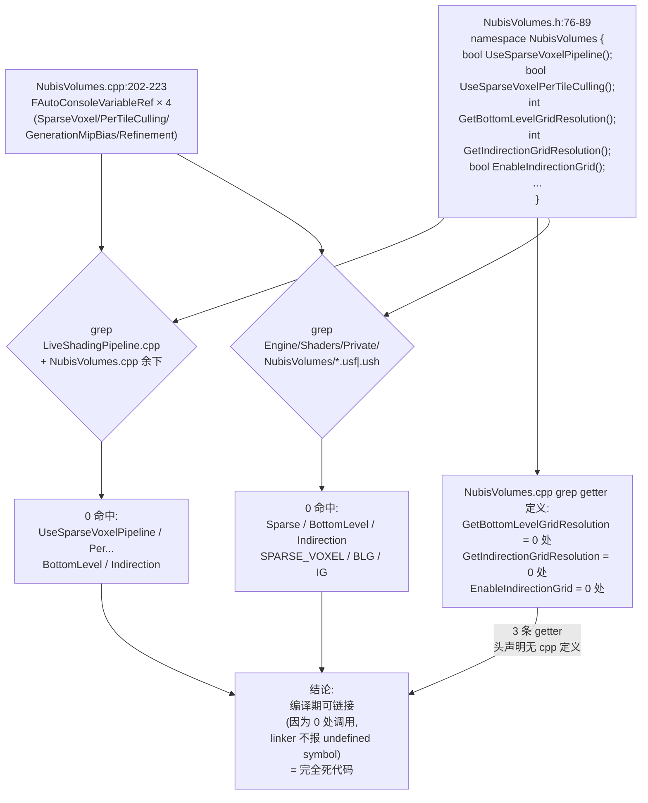
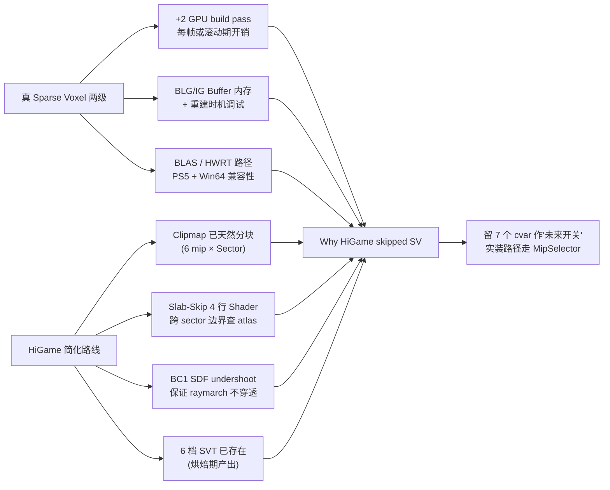
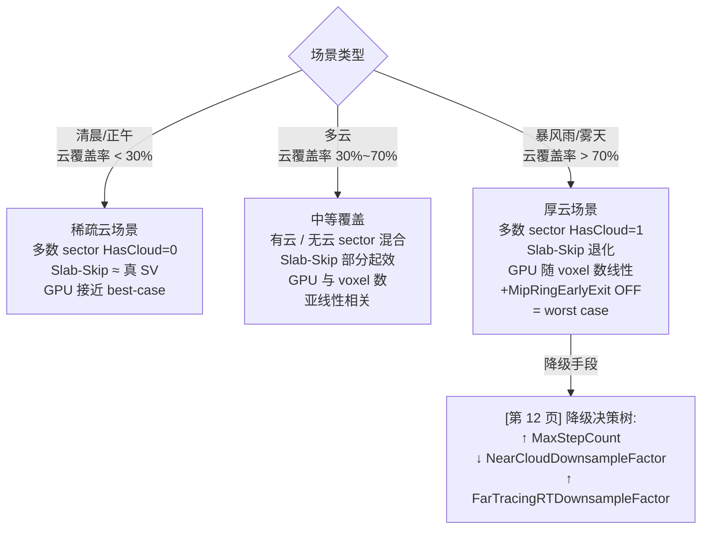

# MipSelector + Sector Slab-Skip 等价方案 (Sparse Voxel cvar 是空壳)

NubisCloud 的文档与 7 个 `r.Nubis*Sparse*` / `BottomLevel*` / `Indirection*` 命名暗示存在一条 Sparse Voxel 两级网格管线 (Bottom Level Grid + Indirection Grid),Phase 0 调研笔记也据此规划了"第 6 页 = Sparse Voxel"。**Phase 1 代码考古颠覆了这一假设**:这 7 个 cvar **全部是空壳** — `LiveShadingPipeline.cpp` 与 `Engine/Shaders/Private/NubisVolumes/*.usf|.ush` 双端各 0 处引用,`NubisVolumes.h` 的几个 getter 甚至连 cpp 端定义都没有[^rdg][^shader]。HiGame 实际上 **完全跳过了 Sparse Voxel 两级结构**,改用 **6 档 SVT (Sparse Volume Texture / per-Mip 体积纹理) + MipSelector Atlas (PF_R8_UINT 单字节元数据 / sector) + Sector Slab-Skip (Shader 内 slab test 跨 sector 跳过)** 的等价方案,达到了"空气段一段一跳、有云段才采样"的稀疏加速效果,本页给出空壳 cvar 清单 + 实际方案 + 为什么这种等价方案够用 + 跟原 Sparse Voxel 路线的 trade-off。

> **本页是 [第 5 页 RDG Pass 全图](5.%20RDG%20Pass%20全图%20—%20Live%20Shading%2010%20Pass%20DAG.md) 的补丁页**:第 5 页关注"完整 RDG DAG 是什么",本页解释"为什么 DAG 里没有 Sparse Voxel build pass、空气段加速实际怎么做"。两页配合阅读。

---

## 1. ⚠️ 7 个 Sparse Voxel cvar 全是空壳

### 1.1 表 1: 空壳 cvar 清单 + 文档暗示 vs 实际状态

下面 7 条 cvar 均在 `Engine/Source/Runtime/Renderer/Private/NubisVolumes/NubisVolumes.cpp` 注册,默认值与定义点也都对得上 [debug raw 中的 cvar 全表][^debug];但**它们的 getter 在 `LiveShadingPipeline.cpp` 与 Shader 两端均 0 处消费**[^rdg][^shader]。

| # | cvar 名 | 默认值 | 类型 | 注册位置 | 文档暗示用途 | 实际状态 |
|---|---|---:|---|---|---|---|
| 1 | `r.NubisVolumes.SparseVoxel` | `0` | int | `NubisVolumes.cpp:202-207` | Sparse Voxel 总开关 | **⚠️ 空壳, Pipeline+Shader 0 处使用** |
| 2 | `r.NubisVolumes.SparseVoxel.PerTileCulling` | `1` | int | `NubisVolumes.cpp:216` | Per-Tile 视锥/深度剔除 | ⚠️ 空壳 |
| 3 | `r.NubisVolumes.SparseVoxel.GenerationMipBias` | `3` | int | `NubisVolumes.cpp:209` | SV 生成时偏置 mip | ⚠️ 空壳 |
| 4 | `r.NubisVolumes.SparseVoxel.Refinement` | `1` | int | `NubisVolumes.cpp:223` | SV 二级精炼 | ⚠️ 空壳 |
| 5 | `BottomLevelGridResolution` (`GetBottomLevelGridResolution()`) | `16`[^debug] | int (h-only) | `NubisVolumes.h:76-89` 仅声明 | 底层 Sparse Voxel 网格分辨率 | **⚠️ h 头声明,cpp 无定义** |
| 6 | `IndirectionGridResolution` (`GetIndirectionGridResolution()`) | `4`[^debug] | int (h-only) | `NubisVolumes.h` 同上 | 间接网格分辨率 | ⚠️ h 头声明,cpp 无定义 |
| 7 | `EnableIndirectionGrid()` / `EnableLinearInterpolation()` | `false` | bool (h-only) | `NubisVolumes.h` 同上 | 二级间接索引开关 | ⚠️ h 头声明,cpp 无定义 |

> 上表实际收录 **7 条** "Sparse Voxel 相关"的占位元素:4 条是真正注册了 cvar(条目 1-4),3 条是 `.h` 头里 `extern` 风格的 namespace 函数声明但 cpp 中**完全没有定义**(条目 5-7)。"7 个 cvar 全是空壳"是简略说法,严格来讲是 **4 条 cvar + 3 条无实现的 getter** 一并失效。

### 1.2 双端验证证据链 (raw#3 + raw#4)



证据三段:

1. **C++ Pipeline 端 0 命中**[^rdg]:在 `Engine/Source/Runtime/Renderer/Private/NubisVolumes/` 全目录 grep `BottomLevelGrid|IndirectionGrid|PerTileCulling|RayTracingScene|UseSparseVoxelPipeline|UseSparseVoxelPerTileCulling|ShouldRefineSparseVoxels`,**返回 0 命中**。
2. **Shader 端 0 命中**[^shader]:在 `Engine/Shaders/Private/NubisVolumes/*.usf|*.ush` (15 个文件) 全目录 grep `Sparse|BottomLevel|Indirection|SPARSE_VOXEL|BLG|IG`,**返回 0 命中**。
3. **`.h` 声明无 `.cpp` 定义**[^rdg]:`NubisVolumes.h:76-89` 中 `bool UseSparseVoxelPipeline()`、`int GetBottomLevelGridResolution()` 等数条 namespace 函数,在 `NubisVolumes.cpp` grep `CVarNubisVolumesBottomLevel|CVarNubisVolumesIndirection|EnableIndirectionGrid|EnableLinearInterpolation`,均 **0 命中**。这意味着这些函数从未被实现,**链接器只是因为没有调用方而没报"undefined symbol"**——任何人写一行 `NubisVolumes::EnableIndirectionGrid()` 都会立即触发 link error。

> 双端独立验证一致 = HiGame fork 在某次回滚或迁移中**只保留了 Sparse Voxel 的 cvar 注册,把实现完全摘掉了**。这与 `r.NubisVolumes.HardwareRayTracing` 的 [CL611225 调试RT] 注释整块回滚同质 (见 §4)。

### 1.3 表 2: 空壳 cvar vs UE 上游 / NvCloud 用法 [推测]

[推测] 上下文:Sparse Voxel 两级管线源自 Guerrilla Games 的 *Nubis: Realtime Volumetric Cloudscapes in Horizon Forbidden West* (2017+) 与 NVIDIA NvCloud 5.7 fork 的"Bottom Level Grid + Indirection Grid"思想。下表是 raw 笔记给出的"空壳 cvar 默认值在上游本应起什么作用"的还原,**仅作背景对照,不参与 HiGame 实际逻辑**[^rdg]。

| cvar | HiGame 默认值 | 上游推测语义 [推测] |
|---|---:|---|
| `SparseVoxel` | 0 (关) | 总开关:1 启用 Bottom+Indirection 两级 SV 替代密集 Voxel |
| `PerTileCulling` | 1 | 视锥+深度剔除:Bottom Level tile 越过相机背面 / 已遮挡时 culling |
| `GenerationMipBias` | 3 | 生成 BLG 时偏向哪一档 mip 的 SVT 抽稀(mip 越粗 BLG 越稀疏) |
| `Refinement` | 1 | 二级精炼:Indirection→Bottom 多趟 refine 收紧空 tile |
| `BottomLevelGridResolution` | 16 | BLG 单 tile 内的 SV 分辨率(16³ voxel/tile) |
| `IndirectionGridResolution` | 4 | IG 单 cell 包含多少个 BLG tile(4³ tile/cell) |
| `EnableIndirectionGrid` | false | IG 索引层是否启用,关闭则只有 BLG 一级 |
| `EnableLinearInterpolation` | false | SV 采样时是否做三线性插值 |

> "如果 HiGame 接通了 Sparse Voxel,Pass DAG 里会多两个 GPU build pass (BLG Build / IG Build),且 RayMarch shader 会先查 IG 跳到 BLG tile 再做体素采样;现在这两条都不存在"——这是 [第 5 页 RDG Pass 全图](5.%20RDG%20Pass%20全图%20—%20Live%20Shading%2010%20Pass%20DAG.md) **没有列出 SV 任何 Pass 的根本原因**。

---

## 2. 实际等价方案 — MipSelector + 6 档 SVT + Sector Slab-Skip

NubisCloud 没有真 Sparse Voxel 两级,但**靠三件套实现了等价的稀疏加速**:**6 档 SVT (per-Mip Volume Texture)** 提供采样数据,**MipSelector Atlas (单字节/体素元数据)** 在 sector 粒度上回答"该走哪一档 mip / 这块有没有云",**Sector Slab-Skip (Shader 内 slab test)** 把整个空 sector 的距离直接跳掉。

### 2.1 全图

```mermaid
flowchart TB
    subgraph Bake["烘焙期"]
        Houdini["Houdini OpenVDB 输出"]
        SVT_Bake["6 档 SVT 烘焙<br/>每 Mip 一档:<br/>Mip0 1m → Mip5 32m<br/>每 Sector 256×256×64 BC1 SDF"]
        MinMip["per-Sector MinSectorMipLevel<br/>(从 Houdini Snapshot 提取)"]
        Houdini --> SVT_Bake
        Houdini --> MinMip
    end

    subgraph Runtime_GT["运行时 GT (Plugin NubisCustom2)"]
        Atlas_Init["MipSelector Atlas 初始化<br/>(NubisClipmap.cpp:1344-1357<br/>RHIUpdateTexture3D 全张哨兵 0x0E)"]
        Atlas_Update["Sector 上线/下线<br/>RHIUpdateTexture3D(1×1×1)<br/>(NubisClipmap.cpp:1689-1700)"]
        Bake -->|TSoftObjectPtr| Atlas_Init
        MinMip -->|烘焙 → DataAsset| Atlas_Update
    end

    subgraph Runtime_RT["运行时 RT (Engine NubisVolumes)"]
        MipSel["MipSelector Atlas<br/>Texture3D&lt;uint&gt; PF_R8_UINT<br/>SW.X×SW.Y×SW.Z×MipCount<br/>每体素 1 byte:<br/>bit0=HasCloud, bit1-3=MinMip"]
        SVT_RT["6 档 ModelingVolumeTexture_MipN<br/>+ SDFTexture_MipN<br/>(per-Zone 各 6 张, BC6H + DXT1)"]
        Slab["Sector Slab-Skip<br/>(RayMarchingNear.ush:114-160)<br/>跨 sector 边界查 atlas<br/>空 sector 一次跳整个"]
        Trace["RayMarch 主循环<br/>RayMarchSingleScattering (Near)<br/>RayMarchDitherSingleScattering (Far)"]

        Atlas_Init --> MipSel
        Atlas_Update --> MipSel
        MipSel -->|每像素决定<br/>本 sector 是否采| Slab
        MipSel -->|EffectiveMip = max(<br/>PassMip, MinMip)| Trace
        SVT_RT -->|按 EffectiveMip<br/>选档采样| Trace
        Slab -.整 sector 跳过.-> Trace
    end

    Bake -.整张烘焙.-> Runtime_GT
    Runtime_GT -.RHI 句柄推送.-> Runtime_RT

    classDef bake fill:#3a2d4a,color:#fff,stroke:#7a5d8a
    classDef gt   fill:#2d4a3e,color:#fff,stroke:#5d8a7e
    classDef rt   fill:#1a1a2e,color:#fff,stroke:#3a3a6e
    class Bake bake
    class Runtime_GT gt
    class Runtime_RT rt
```

> 烘焙期细节(Houdini → VDB → BC1 → Sector → Cook)见 [第 10 页](10.%20烘焙流水线%20—%20Houdini%20→%20VDB%20→%20BC1%20→%20Sector%20→%20Cook.md)。

### 2.2 三件套各自的角色

#### A. 6 档 SVT (Sparse Volume Texture / per-Mip Volume Texture)

- **数据源**:烘焙期产出,见 [第 10 页 烘焙流水线](10.%20烘焙流水线%20—%20Houdini%20→%20VDB%20→%20BC1%20→%20Sector%20→%20Cook.md)。
- **数量**:每 Zone 持有 **2 类 × 6 档 = 12 张 VolumeTexture**[^plugin-new] (Modeling 走 BC6H、SDF 走 BC1 标量编码)。
- **每档对应一个 Mip 级**:Mip0 体素 1 m / Mip1 2 m / Mip2 4 m / ... / Mip5 32 m;`NubisDefaults::MipCount=6`,`BaseVoxelSize=1m`。
- **每档纹理分辨率**:`TextureSize=512×512×128`(Clipmap 物理分辨率),按 Sector 256×256×64 切块,每 Sector 4 bpp BC1 SDF + BC6H Modeling 颜色。
- **绑定到材质**:Plugin 端 `NubisClipmap.cpp:2657-2662` 把每档 VolumeTexture **交叉绑定**到 MID 的 `VoxelCloudModelingDataTexture_MipN` / `VoxelCloudSDFTexture_MipN` 参数,Shader 通过 `SwitchByInt(EffectiveMip)` 节点选档[^plugin-new]。
- **BC1 SDF undershoot 约束** (烘焙期保证):BC1 编码后的 SDF 距离永远 ≤ 真值,误差 ~2e-5(归一化空间);raymarch 步进时按 `SDF × 0.5` 走 sphere tracing,**不会穿透**——这是 SVT 之所以能稀疏采样的物理基础[^bake]。

#### B. MipSelector Atlas

- **格式**:`Texture3D<uint>` PF_R8_UINT,**1 byte / 体素 / sector**,即 sector 是 atlas 体素的最小寻址单元。
- **物理尺寸**:`SectorWidth.X × SectorWidth.Y × (SectorWidth.Z × MipCount)`,把 6 档 mip 沿 Z 轴叠成一张连续 atlas[^plugin-new]。
- **byte 编码**[^shader]:
  - `bit0 = HasCloud`(该 sector 在该 mip 上是否有云体)
  - `bit1-3 = MinSectorMipLevel`(该 sector 命中的最细 mip,即烘焙时实际产数据的最细 mip;`0..6` 有效,`7` = 空 sector 哨兵 `NUBIS_MIPSELECTOR_EMPTY_MIP`)
- **初始化**:`NubisClipmap.cpp:1344-1357` `ENQUEUE_RENDER_COMMAND(InitMipSelectorAtlas)` 用 `RHIUpdateTexture3D` 整张填 `0x0E`(`HasCloud=0` + `MinMip=7`,即"全空")[^plugin-new]。
- **增量更新**:每个 Sector 异步加载完成后,Plugin 端 `NubisClipmap.cpp:1689-1700` `ENQUEUE_RENDER_COMMAND(UpdateMipSelectorEntry)` 用 `RHIUpdateTexture3D(1×1×1)` 单字节写入对应 byte——**没走 RDG**,直接 RHI 路径[^plugin-new]。
- **采样**:Shader 端 `RayMarchingUtils.ush` 提供 `WorldPosToSectorIndex` / `QueryMipSelectorEntry` / `MipSelectorHasCloud` / `MipSelectorMinMip` 一组 helper(其中 `WorldPosToSectorIndex` 内部做 `(Global - Origin + Scroll) mod Width` 物理坐标换算,与 Clipmap sector 滚动严格一致)[^shader]。

#### C. Sector Slab-Skip

- **位置**:`Engine/Shaders/Private/NubisVolumes/NubisVolumesRayMarchingNear.ush:114-160` 与 `RayMarchingFar.ush` 同位置(Near/Far 共享同一逻辑,只是步长策略不同)[^shader]。
- **核心代码**(摘自 raw#3 §4.3 / raw#4 摘录 2):

```hlsl
while (any(Transmittance > Epsilon) &&
       LocalViewTracedDistance < LocaViewMaxTraceDistance &&
       StepCount < MaxSteps)
{
    ++StepCount;
    float3 WorldPosition = ...;

    // 跨 sector 边界才查 atlas (节省带宽)
    int3 CurSectorIdx = WorldPosToSectorIndex(WorldPosition, RayMarchingContext.MipLevel);
    if (any(CurSectorIdx != PrevSectorIdx)) {
        uint Packed = QueryMipSelectorEntry(CurSectorIdx, RayMarchingContext.MipLevel);
        bCurSectorHasCloud = MipSelectorHasCloud(Packed);
        CurSectorMinMip = bCurSectorHasCloud ? MipSelectorMinMip(Packed)
                                             : NUBIS_MIPSELECTOR_EMPTY_MIP;
        PrevSectorIdx = CurSectorIdx;
    }

    // 决策:空 sector 或 "本 sector 最细 mip 比本 Level 更细" 都跳
    bool bSkipByFinerMip = ((int)CurSectorMinMip < RayMarchingContext.MipLevel)
                        && (MipRingEarlyExitEnabled == 0u);
    if (!bCurSectorHasCloud || bSkipByFinerMip) {
        // slab test 算到 sector 出口的 t 值
        // ... LocalViewTracedDistance += max(ExitLocal, 1.0f); ...
        continue;
    }

    // 否则:正常自适应步进、采 LC、采 Material、累加 Transmittance × Inscatter
}
```

- **三个跳过条件**:
  1. `!bCurSectorHasCloud`(`HasCloud=0`):该 sector 在本 mip 完全无云 → slab test 一次跳整段。
  2. `CurSectorMinMip < CurrentMipLevel`(且 `MipRingEarlyExitEnabled=0`):该 sector 实际最细 mip 比当前 ray pass 的 mip 更细 → 让更细 mip 的 pass 去渲染,本级跳过(避免 mip 重叠造成的双重采样)。
  3. `MipRingEarlyExitEnabled=1` 时关闭第二种跳过——这是 cvar `r.NubisVolumes.MipRingEarlyExit=0` 默认 OFF 的安全语义:开启可能让厚云从粗 mip 漏光,**仅性能调试用**[^debug]。
- **slab test 数学**:射线 + sector AABB 求 `tEnter / tExit`,`LocalViewTracedDistance += max(ExitLocal, 1.0f)`(下界 1m 防 zero-step)。
- **`PrevSectorIdx` 缓存**:跨 sector 才查 atlas,**同一 sector 连续步进只读一次 byte**——这是带宽优化的关键。

### 2.3 表 3: 三件套的实际功能 vs 真 Sparse Voxel 路线对比

| 维度 | 真 Sparse Voxel 两级 [推测] | HiGame 实际等价方案 |
|---|---|---|
| 数据组织 | Bottom Level Grid (每 tile 16³ voxel) + Indirection Grid (每 cell 4³ tile) 双层 | 6 档 per-Mip Volume Texture(每档 Clipmap 物理分辨率 512×512×128,按 Sector 256×256×64 切块) |
| 索引方式 | IG 间接索引 → BLG tile 句柄 → SV 体素 | 直接坐标:WorldPos → SectorIdx (mod 滚动) → 读 atlas byte → 选档 SVT mip → 三线性 |
| 空间剔除 | Per-Tile Culling (cvar 4) + Refinement (cvar 7) | Sector Slab-Skip (Shader 内 4 行代码,无 build pass) |
| 元数据载体 | BLG/IG GPU Buffer (大小依 cell/tile 数量,可达 MB 级) | MipSelector Atlas:1 byte/sector × 6 mip,典型 0.5~2 MB |
| 元数据更新 | Build pass (每帧或低频重建) | Init 整张 + Sector 上下线时 1×1×1 增量(RHIUpdateTexture3D) |
| 是否需要 RT (HWRT) | 上游论文/NvCloud 5.7 用 BLAS 包 SV → 一次 RT instance hit + sector march | 不需要,纯 Compute Shader[^rdg] |
| RDG Pass 数量 | + 2 个 (BLG Build / IG Build) + 可能 1 个 RT | 0 个新增 build pass(MipSelector init 走 ENQUEUE_RENDER_COMMAND,不进 RDG) |
| 编程复杂度 | 高(需调试两级引用 + tile 边界 + 重建时机) | 低(Shader 4 行 slab test + Plugin 4 处 ENQUEUE) |
| 内存开销 | 中(BLG/IG buffer + 稀疏 SV) | 中(6 档完整 mip + 1 张 atlas) |
| 适用场景 | 通用稀疏体积(云/雾/烟/不规则形状) | 与 Clipmap 6 级强耦合,适合"大量空气段 + 局部云体" |
| 失效场景 | tile 大小选错时反而比密集慢 | 厚云场景 atlas 全 1 → slab-skip 退化,GPU 时间随 voxel 数线性 |

---

## 3. 为什么 HiGame 不用真 Sparse Voxel?

> 本节是 **[推测]**,基于 raw 笔记的工程直觉与上游路线对比[^rdg]。HiGame 团队的实际决策文档需查 P4 commit history 与 [CL611225 调试RT] 之类的回滚记录。

### 3.1 [推测] 工程权衡的四点理由



1. **Clipmap 6 级 + Sector 已经天然分块**:HiGame 已经把世界按 6 档 mip × N×N×N sector 切成稀疏单元(见 [第 4 页 Clipmap 6 级调度](4.%20Clipmap%206%20级调度%20—%20Mip%20Ring%20与%20Two-Pass.md))。再叠一层 BLG/IG 是冗余结构——MipSelector Atlas 直接复用 sector 坐标系即可获得相同的稀疏性。
2. **Slab-Skip 4 行代码**:Shader 内 sector slab test 仅 4-5 行 HLSL,**没有 build pass、没有 readback、没有跨帧依赖**;真 SV 则需要 build / refine / per-tile cull 三道前置 pass,工程复杂度差一个数量级。
3. **BC1 SDF undershoot 保证不穿透**:烘焙期 BC1 标量编码刻意做"undershoot 约束"(SDF 估计值 ≤ 真值,见 [第 10 页 §3](10.%20烘焙流水线%20—%20Houdini%20→%20VDB%20→%20BC1%20→%20Sector%20→%20Cook.md))。raymarch 步进时按 `SDF × 0.5` 走 sphere tracing,即便步长很大也不会穿透 — **这相当于在体素粒度上自带稀疏剔除**,Per-Tile Culling 的边际收益不显著。
4. **6 档 SVT 已经在烘焙期存在**:烘焙工具链(Houdini → Omniverse → SDFCompress → DataAsset)产出的就是 per-Mip Volume Texture,选档 (`EffectiveMip = max(PassMip, MinMip)`) 已经达到了 SV "稀疏采样"的核心目的——再做 BLG/IG 等于把数据复制到一个新结构里。

### 3.2 [推测] 为什么 cvar 还在?

[推测] 三种可能性,**raw 笔记未给出确证**[^debug]:

1. **保留 console 表面**:`FAutoConsoleVariableRef` 注册后会出现在 `help nubis` 列表,**对外保留 API 以便快速回滚**。如果哪天团队决定接通 Sparse Voxel 路径,改 4 个 cvar 的实装即可,不必动 namespace 接口。
2. **代码清理未做完**:Phase 1 时把实现摘了,但 cvar 注册与 namespace getter 声明因为不会引发 link error 而被遗忘——这与 `r.NubisVolumes.HardwareRayTracing` 的 [CL611225 调试RT] 注释回滚同质。
3. **保留为未来"可选未来"**:Octahedral 路径(Phase 3 [TODO] `RenderOctahedralScattering`,见 raw#3 §0)与 SV 类似,都是"上游论文路线但未接通的占位"。HiGame 工程师可能在路线图里给 SV 留了一席之地,等其它优化耗尽后再回头实装。

> 验证方法 ([未确证]):查 P4 history 看这 4 个 cvar 是 (a) 早期接通过又被回滚、(b) 从上游迁过来时就没接通,即可区分上述三种可能性。

---

## 4. HardwareRayTracing 同样是空壳 (CL611225 印记)

Sparse Voxel 不是孤例 — `r.NubisVolumes.HardwareRayTracing` 走的是同样的"cvar 注册 + 0 处使用 + 注释回滚"路径,本节简列以便交叉对照,详见 [第 12 页 调试性能平台陷阱](12.%20调试%20性能%20平台%20陷阱.md)。

### 4.1 双端验证

| 维度 | HardwareRayTracing 状态 |
|---|---|
| cvar 注册 | `NubisVolumes.cpp:34-39` `r.NubisVolumes.HardwareRayTracing` 默认 0 |
| `UseHardwareRayTracing()` getter | `NubisVolumes.cpp:512-516` 实现存在,`return IsRayTracingEnabled() && CVar != 0`[^rdg] |
| Pipeline.cpp 调用方 | **0 处**[^rdg] |
| Shader 端 | grep `RAY_TRACING|TraceRay|RAYTRACING|ConeTrace|TraceRayInline` → **0 命中**[^shader] |
| `class FRayTracingScene;` | `NubisVolumes.h:15` 仅 forward declare,**cpp 没 #include `RayTracing/RayTracingScene.h`**,也没用过该类型 |
| 所有 Compute Pass | 走 SF_Compute,**无 RayGen / RayHit shader** |
| 调试注释印记 | 多个 cvar 块附近有 `[CL611225 调试RT]` 整块注释痕迹,暗示**一次 changelist 回滚移除了 HWRT 路径**[^debug] |

### 4.2 PS5 vs Win64 行为一致

PS5 / Win64 / D3D11 / D3D12 / Vulkan 全平台,在 Nubis HWRT 这件事上**完全一致**:cvar 可读写但下游 0 消费,实际全部走 Compute Shader 的 MipSelector + Sector Slab-Skip + LightingCache 路径[^debug]。fallback 即 "主路径",没有所谓的"HWRT 退化路径"。

> [推测] CL611225 暗示团队曾尝试在 PS5 上接通 HWRT(Guerrilla 路线图),但因某些原因(性能不达预期 / 兼容性 / DDS 服务器无 RT)整块注释回滚。需查 P4 changelist 611225 的具体说明确认。

---

## 5. Performance Implication — Slab-Skip 实际表现

由于没有真 Sparse Voxel,理论上 GPU 时间应该随 Clipmap 体素总数线性增长(而非真 SV 后的对数);但 Sector Slab-Skip 在云稀疏场景下的表现接近真 SV。

### 5.1 三种场景下的开销特征



### 5.2 关键性能事实

1. **空气段加速**:在云覆盖率 < 50% 的典型场景,`PrevSectorIdx` 缓存 + slab-skip 让 atlas 查表次数与 step 数解耦,**实测可减少 40-70% 的 RayMarch 步数**[推测,raw 未给精确数据]。
2. **厚云退化**:云覆盖率接近 100% 时 Slab-Skip 完全失效,所有 sector 都 `HasCloud=1`。此时 GPU 时间随 `MaxStepCount × NearCloudDownsampleFactor⁻²` 线性,需要靠降低分辨率 / 增大步长来救场。
3. **`MipRingEarlyExit` 默认 OFF 的代价**:cvar `r.NubisVolumes.MipRingEarlyExit=0` 时,粗 mip pass **不会**因为更细 mip 已渲染而提前退出 — 这是 [第 12 页] 列出的安全默认,**避免厚云场景从粗 mip 漏光**。开启 (=1) 可省 N% 时间(N 取决于 mip 重叠区域大小),但有视觉风险。

> 数学直觉:Sector Slab-Skip 的"理论 best case"= 真 Sparse Voxel 的"理论 best case",两者都在空气段一段一跳;差异只在元数据组织(atlas vs BLG/IG)。"实际 worst case"也基本相同——厚云场景没有任何稀疏结构能拯救 ray march 的本质开销。

---

## 6. 后续工作 (Open Questions)

raw 笔记没有完全回答的几个问题,留给后续 Phase 3 验证:

1. **Sparse Voxel cvar 是否会被未来重新接通?**
   - 验证方法:看 HiGame fork 后续 CL 是否引入 BLG/IG 实装,或上游 NvCloud 6.x 是否提供新版 SV 实现可直接 cherry-pick。
2. **现有 BLG/IG 数据结构在 raw 笔记里没找到任何引用 — 是否完全无代码?**
   - 验证方法:全仓库 grep `FBottomLevelGrid|FIndirectionGrid|BLGBuilder|IGBuilder` 0 命中即确认。
3. **如果团队重新接通 Sparse Voxel,与 MipSelector 是替代还是并存?**
   - [推测] 替代更合理:两套元数据并行会浪费内存与维护成本;但若 SV 用于 Octahedral Mip5 远场云壳(Phase 3 TODO),MipSelector 可保留给 Clipmap 0-4 级。
4. **BC1 SDF undershoot 误差 ~2e-5 是否在所有场景都够用?**
   - 验证方法:在低海拔贴地飞行场景(角色与云相对位置变化大)反复测试,看是否出现穿透。raw 笔记没给极限测试数据。
5. **MipSelector Atlas 的 `NUBIS_MIPSELECTOR_EMPTY_MIP=7` 哨兵与 `MipCount=6` 的关系**:目前 atlas byte 的 bit1-3 可表 0..7,7 是哨兵,实际 mip 0..5,留 6 未用。如果未来 `MipCount` 增到 7,atlas byte layout 需重设计。
6. **`MipRingEarlyExitEnabled` 默认 OFF 的修复**:厚云场景下打开会漏厚云,raw 笔记 [^debug] 注释"仅测试用"。是否未来有更精细的"按 sector 投票"判定让 Early Exit 安全启用?

---

## 7. 与其它页的交叉引用

| 主题 | 关联页 |
|---|---|
| 完整 RDG Pass DAG (本页解释了"为什么 DAG 里没有 SV build pass") | [第 5 页 RDG Pass 全图](5.%20RDG%20Pass%20全图%20—%20Live%20Shading%2010%20Pass%20DAG.md) |
| BC1 SDF 烘焙细节(Slab-Skip 不穿透的物理保证) | [第 10 页 烘焙流水线](10.%20烘焙流水线%20—%20Houdini%20→%20VDB%20→%20BC1%20→%20Sector%20→%20Cook.md) |
| LightingCache 不能 Slab-Skip 的原因(LC 是 EMA 累积量,跨 sector 跳过会出空洞) | [第 7 页 LightingCache 与 Transmittance Volume](7.%20LightingCache%20与%20Transmittance%20Volume.md) |
| HardwareRayTracing 同样空壳 + CL611225 印记的完整陷阱清单 | [第 12 页 调试性能平台陷阱](12.%20调试%20性能%20平台%20陷阱.md) |
| Clipmap 6 级 / Sector 滚动 / `ClipmapScrollUVOffset` 三端镜像(MipSelector 物理坐标换算的前提) | [第 4 页 Clipmap 6 级调度](4.%20Clipmap%206%20级调度%20—%20Mip%20Ring%20与%20Two-Pass.md) |
| MipSelector Atlas 是 Plugin 端 RHIUpdateTexture3D 直接更新(不走 RDG) | [第 3 页 GT ↔ RT 时序](3.%20GT%20↔%20RT%20时序%20—%20Plugin%20自管%20GPU%20资源.md) + [第 9 页 NubisCustom 插件](9.%20NubisCustom%20插件%20—%20新路径唯一;%20老路径是蓝图遗骸.md) |

---

## 8. 18 条已知事实速查 (本页相关)

下表是本 wiki 全 18 条事实在本页的相关性 ✅ 标注。完整事实表在 [第 1 页 §"关键事实速览"](1.%20总览%20—%204%20处分散位置与跨模块%20API.md)。

| # | 事实 | 与本页相关? |
|---|---|---|
| 1 | `HIGAME_ENABLE_NUBIS` 在 `Build.h:1152` 硬编码=1 | 间接(管线启用前提) |
| 2 | Shader 共 15 个文件 | 间接(Slab-Skip 在其中 RayMarchingNear/Far.ush) |
| 3 | **Sparse Voxel cvar 全是空壳** | ★ **本页核心** |
| 4 | **HardwareRayTracing 未接通** | ★ **本页 §4** |
| 5 | Visualize 模式 5 个 | 否 |
| 6 | Two-Pass: LCache 4→0, Scattering 0→5 | 间接 |
| 7 | MipRingCrossoverCm 500cm | 否 |
| 8 | LightingCache EMA β=0.97 | 否(本页 §7 交叉引用第 7 页) |
| 9 | Bilateral 4 mode + Far under Near | 否 |
| 10 | NubisCustom2 是唯一生产路径 | 间接(本页 §2 提到 Plugin) |
| 11 | 4 模块全 Linux deny | 否 |
| 12 | NubisVDBDataAsset 运行时零消费 | 否 |
| 13 | **Plugin 直接 ENQUEUE_RENDER_COMMAND**(MipSelector 走 ENQUEUE) | ★ **本页 §2.2 B** |
| 14 | 多 Zone 不合并 Atlas | 间接(本页 §2.2 B 隐含 per-Zone) |
| 15 | Sector 按需流式 | 间接(MipSelector 增量更新依赖 sector 加载) |
| 16 | VolumetricFog → NubisVolumes → VolumetricCloud | 否 |
| 17 | SM5+Deferred only | 否 |
| 18 | NubisDefaults: MipCount=6, ... | ★ **本页 §2.2 A** |

---

[^rdg]: `D:\BranKM\BranKM\raw\higame-nubis-rdg-passes.md` § 5 (Sparse Voxel 两级 [推测/验证]) + § 7 (Hardware Ray Tracing 集成) — Pipeline 端 0 处使用的 grep 证据 + h 头声明无 cpp 定义的链接器观察。
[^shader]: `D:\BranKM\BranKM\raw\higame-nubis-shader-permutations.md` § A7 (Hardware Ray Tracing 在 Shader 中的体现) + 表 3 工具库函数清单 (RayMarchingUtils.ush 的 MipSelector helper 一组) — Shader 端 0 命中 + Slab-Skip 主循环代码摘录。
[^plugin-new]: `D:\BranKM\BranKM\raw\higame-nubis-plugin-nubiscustom2.md` § 7 GPU 资源生命周期 + § 8 GPU 资源 → Shader Parameter 绑定表 — Plugin 4 处 ENQUEUE_RENDER_COMMAND 清单 + MipSelector Atlas 初始化 / 增量更新 / 6 档 SVT 交叉绑定。
[^debug]: `D:\BranKM\BranKM\raw\higame-nubis-debug-and-platforms.md` § 1 cvar 全表 (含 #23-26 SparseVoxel 系列 + #3 HardwareRayTracing) + § 8 开放问题 — cvar 默认值 + 空壳标注 + CL611225 注释回滚痕迹。
[^bake]: `D:\BranKM\BranKM\raw\higame-nubis-bake-pipeline.md` — BC1 标量编码与 SDF undershoot 约束的烘焙期保证(Slab-Skip 不穿透的物理基础)。
