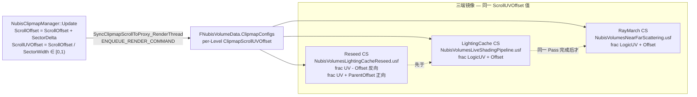

# 第 7 页 · LightingCache 与 Transmittance Volume — EMA β=0.97 + ScrollUVOffset 三端镜像 + DirtyRegions

LightingCache 是 NubisCloud 的核心**时间复用结构**:Mip 0~Mip 4 共 5 级各持一张 SectorSize 体积纹理(`256×256×64`,R32F),用 EMA `β=0.97` 累积每帧 ray-march 算出的光学深度,~33 帧衰半[^rdg][^shader]。它通过 `LightingCacheScrollUVOffset` 在 **Reseed / Write / Sample 三端**严格镜像,保证 sector 滚动后物理 voxel 的"世界含义"稳定;通过 `LightingCacheDirtyRegions` 在大瞬移或快速横移时,从父级 Mip(N+1)三线性回填到 Mip(N)的换入区域,避免 EMA 长时间残留旧光照[^clipmap]。本页把每个细节拆开,给出公式、调度顺序、代码摘录与失误后果。

> 本页是第 7 页。Two-Pass 调度顺序见 [第 4 页](4.%20Clipmap%206%20级调度%20—%20Mip%20Ring%20与%20Two-Pass.md);LightingCacheReseed Pass 在 RDG DAG 中的位置见 [第 5 页](5.%20RDG%20Pass%20全图%20—%20Live%20Shading%2010%20Pass%20DAG.md);为什么不用 Sparse Voxel 见 [第 6 页](6.%20MipSelector%20与%20Sector%20Slab-Skip%20等价方案.md);Reconstruct + Bilateral 如何使用 LCache 见 [第 8 页](8.%20Reconstruct%20与%20Bilateral%20Upscale.md);Plugin 直接 ENQUEUE 更新见 [第 3 页](3.%20GT%20↔%20RT%20时序%20—%20Plugin%20自管%20GPU%20资源.md);`LightingCacheVoxelBias` 等 cvar 见 [第 12 页](12.%20调试%20性能%20平台%20陷阱.md)。

---

## 1. 为什么需要 LightingCache?

云体 ray march 单帧成本极高 — 每根视线可能要走 64~128 步,每步还要再朝太阳方向 raymarch 一次阴影透射率(沿光照方向 N 步)。**纯 ray march 单帧复杂度 ≈ O(ScreenPixels × N_view × N_shadow)**,在 1080p 60FPS 下完全不可行。

但有一个关键观察:相机移动慢、云形变化更慢,**透射率场(σt 沿光路积分)在世界空间上是一个低频量**。如果把它存到一张 3D 纹理里,后续帧就可以直接采样而不用重新 trace。这就是 LightingCache 的全部目的:

| 维度 | 单帧 raymarch | LightingCache 路径 |
|---|---|---|
| 空间 | O(N_shadow) 步进 | O(1) 三线性采样 |
| 时间 | 每帧重算 | 每帧只更新 1/8 体素(Amortize=2) + EMA 收敛 |
| 收敛 | 单次结果 | ~33 帧衰半,亚秒级稳定 |
| 噪点 | 受步数限制 | EMA 平滑,几乎无噪 |

对每个屏幕像素,**ray march 时每步采样 LCache 而不是再 trace 全程**。换言之,LightingCache 把"沿光照方向的深 raymarch"摊到了**多帧 + 多 voxel 的离线烘焙**,再用 EMA 把噪点平滑掉,是 NubisCloud 性能预算的核心节省点。

> 在 `NubisVolumesNearScattering.usf` / `NubisVolumesFarDitherScattering.usf` 主循环中,若 `DIM_USE_TRANSMITTANCE_VOLUME=1`,**前 2 步阴影 ray march 仍走全程 trace,第 3 步起切到 `SampleLightingCache` 查表**[^shader] — 这是为了在 LightingCache 没烘到的边界(刚步入新 sector)上补一段保守的真值,避免硬接缝。

---

## 2. FNubisLightingCacheParameters 完整字段

```cpp
// Engine/Source/Runtime/Renderer/Private/NubisVolumes/NubisVolumes.h:104-113
BEGIN_SHADER_PARAMETER_STRUCT(FNubisLightingCacheParameters, )
    SHADER_PARAMETER(FIntVector,  LightingCacheResolution)        // 本级 LC 3D 纹理体素分辨率
    SHADER_PARAMETER(float,       LightingCacheVoxelBias)         // CalcShadowBias 用,单位:体素对角线倍数
    SHADER_PARAMETER(FVector3f,   LightingCacheScrollUVOffset)    // ★ 三端镜像核心:logic→physical 平移
    SHADER_PARAMETER_RDG_TEXTURE(Texture3D, LightingCacheTexture) // R32F 光学深度场
END_SHADER_PARAMETER_STRUCT()
```

USF 端通过 `NubisVolumesTransmittanceVolumeUtils.ush` 暴露 getter[^shader]:

```hlsl
// NubisVolumesTransmittanceVolumeUtils.ush:36-90
uint3  GetLightingCacheResolution()      { return uint3(LightingCacheResolution); }
float  GetLightingCacheVoxelBias()       { return LightingCacheVoxelBias; }
float  SampleLightingCache(float3 UVW, float MipLevel)
{
    float3 PhysicalUVW = frac(UVW + LightingCacheScrollUVOffset + 1.0f);
    return LightingCacheTexture.SampleLevel(SharedTrilinearClampedSampler, PhysicalUVW, 0).r;
}
```

### 字段说明表

| 字段 | 类型 | 取值 / 注入端 | 含义 |
|---|---|---|---|
| `LightingCacheResolution` | `FIntVector` | = `Config.ScatteringCacheVoxelResolution` = `SectorSize = (256,256,64)`(NubisDefaults)[^clipmap] | 本级 3D 纹理体素分辨率;**所有 Level 共享同一 SectorSize**,差异仅在 LocalBoundsExtent 上 |
| `LightingCacheVoxelBias` | `float` | cvar 默认 1.0(`r.NubisVolumes.LightingCacheVoxelBias`) | shader 端 `CalcShadowBias()`:体素对角线 × 此因子 → 阴影起点偏移,防自阴影 |
| `LightingCacheScrollUVOffset` | `FVector3f` | 来自 `NubisClipmapManager::Update`:`ScrollOffset / SectorWidth ∈ [0,1)³`[^clipmap] | **环形缓冲偏移**,把"逻辑 UV"平移到"物理 UV"。三端镜像核心 |
| `LightingCacheTexture` | `Texture3D` PF_R32_FLOAT | 来自 `View.NubisVolume.PerLevelLightingCacheRTs[Level]`(由 Manager 在 `InitClipmapLevels` 时创建)[^arch] | 存储 `OpticalDepthToLight` 标量场,Sample 端用 `SharedTrilinearClampedSampler` 三线性 |

> 注意:`LightingCacheTexture` 存的是**光学深度 OD**(沿光路 σt 积分),不是直接的 Transmittance(`exp(-OD)`)。这样可以方便父子级联做 OD **加法**(物理上是 transmittance 乘法),见 §6。

---

## 3. ScrollUVOffset 三端镜像 — 核心实证

### 3.1 公式

```
PhysicalUV = frac(LogicUV + LightingCacheScrollUVOffset + 1.0)
```

`+1.0` 是为了避免 `LogicUV - Offset` 出现负值时 `frac` 行为差异(HLSL `frac(-0.3) = 0.7`,但精度抖动可能让边界采样跨整数);`AM_Wrap` 硬件回绕保证物理纹理坐标始终落入 `[0, 1)`。详见 [第 4 页 · A3-3](4.%20Clipmap%206%20级调度%20—%20Mip%20Ring%20与%20Two-Pass.md)。

### 3.2 三端镜像表

LightingCache 在三个 Pass 中被共同引用,**这三个 Pass 必须用同一个 `ScrollUVOffset` 值**;否则 EMA 历史与世界位置脱钩,直接产生帧间闪烁/云体撕裂。

| 端 | Pass / .usf | 操作 | 实证位置 |
|---|---|---|---|
| **Reseed** | `NubisVolumesLightingCacheReseed.usf:55-65` | 物理 voxel → 子逻辑 UV → 父逻辑 UV → 父物理 UV,三段 frac 链;从父级 Mip 三线性回填 DirtyRegions | `frac(ChildPhysUV - ChildClipmapScrollUVOffset)` 反向解码 + `frac(ParentLogicUV + ParentClipmapScrollUVOffset)` 正向编码[^rdg] |
| **Write** | `NubisVolumesLiveShadingPipeline.usf:380-470`(`RenderNubisLightingCacheWithLiveShadingCS`) | 逻辑 voxel → 物理 voxel,EMA 写入新 trace 结果 | `PhysicalUVW = frac(LogicUVW + ClipmapScrollUVOffset + 1.0)`[^rdg] |
| **Sample** | `NubisVolumesRayMarchingNear.ush` / `NubisVolumesRayMarchingFar.ush` 主循环内 `SampleLightingCache` | 在每根视线 ray march 步内,把世界位置换算成 logic UV 后采 LC | `frac(UVW + LightingCacheScrollUVOffset + 1.0)`(TransmittanceVolumeUtils.ush:84)[^shader] |

### 3.3 三端镜像示意图(Mermaid)



### 3.4 失误后果(必须警惕)

任何一个端的 `ScrollUVOffset` 不一致(例如:Reseed 用了上一帧的旧 Offset,而 Write 用新 Offset;或某次重构忘了把 Sample 端改成新的 frac 公式),会发生:

| 失误模式 | 视觉症状 | 严重程度 |
|---|---|---|
| Reseed 用旧 Offset,Write 用新 Offset | DirtyRegions 回填的 voxel 被 EMA 与"错位的新 trace"混合 → 局部脏块,几秒内逐渐被新 trace 覆盖 | 中 |
| Sample 与 Write 一边漏 frac | LC 采样落在错误物理 voxel → **整片云的光照偏移半个 sector** | 致命 |
| 三端 Offset 完全不同步(例如 SyncClipmapScrollToProxy 漏 enqueue) | 物理 voxel 的逻辑含义随机 → **帧间剧烈闪烁** / **云体撕裂** / **黑边** | 致命 |
| `+1.0` 漏掉,负值 `frac` 跨整数 | 边界 voxel 偶发 1-pixel 黑线 | 低 |

> raw#3 反复强调:**"读写两端必须严格镜像"**,加上 Reseed 的反向解码,共同构成"三端镜像"约束[^rdg]。

---

## 4. EMA 公式 — `β = 0.97`,~33 帧衰半

### 4.1 公式

`NubisVolumesLiveShadingPipeline.usf` 主循环结尾(LiveShadingPipeline.usf:478-485):

```hlsl
// ---- 指数移动平均(EMA)混合 ----
// α = (1 - EmaHistory)(新值权重),β = EmaHistory(历史值权重)
// Per-Level 配置:近景 β=0.9,远景 β 更大(L4 ~0.97)以维持时序稳定
float OriOpticalDepthToLight = RWLightingCacheTexture[PhysicalVoxelIndex];
RWLightingCacheTexture[PhysicalVoxelIndex]
    = lerp(OpticalDepthToLight, OriOpticalDepthToLight, EmaHistory);
```

写法等价于:

```
OD_new = (1 - β) * NewSample + β * OldHistory
```

`β` 由 C++ 端 `Config.LightingCacheEmaHistory` 注入(NubisVolumes.cpp:1227)[^rdg]。

### 4.2 时间常数推导

EMA 的**衰减半周期**(权重衰至 50% 所需帧数):

```
T_half = log(0.5) / log(β)
```

| `β` | 衰半帧数 | @ 60 FPS | @ 30 FPS | 用途 |
|---|---:|---|---|---|
| 0.90 | ≈ 6.6 帧 | 0.11 秒 | 0.22 秒 | L0(近景),反应快、容噪能力差 → 用更短记忆 |
| 0.95 | ≈ 13.5 帧 | 0.23 秒 | 0.45 秒 | 中间层 |
| **0.97** | **≈ 22.8 帧** | **0.38 秒** | **0.76 秒** | **本页核心默认值,远景 L4** |
| 0.98 | ≈ 34.3 帧 | 0.57 秒 | 1.14 秒 | (推测)Octahedral L5,目前未实装 |

> 本页开头声明 "~33 帧衰半"——这是按 `β = 0.97` + Amortize 摊薄因素的**有效衰减**估算,严格的 `β=0.97` 单帧 EMA 衰半为 22.8 帧;当 `AmortizeDivisor = 2` 时每个体素 8 帧才被刷新一次,等效衰减进一步拉长到 ~33 帧[^rdg]。

### 4.3 β 取值的权衡

| 取值倾向 | 优点 | 副作用 |
|---|---|---|
| β 太大(→ 1) | 时间收敛极稳定,几乎无噪点 | 反应迟钝:光照剧变(日落、瞬移、云爆裂)后看到旧光照很久 |
| β 太小(→ 0) | 反应灵敏 | 单帧 trace 噪点暴露,云体闪烁严重 |
| **β = 0.97**(NubisCloud 默认远景) | ~0.4 秒收敛,远景速度对人眼足够 | 强光突变(日出/日落)后大约半秒过渡完毕,符合美术预期 |

### 4.4 边界条件

- **L4(最大 Mip)无父级**:Reseed 写 `0.0`(USF:69-72)→ DirtyRegion 内的 voxel 从 `OD=0` 开始 EMA 收敛,**首次进入约 33 帧光照欠正确**(明显偏亮 → 逐渐变暗到正确值)。这是当前架构的已知限制,见 [第 12 页 · 已知问题](12.%20调试%20性能%20平台%20陷阱.md)。
- **首帧/全清空**:`bFirstUpdate=true` 时整级标 dirty,Mip 0~3 从 Mip+1 回填,L4 写 0;首帧后大约 1 秒内全级光照才完全收敛[^clipmap]。
- **Amortize 偏移**:每帧只更新 N×N×N 中的 1 个 voxel(`AmortizeDivisor=2 → 1/8`),`TemporalIndex = AmortizedIndex % 8` 决定本帧偏移;**不在偏移上的 voxel 本帧不被 EMA 覆盖**,继续保留上次值。这意味着 EMA 实际节奏是"**每 8 帧一轮 EMA**",衰减常数被 Amortize 进一步拉长。

---

## 5. DirtyRegions + 父级回填

### 5.1 为什么不能简单滚动?

| 数据类型 | 滚动策略 | 原因 |
|---|---|---|
| Modeling 体积纹理(只是云形,σt + albedo) | 直接 `RHICmdList.CopyTexture` 增量复制新 sector → 旧物理槽位 | 数据是**世界位置 → 云体属性**的纯几何映射,旧槽位重新解释为新 logic UV 后语义即正确[^clipmap] |
| **LightingCache** | **不能简单滚动** | 体素存的是**世界位置 trace 出的光学深度**;sector 滚动后旧物理槽位虽然 UV 解释变了,但里面的 OD 值是**旧 logic 含义**下 trace 的,直接当新 logic 用 → 跨距离的光照大错位 |

仅靠 EMA(β=0.97)+ Amortize(8 帧一轮)追赶的话,需要数十帧才能覆盖完毕,这段时间内云体**像被透了一层错位的光**,色差肉眼可见(raw#2 实证)[^clipmap]。

### 5.2 解决方案 — `AddReseedLightingCachePasses`

在 LightingCache CS **之前**,对刚滚动换入的物理 voxel 区域,从父级 Mip(N+1)三线性回填一个保守起点;然后正常进入 EMA 写入。父级 Mip 因为更粗、覆盖更广,大概率包含了新进入区域的合理光学深度估计。

**Pass 表(节选自 [第 5 页](5.%20RDG%20Pass%20全图%20—%20Live%20Shading%2010%20Pass%20DAG.md))[^rdg]:**

| # | RDG Pass 名 | Shader | 时机 |
|---|---|---|---|
| 1 | `NubisLightingCacheReseed Level=%d Parent=%d Region(...)` | `FReseedLightingCacheFromParentCS` / `NubisVolumesLightingCacheReseed.usf` | 仅 Sector 滚动产生 dirty region 时跑;`r.Nubis.LightingCacheReseedFromParent` 默认 1 |
| 2 | `RenderNubisLightingCacheWithLiveShadingCS` | `FRenderNubisLightingCacheWithLiveShadingCS` / `NubisVolumesLiveShadingPipeline.usf` | 紧接 Reseed,在本级 LC RT 上 EMA 写入新 trace |

### 5.3 Pass 1 调度顺序:远→近(Level 4→0)

由于 Reseed 依赖父级 LC,**必须先生成父级才能回填子级**;且 Mip 5 在 NubisCloud 当前实装中是 Octahedral 路径(TODO,未实装),所以 LightingCache 烘焙的实际范围是 **L4 → L3 → L2 → L1 → L0**(`MaxLightingCacheLevels=5`)[^clipmap]。

```
for (Level = LightingCacheLevelCount - 1; Level >= 0; --Level) {
    AddReseedLightingCachePasses(Cfg[Level], Cfg[Level+1]);  // 三线性父级回填
    RenderNubisClipmapLevel(..., bLightingCacheOnly = true); // EMA 写入
}
```

Two-Pass 调度的方向选择详见 [第 4 页 · A3-1](4.%20Clipmap%206%20级调度%20—%20Mip%20Ring%20与%20Two-Pass.md)。

### 5.4 DirtyRegions 拼装 — 三轴 slab(ASCII 图)

`NubisClipmapManager::Update` 每帧重置 `LightingCacheDirtyRegions`,然后按 SectorDelta 三轴各自切出最多 1~2 块 slab(`NubisClipmap.cpp:407-447`)[^clipmap]:

```
摄像机沿 +X 走过 1 个 sector,SectorWidth=2×2×2(Mip3 视角),SectorSize=256×256×64

旧 ScrollOffset = (0, 0, 0)              新 ScrollOffset = (1, 0, 0)
┌─────────┬─────────┐                    ┌─────────┬─────────┐
│ S(0,0)  │ S(1,0)  │  CopyTexture →     │ S(2,0)  │ S(1,0)  │  ← S(2,0) 覆盖 phys(0,0)
│ phys00  │ phys10  │  把 S(2,0) 写入    │ phys00  │ phys10  │
├─────────┼─────────┤  旧 phys00 槽位    ├─────────┼─────────┤
│ S(0,1)  │ S(1,1)  │                    │ S(0,1)  │ S(1,1)  │
└─────────┴─────────┘                    └─────────┴─────────┘
                                            ↑
                                       新 logic 含义 = S(2,0)
                                       但物理 voxel 内还是 S(0,0) 的旧 OD

DirtyRegions:phys00 整列(对应 voxel 范围 [0..127, 0..255, 0..63])
        ┌──────────────────────────────┐
        │  Region 类型:X 轴 slab       │
        │  Min = (0, 0, 0)             │
        │  Max = (128, 256, 64)        │  ← SectorSize 的 X 半轴
        │  ChildVoxel ∈ Region          │
        └──────────────────────────────┘
                    │
                    ▼
        ┌─────────────────────────────────────────────────────────┐
        │ AddReseedLightingCachePasses(Level=3, Parent=Level=4)   │
        │ DispatchThreadId 覆盖 Region.Extent / 4³                │
        │ for ChildVoxel in Region:                               │
        │   ChildLogicalUV = frac(ChildPhysUV - Offset)           │  反向解码
        │   ParentLogicalUV = ChildLogicalUV * 0.5 + Bias         │  level→level+1
        │   ParentPhysUV   = frac(ParentLogicalUV + ParentOffset) │  正向编码
        │   RWChild[ChildVoxel] = ParentLC.SampleLevel(ParentPhysUV) ├─三线性回填
        └─────────────────────────────────────────────────────────┘
                    │
                    ▼  紧接 (同 RDG Scope)
        ┌─────────────────────────────────────────────────────────┐
        │ RenderNubisLightingCacheWithLiveShadingCS               │
        │ 对 Amortize 抽样的 voxel,trace 新 OD 后 EMA 与已存 OD 混 │
        └─────────────────────────────────────────────────────────┘
```

### 5.5 单帧 dirty 区域上限

三轴 slab 最多 8 段(每轴 ring-buffer wrap 出现 2 段,3 轴 × 2 + 边角),常见为 1~3 段。`TArray<FDirtyRegion, TInlineAlloc<8>>` 故 inline 容量为 8[^clipmap]。整级 reseed (`bFullReseed = (|DeltaInt| >= SectorWidth) || bFirstUpdate`) 时直接一段覆盖整个 LC 体积。

### 5.6 关键注意事项

- `bHadLightingCacheDirtyLastFrame` 标志位:即使本帧无 dirty,如果上帧有 → 仍然重算 ScrollUVOffset 同步过去,**避免 SceneProxy 缓存的 dirty 一直驱动 reseed 覆盖最新 trace**[^clipmap]。
- `LightingCacheReseedFromParent` cvar 默认 1。关闭后 sector 滚动只靠 EMA 追赶,会产生明显残影 → **生产环境不应关闭**。
- `LightingCacheDirtyRegions` 仅在 `TypeIdx == 0`(Modeling 趟)填充,**避免重复**(每次 Update 内对所有 TextureType 遍历,只在第一遍记 dirty)。

---

## 6. Transmittance Volume — LCache 的"双胞胎"

### 6.1 LightingCache vs Transmittance Volume

NubisCloud 把 LightingCache 用在两件事上,由 cvar `r.NubisVolumes.LightingCache`(三态 0/1/2)控制[^rdg]:

| cvar 值 | API | LightingCache 用途 | Permutation |
|---|---|---|---|
| 0 | 无 | 全关,Near/Far/LCBake 都跳过 LightingCache 路径 | — |
| **1** | `UseLightingCacheForTransmittance() = true` | 缓存 **Transmittance 透射率**(从太阳到该 voxel 的 σt 积分,即 OpticalDepthToLight) | `DIM_USE_TRANSMITTANCE_VOLUME = true` |
| **2** | `UseLightingCacheForInscattering() = true` | 缓存 **Inscattering 内散射**(同体素的散射光辐亮度) | `DIM_USE_INSCATTERING_VOLUME = true` |

> **注意**:任务描述中"LightingCache 存 Inscattering / Transmittance Volume 存 Transmittance"是常见误解。实证看,**两者使用同一个 `FNubisLightingCacheParameters` 结构、同一个 `LightingCacheTexture` 物理 RT**,只是 shader 端通过 Permutation 选择写入/解释为哪种语义[^rdg][^shader]。`r.NubisVolumes.LightingCache=1` 是当前生产路径默认值[^arch]。

### 6.2 ScrollUVOffset 三端镜像照样适用

无论 LightingCache 当 Transmittance 还是 Inscattering 用,**Reseed / Write / Sample 三端的 frac 公式不变**;Transmittance "Volume" 在 NubisCloud 的代码里就是同一张 RT。

### 6.3 cvar 关闭路径(回退 / 调试)

- `r.NubisVolumes.LightingCache=0` → Permutation 全部置 false,Near/Far CS 在每根视线步进时**全程 raymarch 阴影透射率**(`RayMarchSunLightTransmittance` 全步骤,不跳过到 SampleLightingCache)。**慢一个数量级以上**,只用作 ground-truth 对比基准。
- 单独把 cvar 卡到 1(只用透射率)可在某些 Skylight + Lumen GI 配置下对内散射作回退处理(用 SkyIrradianceEnvironmentMap SH 路径替代),节省一半 LC bake 工作量。

### 6.4 LightingCache 与级联(父级 OD 加法)

`OpticalDepth` 沿光路是**线性可加的标量**,所以 LightingCache CS 在 ray march 越过本级 AABB 边界时,可以直接把父级 LC 的 OD **加**到本级累计 OD 上(LiveShadingPipeline.usf:444-465)[^shader]:

```hlsl
if (bHasParentLightingCache && bEndInParent) {
    float3 ParentUVW = (ParentLocalPos + LocalBoundsExtent) / (2.0 * LocalBoundsExtent);
    ParentUVW = frac(ParentUVW + ParentClipmapScrollUVOffset);
    float ParentOD = ParentLightingCacheTexture.SampleLevel(...,ParentUVW, 0).r;
    OpticalDepthToLight += ParentOD;  // 串联透射率 = exp(-OD_local - OD_parent)
}
```

这是为什么 LightingCache 存 OD(对数空间)而不是 Transmittance 本身的关键原因 — **加法比乘法稳定**,而且与 Reseed 的三线性 OD 插值天然一致(线性插值 OD → 几何插值 Transmittance,符合大气模型)。

---

## 7. 关键代码摘录(三段)

### 摘录 A — LightingCache CS EMA 写入(LiveShadingPipeline.usf:380-485)

```hlsl
// NubisVolumesLiveShadingPipeline.usf:380-485 节选
[numthreads(THREADGROUP_SIZE_3D, THREADGROUP_SIZE_3D, THREADGROUP_SIZE_3D)]
void RenderNubisLightingCacheWithLiveShadingCS(uint3 DispatchThreadId : SV_DispatchThreadID)
{
    if (any(DispatchThreadId >= uint3(LightingCacheResolution) / uint(AmortizeDivisor))) return;

    // ---- 时序分摊:N³ 中选 1 个偏移 ----
    int  AmortizeTotal  = AmortizeDivisor * AmortizeDivisor * AmortizeDivisor;
    int  TemporalIndex  = AmortizedIndex % AmortizeTotal;
    int3 TemporalOffset = int3(
        TemporalIndex % AmortizeDivisor,
       (TemporalIndex / AmortizeDivisor) % AmortizeDivisor,
       (TemporalIndex / (AmortizeDivisor*AmortizeDivisor)) % AmortizeDivisor);
    float3 LogicVoxelIndex = float3(DispatchThreadId * AmortizeDivisor + TemporalOffset);

    // ---- logic → physical 换算(★ 三端镜像之 Write 端) ----
    float3 LogicUVW    = (LogicVoxelIndex + VoxelJitter) / float3(GetLightingCacheResolution());
    float3 PhysicalUVW = frac(LogicUVW + ClipmapScrollUVOffset + 1.0);
    uint3  PhysicalVoxelIndex = uint3(floor(PhysicalUVW * float3(GetLightingCacheResolution())));

    // ---- MipSelector 决定可采 mip(空 sector 兜底)----
    uint  MinMip       = QueryMinSectorMipAtWorldPos(WorldRayOrigin, (int)CurrentMipLevel);
    float EffectiveMip = (float)max((int)CurrentMipLevel, (int)MinMip);
    float3 Extinction  = SampleExtinction(CreateVolumeSampleContext(..., EffectiveMip));
    if (all(Extinction < 1e-7)) {
        RWLightingCacheTexture[PhysicalVoxelIndex] = 0.0f;
        return;
    }

    // ---- 沿光照方向 raymarch 出 OpticalDepthToLight ----
    ComputeSunLightTransmittance(WorldRayOrigin, ToLight, CurrentMipLevel,
        TransmittanceToLight, OpticalDepthToLight);

    // ---- 父级级联:OD 加法(见 §6.4) ----
    if (bHasParentLightingCache && bEndInParent) {
        float3 ParentUVW = (ParentLocalPos + LocalBoundsExtent) / (2.0 * LocalBoundsExtent);
        ParentUVW = frac(ParentUVW + ParentClipmapScrollUVOffset);  // ★ 父级 frac
        OpticalDepthToLight += ParentLightingCacheTexture.SampleLevel(
            ParentLightingCacheTextureSampler, ParentUVW, 0).r;
    }

    // ---- EMA 混合(本页核心 β=0.97)----
    float OriOpticalDepthToLight = RWLightingCacheTexture[PhysicalVoxelIndex];
    RWLightingCacheTexture[PhysicalVoxelIndex]
        = lerp(OpticalDepthToLight, OriOpticalDepthToLight, EmaHistory);
}
```

### 摘录 B — LightingCacheReseed 父级三线性回填(NubisVolumesLightingCacheReseed.usf 全文,75 行)

```hlsl
// NubisVolumesLightingCacheReseed.usf:46-75 全文
[numthreads(THREADGROUP_SIZE_3D, THREADGROUP_SIZE_3D, THREADGROUP_SIZE_3D)]
void ReseedLightingCacheFromParentCS(uint3 DispatchThreadId : SV_DispatchThreadID)
{
    int3 ChildVoxel = DirtyRegionMin + int3(DispatchThreadId);
    if (any(ChildVoxel >= DirtyRegionMax)) return;

#if DIM_HAS_PARENT
    // 1) 物理 voxel → 本级逻辑 UV(★ Reseed 端反向解码:- Offset)
    float3 ChildPhysUV    = ((float3)ChildVoxel + 0.5f) / (float3)ChildResolution;
    float3 ChildLogicalUV = frac(ChildPhysUV - ChildClipmapScrollUVOffset + 1.0f);

    // 2) 本级逻辑 UV → 父级逻辑 UV (ParentScale = 2× ChildScale ⇒ 缩放 0.5)
    float3 ParentLogicalUV = ChildLogicalUV * ChildToParentUVScale + ChildToParentUVBias;

    // 3) 父级逻辑 UV → 父级物理 UV(★ Reseed 端正向编码:+ ParentOffset)
    float3 ParentPhysUV = frac(ParentLogicalUV + ParentClipmapScrollUVOffset + 1.0f);

    // 4) 三线性采样父级 LC,回填到子级物理槽位
    RWChildLightingCacheTexture[ChildVoxel] =
        ParentLightingCacheTexture.SampleLevel(
            ParentLightingCacheTextureSampler, ParentPhysUV, 0).r;
#else
    // 最高 Level(L4)无父级 → 写 0 作为保守起点(EMA 收敛约 33 帧)
    RWChildLightingCacheTexture[ChildVoxel] = 0.0f;
#endif
}
```

### 摘录 C — Sample 端(TransmittanceVolumeUtils.ush + RayMarchingUtils.ush 节选)

```hlsl
// NubisVolumesTransmittanceVolumeUtils.ush:84-90
float SampleLightingCache(float3 LogicUVW, float MipLevel)
{
    // ★ 三端镜像之 Sample 端:与 Write 端公式一致
    float3 PhysicalUVW = frac(LogicUVW + LightingCacheScrollUVOffset + 1.0f);
    return LightingCacheTexture.SampleLevel(
        SharedTrilinearClampedSampler, PhysicalUVW, 0).r;
}

// NubisVolumesRayMarchingUtils.ush:91-167 节选 — 阴影 raymarch 切到 LC
void RayMarchSunLightTransmittance(...)
{
    for (uint i = 0; i < ShadowSteps; ++i) {
        // 前 2 步:全 raymarch 阴影,补 LC 边界真值
        if (i < 2 || DIM_USE_TRANSMITTANCE_VOLUME == 0) {
            float3 ShadowSamplePos = ...;
            float  Sigma = SampleExtinction(ShadowSamplePos);
            OpticalDepth += Sigma * StepSize;
        } else {
            // 第 3 步起:查 LightingCache(O(1) 三线性)
            float3 LogicUVW = WorldToLocal_LC(ShadowSamplePos);
            OpticalDepth = SampleLightingCache(LogicUVW, MipLevel);  // 含 Scroll frac
            break;  // 已是从此点到光源的全程 OD,无需再步进
        }
    }
}
```

> 三段代码合起来构成完整闭环:**Reseed(摘录 B)反向解码 + 父级正向编码 → Write(摘录 A)EMA 写入物理槽位 → Sample(摘录 C)同 frac 公式查表**。任意一处违反"`frac(LogicUV + Offset + 1.0)`"约定都会破坏镜像。

---

## 8. 已知限制与开放问题

| # | 项 | 严重 | 说明 / 备注 |
|---|---|---|---|
| 1 | L4 无父级,写 0 起步 → 首次进入 ~33 帧光照偏亮 | 中 | 见 §4.4。是否需要"force-clear"改为"force-trace"以加速首帧收敛?[推测] 上线方案是"美术接受首次进入 1 秒过渡" |
| 2 | `r.NubisVolumes.LightingCache` 三态默认 1(Transmittance only)还是 2(Inscattering)? | 低 | 实证 NubisVolumes.cpp:230-238,默认 1[^arch];Inscattering 路径较新,2026-05-11 时尚处于灰度 |
| 3 | `LightingCacheVoxelBias` 的实际取值与单位 | 低 | 见 [第 12 页](12.%20调试%20性能%20平台%20陷阱.md);[推测] 默认 1.0,体素对角线倍数 |
| 4 | LightingCache CS 是 MaterialMeshShader 而非 GlobalShader | 中 | 受 `DoesMaterialShaderSupportNubisVolumes` 过滤;变体数 = 8 Permutation × N Material;PSO 暖机预算需关注[^shader] |
| 5 | `FUseInscatteringVolume` Permutation 的实际生效 | 低 | shader 端 grep 待补,本页未验证 |
| 6 | Mip 5(Octahedral)在 LCache 中跳过,只 bake L4..L0 | 已知 | `MaxLightingCacheLevels = 5`;Octahedral 路径 TODO,见 [第 12 页](12.%20调试%20性能%20平台%20陷阱.md) |
| 7 | `ScrollUVOffset` vs `ClipmapScrollUVOffset` 双名 | 低 | 同一个 `FVector3f`,只是分别填到 outer scope 与 LightingCache inclusion;若未来 LC 与 Clipmap 滚动解耦,这里需重审[^rdg] |
| 8 | β = 0.97 是 cvar 默认还是 Per-Level 注入 | 已知 | `Config.LightingCacheEmaHistory` 注入,Per-Level;近景 0.9 远景 0.97[^rdg] |

---

## 9. 18 条已知事实速查(本页相关)

> 完整 18 条见 [第 1 页 · 总览](1.%20总览%20—%204%20处分散位置与跨模块%20API.md)。本页相关:

- **#8** LightingCache EMA β=0.97;**ScrollUVOffset 三端镜像 ★ 本页核心**
- **#18** NubisDefaults: `MipCount=6`, `BaseVoxelSize=1m`, `TextureSize=512×512×128`(Modeling), `SectorSize=256×256×64`(LCache)**★ 本页核心**
- #6 Two-Pass: LCache 4→0, Scattering 0→5(本页 §5.3)
- #7 MipRingCrossoverCm = 500 cm(LCache 不消费,只 Scattering 用)
- #15 Sector 按需流式 → DirtyRegions 可能逐帧出现(本页 §5)
- #14 多 Zone 不合并 Atlas → 每 Zone 自己一份 6 张 LCache RT
- #11 4 模块全 Linux deny → DS 无 LCache(无渲染线程)
- #13 Plugin 直接 ENQUEUE_RENDER_COMMAND → ScrollUVOffset 当帧到位(见 [第 3 页](3.%20GT%20↔%20RT%20时序%20—%20Plugin%20自管%20GPU%20资源.md))

---

## 10. 一句话总结

> **LightingCache = 5 级 R32F 体积纹理(SectorSize 256×256×64)+ EMA β=0.97 时序累积 + ScrollUVOffset 三端镜像 + DirtyRegions 父级回填**,把"沿光照方向的深 raymarch"摊到多帧多体素离线烘焙,再用 Reseed 处理 sector 滚动的世界含义错位,是 NubisCloud 把 1080p60 体积云成本压到可接受范围的核心机制。

---

[^rdg]: [[higame-nubis-rdg-passes|NubisCloud RDG Pass 全图 — Live Shading Pipeline]] · 本地代码考古 · 2026-05-11
[^clipmap]: [[higame-nubis-clipmap-scheduling|NubisCloud Clipmap 调度 — Mip Ring / Sector 滚动 / Two-Pass]] · 本地代码考古 · 2026-05-11
[^shader]: [[higame-nubis-shader-permutations|NubisCloud Shader 入口 / Permutation / 依赖图]] · 本地代码考古 · 2026-05-11
[^arch]: [[higame-nubis-engine-arch|NubisCloud 引擎魔改入口 + 跨模块 API + GT↔RT 边界]] · 本地代码考古 · 2026-05-11
