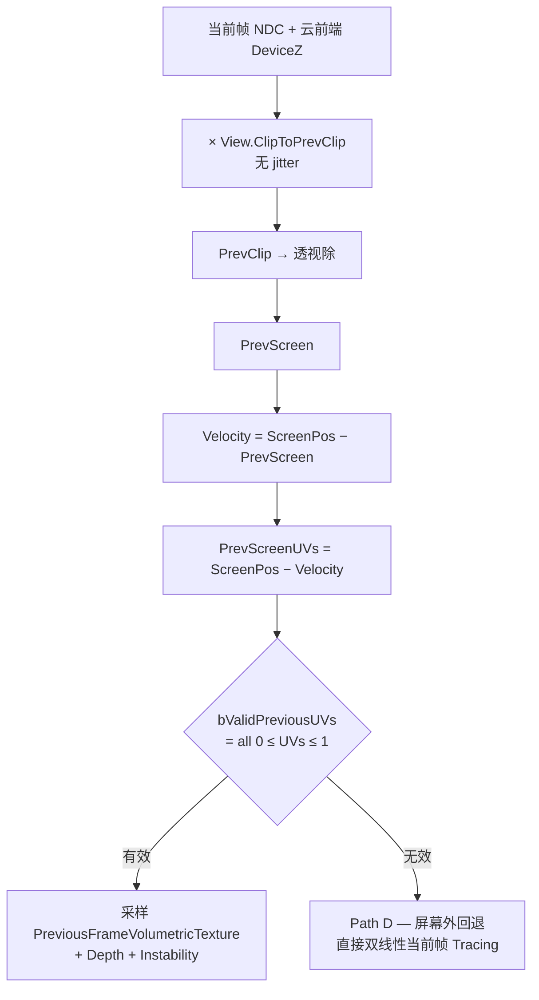
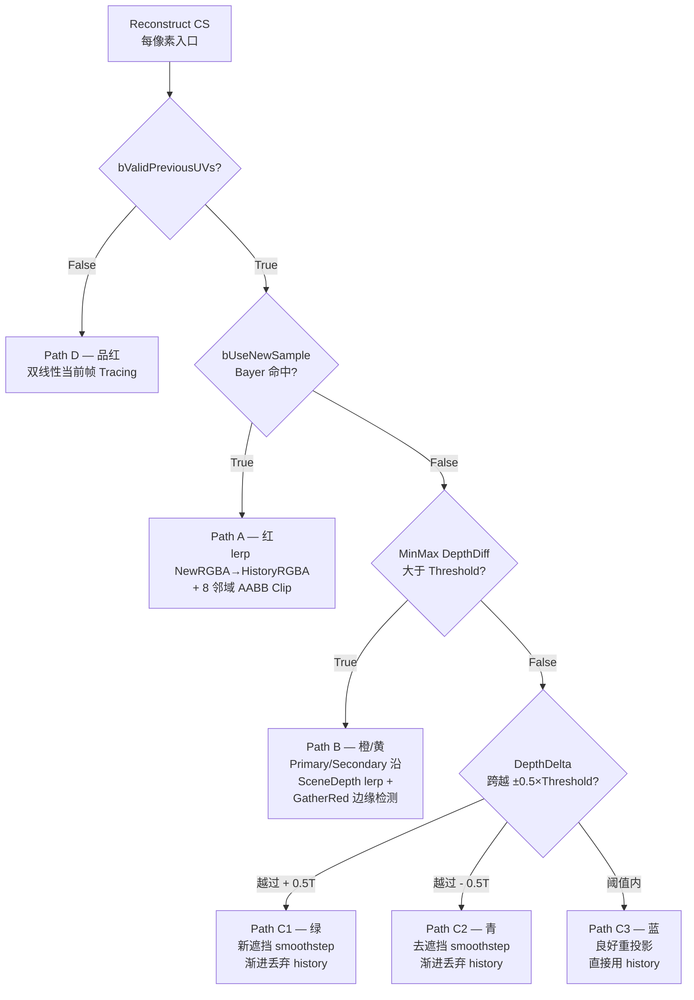

# Reconstruct 与 Bilateral Upscale — 5 路重投影 + 4 UPSCALE_MODE + Far under Near

`Reconstruct` 与 `BilateralUpscale` 是 NubisCloud 时间复用 + 上采样的两个核心 Pass。`Reconstruct.usf` 内置 **5 路重投影策略 (Path A/B/C1/C2/C3/D)** + 云前端深度反投影,目的是从 1/N²~1/N⁴ 倍降采样的 Far Dither Tracing 结果重建出半分辨率(`ReconstructRT`)的稳定时序产物;`BilateralUpscale.usf` 则用 **4 个 `UPSCALE_MODE`** 把 Near 与 Far 半分辨率结果各自上采样到全分辨率,并用 **Far under Near** 物理透射率公式合成。⚠️ **重要警告**:CVar `r.NubisVolumes.NearDominanceBlend` 与对应 cbuffer 字段 `NearDominanceEnabled / StartAlpha / EndAlpha` 已在 C++ 端就位、Pass 也已绑定,但 `BilateralUpscale.usf` 当前主 kernel **零引用**这三个字段,grep `Engine/Shaders` 无任何 `Dominance|StartAlpha|EndAlpha` 命中——这是一个 **未完成的过渡期开关**,不要假设它在生产构建中工作[^temporal][^shader]。本页拆解两个 Pass 的内部逻辑、双层 RT 状态结构、Bayer 抖动注入、深度夹紧防 NaN、Visualize 调试入口。

> 上下文:Pass 在整个 DAG 的位置见 [第 5 页](5.%20RDG%20Pass%20全图%20—%20Live%20Shading%2010%20Pass%20DAG.md);LightingCache EMA(Reconstruct 隐式依赖上一帧 LC)见 [第 7 页](7.%20LightingCache%20与%20Transmittance%20Volume.md);Visualize cvar 总表与 Near Dominance 陷阱见 [第 12 页](12.%20调试%20性能%20平台%20陷阱.md)。

---

## Section 1: 双层 RT 状态结构 — Per-View Wrapper × Per-Level State

### 1.1 嵌套关系总图(ASCII)

NubisCloud 的历史纹理被组织成**两层嵌套**:`FViewInfo::ViewState` 持有 1 个 Per-View 的 `FNubisRenderTargetViewStateData`,后者按 Clipmap MipLevel(典型 2/3/4) 分配 N 个 `FNubisPerLevelDitherState` 实例,每个 Per-Level 实例独立维护自己的 Reconstruct 双缓冲与 Bayer 帧计数,**互不污染 history**[^temporal]。

```
┌──────────────────────────────────────────────────────────────────────────┐
│ FViewInfo                                                                │
│  └─ FSceneViewState* ViewState                                           │
│       │                                                                  │
│       └─ FNubisRenderTargetViewStateData NubisVolumeRenderTarget         │  Per-View
│            │   (NubisRenderTargetViewStateData.h:292-419, 128 行结构体)  │
│            │                                                             │
│            ├─ Reconstruct/Far Tracing/Combined RT[]    ← 全局共享(旧路径) │
│            ├─ NubisInstabilityRT[2]                    ← FSR2-style 双缓冲│
│            ├─ FrameId / NoiseFrameIndex                ← 帧计数器         │
│            ├─ CurrentPixelOffset (uint2)               ← Bayer 偏移       │
│            ├─ CurrentRT (0/1)                          ← 全局 ping-pong   │
│            │                                                             │
│            └─ TMap<int32, FNubisPerLevelDitherState>                     │  Per-Level
│                 PerLevelDitherStates                                     │
│                 │   Key = MipLevel ∈ {2, 3, 4} (典型)                    │
│                 │                                                        │
│                 ├─ MipLevel=2 → FNubisPerLevelDitherState                │
│                 │    ├─ FrameIndex (该 Level 自己的计数)                 │
│                 │    ├─ CurrentPixelOffset (该 Level 自己的 Bayer)       │
│                 │    ├─ CurrentRT (该 Level 自己的 ping-pong)            │
│                 │    ├─ DitherFrameCount = DownsampleFactor²             │
│                 │    ├─ ReconstructRT[2]      (PF_FloatRGBA, 双缓冲)     │
│                 │    ├─ ReconstructRTDepth[2] (PF_G16R16F,  双缓冲)      │
│                 │    ├─ InstabilityRT[2]      (PF_R16F,     双缓冲)     │
│                 │    ├─ FarTracingRT          (PF_FloatRGBA, 单缓冲)    │
│                 │    ├─ FarSecondaryTracingRT (PF_FloatRGBA, 单缓冲)    │
│                 │    └─ FarTracingRTDepth     (PF_FloatRGBA, 单缓冲)    │
│                 │                                                        │
│                 ├─ MipLevel=3 → 同上独立一份                             │
│                 └─ MipLevel=4 → 同上独立一份                             │
└──────────────────────────────────────────────────────────────────────────┘
```

> 来源:`NubisRenderTargetViewStateData.h:292-419` (Per-View) + `:23-289` (Per-Level)[^temporal]。

### 1.2 RT 列表与作用一览

| RT | 是否双缓冲 | 像素格式 | 用途 |
|----|------|------|------|
| `ReconstructRT[0/1]` | ✅ ping-pong | `PF_FloatRGBA` | Reconstruct 输出(云预乘 RGB + α 通道);上一帧作为 history 被 Reproject |
| `ReconstructRTDepth[0/1]` | ✅ ping-pong | `PF_G16R16F` | (CloudFrontKm, SceneKm);reproject 时取 history 深度做 dis/occlusion 测试 |
| `InstabilityRT[0/1]` | ✅ ping-pong | `PF_R16F` | EMA 累积亮度抖动;启用 `NUBIS_LUMINANCE_INSTABILITY=1` 时使用,默认 0 关 |
| `FarTracingRT` | ❌ 单缓冲 | `PF_FloatRGBA` | 当前帧低分辨率 Trace 结果(rgb = 辐射 × α) |
| `FarSecondaryTracingRT` | ❌ 单缓冲 | `PF_FloatRGBA` | MinMax 模式下的 Near 端截止结果(Path B 使用) |
| `FarTracingRTDepth` | ❌ 单缓冲 | `PF_FloatRGBA` | (CloudFrontKm, SceneKm, MinDeviceZ, MaxDeviceZ) |
| `CombinedReconstructRT/Depth` | ❌ | `PF_FloatRGBA` | Bilateral Upscale 之前的多 Level 合并缓冲(仅旧路径使用) |

> ⚠️ **没有独立的 Radiance / Transmittance RT**:α 通道既是不透明度又是 (1 − Transmittance)。LightingCache 是 3D RT,挂在 `NubisVolume Component` 上,不在这条线[^temporal]。

### 1.3 双缓冲交换的精确时机

```cpp
// NubisRenderTargetViewStateData.h:246-250 (Per-Level)
CurrentRT = 1 - CurrentRT;
const uint32 PreviousRT = 1 - CurrentRT;
bHistoryValid = !bCameraCut
              && ReconstructRT[PreviousRT].IsValid()
              && ReconstructRTDepth[PreviousRT].IsValid();
```

构造时 `CurrentRT = 1`(`NubisVolumes.cpp:562`),所以**第一帧会变 0、第二帧变 1,循环往复**。`bHistoryValid` 是 `Reconstruct CS Permutation PERMUTATION_HISTORY_AVAILABLE` 的来源——首帧 / 相机切 / 分辨率改 → 走无 history 分支(Path D / 直接双线性)[^shader]。

```
帧 N   写 ReconstructRT[0] ──┐
                              ▼
                       ┌── Swap ───┐
                       ▼           │
帧 N+1 读 ReconstructRT[0]         │  ← history
帧 N+1 写 ReconstructRT[1] ────────┘
                       ▼
帧 N+2 读 ReconstructRT[1]            ← history
帧 N+2 写 ReconstructRT[0]    ←── 循环 ──┘
```

### 1.4 显存隐含问题(多 View 爆炸)

由于 `FNubisPerLevelDitherState` 嵌套在 `FViewInfo::ViewState` 内,**每个 View 都会复制一整套**:Split Screen 双人本地协作 → 显存翻倍;VR 双眼 → 显存翻倍;PIE 多视口预览 → 每个视口独立。3 路 Per-Level × 7 个 RT × 2 个双缓冲位 ≈ 每 View 数十 MB 显存开销。`GetGPUSizeBytes` 只统计 Per-View 字段,**不含 PerLevelDitherStates**,显存监控有盲区[^temporal]。详见 [第 12 页](12.%20调试%20性能%20平台%20陷阱.md) 性能预算章节。

---

## Section 2: Reconstruct.usf — 5 路重投影 (Path A/B/C/D)

### 2.1 重投影 UV 计算 — 用云前端深度,不是场景深度

```hlsl
// NubisVolumesReconstruct.usf:411-428
// 使用云前端深度(而非场景深度)进行重投影
// 这样可以得到更准确的云层运动向量,减少移动时的 ghosting
float TracingVolumetricSampleDepthKm = SafeLoadTracingVolumetricDepthTexture(
    int2(PixelPos) / NubisFarTracingRTDownsampleFactor).CloudFrontDepthFromViewKm;
float TracingVolumetricSampleDepth = TracingVolumetricSampleDepthKm * KILOMETER_TO_CENTIMETER;
float DeviceZ = ConvertToDeviceZ(TracingVolumetricSampleDepth);

// 当前帧 → 上一帧的运动向量计算
float4 CurrClip   = float4(ScreenPosition, DeviceZ, 1);
float4 PrevClip   = mul(CurrClip, View.ClipToPrevClip);   // 不含 TAA jitter
float2 PrevScreen = PrevClip.xy / PrevClip.w;
float2 ScreenVelocity      = ScreenPosition - PrevScreen;
float2 PrevScreenPosition  = ScreenPosition - ScreenVelocity;
float2 PrevScreenUVs       = ScreenPosToViewportUV(PrevScreenPosition);
const bool bValidPreviousUVs = all(PrevScreenUVs >= 0.0) && all(PrevScreenUVs <= 1.0f);
```



> **关键决定**:用**云前端深度**(不是场景深度)做 reproject。移动云团能跟着自身速度对齐,避免远处云片被场景物体的 motion vector 错误带走。这也是防 **Luminance Instability**(云密度边缘抖动)的核心 Trick[^shader]。

### 2.2 5 路 Path 决策表



| Path | 触发条件 | 行为 | Debug 颜色 | 抗噪机制 |
|------|---------|------|---------|---------|
| **A** | `bUseNewSample`(子像素 Bayer 命中) | `lerp(NewRGBA, HistoryRGBA, BlenderFactor)` + 8 邻域 AABB Color Clip | 红 | YCoCg 空间 clip |
| **B** | `!bUseNewSample` + MinMax DepthDiff > Threshold | Primary/Secondary 沿 SceneDepth lerp + GatherRed 边缘检测 | 橙 / 黄 | 双 RT 深度差驱动 |
| **C1** | DepthDelta 越过 +0.5×Threshold(新遮挡) | smoothstep 渐进丢弃 history | 绿 | DiscardRate 渐进 |
| **C2** | DepthDelta 越过 −0.5×Threshold(去遮挡) | smoothstep 渐进丢弃 history | 青 | DiscardRate 渐进 |
| **C3** | DepthDelta 在阈值内(深度稳定) | `PathC_RGBA = HistoryRGBA`(直接用历史) | 蓝 | 无 |
| **D** | `!bValidPreviousUVs`(屏幕外/首帧) | 双线性当前帧 Tracing | 品红 | 无 history,完全丢弃 |
| **E** | Sky 像素(深度夹紧前后)[推测] | 走 Path D / Path A 的边界路径,Reconstruct 不专门分类 | — | 输出 0 而不写 NaN |

> **注**:Phase 0 假设里曾把 "Sky 像素深度夹紧" 列为独立 Path E,但 raw#4 实证 Reconstruct.usf 中并没有专门为天空像素引出新的 if-branch——天空像素的深度夹紧实际发生在 `BilateralUpscale.usf:499-501` 的 `min(PixelDistanceFromViewKm, MaxNeighborDepthKm)`(详见 Section 5),与 Reconstruct 的 5 路决策**正交**。把天空 NaN 防护放到 Bilateral Upscale 阶段,是为了在 Reconstruct 层保留更完整的 history 信息[^temporal][^shader]。

### 2.3 子像素 Bayer 命中判定 (bUseNewSample 核心)

```hlsl
// NubisVolumesReconstruct.usf:373-383
int2 IntPixelPosDownsample = IntPixelPos / NubisFarTracingRTDownsampleFactor;
const int XSub = IntPixelPos.x - IntPixelPosDownsample.x * NubisFarTracingRTDownsampleFactor;
const int YSub = IntPixelPos.y - IntPixelPosDownsample.y * NubisFarTracingRTDownsampleFactor;
const bool bUseNewSample = (XSub == CurrentTracingPixelOffset.x)
                        && (YSub == CurrentTracingPixelOffset.y);
```

> 同 Bayer 周期内**每个 Reconstruct 像素恰好一帧被命中**,其他帧走 Path B/C 用历史/邻域上采样。这是 Far Dither 管线的核心机制——把 Trace 工作量摊到 4/16/64 帧,用 Reconstruct 的 5 路决策树吸收时序噪点[^temporal]。

### 2.4 内置 DebugResolveMode(代码考古)

Reconstruct CS 有一组路径染色,独立于 [第 12 页] 的 `r.NubisVolumes.Visualize` Pass。`DebugResolveMode` 由 C++ 端始终设 0(`CL611225` 注释痕迹),实际运行不进入这些分支,但代码留作 dead-but-kept 调试基础设施[^temporal][^shader]:

| Mode | 含义 |
|------|------|
| 0 | 正常输出 |
| 1 | 路径染色:A=红 / B=黄 / C1=绿 / C2=青 / C3=蓝 / D=品红 |
| 2 | Path B 三通道深度可视化 (Near, Far, SceneHalf) |
| 3 | edgeFactor / LerpFactor |
| 4 | Secondary RT |
| 5 | Primary RT |
| 6 | edgeFactor 灰度 + 边缘红色叠加 |
| 7 | Luminance Instability(仅 `NUBIS_LUMINANCE_INSTABILITY=1`) |

---

## Section 3: BilateralUpscale.usf — 4 个 UPSCALE_MODE

### 3.1 Permutation Domain 现状

`UPSCALE_MODE` **原本是 C++ 端的 `SHADER_PERMUTATION_RANGE_INT("UPSCALE_MODE", 0, 3)`**,但在 2026 年改造中被注释掉,改为 shader 端 `#define UPSCALE_MODE 0` 调试切换。`FUpscaleMode` 不再编译变体,需要切换需修改 .usf 重编[^shader]。

```cpp
// NubisVolumesLiveShadingPipeline.cpp:957-1043 (FNubisBilateralUpscaleCS)
class FNubisBilateralUpscaleCS : public FGlobalShader {
    // ...
    // 历史 permutation 现已注释:
    // class FUpscaleMode : SHADER_PERMUTATION_RANGE_INT("UPSCALE_MODE", 0, 3);
    using FPermutationDomain = TShaderPermutationDomain<
        FHistoryAvailable,
        FReprojectionBoxConstraint,
        FCloudMinAndMaxDepth>;     // ← FUpscaleMode 不在 domain 里
};
```

```hlsl
// NubisVolumesBilateralUpscale.usf:80(等价位置)
#define UPSCALE_MODE 0     // ← 现在是 shader 端硬编码
```

### 3.2 4 模式对照表

| Mode | 名称 | 核 | 代码位置 | σ_spatial / σ_depth | 切换条件 |
|------|------|----|------|---------------------|---------|
| **0** | 原始 2×2 | 2×2 邻域 | `BilateralUpscale.usf:407-549` | n/a | 阈值 `MaxDepth4Diff > 0.1×PixelDist` 切换 bilinear / depth-weighted |
| **1** | 4×4 高斯 + 双边 | 4×4 | `:551-678` | σ_spatial=1.0 tex, σ_depth=2% dist | 永远 depth-weighted(无 bilinear fallback) |
| **2** | 直接 1/2 → 全分辨率 bilateral | 4×4 | n/a(模式 2 复用 4×4 路径) | σ_spatial=0.7, σ_depth=1.5% | 固定 2× downsample |
| **3** | 深度二值测试 + 多采样平均 | 2×2 | `:698-784` | n/a | 累加通过 `PixelDist > CloudFront−bias` 的 4 个样本 |

> **生产构建走哪一档?**:从 `#define UPSCALE_MODE 0` 推断默认 Mode 0(原始 2×2),其它模式相当于调试遗留[^shader]。

### 3.3 反距离权重融合(Mode 0 核心公式)

```hlsl
// NubisVolumesBilateralUpscale.usf:511-529 (Mode 0)
const float WeightMultiplier    = 1000.0f;
const float ThresholdToBilinear = PixelDistanceFromViewKm * 0.1;  // 10% 距离

if (MaxDepth4Diff > ThresholdToBilinear) {
    float4 Depth4Diff = abs(PixelDistanceFromViewKm - SceneDepth4Km);
    float4 weights    = 1.0f / (Depth4Diff * WeightMultiplier + 1.0f);
    weights /= dot(weights, 1.0.xxxx);     // 归一化
    DataAcc = w.x*RGBT0 + w.y*RGBT1 + w.z*RGBT2 + w.w*RGBT3;
} else {
    DataAcc = bilinear sample at offset center;
}
```

> 关键:`WeightMultiplier=1000.0` 让深度差很小时(`Depth4Diff < 0.001 km = 1m`)权重接近 1,深度差较大时权重快速衰减。`ThresholdToBilinear = PixelDistance × 0.1` 让远处(`PixelDist=10km` → 阈值 1km)放宽切换条件,避免过度走 depth-weighted 路径破坏远云的平滑[^shader]。

### 3.4 全分辨率 Depth Occlusion(边缘安全网,Mode 3 核心)

```hlsl
// NubisVolumesBilateralUpscale.usf:758-779 (UpscaleFarCloud)
float TransitionPercent = lerp(0.002, 0.008, saturate((DownsampleScale - 2.0) / 2.0));
float TransitionWidthKm = max(0.001, CloudFrontDepthKm * TransitionPercent);

float OcclusionFactor = smoothstep(
    CloudFrontDepthKm - TransitionWidthKm,
    CloudFrontDepthKm,
    PixelDistanceFromViewKm);    // PixelDist >= CloudFront → 1 (可见)
                                 // PixelDist <  CloudFront → 0 (被前面的不透明物体遮挡)
NubisRt0 *= OcclusionFactor;     // 衰减 RGB+α
```

> 下采样系数越大,过渡带越宽(`1/2 → 0.2%`,`1/4 → 0.8%`),以补偿低分辨率纹素覆盖更多全分辨率像素时的边缘锯齿[^shader]。

---

## Section 4: Far under Near Blend — 物理透射率公式

### 4.1 Pass 调用顺序与 CompositeBlendMode

`FNubisBilateralUpscaleCS` 在两个时机被调用,通过 `CompositeBlendMode` 区分行为(详见 [第 5 页](5.%20RDG%20Pass%20全图%20—%20Live%20Shading%2010%20Pass%20DAG.md))[^rdg]:

| Pass 时机 | 调用 RDG Pass 名 | `CompositeBlendMode` | 含义 |
|---------|---------------|--------------------|------|
| Near 上采样(Level 0) | `NubisBilateralUpscale_NearLowResToFullRes (1/N)` | **0** | 直接覆盖 `RWCombinedVolumetricTexture` |
| Near 上采样(Level 1+) | `NubisBilateralUpscale_NearLowResToFullRes (1/N)` | **1** | Far under Near(把当前 Level Near 叠在前级 Near 后) |
| Far 上采样(每 Level) | `NubisBilateralUpscale_FarReconstructToFullRes` | **1** | Far under Near(必然 over 已有近景结果) |

### 4.2 Far under Near 物理公式

```hlsl
// NubisVolumesBilateralUpscale.usf:840-855 (CompositeBlendMode > 0)
// 合并模式:Far under Near(远景插入已有近景后面)
// 近景先执行,buffer 中已有近景结果;远景后执行,需要被近景透射率衰减后叠加在后面
// ExistingNear.a = 近景不透明度,NearTransmittance = 1 - ExistingNear.a
// 物理正确公式:Result = ExistingNear + Far × NearTransmittance
if (CompositeBlendMode > 0u)
{
    float4 ExistingNear            = RWCombinedVolumetricTexture[PixelCoord];
    float  ExistingNearTransmittance = saturate(1.0 - ExistingNear.a);
    float4 BlendedResult;
    BlendedResult.rgb = ExistingNear.rgb + FarReconstructColor.rgb * ExistingNearTransmittance;
    BlendedResult.a   = ExistingNear.a   + FarReconstructColor.a   * ExistingNearTransmittance;
    RWCombinedVolumetricTexture[PixelCoord] = BlendedResult;
}
```

```
ExistingNear (已有近景)        FarReconstructColor (远景输入)
        │                              │
        │ a = 0.7                      │ a = 0.5
        │ rgb = 红色                    │ rgb = 蓝色
        │                              │
        ▼                              │
NearTransmittance = 1 − 0.7 = 0.3      │
        │                              │
        └────── × ──────────────────── ▼
                    │
                    ▼
        Far 贡献 = (蓝色, 0.5) × 0.3 = (蓝色 × 0.3, 0.15)
                    │
                    ▼
        Result.rgb = 红色 + 蓝色 × 0.3
        Result.a   = 0.7  + 0.15        ← 累计不透明度
```

> 这是 **physical correct** 的体积渲染叠加公式(over operator,但应用顺序是 Near 先 Far 后,故等价 under operator from Far 视角)。Near 越不透明,Far 贡献越被压制——这是合理的,因为 Far 在 Near 后面,被 Near 遮住理应衰减[^shader]。

### 4.3 ⚠️ Near Dominance Blend 是预留 cbuffer,**未在 .usf 实装**

⚠️ **重要发现**:`Near Dominance` 的 cbuffer 已声明,Pass CPU 端两处也都赋值了,但 `BilateralUpscale.usf` **零引用**这三个字段[^temporal][^shader]:

```cpp
// FNubisBilateralUpscaleCS::FParameters (NubisVolumesLiveShadingPipeline.cpp:968-986)
SHADER_PARAMETER(uint32, NearDominanceEnabled)
SHADER_PARAMETER(float,  NearDominanceStartAlpha)
SHADER_PARAMETER(float,  NearDominanceEndAlpha)
// CPU 端两处 Pass 都赋值:
// NubisVolumesLiveShadingPipeline.cpp:2161-2163 (Near Upscale)
// NubisVolumesLiveShadingPipeline.cpp:2376-2378 (Far Upscale)
```

CVar 与默认值(`NubisVolumes.cpp:177-200`):

```cpp
// 注释中描述的 *期望* 行为:
// 开启时:当 Near.a ∈ [Start, End] 应有进一步 smoothstep 压制 Far:
//   α  = saturate( (Near.a - Start) / (End - Start) )       // 0..1
//   k  = 1 − α                                              // Far 衰减系数
//   Far'.rgb = Far.rgb * k * NearTransmittance              // 在原 Far × T 上再乘 k
//   Result.rgb = Near.rgb + Far'.rgb
// 默认 Start=0.3, End=0.6 → Near.a≥0.6 时 Far 完全被压制
TAutoConsoleVariable<int32> CVarNubisVolumesNearDominanceBlend(
    TEXT("r.NubisVolumes.NearDominanceBlend"), 1, ...);
TAutoConsoleVariable<float> CVarNubisVolumesNearDominanceStartAlpha(
    TEXT("r.NubisVolumes.NearDominanceStartAlpha"), 0.3f, ...);
TAutoConsoleVariable<float> CVarNubisVolumesNearDominanceEndAlpha(
    TEXT("r.NubisVolumes.NearDominanceEndAlpha"), 0.6f, ...);
```

**实证**:对 `Engine/Shaders` 全目录 grep `Dominance|StartAlpha|EndAlpha` → **0 处命中**[^shader]。

**结论 [推测+证据]**:参数已在 cbuffer / CPU 端就位,但 `BilateralUpscale.usf` 似乎漏写或被回滚——这是一个 **未完成的功能开关**。可能的原因:
1. 与 raw#3 提到的 Far/Near 异步任务流程一致,shader 一侧 WIP 期间未接通
2. 历史 Perforce CL 上曾有实现并被回滚(需查 `git log --all -- BilateralUpscale.usf`)
3. 团队规划中预留参数,等待美术调参验证后再补 shader 端

**实操影响**:
- ❌ **不要假设 `r.NubisVolumes.NearDominanceBlend=0` 会影响画面**——CVar 已注册但无消费者。
- ❌ **不要假设 `StartAlpha=0.3 / EndAlpha=0.6` 在生产环境真的压制 Far**——shader 完全忽略。
- ✅ **唯一在跑的 blend 公式**就是 Section 4.2 的 `Result = ExistingNear + Far × NearTransmittance`(Far under Near)。
- ✅ **若需补回 Near Dominance Blend**:在 `BilateralUpscale.usf:843-851` 处插入:
  ```hlsl
  if (NearDominanceEnabled != 0) {
      float DominanceAlpha = saturate((ExistingNear.a - NearDominanceStartAlpha)
                                    / (NearDominanceEndAlpha - NearDominanceStartAlpha));
      float DominanceK = 1.0 - DominanceAlpha;
      BlendedResult.rgb = ExistingNear.rgb + FarReconstructColor.rgb
                                            * ExistingNearTransmittance * DominanceK;
      BlendedResult.a   = ExistingNear.a   + FarReconstructColor.a
                                            * ExistingNearTransmittance * DominanceK;
  }
  ```
  即可激活,无需 C++ 侧改动(此为 [推测] 实装路径,需测试验证物理正确性)。

详见 [第 12 页](12.%20调试%20性能%20平台%20陷阱.md) 陷阱清单第 7 项。

---

## Section 5: UE5 深度夹紧 — 防天空 NaN 黑斑

### 5.1 问题根因

天空像素的 DeviceZ 极小(无穷远 → DeviceZ → 0),`ConvertFromDeviceZ` 返回**极大值**(km 级),会把 Bilateral Upscale 中的 `Depth4Diff = abs(PixelDistance − Neighbor4Depth)` **推爆**:

```
PixelDist (天空) = 1e10 km
Neighbor4Depth   = [10km, 10km, 1e10km, 10km]  ← 1 个邻域是天空
Depth4Diff       = [1e10, 1e10, 0,     1e10]
weights          = [1/(1e10×1000), ..., 1/(0+1)]   ← 几乎全 0,除了天空邻域
weights /= sum   ← 0 / 0 = NaN
                   或 → 全权重压在 1 个天空像素
```

→ NaN 写入 `RWCombinedVolumetricTexture` → 后续 SceneComposite 全屏黑斑 / 闪屏。

### 5.2 解决方案 — 4 邻域深度 max 夹紧

```hlsl
// NubisVolumesBilateralUpscale.usf:499-501 (Mode 0)
// 亦见 4×4 路径 :610-612
float MaxNeighborDepthKm = max(max(SceneDepth4Km.x, SceneDepth4Km.y),
                                max(SceneDepth4Km.z, SceneDepth4Km.w));
PixelDistanceFromViewKm = min(PixelDistanceFromViewKm, MaxNeighborDepthKm);
```

> 把当前像素深度**夹到 4 邻域最大深度**之下:
> - 若 4 邻域全是天空 → 都是 `1e10 km` → 夹紧无效但权重计算不会崩(全 0/0 → fallback bilinear)
> - 若 4 邻域有 1 个真实表面 + 3 个天空 → `MaxNeighbor = 1e10`,`PixelDist` 不变 → 真实表面权重占主导
> - 若当前像素是天空 + 4 邻域全是真实表面 → `PixelDist` 被夹到 `max(SceneDepth4)` → 至少 1 个邻域权重正常

→ **至少 1 个邻域权重正常**,避免 NaN/黑斑[^shader]。

### 5.3 与 Reconstruct 的关系

Reconstruct.usf 在天空像素**不做特殊处理**,因为天空像素的 `CloudFrontDepth` 在 FarTracing CS 里就被设成最大有效深度(K_INF),Reproject 计算的 `DeviceZ → 0`,`PrevClip.w → 极小值`,经过透视除可能产生 NaN——但在 `bValidPreviousUVs` 判定时被 `all(UVs >= 0 && UVs <= 1)` 截断到 Path D,直接走当前帧双线性,自然规避 NaN[^temporal]。

详见 [第 12 页](12.%20调试%20性能%20平台%20陷阱.md) 陷阱清单第 8 项。

---

## Section 6: Bayer Pattern 2/4/8 三档 — Far Dither 空间抖动

### 6.1 三档查表常量

`FNubisPerLevelDitherState::Initialise()` 内的查表(`NubisRenderTargetViewStateData.h:225-289`):

| `DownsampleFactor` | Pattern 大小 | 帧周期 | 来源 | 典型 Mip Level [推测] |
|---|---|---|---|---|
| 2 | 2×2 = 4 帧 | `OrderDithering2x2[4] = {0, 2, 3, 1}` | Bayer-2 | Mip 1-2(近景) |
| 4 | 4×4 = 16 帧 | `OrderDithering4x4[16] = {0,8,2,10, 12,4,14,6, 3,11,1,9, 15,7,13,5}` | Bayer-4 | Mip 3-4(中景) |
| 8 | 8×8 = 64 帧 | 完整 8×8 Bayer 矩阵 | Bayer-8 | Mip 5(远场)[推测] |
| 其他 | 线性扫描 | `(idx % N, idx / N)` | fallback | 异常配置降级 |

> ⚠️ Mip 档位 → DownsampleFactor 的实际映射需查 `NubisVolumesLiveShadingPipeline.cpp:2658-2698`(per-Level Dither 初始化时机)。Phase 0 笔记的"Bayer 8 用于 Mip 5" 仍属 [推测][^temporal]。

### 6.2 帧推进与偏移注入

每帧把 `FrameIndex++`、查表得到 `LocalFrameId`、还原成 `(x, y) ∈ [0, N)`,写入 `CurrentPixelOffset`:

```
DownsampleFactor=2:
  帧 N   → FrameId 0 → Order[0]=0 → offset (0,0)
  帧 N+1 → FrameId 1 → Order[1]=2 → offset (0,1)
  帧 N+2 → FrameId 2 → Order[2]=3 → offset (1,1)
  帧 N+3 → FrameId 3 → Order[3]=1 → offset (1,0)
  帧 N+4 → 回到 (0,0) ……
```

注入路径:`CurrentPixelOffset → CB(CurrentTracingPixelOffset) → Reconstruct.usf` 用于判定 `bUseNewSample`(Section 2.3)。

### 6.3 Jitter ↔ Reproject 解耦

**Reproject 不需要补偿 Bayer 偏移**——因为[^temporal][^shader]:

1. Reconstruct 用云前端深度做重投影(与 Bayer 偏移无关)
2. AABB Color Clip 通过邻域包围盒夹紧,自然吸收 jitter 引入的小偏差
3. `View.ClipToPrevClip` 不含 jitter,保证当前 / 历史在同一非抖动空间对齐

### 6.4 Per-Level 帧计数初始化时机

```cpp
// FNubisPerLevelDitherState::Initialise (.h:231-289)
if (bCameraCut) {
    FrameIndex = 0;
    CurrentPixelOffset = 0;
    CurrentRT = 0;
    bHistoryValid = false;
}
CurrentRT = 1 - CurrentRT;          // 双缓冲交换
bHistoryValid = !bCameraCut
              && Reconstruct[Prev].IsValid()
              && ReconstructDepth[Prev].IsValid();
FrameIndex++;
uint32 FrameId = FrameIndex % (DownsampleFactor * DownsampleFactor);
// ... 查 Bayer 表得 CurrentPixelOffset
```

> 每个 Level 维护**自己的 FrameIndex**,因此不同 Level 即使同时启用 Far Dither,Bayer 命中点也彼此独立——**避免多 Level 帧抖动同步导致整屏闪烁**[^temporal]。

### 6.5 Bayer-8 长周期残影风险

DownsampleFactor=8 的 Bayer-8 表(64 帧周期)已经写好,但 64 帧 ≈ 1s @ 60fps。相机微动(1px / frame)会让某些像素**1 秒内只被采样 1 次**,产生明显残影。生产配置中**实际是否启用 8** 需在 `NubisVolumesLiveShadingPipeline.cpp:2658-2698` 处查 Config 来源[^temporal]。

---

## Section 7: Visualize 5 模式

### 7.1 完整模式枚举

```hlsl
// NubisVolumesVisualize.usf:9-14
#define NUBIS_VIS_MODE_RADIANCE        1   // 显示云预乘 radiance(HDR Reinhard tonemap)
#define NUBIS_VIS_MODE_DEPTH           2   // 用 Turbo-like LUT 着色 CloudFront 深度
#define NUBIS_VIS_MODE_LIGHTING_CACHE  3   // 3D LightingCache 切片或 tile 网格 (Heat LUT)
#define NUBIS_VIS_MODE_FAR_TRACING     4   // 低分辨率 dither tracing 输出
#define NUBIS_VIS_MODE_RECONSTRUCT     5   // Reconstruct 后结果
```

| ID | 模式 | 输入 RT | LUT |
|----|------|---------|-----|
| 1 | Radiance | `View.NubisVolumeRadiance` | `rgb / (1+rgb)` Reinhard |
| 2 | Depth | `View.NubisVolumeDepth` | TurboColormap(`t = Depth.r * DepthScale`) |
| 3 | LightingCache | 3D RT(Per-Level via `r.Nubis.Visualize.ClipmapLevel`) | HeatColormap + 可选 tile 网格 |
| 4 | Far Tracing | ViewState 的 `FarTracingRT`(或 Per-Level 的) | `rgb / (1+rgb)` |
| 5 | Reconstruct | ViewState 的 `Reconstruct[Cur]` | `rgb / (1+rgb)` |
| default | unknown | — | 品红警示 |

> ⚠️ 早期任务清单提到的 **SparseVoxel / RayMarchSteps / DitherPattern / FrameJitter / Transmittance** 等模式**当前 .usf 没有实现**——只有 5 个基础模式 + 默认品红。Visualize 系统的更多功能依赖于已注释的 `NubisVisualizationData.h`(`CL611225` 调试 RT 改动),目前在仓库中已不存在[^temporal]。

### 7.2 触发开关(双路径)

无单一 `r.Nubis.Visualize` CVar;通过两条路径进入:

```cpp
// NubisVolumes.cpp:1645-1660
bool ShouldVisualizeNubis(const FViewInfo& View) {
#if WITH_DEBUG_VIEW_MODES
    if (View.Family && View.Family->EngineShowFlags.VisualizeNubis) return true;
#endif
    FNubisVisualizationData& NubisVis = GetNubisVisualizationData();
    NubisVis.Update(NAME_None);    // 让 NubisVisualizationData 自己读 CVar
    return NubisVis.IsActive();
}
```

→ 一是 Editor 的 `EngineShowFlags.VisualizeNubis`(视图模式菜单),二是 `FNubisVisualizationData` 内部维护的 ViewMode 名 + CVar(具体 CVar 名要看 `NubisVisualizationData.h`,但该文件已注释 / 不存在)[^temporal]。

### 7.3 辅助 CVar(`NubisVolumes.cpp:1566-1592`)

| CVar | 默认 | 作用 |
|------|------|------|
| `r.Nubis.Visualize.ClipmapLevel` | 0 | 选哪一级 LightingCache |
| `r.Nubis.Visualize.LightingCacheSlice` | 0 | 单切片视图的 Z slice |
| `r.Nubis.Visualize.LightingCacheTiled` | 0 | 1=网格平铺所有切片 |
| `r.Nubis.Visualize.DepthScale` | 1e-5 | 深度归一化系数 |

详见 [第 12 页](12.%20调试%20性能%20平台%20陷阱.md) cvar 速查表。

---

## Section 8: 关键代码摘录

### 摘录 A: Reconstruct 重投影 — 云前端深度 + ClipToPrevClip 不含 jitter

```hlsl
// NubisVolumesReconstruct.usf:319-336 (GetHistoryScreenPosition) + :411-428 主体
// =============================================================
// 步骤 1: 取当前像素的云前端深度(km),换成 DeviceZ
// 步骤 2: NDC × ClipToPrevClip → 上一帧 NDC
// 步骤 3: 透视除得到 PrevScreen,Velocity = ScreenPos − PrevScreen
// 步骤 4: PrevScreenUVs = ScreenPos − Velocity → 屏幕外则走 Path D
// =============================================================
float TracingVolumetricSampleDepthKm = SafeLoadTracingVolumetricDepthTexture(
    int2(PixelPos) / NubisFarTracingRTDownsampleFactor).CloudFrontDepthFromViewKm;
float TracingVolumetricSampleDepth = TracingVolumetricSampleDepthKm * KILOMETER_TO_CENTIMETER;
float DeviceZ = ConvertToDeviceZ(TracingVolumetricSampleDepth);

float4 CurrClip   = float4(ScreenPosition, DeviceZ, 1);
float4 PrevClip   = mul(CurrClip, View.ClipToPrevClip);   // 关键: 此矩阵不含 TAA jitter
float2 PrevScreen = PrevClip.xy / PrevClip.w;
float2 ScreenVelocity = ScreenPosition - PrevScreen;
float2 PrevScreenPosition = ScreenPosition - ScreenVelocity;
float2 PrevScreenUVs = ScreenPosToViewportUV(PrevScreenPosition);

const bool bValidPreviousUVs = all(PrevScreenUVs >= 0.0)
                            && all(PrevScreenUVs <= 1.0f);

if (!bValidPreviousUVs)
{
    // Path D — 品红:屏幕外回退,直接双线性当前帧 Tracing
    return SafeSampleCurrentTracing(PixelPos);
}
```

### 摘录 B: Reconstruct Path A — 历史混合 + AABB Color Clamp

```hlsl
// NubisVolumesReconstruct.usf:368-540 (Path A 路径骨架,简化版)
// Path A(红色):当前像素是本帧新采样 → 新数据 + 历史混合
if (bUseNewSample)
{
    // 1. 采当前帧新数据
    float4 NewRGBA = SafeSampleCurrentTracing(PixelPos);

    // 2. 采历史
    float4 HistoryRGBA = SafeSamplePreviousFrameVolumetricTexture(PrevScreenUVs);

    // 3. 8 邻居 ColorAABBMin/Max 计算(YCoCg 空间)
    float3 ColorAABBMin = +1e10f;
    float3 ColorAABBMax = -1e10f;
    [unroll] for (int dy = -1; dy <= 1; ++dy)
    {
        [unroll] for (int dx = -1; dx <= 1; ++dx)
        {
            float4 NeighborRGBA = SafeSampleCurrentTracing(PixelPos + int2(dx, dy));
            float3 NeighborYCoCg = RGBToYCoCg(NeighborRGBA.rgb);
            ColorAABBMin = min(ColorAABBMin, NeighborYCoCg);
            ColorAABBMax = max(ColorAABBMax, NeighborYCoCg);
        }
    }

    // 4. 历史色彩 clip 到当前帧邻域 AABB(防 ghosting)
    float3 HistoryYCoCg = RGBToYCoCg(HistoryRGBA.rgb);
    HistoryYCoCg = clamp(HistoryYCoCg, ColorAABBMin, ColorAABBMax);
    HistoryRGBA.rgb = YCoCgToRGB(HistoryYCoCg);

#if NUBIS_LUMINANCE_INSTABILITY
    // 5. (可选)高不稳定像素 → 提升历史权重,强制软过渡
    float Instability = SafeSampleInstability(PrevScreenUVs);
    BlenderFactor = lerp(BlenderFactor, 1.0, saturate(Instability));
#endif

    // 6. 输出:新值与历史的混合
    RGBA = lerp(NewRGBA, HistoryRGBA, BlenderFactor);
    DebugColor = float3(1, 0, 0);  // 红
}
```

### 摘录 C: Bilateral Upscale 4 邻域深度夹紧 + Far under Near 物理混合

```hlsl
// NubisVolumesBilateralUpscale.usf:486-501 (天空 NaN 防护)
// + :840-855 (Far under Near)
// =============================================================
// 第一段: 4 邻域深度夹紧防天空 NaN
// =============================================================
float SceneDepthCm = SceneDepthTexture.Load(int3(PixelCoord, 0)).r;
float PixelDistanceFromViewKm = ConvertFromDeviceZ(SceneDepthCm) * CENTIMETER_TO_KILOMETER;

// 4 邻域深度
float4 SceneDepth4Km = float4(
    SceneDepthTexture.Load(int3(PixelCoord + int2(0,0), 0)).r,
    SceneDepthTexture.Load(int3(PixelCoord + int2(1,0), 0)).r,
    SceneDepthTexture.Load(int3(PixelCoord + int2(0,1), 0)).r,
    SceneDepthTexture.Load(int3(PixelCoord + int2(1,1), 0)).r
);
SceneDepth4Km = ConvertFromDeviceZ4(SceneDepth4Km) * CENTIMETER_TO_KILOMETER;

// ⚠️ 关键: 把当前像素深度夹到 4 邻域最大值之下,防天空 NaN
float MaxNeighborDepthKm = max(max(SceneDepth4Km.x, SceneDepth4Km.y),
                                max(SceneDepth4Km.z, SceneDepth4Km.w));
PixelDistanceFromViewKm = min(PixelDistanceFromViewKm, MaxNeighborDepthKm);

// =============================================================
// 第二段: Far under Near 物理透射率混合(CompositeBlendMode > 0)
// =============================================================
if (CompositeBlendMode > 0u)
{
    float4 ExistingNear = RWCombinedVolumetricTexture[PixelCoord];
    float ExistingNearTransmittance = saturate(1.0 - ExistingNear.a);

    // ⚠️ 注意: NearDominanceEnabled / StartAlpha / EndAlpha 当前未消费
    // (Section 4.3 警告:cbuffer 已就位但 shader 未实装)

    float4 BlendedResult;
    BlendedResult.rgb = ExistingNear.rgb + FarReconstructColor.rgb * ExistingNearTransmittance;
    BlendedResult.a   = ExistingNear.a   + FarReconstructColor.a   * ExistingNearTransmittance;
    RWCombinedVolumetricTexture[PixelCoord] = BlendedResult;
}
else
{
    // CompositeBlendMode == 0: 直接覆盖(Level 0 Near 上采样)
    RWCombinedVolumetricTexture[PixelCoord] = FarReconstructColor;
}
```

---

## Section 9: 关键参数与 CVar 速查

### 9.1 Reconstruct / Bilateral Upscale 相关 CVar

| CVar | 默认 | 作用 | 状态 |
|------|------|------|------|
| `r.NubisVolumes.Jitter` | 1 | Ray-marching 起点 jitter 总开关 | ✅ |
| `r.NubisVolumes.ReconstructRTDownsampleFactor` | 2 | Reconstruct RT 降采样 | ✅ |
| `r.NubisVolumes.NubisFarTracingRTDownsampleFactor` | 2 | Far Tracing RT 降采样 | ✅(注释写 4,实际 2) |
| `r.NubisVolumes.DitherFrameCount` | 4 | Bayer 抖动帧数(=DownsampleFactor²) | ✅ |
| `r.NubisVolumes.DitherBlendFactor` | 0.5 | 历史帧融合权重 | ✅ |
| `r.NubisVolumes.NearDominanceBlend` | 1 | 近景 α 压制 Far 贡献开关 | ⚠️ **未实装** |
| `r.NubisVolumes.NearDominanceStartAlpha` | 0.3 | 开始压制阈值 | ⚠️ **未实装** |
| `r.NubisVolumes.NearDominanceEndAlpha` | 0.6 | 完全压制阈值 | ⚠️ **未实装** |
| `r.Nubis.Visualize.ClipmapLevel` | 0 | LightingCache 可视化的 Level | ✅ |
| `r.Nubis.Visualize.LightingCacheSlice` | 0 | LightingCache Z 切片 | ✅ |
| `r.Nubis.Visualize.LightingCacheTiled` | 0 | 1=切片网格平铺 | ✅ |
| `r.Nubis.Visualize.DepthScale` | 1e-5 | 深度归一化 | ✅ |

### 9.2 Shader 端宏

| 着色器宏 | 默认 | 作用 |
|---------|------|------|
| `NUBIS_LUMINANCE_INSTABILITY` | **0** | `Reconstruct.usf:108`,开启 EMA 软过渡防闪 |
| `UPSCALE_MODE` | **0** | `BilateralUpscale.usf:80`,0=2×2 / 1=4×4 高斯 / 2=直接 1/2→全 / 3=深度二值 |
| `USE_YCOCG` | 1 | Reconstruct AABB 在 YCoCg 空间裁剪 |
| `PERMUTATION_HISTORY_AVAILABLE` | 由 C++ 注入(实际恒 1) | 首帧/相机切走 1 (无 history) 分支(但 ModifyCompilationEnvironment 强制 =1,等同死代码) |

详见 [第 12 页](12.%20调试%20性能%20平台%20陷阱.md) 完整 42 条 cvar 速查表。

---

## Section 10: 18 条已知事实(本页范围)

1. **HIGAME_ENABLE_NUBIS** 在 `Build.h:1152` 硬编码 = 1,本页两个 Pass 全程依赖此宏(详见 [第 2 页])。
2. **Shader 共 15 个文件**(8 .usf + 7 .ush),本页涉及 `Reconstruct.usf` + `BilateralUpscale.usf` + `Visualize.usf` 三个(详见 [第 5 页])。
3. **Sparse Voxel cvar 全是空壳**,与本页两个 Pass 无关——加速空气段的实际机制是 MipSelector Atlas + Sector 跳跃(详见 [第 6 页])。
4. **HardwareRayTracing 未接通**,Reconstruct / Bilateral 完全是 SF_Compute 路径,无 RayGen / RayHit(详见 [第 5 页])。
5. ★ **Visualize 模式 5 个**:Radiance / Depth / LightingCache / FarTracing / Reconstruct(本页 Section 7)。
6. **Two-Pass**:LCache 4→0,Scattering 0→5,本页 Pass 全部位于 Scattering 第二趟(详见 [第 5 页])。
7. **MipRingCrossoverCm = 500cm**,与 Reconstruct 无关(影响 RayMarch 阶段)。
8. **LightingCache EMA β=0.97**,**ScrollUVOffset 三端镜像**;Reconstruct 不消费 LightingCache,但 Reconstruct 的 5 路 Path 都依赖 FarTracing CS 的输出,而 FarTracing 用 LightingCache 算阴影(详见 [第 7 页])。
9. ★ **Bilateral 4 mode + Far under Near Blend** — **本页核心**(Section 3+4)。⚠️ Near Dominance 是预留 cbuffer 未实装(Section 4.3)。
10. **NubisCustom2 是唯一生产路径**,本页 Pass 在两路径下行为一致,但只有 NubisCustom2 路径会注入 Per-Level Dither State(详见 [第 9 页])。
11. **4 模块全 Linux deny**,本页 GPU Compute Pass 在 DS 上零开销(详见 [第 12 页])。
12. **NubisVDBDataAsset 运行时零消费**,与本页 Pass 无关(只在烘焙阶段使用,详见 [第 10 页])。
13. **Plugin 直接 ENQUEUE_RENDER_COMMAND**,本页 Pass 由引擎 `RenderNubisVolumes` 调度,Plugin 不直接触达(详见 [第 3 页])。
14. **多 Zone 不合并 Atlas**,但 Per-Level Dither State 仍 per-Zone 独立——多 Zone 显存压力会乘以 Zone 数 + Level 数(详见 Section 1.4)。
15. **Sector 按需流式**,Reconstruct 用云前端深度反投影,流式期间深度可能跳变 → 触发 Path C1/C2 渐进丢弃 history(详见 Section 2.2)。
16. **VolumetricFog → NubisVolumes → VolumetricCloud**,本页 Pass 在 NubisVolumes 内部,SceneComposite 之后才把结果合到 SceneColor(详见 [第 5 页])。
17. **SM5+Deferred only**,本页 CS Pass 在 ES3.1 / Forward 平台不会被调度(详见 [第 12 页])。
18. **NubisDefaults: MipCount=6**,本页 Per-Level Dither State 只为有 `bUseDither` 的 Level 创建(典型 Mip 2/3/4),Mip 0/1 走 Near 路径无 history,Mip 5 走 Octahedral 待实装(详见 [第 4 页])。

---

## Section 11: 交叉引用

- **Pass 在 DAG 的位置** → [第 5 页 · 渲染 Pass 清单](5.%20RDG%20Pass%20全图%20—%20Live%20Shading%2010%20Pass%20DAG.md)
- **LightingCache EMA(Reconstruct 的隐式上游)** → [第 7 页 · LightingCache 与 Sector 滚动](7.%20LightingCache%20与%20Transmittance%20Volume.md)
- **Visualize 5 模式与 cvar 总表** → [第 12 页 · 调试 / 性能 / 平台 / 陷阱](12.%20调试%20性能%20平台%20陷阱.md)
- **Near Dominance 未实装陷阱** → [第 12 页 · 陷阱清单第 7 项](12.%20调试%20性能%20平台%20陷阱.md)
- **天空 NaN 黑斑陷阱** → [第 12 页 · 陷阱清单第 8 项](12.%20调试%20性能%20平台%20陷阱.md)
- **Per-View / Per-Level RT 显存预算** → [第 12 页 · 性能预算](12.%20调试%20性能%20平台%20陷阱.md)
- **Pb4ueRpc / Aether 无关** — 本页两个 Pass 在 Renderer 模块内,与 Plugin / 网络无任何交互
- **HiGame Begin/End 标记缺失** → 本页涉及的 4 个 Renderer 文件均未按 `CLAUDE.md` 规范打标,详见 [第 12 页 · 已知问题](12.%20调试%20性能%20平台%20陷阱.md)

---

## Section 12: 开放问题清单

1. **Near Dominance 实际是否生效?** cbuffer / CPU 已就位,但 `BilateralUpscale.usf` 未引用。需要(a)查历史 P4 CL 看 shader 端是否曾有实现并被回滚;(b)在已运行场景中测 `Near.a ≥ 0.6` 时 Far 是否被进一步压制;(c)评估是否要把 CVar 注释中描述的公式补回到 `:843-851` 处。
2. **Visualize 模式被 CL611225 砍剩 5 个**,原版 `NubisVisualizationData.h` 还存在于历史 CL 中吗?里面是否定义了 SparseVoxel / RayMarchSteps / DitherPattern / FrameJitter 等模式?
3. **Per-Level Dither 与 Per-View 状态共存**:cpp 同时维护 `NubisVolumeRT.Initialise()`(Per-View)与 `PerLevelDitherStates`(Per-Level)。两套是同时调用还是互斥?哪个 Level 走 Per-View 路径?
4. **DownsampleFactor=8 的 Bayer-8 表**已经写好(64 帧周期),但实际项目里有没有任何 Config 把 Tracing 降采样设到 8?过长周期会让相机微动产生明显残影。
5. **`Initialise` 的 `bHistoryValid` 与 RT Resolution-Reset 顺序**:cpp:2674-2684 注释说"先 UpdateResolution 再 Initialise"避免不一致,但 Initialise 内部 :622-628 还会再次释放 `NubisReconstructRT[CurrentRT]`。这个二次释放的边界条件是否覆盖动态分辨率缩放?
6. **Instability EMA 默认关闭**(`NUBIS_LUMINANCE_INSTABILITY=0`),意味着当前 ship 配置走的是硬切换。开启的性能开销注释说 `~5~10 ALU + 0.5 MB`,是否在中端 GPU 可承担?
7. **Per-Level RT 占用统计**:Clipmap 4 级时 ReconstructRT[2]+InstabilityRT[2]+FarTracingRT 等加起来显存量级?`GetGPUSizeBytes` 只统计 Per-View,不含 PerLevelDitherStates → 显存监控有盲区。
8. **`FUpscaleMode` 已被注释**:原 `SHADER_PERMUTATION_RANGE_INT("UPSCALE_MODE", 0, 3)` 改为 shader 端 `#define UPSCALE_MODE 0`。生产构建走哪一档?
9. **`PERMUTATION_HISTORY_AVAILABLE` / `SHADER_RECONSTRUCT_VOLUMETRICRT` 双重定义**:C++ permutation 声明 BOOL,但 ModifyCompilationEnvironment 又强制 `=1`,等价只编 1 份变体。是历史遗留还是刻意?

---

[^temporal]: `D:\BranKM\BranKM\raw\higame-nubis-temporal-and-upscale.md` — 双层 RT 状态、5 路 Path、4 UPSCALE_MODE、Bayer 三档查表常量、Visualize 5 模式、Near Dominance 未实装实证。所有源码引用经 P4 主分支验证(`Engine/Source/Runtime/Renderer/Private/NubisVolumes/NubisRenderTargetViewStateData.h:23-419`、`NubisVolumes.cpp:48-200/507-662/1566-1808`、`NubisVolumesLiveShadingPipeline.cpp:957-1043/2658-2698`、`Engine/Shaders/Private/NubisVolumes/NubisVolumesReconstruct.usf:319-540`、`NubisVolumesBilateralUpscale.usf:407-856`、`NubisVolumesVisualize.usf:9-175`)。

[^shader]: `D:\BranKM\BranKM\raw\higame-nubis-shader-permutations.md` — Reconstruct / BilateralUpscale 的 Shader 入口表、Permutation Domain、Far under Near 物理公式、Near Dominance 参数 grep 结果。`UPSCALE_MODE` permutation 在 2026 改造中被注释、改为 shader 端 `#define`,Far under Near 的 4 行 HLSL 来自 `BilateralUpscale.usf:840-855`,Near Dominance 三个 SHADER_PARAMETER 已声明但 grep `Engine/Shaders` 0 处引用,均为代码考古实证。

[^rdg]: `D:\BranKM\BranKM\raw\higame-nubis-rdg-passes.md` — Reconstruct + BilateralUpscale 在 NubisVolumes RDG DAG 中的位置(Pass #4-5 Far / Pass #4 Near)、`CompositeBlendMode` 的 Near 上采样 Level0=0/Level1+=1 与 Far 上采样恒=1 的精确触发条件、`FNubisBilateralUpscaleCS::FParameters` 字段表(`NearDominanceEnabled` 等)在 cpp:968-986 的实证位置。
