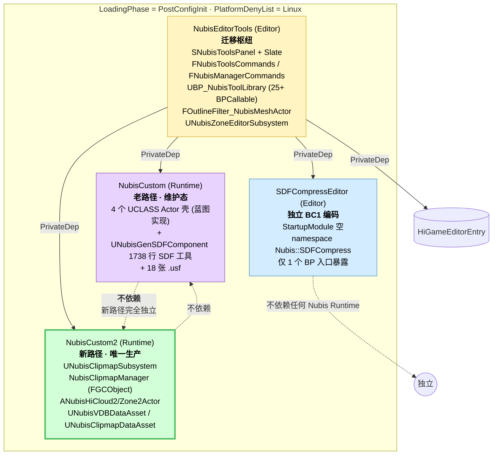
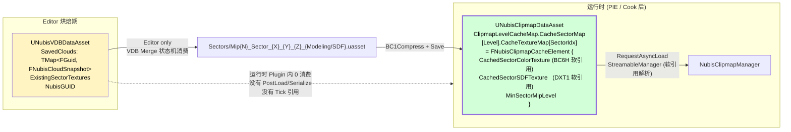

# NubisCustom 插件 — 新路径唯一生产; 老路径是蓝图遗骸 + 复用的 SDF 工具组件

HiGame NubisCloud 的"数据端"装在一个叫 `NubisCustom` 的插件里,但插件名是历史包袱。实际上,**这个插件由 4 个模块构成,新路径 (NubisCustom2) 是唯一活的生产管线;同名的老 NubisCustom 模块,除了一个 1738 行的 SDF 烘焙工具组件 (`UNubisGenSDFComponent`) 之外,几乎全部是 C++ 留壳 + 蓝图实现的实验遗骸**[^plugin-old][^plugin-new]。`NubisEditorTools` 是迁移枢纽,同时依赖老/新/SDFCompress/HiGameEditorEntry 4 个模块,承担"把老 Actor 迁到新 Actor"和整套烘焙工作流。`SDFCompressEditor` 完全独立,只提供一个 BC1 标量编码 namespace API,跟运行时 Nubis 业务零关系。本页拆解四模块的边界、UCLASS 清单、依赖关系,以及为什么"不要拿老 Actor 当模板"会成为 [第 12 页][p12] 的头号陷阱。

> **Phase 0 → Phase 1 主题修正**:本页的关键发现颠覆了 Phase 0 立的"老/新路径并存"假设。实际是"老路径 C++ 已死,只有 1 个 SDF 烘焙工具仍被复用",新路径 NubisCustom2 是唯一生产路径。这是本页要传达的最核心事实[^plugin-old]。

## 1. 4 模块拓扑一图说

`Projects/HiGame/Plugins/NubisCustom/NubisCustom.uplugin` 声明 4 个模块,全部 `LoadingPhase = PostConfigInit`,全部 `PlatformDenyList = ["Linux"]`,显式启用 2 个依赖插件:`Niagara` 与 `BlueprintMaterialTextureNodes`[^plugin-old]。

**只读图就能立刻发现的两件事**:

1. **NubisCustom2 不依赖 NubisCustom**——`NubisCustom2.Build.cs:25-52` 整段 `PublicDependencyModuleNames` / `PrivateDependencyModuleNames` 没有出现 `"NubisCustom"`[^plugin-new]。新路径是从零写的重写,老模块只是被一起编译而已。
2. **NubisEditorTools 是唯一的汇聚点**——它一次性 `PrivateDependencyModuleNames` 同时引入 `NubisCustom`、`NubisCustom2`、`SDFCompressEditor`、`HiGameEditorEntry` 四者,顺带 `+InteractiveToolsFramework / UnrealEd / Slate / UMG / SceneOutliner / LevelEditor / Blutility / AssetTools / EditorSubsystem / SourceControl` 一票编辑器基础[^plugin-old]。这种"全连接"形态决定了它是**整个 Nubis 编辑期工作流的枢纽**:迁移老 Actor、烘焙、Sector 切块、BC1 压缩、刷新 Clipmap 全在它的 Slate 面板里。

### 表 1 · 4 模块清单

| 模块 | Type | LoadingPhase | Platform | 主要内容 | 状态 |
|---|---|---|---|---|---|
| **NubisCustom** | Runtime | PostConfigInit | Linux deny | Actor 壳 (蓝图实现) + `UNubisGenSDFComponent` 1738 行 SDF 烘焙工具 + `UNubisCustomSubsystem` Editor 空转 + `UNubisDataAsset` 旧 TMap 格式 + 18 张 .usf | **维护态**(C++ 几乎死,只剩 SDF 工具仍被新路径间接复用)[^plugin-old] |
| **NubisCustom2** | Runtime | PostConfigInit | Linux deny | `UNubisClipmapSubsystem` + `NubisClipmapManager` (FGCObject) + `ANubisHiCloud2/Zone2Actor` + `UNubisVDBDataAsset` + `UNubisClipmapDataAsset` | **唯一生产路径**[^plugin-new] |
| **NubisEditorTools** | Editor | PostConfigInit | Linux deny | `SNubisToolsPanel` Slate(5254 行)+ 2 套 UICommand + 25+ BPCallable + Outliner 过滤器 + `UNubisZoneEditorSubsystem` | **生产**[^plugin-old] |
| **SDFCompressEditor** | Editor | PostConfigInit | Linux deny | StartupModule 空实现;namespace `Nubis::SDFCompress(::BC1Scalar)` 纯 C++ API,仅 1 个 BP 入口经 NubisEditorTools 暴露 | **生产**(独立)[^plugin-old] |

**为什么 4 个模块都 `PlatformDenyList = Linux`?** uplugin 内没注释,但根据 HiGame 工程事实可以串起来[^plugin-old]:

- `HiGameServer` 是 Linux DS,无渲染需求,体积云全套对它毫无意义;
- HiGame 项目本身的编辑器只跑 Win64(见根 `CLAUDE.md`);
- 4 个模块都强依赖 `Niagara` / `UHeterogeneousVolumeComponent` / BC1 编码 / Slate,这些 API 在 Linux DS 上要么没有意义要么维护成本极高。

**为什么 4 个模块都 `PostConfigInit`?** 这是 `Default` 之前的早期阶段,UE 文档里这是允许插件注册全局 Shader 源码目录 (`AddShaderSourceDirectoryMapping`) 的窗口[^plugin-old][推测]。但有意思的是 `NubisCustom.cpp:16-17` 与 `NubisEditorTools.cpp:25-27` 这两个 `AddShaderSourceDirectoryMapping` 调用都被注释掉了——只有 `NubisCustom2.cpp:12-18` 真正做了 `/Plugin/NubisCustom → <Plugin>/Shaders/` 的映射[^plugin-new]。**老模块的 PostConfigInit 已经没必要保留**(理论上降到 `Default` 不会影响现行逻辑,只是惯性没改)。

## 2. 老路径 NubisCustom — 别拿它当模板

### 2.1 `ANubisHiCloudActor` / `ANubisZoneActor` 是纯蓝图壳

> ⚠️ **重要警告**:`ANubisHiCloudActor` / `ANubisZoneActor` 的 C++ 部分**不实现 `INubisVolumeInterface`**、不挂 `UHeterogeneousVolumeComponent`、不参与 ghost-real。它们的全部"渲染逻辑"在蓝图里,通过 `BlueprintImplementableEvent` 钩出去。**不要拿这两个老 Actor 当模板写新代码** —— 你照着抄一份,运行时是死的,因为没有任何 Component 推 SceneProxy。详见 [第 12 页 · 陷阱清单][p12]。

证据[^plugin-old]:

- `NubisHiCloudActor.h` 虽然 `#include "Components/HeterogeneousVolumeComponent.h"`,但 `NubisHiCloudActor.cpp:1-42` 的构造函数里只设了 `PrimaryActorTick.bCanEverTick = true`,**没有 New / RegisterComponent / Attach 任何 Component**;
- 头文件只有 3 个 `BlueprintImplementableEvent`:`BP_GetVolumeName` / `BP_LoadAndAttachMesh` / `BP_CustomUpdate`;真正 Spawn `UHeterogeneousVolumeComponent` 与赋材质的逻辑都在蓝图子类(`/Game/.../BP_NubisHiCloudActor` 之类,需要内容目录确认)里;
- `NubisZoneActor.cpp` 更彻底,只有一个 `BP_CustomUpdate` BIE。

`UNubisCustomSubsystem` 是 `UTickableWorldSubsystem`,Tick 里在 `#if WITH_EDITOR` 区段 `TActorRange<ANubisHiCloudActor>` / `TActorRange<ANubisZoneActor>` 扫全世界对每个调 `BP_CustomUpdate()`(`NubisCustomSubsystem.cpp:32-72`)。注意:**Actor 自己的 Tick 里 `#if WITH_EDITOR` 段也会调一次同名 BIE**——也就是说编辑器里 `BP_CustomUpdate` 会被调用两次(一次由 Subsystem 扫描,一次由 Actor Tick),Shipping 完全不跑。这套 Tick 机制只为蓝图提供 hook,纯 Editor 工具向。

### 2.2 老路径唯一仍活的 C++ 类:`UNubisGenSDFComponent`

`UNubisGenSDFComponent` 是 `UPrimitiveComponent` 的子类,头文件 `NubisGenSDFComponent.h:11-131` + cpp 1738 行,在老模块里是**唯一有实质内容的 C++**[^plugin-old]:

- 注册了 10+ 个 `FGlobalShader`:`FInitializeCS` / `FSplatTriangleDistancesUnsignedCS` / `FSplatTriangleDistancesSignedCS` / `FFinalizeCS` / `FLinearFloodStepCS` / `FJumpFloodInitializeCS` / `FJumpFloodStepCS` / `FJumpFloodFinalizeCS` / `FGenNVDB2CS` 等;
- `/Plugin/NubisCustom/Private/` 下 18 张 .usf(`GenSDFInitialize.usf` / `GenSDFFinalize.usf` / `LinearFloodStep.usf` / `JumpFloodStep.usf` / `GenNVDB.usf` 等)被它驱动;
- 暴露 4 个 `CallInEditor` 函数:`GenerateSDF` / `GenerateSDF_CPU` / `GenerateNVDB` / `SaveSDF` / `DebugDrawNoiseType`;
- `FloodMode` `UENUM(BlueprintType)` `Linear=0 / Jump=1`,选 GPU jump-flood 还是 linear-flood;CPU 版走 `Implicit/SweepingMeshSDF.h` + `Spatial/MeshAABBTree3.h` 的几何处理库[^bake]。

**它今天是怎么"被新路径间接复用"的?** [推测] `UNubisGenSDFComponent` 不直接被 `NubisCustom2` 模块 grep 到,但 `NubisEditorTools` 在 `Build.cs` 里把 `NubisCustom` 写进 `PrivateDependencyModuleNames`,因此美术可以在编辑器里把它挂到任何 StaticMeshComponent Actor 上,把 Mesh 烘成 SDF VolumeTexture(`GenerateSDF` / `GenerateSDF_CPU`)或生成 NVDB(`GenerateNVDB`)写入 `UTextureRenderTargetVolume` / `UVolumeTexture`,产物**作为美术中间资产**回流给新路径 Houdini→VDB→Sector 烘焙链使用[^bake]。它**不直接参与运行时 Nubis 渲染管线**,是"烘焙前中间工具"。这种"老 C++ 类活下来作为工具"的形态是 4 模块拓扑里最微妙的部分,本页把它单列为表格中的"活,被新路径间接复用"。

### 表 2 · 老路径 NubisCustom 模块的 UCLASS 清单

| 类 | 父类 | 文件:行号 | 角色 | 是否仍活 |
|---|---|---|---|---|
| `FNubisCustomModule` | `IModuleInterface` | `NubisCustom.h:10` | 壳;StartupModule 里 `AddShaderSourceDirectoryMapping` **已注释掉**;`DEFINE_LOG_CATEGORY(LogNubis)` 仍在 | 活(只为 LogCategory)[^plugin-old] |
| `UNubisCustomSubsystem` | `UTickableWorldSubsystem` | `NubisCustomSubsystem.h:14` | Tick 里 `#if WITH_EDITOR` 扫全世界老 Actor 调 `BP_CustomUpdate` | **只在 Editor 活**,Shipping 空转[^plugin-old] |
| `ANubisHiCloudActor` | `AActor` | `NubisHiCloudActor.h:10` | 3 个 BIE;构造函数仅设 Tick 标志,无 Component | **纯蓝图壳**,C++ 不挂 HVC[^plugin-old] |
| `ANubisZoneActor` | `AActor` | `NubisZoneActor.h:10` | 1 个 `BP_CustomUpdate` BIE | **纯蓝图壳**[^plugin-old] |
| `UNubisGenSDFComponent` | `UPrimitiveComponent` | `NubisGenSDFComponent.h:19` | 1738 行;10+ FGlobalShader CS + CPU `SweepingMeshSDF`;4 个 `CallInEditor` 函数 | **活**,作为 SDF 烘焙工具被新路径间接复用[^plugin-old][^bake] |
| `FNubisCacheData` | `USTRUCT` | `NubisDataAsset.h:9` | 单条记录:GlobalScale/Rotation/Location + `USparseVolumeTexture* VDBFromHDA` (硬引用) + ActorUniqueID 字符串 + 20 个 Profile/Density/DetailType 参数 | **维护态**,被 `FNubisCloudSnapshot` 替代[^plugin-old][^bake] |
| `UNubisDataAsset` | `UPrimaryDataAsset` | `NubisDataAsset.h:68` | `TMap<FString, FNubisCacheData> CacheMap` + `int CacheVoxelSize=8` + `FVector VolumeSizeMeter=(4096,1024,4096)` + `SaveCache` / `LoadCache` / `HasValidateCache` 3 个 BPCallable | **维护态**,被 `UNubisVDBDataAsset` 替代[^plugin-old][^bake] |
| `FloodMode` | `UENUM(BlueprintType)` | `NubisGenSDFComponent.h:12` | `Linear=0 / Jump=1`,GenSDF 选模式 | 活[^plugin-old] |

### 2.3 老路径数据流的关键非事实

- 老路径**不存在 ghost-real / 不存在 Sector / 不存在 Clipmap 感知**——美术挂 Component 之后,SceneProxy 由引擎端 `UHeterogeneousVolumeComponent` 自己实现的 `CreateSceneProxy` 创建,然后才走 `INubisVolumeInterface`(详见 [第 2 页][p2] · 引擎端架构),与老 NubisCustom 的 4 个 UCLASS 没有直接关系;
- 老 `UNubisDataAsset` 的 `TMap<FString, ...>` 用 ActorUniqueID **字符串**做 key,这是新格式被改成 `TMap<FGuid, FNubisCloudSnapshot>` 的原因(GUID 比 FString 稳定,跨包/跨关卡 rename 不会失效)[^bake];
- 老 `FNubisCacheData::VDBFromHDA` 是 `TObjectPtr<USparseVolumeTexture>` **硬引用**,新格式改成 `TSoftObjectPtr<UStaticSparseVolumeTexture>` 软引用,与"运行时按需流式 Sector"的策略一致[^plugin-new]。

## 3. 新路径 NubisCustom2 — 唯一生产路径

详细的 GT↔RT 时序、6 级 Clipmap 调度、Sector 滚动等机制在 [第 3 页 · GT↔RT][p3] 和 [第 4 页 · Clipmap 6 级调度][p4] 展开。本节只给类清单 + 边界事实。

### 表 3 · 新路径 NubisCustom2 模块的 UCLASS / USTRUCT 清单

| 类 | 父类 | 文件:行号 | 角色 |
|---|---|---|---|
| `FNubisCustom2Module` | `IModuleInterface` | `NubisCustom2.h:10` | StartupModule 仅注册 shader 路径 `/Plugin/NubisCustom → Shaders/` (`NubisCustom2.cpp:12-18`)[^plugin-new] |
| `UNubisClipmapSubsystem` | `UTickableWorldSubsystem` | `NubisClipmapSubsystem.h:30` | World 级 Tick 入口,`IsTickableInEditor()=true` 编辑器关 PIE 也 Tick;持有 `TMap<ANubisZone2Actor*, TUniquePtr<NubisClipmapManager>>`[^plugin-new] |
| `NubisClipmap::NubisClipmapManager` | **`FGCObject` 普通 C++ 类(非 UCLASS)** | `NubisClipmap.h:81` | 单 Zone 的 Clipmap 状态机,**唯一拥有** Per-Level VolumeTexture / MID / LightingCacheRT;`AddReferencedObjects` 手动注册 `ClipmapMIDs` `CacheDataAsset`,VolumeTexture 用 `AddToRoot` 防 GC[^plugin-new] |
| `ANubisZone2Actor` | `AActor` | `NubisZone2Actor.h:14` | 关卡放置体;`DefaultSubobject` 持有 `UHeterogeneousUBSVolumeComponent`(引擎端 UCLASS)与 `UNubisClipmapDataAsset` 引用;`OnConstruction` 在编辑器 Unregister+Register Manager[^plugin-new] |
| `ANubisHiCloud2Actor` | `AActor` | `NubisHiCloud2Actor.h:22` | 离散云朵 Actor,持 `UStaticMeshComponent` 预览体 + `UMaterialInstanceDynamic`;`SetCanEverAffectNavigation=false`;BeginPlay 内为空,**运行时是死的**(只是预览资产)[^plugin-new] |
| `UNubisClipmapDataAsset` | `UPrimaryDataAsset` | `NubisClipmapDataAsset.h:58` | 烘焙产物索引;`FNubisClipmapLevelCache > FNubisClipmapSectorCache > FNubisClipmapCacheElement` 三层嵌套表 (`TMap`),叶子是 Modeling+SDF 软引用 + `MinSectorMipLevel`[^plugin-new] |
| `UNubisVDBDataAsset` | `UPrimaryDataAsset` | `NubisVDBDataAsset.h:189` | 烘焙输入快照;`TMap<FGuid, FNubisCloudSnapshot> SavedClouds` + `TMap<FSectorKey, TSoftObjectPtr<UVolumeTexture>> ExistingSectorTextures`;**运行时 Plugin 内零消费**(下一节展开)[^plugin-new][^bake] |
| `FNubisClipmapConfig` | POD | `NubisClipmap.h:39` | per-Zone 运行时 Clipmap 配置 |
| `NubisClipmap::NubisLevelInfo` | POD | `NubisClipmap.h:218` | 单 MIP Level 状态(VolumeTexture+SectorStates+ScrollOffset+ClipmapOrigin) |
| `NubisClipmap::NubisSectorState` | POD | `NubisClipmap.h:201` | 单 Sector 状态机(LoadHandle / LoadState / bHasCloud) |
| `FSectorKey` | `USTRUCT` | `NubisVDBDataAsset.h:9` | `(GridCoord, MipLevel)` 联合 key,带 `GetTypeHash` |
| `FNubisHoudiniParams` | `USTRUCT` | `NubisVDBDataAsset.h:34` | 16 个 Houdini 浮点(SDFOffset / DensityScale 等)[^bake] |
| `FNubisCloudSnapshot` | `USTRUCT` | `NubisVDBDataAsset.h:117` | 主体快照,见 [第 10 页 · 烘焙][p10] |
| `ECloudPresetType` | `UENUM uint8` | `NubisHiCloud2Actor.h:11` | 三档预设:`MeshAttached / PureVisual / Custom` |

### 3.1 关键事实:Plugin 直接 ENQUEUE_RENDER_COMMAND,不触 RDG

> Phase 0 假设"Plugin 完全走 Engine 转发,不直接接 RT"已被 Phase 1 推翻[^plugin-new]。

`NubisCustom2` 内 `ENQUEUE_RENDER_COMMAND` 的全部 4 处出现:

| 位置 | 用途 | RT 操作 |
|---|---|---|
| `NubisClipmap.cpp:1220` | `SetNubisVolumeTextureDebugName` | 仅打 RHI debug 名(截帧用) |
| `NubisClipmap.cpp:1344-1357` | `InitMipSelectorAtlas` | `RHIUpdateTexture3D` 全张填哨兵 `0x0E`,**唯一一处 atlas 批量上传** |
| `NubisClipmap.cpp:1689-1700` | `UpdateMipSelectorEntry` | `RHIUpdateTexture3D(1×1×1)`,sector 上线/下线时单字节增量更新 atlas |
| `NubisClipmap.cpp:2085-2100` | `CopyClipmapSectorTexture` | `RHICmdList.CopyTexture`,sector RT(BC6H/DXT1)→ Clipmap VolumeTexture 环形位置 |

**关键边界**:Plugin 不直接构造 RDG Builder、不直接 `SHADER_PARAMETER_STRUCT`,**RDG Pass 全部在 Engine 端 `NubisVolumesLiveShadingPipeline.cpp`**(详见 [第 5 页 · RDG Pass 全图][p5])[^arch]。Plugin 通过 `UHeterogeneousUBSVolumeComponent::Set*` 系列把 `UVolumeTexture::Resource->TextureRHI` 推到 SceneProxy 的 `FNubisVolumeData::*RHI` 字段;RDG 端再从 Engine 端的 `MeshBatch.UserData` 强转拿到 `INubisVolumeInterface*`。

**Engine ↔ Plugin 契约面 8 个 Component 方法/字段**[^arch]:

| Component 接口 | 调用方向 | Plugin 端调用点 |
|---|---|---|
| `UHeterogeneousUBSVolumeComponent::SetClipmapData(MipCount, ClipmapConfigs, ClipmapMIDs)` | Plugin → Engine | `NubisClipmap.cpp:711, 2745` |
| `SetMipSelectorVolume(UVolumeTexture*)` | Plugin → Engine | `:2744` |
| `SetPerLevelLightingCacheRTs(TArray<UTextureRenderTargetVolume*>)` | Plugin → Engine | `:2703` |
| `SyncClipmapScrollToProxy_RenderThread(...)` | Plugin → Engine | `:720` (当帧把新 ScrollUVOffset 即时推 SceneProxy,避免下一帧重建期间 UV 错位) |
| `MarkRenderStateDirty()` | Plugin → Engine | `:201, :712` (SceneProxy 重建触发) |
| `FlushRenderingCommands()` | Plugin → Engine | `:207` (Shutdown 期间等渲染线程把旧 SceneProxy 处理完再 ReleaseVolumeTextures) |
| `UTexture::UpdateResource()` | Plugin → Engine | `:1211, :1326, :2399` (per-Mip Clipmap VolumeTexture 初始 GPU / atlas 创建后初始 GPU / BC6H mip strip 后重建) |
| `INubisVolumeInterface*` from `MeshBatch.UserData` | Engine 内部消费 | RT 端 `NubisVolumes.cpp:1219` |

`BeginInitResource` 在 Plugin 内**0 命中**,即 Plugin 不自定义 `FRenderResource`,所有 GPU 资源都是标准 `UVolumeTexture`/`UTextureRenderTargetVolume`,生命周期由 Engine `UTexture::UpdateResource` 接管[^plugin-new]。

### 3.2 关键事实:`UNubisVDBDataAsset` 运行时零消费

新路径有 2 个 DataAsset,但只有一个真正参与运行时:

证据[^plugin-new][^bake]:

- `NubisVDBDataAsset.cpp` 全文一行 `#include`,**没有 PostLoad / Serialize 自定义**;
- `Reset()` 是 `UNubisVDBDataAsset` **唯一的成员函数**,由 Editor 烘焙工具调用清空 `SavedClouds`;
- 运行时 GPU 上传链**完全不走 VDBDataAsset**;走的是 `UNubisClipmapDataAsset.ClipmapLevelCacheMap.CacheSectorMap[Level].CacheTextureMap[SectorIdx].CachedSectorColorTexture`(已经是烘焙后压成 BC6H/DXT1 的 `TSoftObjectPtr<UVolumeTexture>`);
- `Niagara*` 模块在 `NubisCustom2.Build.cs` 里是 `PrivateDependencyModuleNames`,但运行时 grep `Niagara` API **0 命中**——[推测] 仅烘焙阶段使用[^plugin-new]。

**这意味着什么?**

1. B4 的"运行时 Sector 加载时机"答案:`Subsystem::Tick → Manager::Update → EnqueueLoadRequest → ProcessPendingLoads → StreamableManager.RequestAsyncLoad`,**完全 lazy**,只对当前 Clipmap 窗口内的 sector 做异步流式,**不存在 BeginPlay 全加载**。
2. Cook 阶段 `UNubisVDBDataAsset` **理论上不需要随 Cook 打包**(它只是 Editor 中间产物),但 [推测] 实际是否被 Cook 出去取决于关卡里是否有引用——一般通过 `NubisVDBCache_Config` 命名约定放在 `EditorOnly/` 风格目录里规避,或在 `DefaultEditor.ini` 里明示排除 cook[^bake]。

### 3.3 多 Zone 不合并 Atlas

`UNubisClipmapSubsystem` 持有 `TMap<ANubisZone2Actor*, TUniquePtr<NubisClipmapManager>>`,**每个 Zone 一份 6 级 Clipmap + MID + LightingCacheRT**(NubisClipmapSubsystem.cpp:139-197 `RegisterZone`)[^plugin-new]:

- 没有跨 Zone 合并 atlas 的代码路径;`Initialize()` 直接为 `(Type=2) × (MipCount=6) = 12 张 VolumeTexture` 走 `CreateTransient`;
- `UHeterogeneousUBSVolumeComponent` 也是 per-Zone 子组件,引擎端 SceneProxy 与 Component 1:1;
- 渲染端 `RenderNubisVolumes` 调度循环按 Scene 内所有 NubisVolumeProxy 各自一遍 RDG passes(详见 [第 5 页][p5])。

**[开放问题]**:如果两个 Zone 的 BoundingBox 物理重叠,运行时会出现 `6+6=12` 级独立 Clipmap 各自 raymarch,RT 端是否合成或先后覆盖,需查 [第 5 页][p5] 的 `RenderNubisVolumes` 调度细节[^plugin-new]。

## 4. NubisEditorTools — 迁移枢纽 + 烘焙总线

### 4.1 模块入口 `FNubisEditorToolsModule`

`NubisEditorTools.cpp:22-115` 的 StartupModule 做三件事[^plugin-old]:

1. **注册 2 套 UICommand**:`FNubisManagerCommands::Register()` + `FNubisToolsCommands::Register()` (`ToolsCommands.cpp:7-10` / `ManagerCommands.cpp:16-19`);
2. **注册 Slate Tab**:`FGlobalTabmanager::Get()->RegisterNomadTabSpawner("NubisToolsPanel", ...)`,Tab 里塞一个 `SNew(SNubisToolsPanel)`;
3. **延迟注入(`OnAllModuleLoadingPhasesComplete` 回调)**:
   - 通过 `FHiGameEditorEntryModule::AddMenuCommand` 把 `OpenNubisToolsPanel` 与 `OpenNubisManager` 两个按钮注入 HiGame 自己的菜单;
   - `FLevelEditorModule::AddCustomFilterToOutliner` 注册 `FOutlineFilter_NubisMeshActor` 到 HiGame 分类。

**两条入口共存**[^plugin-old]:

- `NubisManagerButtonClicked` 会 `LoadObject<UWidgetBlueprint>(/Game/EditorOnly/NubisTools/WBP_NubisEditorUtility)` 然后 `UEditorUtilitySubsystem::SpawnAndRegisterTab` 起一个 EUW(老 Nubis Manager,UMG 工具);
- `NubisToolsButtonClicked` 起 Slate 原生 `SNubisToolsPanel`(新工具,5254 行 cpp)。

老 EUW 仍保留在 `/Game/EditorOnly/NubisTools/WBP_NubisEditorUtility.uasset`(1.3 MB),美术习惯使然[^bake]。

### 4.2 `FOutlineFilter_NubisMeshActor`

Scene Outliner 的红色图标过滤器,**同时**通过 `IsA<...>()` 的 4-OR 过滤 `ANubisHiCloudActor` / `ANubisZoneActor` / `ANubisHiCloud2Actor` / `ANubisZone2Actor`(`NubisActorFilter.cpp:22-37`)[^plugin-old]。

> **暗示**:既然过滤器仍同时认 4 种 Actor,迁移按钮也仍在,**项目里还有未迁移完的老 Actor 存在**[^plugin-old]。

### 4.3 `UNubisZoneEditorSubsystem`

Editor Subsystem,`Initialize` 里 `FTSTicker::GetCoreTicker().AddTicker(...)` 注册每帧 Tick;Tick 里 `GEditor->GetEditorWorldContext().World()`,`TActorIterator<ANubisZone2Actor>` 扫**新路径** Zone,调它们的 `EditorTick(DeltaTime)`(`NubisZoneEditorSubsystem.cpp:9-85`)[^plugin-old]。

> **关键**:`FindAllNubisZoneActors` 的 Iterator 模板参数固定为 `ANubisZone2Actor*`(`:66-83`),**老路径 `ANubisZoneActor` 不参与 Editor Tick**——这是"新路径才是生产路径"的又一硬证据。

### 4.4 `SNubisToolsPanel` 按钮 → 函数 → 流程

### 表 4 · Slate 面板按钮清单(按 `SNubisToolsPanel.cpp:164-405` 出现顺序)

| 按钮 | 回调函数 | 触发流程 |
|---|---|---|
| ⚠️ 迁移旧 Actor 到新 Actor | `OnMigrateOldActorToNew` (cpp:505-625) | `TActorIterator<ANubisHiCloudActor>` 扫老 Actor,对每个 `SpawnActor<ANubisHiCloud2Actor>`,同名同 Transform,复制匹配字段,删除旧;`GEditor->BeginTransaction` 包事务;**单向迁移** |
| 添加或替换 NubisZone | `OnAddOrCreateNubisZone` | 检测当前 Level → 删老 → 加新 `ANubisZone2Actor`,确保**有且仅有一个** |
| 显示 NubisZone 边界框 | `OnToggleDebugBoundingBox` | 切 `ANubisZone2Actor.DebugBoundingBox` |
| 冻结 Clipmap 原点 | `OnToggleFreezeClipmap` | 固定 Clipmap 中心,用于调试相机跟随脏判定 |
| 添加 HiCloud | `OnAddHiCloud` | `SpawnActor<ANubisHiCloud2Actor>` |
| 选中新创建的 HiCloud | `OnSelectLastHiCloud` | 恢复上一步 SpawnActor 的选择状态 |
| 显示 / 隐藏 HiCloudMesh | `OnShowHiCloudMesh` / `OnHideHiCloudMesh` | 切 Actor 内部 `UStaticMeshComponent` 可见性 |
| 显示 / 隐藏 Nubis 云 | `OnShowNubisCloud` / `OnHideNubisCloud` | 切 `UHeterogeneousUBSVolumeComponent` 可见性 |
| 启用 / 禁用 / 切换 HiCloud 碰撞 | `OnEnableHiCloudCollision` / `OnDisableHiCloudCollision` / `OnToggleHiCloudCollision` | 3 个按钮操作碰撞 |
| **烘焙 HiCloud** | `OnBakeHiCloud` | 驱动 BakeQueue + Omniverse 蓝图串行烘焙;Spawn `BP_NubisTOmniversePythonActor` → 收集 Snapshot → Houdini 串行,详见 [第 10 页][p10] 阶段一 |
| 停止烘焙 | `OnStopBakeClicked` | 保存已有产物并退出状态机 |
| VDB Merge | `StartAsyncVDBMerge` | 状态机逐 Sector GPU Compute(`RouteSectorMip → InitMip → InitSector → MergingSectorVDB → WaitForStreaming → SaveSector → CleanupMip → Finalize`),详见 [第 10 页][p10] 阶段二 |
| 生成 Mipmap(Modeling Average / SDF Min)| `OnGenerateMipmaps` | 对已存在的 Mip Modeling/SDF VolumeTexture 重新生成 mipmap 链 |
| 🔄 刷新 Clipmap | `OnRefreshClipmap` / `RefreshClipmapForZone` | 对 `UNubisClipmapSubsystem` 做 Unregister+Register,强制 `NubisClipmapManager` 重建 Sector 软引用 |

面板底部还有一个 **"📋 输出日志"** `SListView` + 清空按钮,所有按钮回调都会 `AddLog()` 到这里[^plugin-old]。

### 4.5 `UBP_NubisToolLibrary` BlueprintCallable 清单(25+ 个)

按功能分组(`BP_NubisToolLibrary.h:113-402`)[^plugin-old][^bake]:

| 分类 | 函数 | 用途 |
|---|---|---|
| NubisHoudini | `CalcMeshWorldBounds` | 遍历 LOD0 顶点在世界空间算精确 Bounds |
| NubisHoudini | `ForceReconstructActor` | `InActor->RerunConstructionScripts()` |
| SourceControl | `PrepareAssetForSave` / `PrepareAssetByPath` / `PrepareAssetByAbsFilePath` | P4 Checkout / MarkForAdd / MakeWritable 兜底 |
| SourceControl | `IsAssetCheckedOut` / `IsAssetCheckedOutByOther` / `AddAssetToChangelist` / `MakeAssetWritable` | 细粒度 P4 状态查询 |
| Editor UI | `ShowEditorNotification` | `FNotificationManager` 通知 |
| Editor UI | `GetOrCreateVDBCacheConfig` | 加载/创建 `UNubisDataAsset` 配置(传入的是**老** `UNubisDataAsset`) |
| Editor UI | `GetHiCloudVDBPath` | 给**老** `ANubisHiCloudActor` 算 VDB 存路径(DisplayName+GUID);`GetHiCloud2VDBPath` 已被注释掉[推测]说明 VDB 路径统一由 `FNubisCloudSnapshot.VDBPath` 管 |
| NubisTools | `CreateVolumeTextureFromTextureArray` | 把一堆 `UTexture2D` 合成一张 `UVolumeTexture` |
| NubisTools | `GenerateNubisModelingData` / `GenerateNubisModelingDataFromMesh` | 用 MergeVDB 的 CS 把多个 SVT 合成 Modeling+SDF VolumeTexture(GenSDFSplatTriangleDistances.usf) |
| NubisTools | `GetCurrentWorldSaveDirectory` | 当前关卡所在内容目录 |
| NubisTools | `GenerateNubisClipmap` | 从 Actor+DataAsset 生成 Clipmap 数据 |
| NubisTools | `SetPropertiesForOmniverse` / `SetPropertySetFloatValue` / `GetPropertySetFromActor` / `GetPropertySetFromActorWithName` / `GetOmniverseBridgeFromActor` | 与 Omniverse+Houdini 蓝图 Actor 对话设参([第 10 页][p10] 阶段一入口) |
| CloudFixer | `GenerateClipmapFromVDB` | 从 `UNubisVDBDataAsset` 生成 `UNubisClipmapDataAsset` |
| NubisTools \| SDFCompress | `SaveRenderTargetSubRegionToBC1VolumeTexture` | **唯一真正暴露给 BP 的 BC1 压缩入口**,内部调 SDFCompressEditor 的 `CompressR16VolumeToBC1`(详见 [第 10 页][p10]) |
| NubisTools \| ThicknessMip | `ComputeRecommendedMipForVDB` / `ComputeAndCacheSectorMipForDataAsset` | 按 SDF 最小值推导 VDB 该烘到哪一档 Sector Mip,写回 `FNubisCloudSnapshot::SectorMipLevel` |

### 表 5 · `FNubisToolsCommands` / `FNubisManagerCommands` 注册

| UICommand | Context | DisplayName | 注入位置 |
|---|---|---|---|
| `OpenNubisToolsPanel` | `"NubisTools"` | `"Nubis Tools"` | `HiGameEditorEntry` 菜单(`NubisEditorTools.cpp:77-82`),起 Slate `SNubisToolsPanel` |
| `OpenNubisManager` | `"NubisManager"` | `"NubisManager"` | `HiGameEditorEntry` 菜单(`NubisEditorTools.cpp:69-74`),起 EUW `WBP_NubisEditorUtility` |

## 5. SDFCompressEditor — 完全独立的 BC1 标量编码器

依赖面 (`SDFCompressEditor.Build.cs:27-73`)[^plugin-old]:

- **Public**:`Core` / `CoreUObject` / `Engine` / `RHI` / **`RenderCore`**
- **Private**:`Projects` / `Slate` / `SlateCore` / `InputCore`
- **Editor only**:`UnrealEd` / `AssetTools` / `EditorSubsystem` / `EditorFramework` / `EditorStyle` / `ToolMenus` / `ContentBrowser` / `ContentBrowserData` / **`ImageWrapper`**
- **不依赖** `NubisCustom` / `NubisCustom2` —— **压缩算法完全脱离 Nubis 业务**,只关心 16bit 标量 → BC1 编码,理论上换个项目就能直接复用。

### 5.1 暴露形态

`SDFCompressEditorModule.cpp:7-19` 的 StartupModule / ShutdownModule **空实现**,仅在 cpp 顶端注释里写 `Editor-only module. Owns the BC1 scalar encoder… no Runtime module… output is a standard UVolumeTexture with pixel format PF_DXT1`[^plugin-old]。

它**不注册任何 Slate UI / ToolMenu / Factory**,也没有 UObject / BlueprintCallable —— 整套 API 是**纯 C++ namespace**,只能从依赖它的其它 Editor 模块(当前即 `NubisEditorTools`)里调用[^plugin-old]:

| Public 头文件 | 内容要点 |
|---|---|
| `SDFCompressEditorModule.h` | 普通 `IModuleInterface`,空实现 |
| `BC1ScalarEncoder.h` | namespace `Nubis::SDFCompress::BC1Scalar`,对外 `SDFCOMPRESSEDITOR_API` 4 个函数:`GetDefaultUnpackDot()` / `BuildBlock(16 floats, UnpackDot) → uint64` / `BuildTexture2D` / `BuildTexture3D`;Horizon Forbidden West 最优 dot 常量 = `(0.96414679, 0.03518212, 0.00067109)`,强序 R>G>B[^bake] |
| `BC1ScalarSDFCompressor.h` | namespace `Nubis::SDFCompress`,对外:`FSDFCompressOptions` (SourceMin/Max / bAutoDetectRange / UnpackDot / bParallel / bClampOutOfRange) + `FSDFCompressResult` + `CompressR16TextureToBC1(UTexture2D*)` / `CompressR16VolumeToBC1(UVolumeTexture*)` + 底层 `CreateBC1ScalarTexture2D` / `CreateBC1ScalarVolumeTexture` (Block Array → UTexture) |

唯一暴露给 BP 的入口是 `UBP_NubisToolLibrary::SaveRenderTargetSubRegionToBC1VolumeTexture` (`BP_NubisToolLibrary.h:269-282`),它拼好参数后调 `CompressR16VolumeToBC1`[^plugin-old]。

### 5.2 算法摘要

详见 [第 10 页 · 烘焙][p10],这里只列约束:

- 16-bit scalar → BC1(DXT1)编码,采样时用 `dot(RGB, float3(0.96414679, 0.03518212, 0.00067109))` 解码;
- **保证 GPU 采样值 ≤ 源值**(undershoot constraint)→ raymarch 不会穿透 SDF 表面;
- 最大误差 ~`2e-5`(~`1/50000`);
- 支持源格式 `PF_R16F` / `PF_G16` / `PF_FloatRGBA` / `PF_R32_FLOAT`;
- 输出类型 `UBC1ScalarVolumeTexture`(引擎级自定义 `UVolumeTexture` 子类,Override `Serialize` / `PostLoad` / `UpdateResource`,**阻止 UE 重压缩**)[^bake]。

## 6. 老→新迁移证据汇总

`NubisEditorTools` 的"迁移旧 Actor 到新 Actor"按钮(`SNubisToolsPanel.cpp:505-625`)显式 `SpawnActor<ANubisHiCloud2Actor>` 并拷贝匹配属性,这是从工具层把老资产转成新资产的官方路径[^plugin-old]。其它能反映"项目正在从老到新迁移"的代码痕迹:

| 痕迹 | 位置 | 解读 |
|---|---|---|
| `UNubisZoneEditorSubsystem::FindAllNubisZoneActors` 模板锁定为 `ANubisZone2Actor*` | `NubisZoneEditorSubsystem.cpp:66-83` | 老 `ANubisZoneActor` 没有 Editor Tick,即不再投资[^plugin-old] |
| `FOutlineFilter_NubisMeshActor` 同时认 4 种 Actor | `NubisActorFilter.cpp:22-37` | 项目内仍有未迁完的老 Actor[^plugin-old] |
| `UBP_NubisToolLibrary::GetHiCloud2VDBPath` 整段被注释掉 | `BP_NubisToolLibrary.cpp:1048-1060` | 只留老 `GetHiCloudVDBPath`;[推测] 说明 VDB 路径统一交给新 `FNubisCloudSnapshot.VDBPath` 字段管理,老函数留着向后兼容仍调它的蓝图[^plugin-old] |
| `UBP_NubisToolLibrary::AutoMigrateAllMatchingProperties` 整段被注释掉 | `BP_NubisToolLibrary.cpp:2791-…` | 逻辑被内联进 `SNubisToolsPanel::OnMigrateOldActorToNew`[^plugin-old] |

## 7. 关键事实汇总(本页核心 4 条)

为了让读这一页的工程师把 18 条已知事实里**与本页强相关的 4 条**记牢:

> 18 条全员事实见 [第 1 页 · 总览][p1],下方 4 条是本页核心。

| 事实 # | 内容 | 本页章节 |
|---|---|---|
| 10 | **NubisCustom2 是唯一生产路径** | §1, §3 |
| 11 | **4 模块全 `PlatformDenyList = Linux`** | §1 |
| 12 | **`UNubisVDBDataAsset` 运行时 Plugin 内零消费** | §3.2 |
| 13 | **Plugin 直接 `ENQUEUE_RENDER_COMMAND`,不触 RDG**(共 4 处) | §3.1 |

本页未展开的其它已知事实(已在其它页详述):

- `HIGAME_ENABLE_NUBIS` 在 `Build.h:1152` 硬编码 = 1(详见 [第 2 页][p2])[^arch]
- Shader 共 15 个文件 / Sparse Voxel cvar 全是空壳 / HardwareRayTracing 未接通 / Visualize 模式 5 个 / Two-Pass: LCache 4→0, Scattering 0→5 / MipRingCrossoverCm 500cm / LightingCache EMA β=0.97 / Bilateral 4 mode + Far under Near(详见 [第 4][p4][第 5][p5][第 6][p6][第 7][p7][第 8 页][p8])[^arch]
- 多 Zone 不合并 Atlas / Sector 按需流式(本页 §3.3)
- VolumetricFog → NubisVolumes → VolumetricCloud 共存 / SM5+Deferred only(详见 [第 2 页][p2] / [第 12 页][p12])[^arch]
- `NubisDefaults`: `MipCount=6, BaseVoxelSize=1m, TextureSize=512×512×128, SectorSize=256×256×64, SectorWidth=2×2×2`(详见 [第 4 页][p4])[^arch][^bake]

## 8. 开放问题

1. **老 `ANubisHiCloudActor` 今天还在场景里吗?**`FOutlineFilter_NubisMeshActor` 同时过滤 4 个类、迁移按钮仍在,提示至少还有历史场景未迁。需要在 P4 里搜 `Content/**/*.umap` / `External*`,确认实际数量。无法靠本次考古得出数字[^plugin-old]。
2. **`UNubisGenSDFComponent` 被新路径**直接** grep 引用吗?**`NubisEditorTools.Build.cs` 把 `NubisCustom` 写进 `PrivateDep`,但 grep 老模块内 `UNubisGenSDFComponent` 的外部引用只在**老模块自己的 cpp** 里。`UBP_NubisToolLibrary` 里 `GenerateNubisModelingDataFromMesh` 是重新注册的 FGlobalShader(`MergeMeshModelDatas.usf`)+ 自己的 CS,**不走 `UNubisGenSDFComponent`**[^plugin-old]。→ [推测] 它仍保留给美术在蓝图里单独用(e.g. "给任意 StaticMesh 生成一张 SDF VolumeTexture"),但**不属于 Nubis 运行时渲染栈的任何一部分**。
3. **`PlatformDenyList=Linux` 是否误伤 Linux Editor?**HiGame 不官方支持 Linux Editor,但 UE5 原生支持;若将来接 Linux Editor,这 4 个模块会全部缺失[^plugin-old]。
4. **`LoadingPhase=PostConfigInit` 必要吗?**当前 StartupModule 里的 `AddShaderSourceDirectoryMapping` 在老模块中**全部被注释掉**(`NubisCustom.cpp:16-17` 与 `NubisEditorTools.cpp:25-27`),真正的 shader 路径映射在 `NubisCustom2.cpp:12-18`。理论上老模块降到 `Default` 不会影响当前逻辑,只是惯性没改[^plugin-old]。
5. **`PerLevelLightingCacheRTs` 双缓冲在哪一端?**`NubisClipmap.cpp:2685-2697` 创建是单张 `UTextureRenderTargetVolume`,但 [第 7 页 · LightingCache][p7] 提到 Engine 端 `FNubisRenderTargetViewStateData` 双缓冲。两者是同一份还是 Plugin 端 RT 给 Engine 端复制成双缓冲?[推测] 后者[^plugin-new]。
6. **`Niagara` 模块在新路径 Build.cs 的依赖**:运行时 grep 0 命中 Niagara API。**可能仅烘焙阶段使用**[^plugin-new][^bake]。
7. **`ANubisHiCloud2Actor.bUseCollision/bShowMesh` 的运行时意义**:这些字段在烘焙阶段决定 mesh 行为,运行时 `BeginPlay()` 内为空(`NubisHiCloud2Actor.cpp:57-60`),也就是说 **HiCloud Actor 在运行时是死的**——只有 `PreviewCloudStaticMesh` 还在场景里(可能影响碰撞/导航)。是否应该在 Shipping 中剔除?需查 [第 10 页][p10] 烘焙后是否 spawn HiCloud Actor 到正式关卡[^plugin-new]。

## 9. 交叉引用速查

| 你想知道 | 去哪一页 |
|---|---|
| 详细 GT↔RT 时序、SceneProxy 构造与 `FNubisVolumeData` | [第 3 页 · GT↔RT][p3] |
| 6 级 Clipmap 滚动 / Z 各向异性死区 / Mip Ring Crossover | [第 4 页 · Clipmap 6 级调度][p4] |
| Live Shading Pipeline 11 个 RDG Pass | [第 5 页 · RDG Pass 全图][p5] |
| Sparse Voxel Bottom + Indirection 两级 | [第 6 页 · Sparse Voxel][p6] |
| LightingCache EMA β=0.97 / Transmittance Volume / Scroll UV | [第 7 页 · LightingCache][p7] |
| Temporal + Bilateral Upscale + Near Dominance | [第 8 页 · Temporal 与 Upscale][p8] |
| Houdini → VDB → SDFCompress → DataAsset → Cook 全链 | [第 10 页 · 烘焙][p10] |
| 关卡放置 Cookbook 8 步 | [第 11 页 · 关卡放置][p11] |
| **不要拿老 Actor 当模板** + 平台差异 + 性能陷阱 | [第 12 页 · 陷阱清单][p12] |

## 10. 一页式心智模型

如果你只能记住一段话:

> **NubisCustom 插件下 4 个模块。新路径 `NubisCustom2` 是唯一活的生产路径,它有自己的 `UNubisClipmapSubsystem` + `NubisClipmapManager` (FGCObject) + `ANubisHiCloud2/Zone2Actor` + 两个 DataAsset,Plugin 直接 `ENQUEUE_RENDER_COMMAND`(4 处)管 GPU 资源,通过 `UHeterogeneousUBSVolumeComponent::Set*` 8 个方法把句柄推到 Engine 端 SceneProxy,RDG Pass 全在 Engine。老模块 `NubisCustom` 几乎全是蓝图遗骸:Actor 是壳、Subsystem Editor 空转、DataAsset 旧 TMap 格式被替代,只有 `UNubisGenSDFComponent` 这个 1738 行 SDF 烘焙工具仍被新路径间接复用。`NubisEditorTools` 是迁移枢纽,同时依赖老/新/SDFCompress/HiGameEditorEntry,提供 Slate 面板烘焙工作流和"迁移老 Actor"按钮。`SDFCompressEditor` 完全独立,只暴露 namespace API + 1 个 BP 入口,跟 Nubis 运行时业务零关系。4 模块全 `PlatformDenyList=Linux`。**

---

[^plugin-old]: `Plugins/NubisCustom/NubisCustom.uplugin:17-49`、`Plugins/NubisCustom/Source/NubisCustom/NubisCustom.Build.cs:25-52`、`Plugins/NubisCustom/Source/NubisCustom/Public/NubisCustom.h:10-18`、`Plugins/NubisCustom/Source/NubisCustom/Public/NubisCustomSubsystem.h:13-36`、`Plugins/NubisCustom/Source/NubisCustom/Private/NubisCustomSubsystem.cpp:32-72`、`Plugins/NubisCustom/Source/NubisCustom/Public/NubisHiCloudActor.h:9-41`、`Plugins/NubisCustom/Source/NubisCustom/Private/NubisHiCloudActor.cpp:1-42`、`Plugins/NubisCustom/Source/NubisCustom/Public/NubisZoneActor.h:9-31`、`Plugins/NubisCustom/Source/NubisCustom/Public/NubisGenSDFComponent.h:11-131`、`Plugins/NubisCustom/Source/NubisCustom/Public/NubisDataAsset.h:8-114`、`Plugins/NubisCustom/Source/NubisEditorTools/NubisEditorTools.Build.cs:27-94`、`Plugins/NubisCustom/Source/NubisEditorTools/Private/NubisEditorTools.cpp:17-115`、`Plugins/NubisCustom/Source/NubisEditorTools/Private/NubisToolsCommands.cpp:7-10`、`Plugins/NubisCustom/Source/NubisEditorTools/Private/NubisManagerCommands.cpp:9-19`、`Plugins/NubisCustom/Source/NubisEditorTools/Private/NubisActorFilter.cpp:22-37`、`Plugins/NubisCustom/Source/NubisEditorTools/Private/NubisZoneEditorSubsystem.cpp:9-85`、`Plugins/NubisCustom/Source/NubisEditorTools/Public/SNubisToolsPanel.h:23-540`、`Plugins/NubisCustom/Source/NubisEditorTools/Private/SNubisToolsPanel.cpp:164-625`、`Plugins/NubisCustom/Source/NubisEditorTools/Public/BP_NubisToolLibrary.h:113-402`、`Plugins/NubisCustom/Source/SDFCompressEditor/SDFCompressEditor.Build.cs:27-73`、`Plugins/NubisCustom/Source/SDFCompressEditor/Public/BC1ScalarEncoder.h:24-87`、`Plugins/NubisCustom/Source/SDFCompressEditor/Public/BC1ScalarSDFCompressor.h:11-134`、`Plugins/NubisCustom/Source/SDFCompressEditor/Private/SDFCompressEditorModule.cpp:7-19`(详见 raw#6 `higame-nubis-plugin-nubiscustom.md`)。

[^plugin-new]: `Plugins/NubisCustom/Source/NubisCustom2/NubisCustom2.Build.cs:1-71`、`Plugins/NubisCustom/Source/NubisCustom2/Public/NubisCustom2.h:1-19`、`Plugins/NubisCustom/Source/NubisCustom2/Private/NubisCustom2.cpp:1-26`、`Plugins/NubisCustom/Source/NubisCustom2/Public/NubisClipmap.h:1-398`、`Plugins/NubisCustom/Source/NubisCustom2/Private/NubisClipmap.cpp:1-3122`、`Plugins/NubisCustom/Source/NubisCustom2/Public/NubisClipmapSubsystem.h:1-99`、`Plugins/NubisCustom/Source/NubisCustom2/Private/NubisClipmapSubsystem.cpp:1-358`、`Plugins/NubisCustom/Source/NubisCustom2/Public/NubisClipmapDataAsset.h:1-82`、`Plugins/NubisCustom/Source/NubisCustom2/Public/NubisHiCloud2Actor.h:1-127`、`Plugins/NubisCustom/Source/NubisCustom2/Private/NubisHiCloud2Actor.cpp:1-181`、`Plugins/NubisCustom/Source/NubisCustom2/Public/NubisZone2Actor.h:1-217`、`Plugins/NubisCustom/Source/NubisCustom2/Private/NubisZone2Actor.cpp:1-340`、`Plugins/NubisCustom/Source/NubisCustom2/Public/NubisVDBDataAsset.h:1-205`(详见 raw#7 `higame-nubis-plugin-nubiscustom2.md`)。

[^arch]: `Engine/Source/Runtime/Core/Public/Misc/Build.h:1152-1154`、`Engine/Source/Runtime/Engine/Public/NubisVolumeInterface.h:1-438`、`Engine/Source/Runtime/Engine/Classes/Components/NubisVolumeComponent.h:1-172`、`Engine/Source/Runtime/Engine/Private/Components/NubisVolumeComponent.cpp:1-730`、`Engine/Source/Runtime/Renderer/Private/NubisVolumes/NubisVolumes.cpp:1-1418`、`Engine/Source/Runtime/Renderer/Private/NubisVolumes/NubisVolumesLiveShadingPipeline.cpp`、`Engine/Source/Runtime/Renderer/Private/DeferredShadingRenderer.cpp:3160-3179, 3648-3653`(详见 raw#3 `higame-nubis-engine-arch.md`)。

[^bake]: `Plugins/NubisCustom/Source/NubisEditorTools/Public/SNubisToolsPanel.h`、`Plugins/NubisCustom/Source/NubisEditorTools/Private/SNubisToolsPanel.cpp`、`Plugins/NubisCustom/Source/NubisEditorTools/Public/BP_NubisToolLibrary.h`、`Plugins/NubisCustom/Source/NubisCustom2/Public/NubisVDBDataAsset.h`、`Plugins/NubisCustom/Source/NubisCustom2/Public/NubisClipmapDataAsset.h`、`Plugins/NubisCustom/Source/SDFCompressEditor/Public/BC1ScalarSDFCompressor.h`、`Plugins/NubisCustom/Source/SDFCompressEditor/Private/BC1ScalarSDFCompressor.cpp`、`Plugins/NubisCustom/Source/SDFCompressEditor/Public/BC1ScalarEncoder.h`、`Plugins/NubisCustom/Source/NubisCustom/Public/NubisGenSDFComponent.h`、`Plugins/UnrealOmniverse/Source/TOmniversePythonActor/Public/`、`Engine/Source/Runtime/Engine/Classes/Engine/BC1ScalarVolumeTexture.h`(详见 raw#8 `higame-nubis-bake-pipeline.md`)。

[p1]: ./1.%20总览%20—%204%20处分散位置与跨模块%20API.md "第 1 页 · 总览"
[p2]: ./2.%20引擎端架构%20—%20HIGAME_ENABLE_NUBIS%20与%20INubisVolumeInterface.md "第 2 页 · 引擎端架构"
[p3]: ./3.%20GT%20↔%20RT%20时序%20—%20Plugin%20自管%20GPU%20资源.md "第 3 页 · GT↔RT 时序"
[p4]: ./4.%20Clipmap%206%20级调度%20—%20Mip%20Ring%20与%20Two-Pass.md "第 4 页 · Clipmap 6 级调度"
[p5]: ./5.%20RDG%20Pass%20全图%20—%20Live%20Shading%2010%20Pass%20DAG.md "第 5 页 · RDG Pass 全图"
[p6]: ./6.%20MipSelector%20与%20Sector%20Slab-Skip%20等价方案.md "第 6 页 · Sparse Voxel"
[p7]: ./7.%20LightingCache%20与%20Transmittance%20Volume.md "第 7 页 · LightingCache"
[p8]: ./8.%20Reconstruct%20与%20Bilateral%20Upscale.md "第 8 页 · Temporal 与 Upscale"
[p10]: ./10.%20烘焙流水线%20—%20Houdini%20→%20VDB%20→%20BC1%20→%20Sector%20→%20Cook.md "第 10 页 · 烘焙"
[p11]: ./11.%20关卡放置%20Cookbook%20—%20给新地图加云的%208%20步流程.md "第 11 页 · 关卡放置"
[p12]: ./12.%20调试%20性能%20平台%20陷阱.md "第 12 页 · 陷阱清单"
