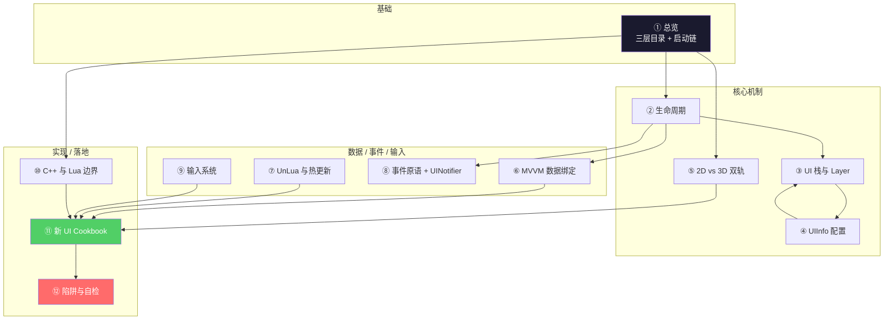

# HiGame UI 脚本架构 — 总览

> 本 wiki 为 **AI 编程助手**(Claude / CodeBuddy / Cursor)与新加入的客户端开发者准备,把 HiGame 项目(UE5.5.4 + UnLua,DDS 架构)的 UI 脚本层全部技术细节压缩成 12 页有图、有代码、可执行的指南。读者读完后,应当能在没有人指导的情况下,产出一个符合项目规范的新 UI(WBP + DataTable + Lua + 可选 VM)。
>
> **研究方法**:本项目以**本地代码考古**替代 km-websearch 的 web fetch,信息来源为 P4 工作区的项目代码与 C++ 头文件,所有 API 名/字段名/路径均经实际代码验证。

## 知识地图

写一个新 UI 时,推荐顺序:**④ → ⑦ → ② → ⑥ → ⑨ → ⑪**。
排错或优化时:⑩ → ⑫ → ③ → ⑧。

## 项目最关键的几条事实

1. **UI 主目录是 `Content/Script/ui/...`,不是 `ClientScript/ui/...`**(虽然两者都有,业务 UI 大多在前者)
2. **`uiframework`(2D UMG)与 `lguiframework`(3D LGUI)共用同一个 UIManager**,通过 `UIInfo.IsLGUI` 标志区分,不是新旧替代
3. **`main_ui.lua` / `interactive_ui.lua` 已废弃**(原作者注释证实),不要拿它们当模板
4. **`UILogicSubSystem` C++ 类只是骨架**,所有逻辑通过 `BlueprintImplementableEvent` 下沉到 Lua
5. **8 层 UI 栈** — `TopLayer / AlertLayer / LoadingLayer / TipsLayer / GuideLayer / SystemLayer / SceneLayer / HUDLayer`,FullScreen 自动隐藏下层
6. **MVVM 不是双向绑定**,有三种 BindWay:`BindWayToWidget(1)` / `BindWayToVM(2)` / `NotifyUI(3)`
7. **跨 UI 数据共享 = `ViewModelCollection:FindUniqueViewModel`**,不要用全局变量
8. **输入用 EnhancedInput Action 名**(`InputDef.DefaultUIAction`),不是 KeyCode
9. **ESC 关闭 = `UIInfo.EscClose=true`**,不需要手写监听
10. **`Construct` 中所有 `:Add` 在 `Destruct` 中必须 `:Remove`** — 热更/GC 防泄漏

## 页面目录

### 基础
- [1. 总览 — UI 脚本三层目录与启动链](wiki/1.%20总览%20—%20UI%20脚本三层目录与启动链.md) — 三层 Lua 代码隔离、`ui/` 子树结构、UIManager 启动链

### 核心机制
- [2. UIWindowBase 生命周期](wiki/2.%20UIWindowBase%20生命周期.md) — 5 个状态值 + 9 个可覆写方法 + DoOnCreate 递归
- [3. UI 栈与 Layer](wiki/3.%20UI%20栈与%20Layer.md) — 8 层栈、FullScreen 自动隐藏、Modal 屏蔽、ESC 流程
- [4. UIInfo 配置与 DataTable 注册](wiki/4.%20UIInfo%20配置与%20DataTable%20注册.md) — 字段全表、典型场景配置组合、注册流程
- [5. 2D vs 3D 双轨](wiki/5.%202D%20vs%203D%20双轨.md) — uiframework vs lguiframework 差异表 + 决策树

### 数据 / 事件 / 输入
- [6. MVVM 数据绑定](wiki/6.%20MVVM%20数据绑定.md) — Field/Binder/Proxy/Collection 五件套 + ListView 数据驱动
- [7. UnLua 绑定与热更新](wiki/7.%20UnLua%20绑定与热更新.md) — 蓝图↔Lua 路径、子控件自动绑定、Construct/Destruct、热更原理
- [8. UI 事件原语与 UINotifier](wiki/8.%20UI%20事件原语与%20UINotifier.md) — 5 个 Wait 原语、UINotifier 总线
- [9. 输入系统](wiki/9.%20输入系统.md) — Action 注册、ESC、激活栈、设备切换、KeyAction/KeyIcon、模态屏蔽

### 实现 / 落地
- [10. C++ 与 Lua 边界](wiki/10.%20C%2B%2B%20与%20Lua%20边界.md) — 类层次、必须 C++ vs 应该 Lua、BlueprintCallable 速查
- [11. 新 UI Cookbook 与真实模板](wiki/11.%20新%20UI%20Cookbook%20与真实模板.md) — 5 步标准流程 + 4 套真实代码模板
- [12. 常见陷阱与自检清单](wiki/12.%20常见陷阱与自检清单.md) — 11 类陷阱 + 12 项自检 + 性能项

## 关键问题覆盖范围

| 关键问题 | 由以下页面解答 |
|----------|---------------|
| Q1 — UI 脚本目录结构? | [1. 总览](wiki/1.%20总览%20—%20UI%20脚本三层目录与启动链.md) |
| Q2 — 启动链路? | [1. 总览](wiki/1.%20总览%20—%20UI%20脚本三层目录与启动链.md) |
| Q3 — UIWindowBase 生命周期? | [2. 生命周期](wiki/2.%20UIWindowBase%20生命周期.md) |
| Q4 — 8 层栈与 FullScreen/IsModal? | [3. UI 栈与 Layer](wiki/3.%20UI%20栈与%20Layer.md) |
| Q5 — UIInfo 字段? | [4. UIInfo 配置](wiki/4.%20UIInfo%20配置与%20DataTable%20注册.md) |
| Q6 — uiframework vs lguiframework? | [5. 2D vs 3D 双轨](wiki/5.%202D%20vs%203D%20双轨.md) |
| Q7 — MVVM 三件套? | [6. MVVM 数据绑定](wiki/6.%20MVVM%20数据绑定.md) |
| Q8 — UnLua 绑定与热更? | [7. UnLua 绑定与热更新](wiki/7.%20UnLua%20绑定与热更新.md) |
| Q9 — UI 事件原语? | [8. 事件原语与 UINotifier](wiki/8.%20UI%20事件原语与%20UINotifier.md) |
| Q10 — UI 输入? | [9. 输入系统](wiki/9.%20输入系统.md) |
| Q11 — C++ vs Lua 边界? | [10. C++ 与 Lua 边界](wiki/10.%20C%2B%2B%20与%20Lua%20边界.md) |
| Q12 — 新 UI 完整流程? | [11. Cookbook](wiki/11.%20新%20UI%20Cookbook%20与真实模板.md) + [12. 陷阱](wiki/12.%20常见陷阱与自检清单.md) |

## 数据来源(本地 raw 笔记)

- [[higame-ui-framework-overview]] (#48) — 框架架构、入口、UIManager
- [[higame-ui-window-lifecycle]] (#49) — 生命周期、UIInfo 配置
- [[higame-ui-mvvm]] (#50) — MVVM 五件套
- [[higame-ui-unlua-and-events]] (#51) — UnLua 绑定、事件原语
- [[higame-ui-input-and-navigation]] (#52) — 输入系统
- [[higame-ui-cpp-boundary]] (#53) — C++ 类层次、边界、API 速查
- [[higame-ui-cookbook-and-pitfalls]] (#54) — Cookbook、模板、陷阱

## 质量说明

- **总页面数**:12
- **总参考来源数**:7(全部为本地代码考古产物)
- **覆盖率**:12 / 12 关键问题全部覆盖
- **空白领域**:无关键缺失。Wwise 音频细节 / DDS Actor 同步 / UMG 控件本身属性表显式排除在 scope 外
- **最后更新**:2026-05-10
