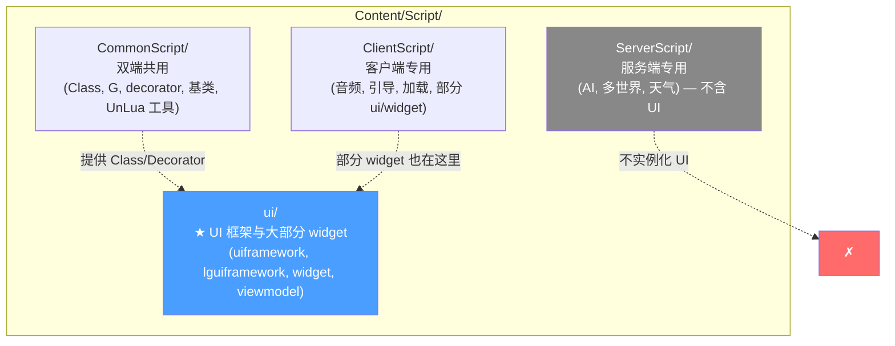
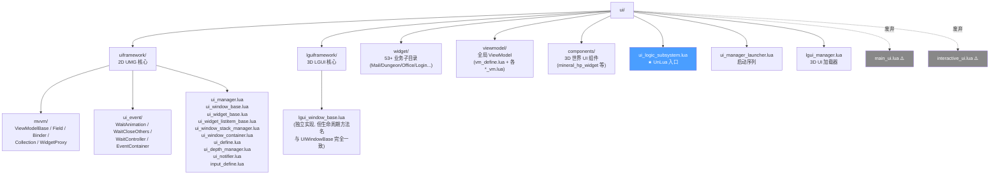
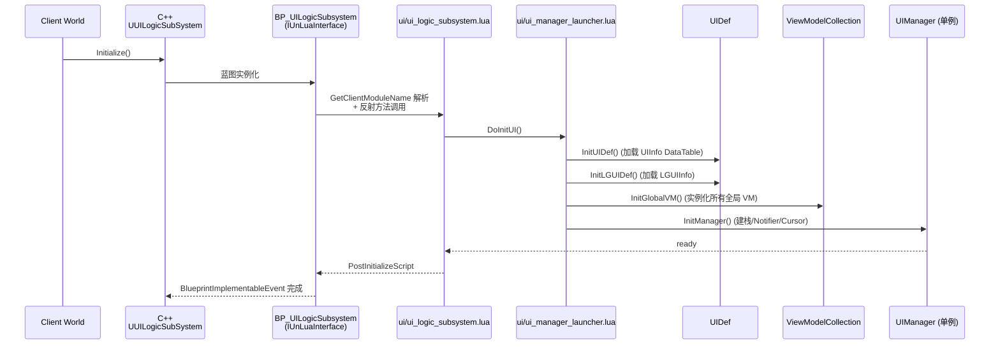
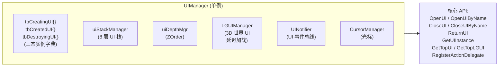
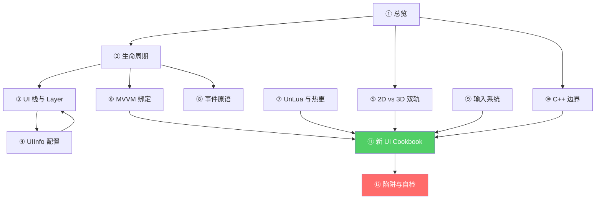

# 总览 — UI 脚本三层目录与启动链

HiGame 是 UE5.5.4 + UnLua 架构的 DDS(分布式 DS)游戏。**UI 脚本层只在客户端实例化**,以 Lua 写 UMG 后端,通过自研 `UIManager` 单例统一管理所有 2D / 3D 界面的生命周期、栈、输入与音效。本页画出整个 UI 子系统的边界、目录结构、启动链路,后续每一页深挖其中一块。

## 三层 Lua 代码分隔与 UI 子树

HiGame 的 Lua 代码在 `Content/Script/` 下被强制分成三层,UI 几乎全部位于 **Common + Client** 层[^48]。



> **路径陷阱**:业务 UI **大多数**在 `Content/Script/ui/...`(无 `ClientScript` 前缀),少数在 `Content/Script/ClientScript/ui/...`。新写 UI 推荐落 `Content/Script/ui/widget/<模块>/`。

### 运行时环境判断

```lua
UnLua.IsSSInstanceClient()                            -- 客户端
UE.UHiRuntimeEnvFunctionLibrary.IsSSInstanceGame()    -- DS 服务端
```

UI 一旦写到 `ServerScript/`,**根本不会被加载**,因为 DS 不会实例化 `UILogicSubSystem`。

## ui/ 目录全图



`main_ui.lua` 与 `interactive_ui.lua` 已被原作者标记为废弃[^48],**新代码绝对不要拷贝它们当模板**。

## 启动链路 — 从 C++ 到 Lua UIManager

UI 子系统启动顺序非常明确:



`UUILogicSubSystem` C++ 类只是骨架,**所有逻辑通过 `BlueprintImplementableEvent`**(`InitializeScript` / `PostInitializeScript` / `DeinitializeScript` / `OnWorldBeginPlayScript`)下沉到 Lua[^53]。

## UIManager — 整个 UI 系统的中央调度

`Content/Script/ui/uiframework/ui_manager.lua` 是单例,持有所有 UI 实例与子模块[^48]。



每一块都有专门一页详解:[3. UI 栈与 Layer](3.%20UI%20栈与%20Layer.md)、[6. MVVM 数据绑定](6.%20MVVM%20数据绑定.md)、[8. UI 事件原语与 UINotifier](8.%20UI%20事件原语与%20UINotifier.md)、[9. 输入系统](9.%20输入系统.md)。

## 知识地图(本 wiki 12 页之间的关系)



写一个新 UI,顺序就是 **④ → ⑦ → ② → ⑥ → ⑨ → ⑪**;遇到性能或调试问题再读 ⑩、⑫。

[^48]: [[higame-ui-framework-overview|HiGame UI Lua 框架架构 — 入口/UIManager/uiframework vs lguiframework]] · 本地代码考古
[^53]: [[higame-ui-cpp-boundary|HiGame UI C++ 类层次 + Lua/C++ 边界 + BlueprintCallable 接口清单]] · 本地代码考古

## Sources

| # | Title | Raw Note | Original |
|---|-------|----------|----------|
| 48 | HiGame UI 框架架构 | [[higame-ui-framework-overview]] | p4://Content/Script/ui/ |
| 53 | HiGame UI C++ 边界 | [[higame-ui-cpp-boundary]] | p4://Source/HiGame/Public/UI/ |
