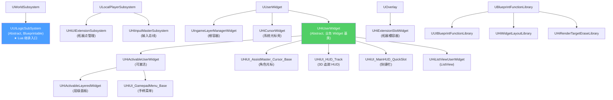
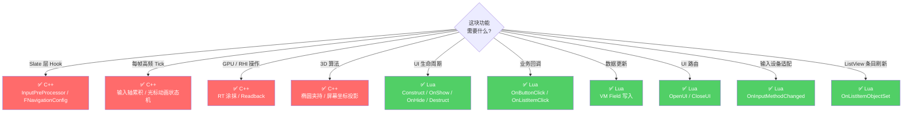
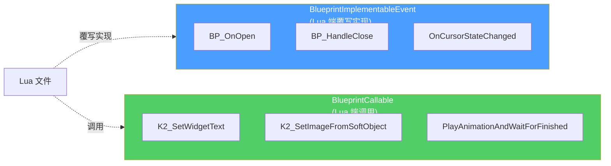

# C++ 与 Lua 边界

HiGame UI 是一座 C++ 引擎能力 + Lua 业务逻辑的桥梁。**搞错边界 = 性能爆炸或者根本写不出来**。本页给出 C++ UI 类层次图、明确告诉你"哪些必须 C++、哪些应该 Lua"、列出 Lua 端最常用的 BlueprintCallable 接口[^53]。

## C++ UI 类层次

## 各模块职责

| 模块 | 文件 | 说明 |
|------|------|------|
| **UILogicSubSystem** | `UILogicSubSystem.h/cpp` | 仅客户端实例化的 WorldSubsystem;C++ 仅提供生命周期骨架,**全部逻辑通过 `BlueprintImplementableEvent` 下沉到 Lua**(`InitializeScript` / `PostInitializeScript` / `DeinitializeScript` / `OnWorldBeginPlayScript`) |
| **IngameLayerManager** | `IngameLayerManagerWidget.h/cpp` | 顶层 Widget 容器(**并非多 Layer 分层**);核心:注册 Slate `InputPreProcessor` 拦截鼠标事件,广播输入方式/文化/前后台/全屏变化委托给 Lua;`OpenUIByName` 静态方法转调 `BP_OpenUIImpl` 交由 Lua 实现 |
| **UIExtensions** | `HiUIExtensionSubsystem.h` | **自研拓展点**(非 CommonUI UIExtensionSystem);DataTable 配置各 ExtensionSlot 的 WidgetClass(按平台 Desktop/Mobile/PS 区分);Subsystem 管理全局激活/反激活;`UHiExtensionSlotWidget` 是放在 UMG 蓝图中的 Overlay,按需异步加载子 Widget |
| **UINavigation** | `UINavigationConfig.h`, `HiInputMasterSubsystem.h` | **完全自研**;`UHiInputMasterSubsystem`(LocalPlayerSubsystem)统一管理键鼠/手柄/触屏输入,维护 UI 激活栈,判定 Top UI 并分发按键/摇杆;自定义 `FNavigationConfig` 覆盖 UE 原生方向导航;5 个 Handler 链 |
| **Cursor** | `HiCursorWidget.h`, `HiUI_AssistMaster_Cursor_Base.h` | 双层设计:`UHiCursorWidget` 系统级壳(硬件光标替换);`UHiUI_AssistMaster_Cursor_Base` 角色化光标,带状态机(Moving/Click/ShortIdle/LongIdle)、眼球追踪、Hover Context、动画 Config Map |
| **Gamepad** | `HiUI_GamepadMenu_Base.h` | 手柄专用菜单基类,通过 `UHiGamepadManager` 接收轴/按键;屏蔽默认 InputTypeChanged |
| **MainHUD** | `HiUI_HUD_Track.h` 等 | HUD 追踪(3D 屏幕坐标映射 + 椭圆边界夹持)、快捷栏(长按检测)等;复杂计算 C++,表现回调用 `BlueprintImplementableEvent` |

## C++ vs Lua 边界 — 决策表

### 必须 C++(原因)

- **Slate `InputPreProcessor` 注册分发** — Lua 无法触达 `FSlateApplication` 层
- **自定义 `FNavigationConfig` 覆盖** — 引擎框架级 Hook
- **`UHiInputMasterSubsystem` 输入总线** — 每帧 Tick 高频轴值累积、Focus 追踪
- **`UHiUI_AssistMaster_Cursor_Base` 眼球插值/动画序列队列** — 每帧 Tick 性能敏感
- **RT 降采样链(`HiRenderTargetEraseLibrary`)** — 涉及 GPU Readback 和 RHI 线程安全
- **HUD 3D 追踪坐标椭圆夹持算法(`HiUI_HUD_Track`)**

### 应写 Lua

- `UILogicSubSystem` 的 Initialize/Deinitialize/OnWorldBeginPlay 具体逻辑
- `IngameLayerManagerWidget.BP_OpenUIImpl` — UI 打开路由
- `HiActivableLayeredWidget` 的 `BP_OnOpen` / `BP_HandleClose` / `BP_Setup` / `BP_Cleanup`
- 所有 `OnActivated` / `OnDeactivated` 表现层响应
- ListView 条目的 `RefreshWidgets` / `OnClicked`
- 输入类型切换后的 UI 适配(`BP_OnInputTypeChanged`)
- 光标状态变化响应(`OnCursorStateChanged`)

## 高频 BlueprintCallable 接口速查

### `UHiUserWidget`(基类方法,所有 Lua Widget 可用)

| 方法 | 作用 |
|---|---|
| `K2_GetPlayerController/State/Character` | 获取游戏对象 |
| `K2_SetImageFromResourcePicKey` / `K2_SetImageFromSoftObject` | 异步图片加载 |
| `K2_SetWidgetVisible` / `K2_SetWidgetVisibility` | 可见性 |
| `K2_SetWidgetText` / `K2_SetWidgetTextFromStringTable` | 文本设置 |
| `PlayAnimationAndWaitForFinished` | Latent 动画播放 |
| `PlayAnimationLoop` | 循环动画 |
| `SetTimerOnce` | 定时回调 |
| `K2_GetWidgetAnimationByName` | 按名获取动画 |
| `K2_GetWidgetFromName` | 按名获取子控件 |
| `K2_GetOwnerLayeredWidget` | 获取所属层级 Widget |
| `AsyncLoadObject` | 异步加载资源 |

### `UHiActivableUserWidget`

| 方法 | 作用 |
|---|---|
| `K2_RequestActivateExtension` / `K2_RequestDeactivateExtension` | 拓展点开关 |
| `K2_DoBackAction` | 返回操作 |
| `K2_PlayActivateAnimation` / `K2_PlayDeactivateAnimation` | 激活/反激活动画 |

### `UUIBlueprintFunctionLibrary`(静态)

| 方法 | 作用 |
|---|---|
| `GetWidgetScreenPosition` | Widget 屏幕坐标 |
| `SetFocus` / `HasFocus` | 焦点控制 |
| `GetDefaultInputDeviceType` | 当前输入设备 |
| `TextLengthMeasure` | 文本像素长度 |
| `DrawUIToRenderTarget` | Widget → RT |
| `GlobalUpdateTypefaceToFarh` / `GlobalResetTypefaceFromFarh` | 法恩语切换 |

### `UHiWidgetLayoutLibrary`

| 方法 | 作用 |
|---|---|
| `DuplicateWidget` | 克隆 Widget |
| `GetWidgetFromName` | 按名查子控件 |
| `GetAllWidgets` | 获取所有子控件 |
| `GetEntryWidgetFromItem` | ListView Item → Entry |

### `UHiInputMasterSubsystem`

| 方法 | 作用 |
|---|---|
| `SetInputMode` / `GetCurrentInputMode` | 输入模式切换 |
| `SetMouseCursorVisible` | 光标显隐 |
| `OnLayeredUIActivated` / `OnLayeredUIDeactivated` | 注册/注销层级 UI |
| `IsWidgetReachable` | 导航可达检测 |
| `SimulateKeyToKeysActions` | 模拟按键 |

### `UHiRenderTargetEraseLibrary`
- `DrawMIDToRT` + `ComputeAlphaRatioByDownsample` + `InitDownsampleResources` — 涂抹进度

## UnLua 暴露模式

C++ 通过两种 UFUNCTION 宏暴露给 Lua[^53]:

`UUILogicSubSystem` 标记为 `Abstract + Blueprintable`,意味着项目中存在一个 BP 子类绑定了 UnLua 脚本(`BP_UILogicSubsystem`),由 Lua 实现整个 UI 管理器逻辑。Widget 层面,Lua 继承 `UHiActivableLayeredWidget` 的 BP 子类实现具体面板。

## 陷阱

| 陷阱 | 后果 | 正确做法 |
|---|---|---|
| 在 Lua Tick 做高频计算 | 帧率耦合,GC 抖动 | 移到 C++ 或 UMG `WidgetAnimation` |
| Lua 操作 RT / RHI | 无法触达,API 缺失 | 用 `UHiRenderTargetEraseLibrary` 函数 |
| 试图 Lua 注册 InputPreProcessor | 不可能 | 改用 EnhancedInput Action |
| 用 `K2_SetWidgetText` 但没传 FText | 编译警告 / 运行时空 | 用 `FText.FromString()` 包字符串 |
| C++ 接口签名带 `_Implementation` | Lua 不能直接调 | 调原生命名(去掉 `_Implementation`) |

[^53]: [[higame-ui-cpp-boundary|HiGame UI C++ 类层次 + Lua/C++ 边界 + BlueprintCallable 接口清单]] · 本地代码考古

## Sources

| # | Title | Raw Note | Original |
|---|-------|----------|----------|
| 53 | HiGame UI C++ 边界 | [[higame-ui-cpp-boundary]] | p4://Source/HiGame/Public/UI/ |
