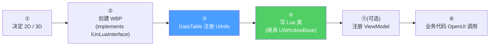
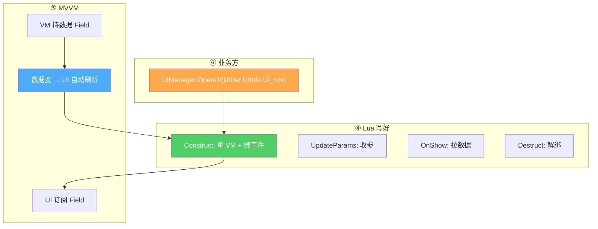

# 新 UI Cookbook 与真实模板

把前面 10 页的知识浓缩成 **AI 写新 UI 的 5 步标准流程**,加上 4 套真实代码模板(简单弹窗 / 全屏面板 + MVVM / ListView 条目 / ViewModel),最后给出业务代码中真实的 OpenUI 调用形态。AI 直接照抄改造,80% 场景能立即跑通[^54]。

## 5 步标准流程



### ① 决定 2D 还是 3D

| 场景 | 选什么 |
|------|------|
| 全屏面板 / 弹窗 / HUD / 列表 | **2D UMG**(`UIWindowBase`)|
| 角色头顶血条 / 世界标记 / 3D 菜单 | **3D LGUI**(`LGUIWindowBase`)|

详见 [5. 2D vs 3D 双轨](5.%202D%20vs%203D%20双轨.md)。

### ② 创建 WBP

1. 蓝图继承自 `UHiActivableLayeredWidget` 或 `UHiUserWidget`(具体看用途)
2. WBP **implements `IUnLuaInterface`**
3. `GetClientModuleName` 返回 `"ui.widget.<模块>.<lua文件名>"`(详见 [7. UnLua 绑定与热更新](7.%20UnLua%20绑定与热更新.md))

### ③ 在 DataTable 注册 UIInfo

打开 `/Game/CP0032305_GH/Blueprints/DT/UIInfo`,新增一行(详见 [4. UIInfo 配置与 DataTable 注册](4.%20UIInfo%20配置与%20DataTable%20注册.md)):
- `UIName` = `"UI_MyNewPanel"`(必须唯一)
- `WidgetClassPath` = WBP 路径(不要拼 `_C`,框架自动拼)
- `UILayer` = 选合适层级
- `FullScreen` / `IsModal` / `EscClose` 按需

### ④ 写 Lua 类(完整模板)

路径:`Content/Script/ui/widget/<模块>/ui_my_new_panel.lua`

```lua
local UIWindowBase = require('ui.uiframework.ui_window_base')
local UIManager    = require('ui.uiframework.ui_manager')
local ViewModelCollection = require('ui.uiframework.mvvm.viewmodel_collection')
local ViewModelBinder     = require('ui.uiframework.mvvm.viewmodel_binder')
local WidgetProxys        = require('ui.uiframework.mvvm.ui_widget_proxy')
local VMDef = require('ui.viewmodel.vm_define')

---@type WBP_MyNewPanel_C
local M = UnLua.Class(UIWindowBase)

function M:Construct()
    -- 1. 拿 ViewModel(全局共享)
    self.MyVM = ViewModelCollection:FindUniqueViewModel(
                    VMDef.UniqueVMInfo.MyVM.UniqueName)

    -- 2. ListView 数据驱动
    self.ListProxy = WidgetProxys:CreateWidgetProxy(self.ListView_Items)
    ViewModelBinder:BindViewModel(
        self.ListProxy.ListField, self.MyVM.ItemListField,
        ViewModelBinder.BindWayToWidget)

    -- 3. 监听按钮
    self.Btn_Close.OnClicked:Add(self, self.OnCloseClick)
end

function M:UpdateParams(...)
    -- 接收 OpenUI 透传参数
end

function M:OnShow()
    -- 显示动画完成后刷新数据
    self.MyVM:RefreshData()
end

function M:OnHide() end

function M:Destruct()
    ViewModelBinder:UnBindByUI(self, true)
    self.Btn_Close.OnClicked:Remove(self, self.OnCloseClick)
end

function M:OnCloseClick()
    UIManager:CloseUI(self, true)
end

return M
```

### ⑤ (可选)注册 ViewModel

VM 类:`Content/Script/ui/viewmodel/my_vm.lua`

```lua
local ViewModelBaseClass = require('ui.uiframework.mvvm.viewmodel_base')
local M = Class(ViewModelBaseClass)

function M:ctor()
    Super(M).ctor(self)
    self.ItemListField  = self:CreateVMArrayField({})
    self.SomeValueField = self:CreateVMField(0)
end

function M:RefreshData()
    -- 拉数据(IRPC 或本地), 更新 Field
    -- self.ItemListField:AddItem(...)
end

return M
```

VM 注册到 `Content/Script/ui/viewmodel/vm_define.lua`:

```lua
VMDef.UniqueVMInfo.MyVM = {
    UniqueName = 'MyVM',
    ViewModelClassPath = 'ui.viewmodel.my_vm',
}
```

详见 [6. MVVM 数据绑定](6.%20MVVM%20数据绑定.md)。

### ⑥ 业务代码打开

```lua
local UIDef     = require('ui.uiframework.ui_define')
local UIManager = require('ui.uiframework.ui_manager')

-- 推荐: 通过 UIInfo 引用打开
UIManager:OpenUI(UIDef.UIInfo.UI_MyNewPanel)

-- 带回调
UIManager:OpenUI(UIDef.UIInfo.UI_MyNewPanel, function(panel)
    panel:SomeAfterOpenAction()
end)

-- 同步打开 + 透传参数 (会被 UpdateParams 收到)
UIManager:OpenUI(UIDef.UIInfo.UI_MyNewPanel, nil, true, arg1, arg2)

-- 通过名字 (动态打开场景)
UIManager:OpenUIByName("UI_MyNewPanel", nil, nil, arg1)
```

## 真实模板 A — 简单弹窗

`Content/Script/ui/widget/Login/WBP_Login_Popup_Device.lua`[^54]:

```lua
local UIWindowBase = require('ui.uiframework.ui_window_base')
local UIManager    = require('ui.uiframework.ui_manager')

local M = Class(UIWindowBase)

function M:OnConstruct()
    self.CommitCallBacks = {}
    self.WBP_Common_SquareIconButton_01:BindBtnClick(self, self.OnCopyEvent)
    self.WBP_Common_Popup_Small:SetKeyCalloutKeys(true,
        "ESC_KEYBOARD_RETURN_AND_CONFIRM", nil, KeyInfoData)
    self.WBP_Common_Popup_Small:RegisterKeySelectedCallBacks(self, self.OnKeySelected)
end

function M:StartShow()
    self.WBP_Common_Popup_Small:PlayInAnim()
end

function M:CloseMyself()
    UIManager:CloseUI(self, true)
end

return M
```

**特点**:无 ViewModel,纯交互弹窗。`WBP_Common_Popup_Small` 是公共子控件,提供动画和按键回调封装。

## 真实模板 B — 全屏面板 + MVVM

`Content/Script/ui/widget/Mail/ui_mainmail.lua`[^54]:

```lua
local UIWindowBase  = require('ui.uiframework.ui_window_base')
local WidgetProxys  = require('ui.uiframework.mvvm.ui_widget_proxy')
local ViewModelBinder     = require('ui.uiframework.mvvm.viewmodel_binder')
local ViewModelCollection = require('ui.uiframework.mvvm.viewmodel_collection')

local M = UnLua.Class(UIWindowBase)

function M:Construct()
    self.MailList   = WidgetProxys:CreateWidgetProxy(self.ListView_Mail)
    self.SelectMail = self:CreateUserWidgetField(self.ClickMail)
    self.MailVM     = ViewModelCollection:FindUniqueViewModel(
                          VMDef.UniqueVMInfo.MailVM.UniqueName)

    ViewModelBinder:BindViewModel(self.SelectMail,
                                  self.MailVM.SelectInfo,
                                  ViewModelBinder.BindWayToWidget)
    ViewModelBinder:BindViewModel(self.MailList.ListField,
                                  self.MailVM.MailListField,
                                  ViewModelBinder.BindWayToWidget)

    self.WBP_ComBtn_Delete.OnClicked:Add(self, DeleteCurMail)
end

function M:OnShow()
    self.MailVM:SetOwner(self)
end

function M:Destruct()
    ViewModelBinder:UnBindByUI(self, true)
    self.WBP_ComBtn_Delete.OnClicked:Remove(self, DeleteCurMail)
end

return M
```

**特点**:`ListView_Mail` + `MailListField` 数据驱动;选中项 `SelectMail ↔ SelectInfo` 双 Field 共享;Destruct 一次性 `UnBindByUI`。

## 真实模板 C — ListView 条目

`Content/Script/ui/widget/Mail/ui_mailitem.lua`[^54]:

```lua
local UIWindowBase = require('ui.uiframework.ui_window_base')
local M = UnLua.Class(UIWindowBase)

function M:OnListItemObjectSet(ListItemObject)
    self.Info  = ListItemObject.ItemValue.FieldValue
    self.ID    = ListItemObject.ItemValue.FieldValue.ID
    self.Title = ListItemObject.ItemValue.FieldValue.Title
    RefreshShow(self)
end

function M:Construct()
    self.WBP_Btn_MailList.OnClicked:Add(self, Click)
    self.WBP_Btn_MailList.OnHovered:Add(self, OnHoverItem)
end

function M:Destruct()
    self.WBP_Btn_MailList.OnClicked:Remove(self, Click)
    self.WBP_Btn_MailList.OnHovered:Remove(self, OnHoverItem)
end

return M
```

**关键方法**:`OnListItemObjectSet` 是 UE ListView 重设条目数据时引擎调用的回调,从 `ItemValue.FieldValue` 解出业务数据。

## 业务代码中的真实 OpenUI 用法

| 调用形式 | 文件 |
|---------|------|
| `UIManager:OpenUI(UIDef.UIInfo.UI_Abyss_Shelter)` | `ClientScript/actors/Abyss/BPA_AbyssEntry.lua` |
| `UIManager:OpenUI(UIDef.UIInfo.UI_Common_SecondTextConfirm, function(SureUI) ... end)` | `ui/widget/Mail/ui_mainmail.lua` |
| `UIManager:OpenUI(UIDef.UIInfo.UI_Exchange_Filter, nil, nil, VMName)` | `ClientScript/ui/widget/TradingPost/WBP_TradingPost_Main.lua` |
| `UIManager:OpenUIByName(UI_NAME)` | `ClientScript/ui/viewmodel/ld_head_swap_vm.lua` |
| `UIManager:OpenUIByName(NavigationData.details, nil, nil, ...)` | `common/item/ItemJumpToAccess.lua` |

签名:
```lua
UIManager:OpenUI(UIInfo, CallBack, Sync, ...)
UIManager:OpenUIByName(UIName, CallBack, Sync, ...)
```

参数说明:
- `UIInfo`:`UIDef.UIInfo.UI_xxx` 或 LGUIInfo
- `CallBack`:UI 创建并显示后的回调,签名 `function(uiInstance) end`
- `Sync`:`true` 同步打开(无异步加载等待),`false`/`nil` 异步
- `...`:透传给 `UpdateParams(...)` 的业务参数

## 整体心智模型



继续阅读 → [12. 常见陷阱与自检清单](12.%20常见陷阱与自检清单.md)。

[^54]: [[higame-ui-cookbook-and-pitfalls|HiGame UI 真实代码模板(弹窗/全屏面板/ListItem/VM) + 注册流程]] · 本地代码考古

## Sources

| # | Title | Raw Note | Original |
|---|-------|----------|----------|
| 54 | HiGame UI Cookbook | [[higame-ui-cookbook-and-pitfalls]] | p4://Content/Script/ui/widget/ |
