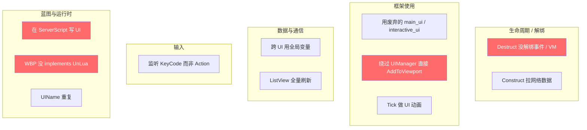
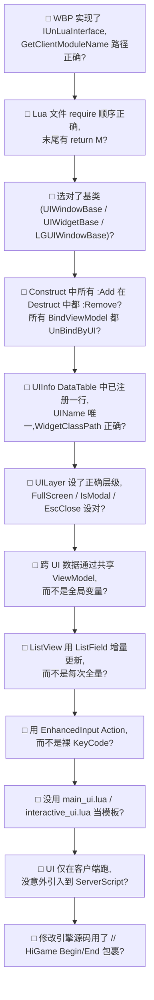

# 常见陷阱与自检清单

写完 UI 不代表能跑、能跑不代表不泄漏、不泄漏不代表性能 OK。本页归纳 11 类常见陷阱(全部来自项目真实代码 review 痕迹)+ 12 项 AI 写完 UI 后必过的自检清单[^54]。**写新 UI 前先看一遍,提交前再过一遍**。

## 11 类陷阱总图



## 详细陷阱表

| # | 陷阱 | 后果 | 正确做法 | 关联页 |
|---|------|------|---------|------|
| 1 | 在 `Destruct` 没解绑事件 / VM | 热更/GC 泄漏,旧 self 残留 | 配套 `OnClicked:Remove`、`UnBindByUI` | [2](2.%20UIWindowBase%20生命周期.md), [6](6.%20MVVM%20数据绑定.md), [7](7.%20UnLua%20绑定与热更新.md) |
| 2 | 用 `main_ui.lua` / `interactive_ui.lua` 当模板 | 已废弃,代码死 | 用 [11. Cookbook](11.%20新%20UI%20Cookbook%20与真实模板.md) 模板 | [1](1.%20总览%20—%20UI%20脚本三层目录与启动链.md) |
| 3 | 绕过 UIManager 直接 `AddToViewport` | 不入栈,ESC 关不掉,层级错乱 | `UIManager:OpenUI(UIDef.UIInfo.UI_xxx)` | [3](3.%20UI%20栈与%20Layer.md) |
| 4 | 跨 UI 通过全局变量传数据 | 时序问题,VM 不刷新 | 共享 `ViewModelCollection:FindUniqueViewModel` | [6](6.%20MVVM%20数据绑定.md) |
| 5 | 在 `Construct` 拉网络数据 | UI 还没显示就触发,可能时序错 | 在 `OnShow` 拉,或交给 VM 自己拉 | [2](2.%20UIWindowBase%20生命周期.md) |
| 6 | 监听 KeyCode 而非 Action | 设备切换/重映射不工作 | 用 `RegisterActionDelegate` + `InputDef.DefaultUIAction` | [9](9.%20输入系统.md) |
| 7 | ListView 数据全量刷新 | 性能差,UI 闪烁 | 用 `AddItem` / `RemoveItemIf` 增量 OpCode | [6](6.%20MVVM%20数据绑定.md) |
| 8 | 在 DS(服务端)写 UI 代码 | UI 只在客户端实例化,代码不会执行 | UI 一律走 ClientScript / `ui/` 目录 | [1](1.%20总览%20—%20UI%20脚本三层目录与启动链.md) |
| 9 | 写 Tick 做 UI 动画 | 帧率耦合,GC 抖动 | 用 UMG `WidgetAnimation` + `UIWaitAnimation` | [8](8.%20UI%20事件原语与%20UINotifier.md) |
| 10 | WBP 没 implements UnLua 接口 | Lua 类不会绑定,所有方法不触发 | WBP 实现 `IUnLuaInterface` 并填 `GetClientModuleName` | [7](7.%20UnLua%20绑定与热更新.md) |
| 11 | 多个 UI 共用一个 UIName | UIManager 状态冲突 | UIName 必须唯一 | [4](4.%20UIInfo%20配置与%20DataTable%20注册.md) |

## 高频"看似没错"的代码示例

### ❌ 陷阱 1:Destruct 没解绑

```lua
function M:Construct()
    self.Btn.OnClicked:Add(self, self.OnClick)
end

-- 缺 Destruct 或 Destruct 中没 :Remove → 热更后两次回调都触发
```

✅ 修复:

```lua
function M:Destruct()
    self.Btn.OnClicked:Remove(self, self.OnClick)
end
```

### ❌ 陷阱 4:全局变量跨 UI

```lua
-- UI_Mail
_G.MailListData = self:GetMailList()
UIManager:OpenUI(UIDef.UIInfo.UI_MailDetail)

-- UI_MailDetail
function M:OnShow()
    self:Refresh(_G.MailListData)   -- 时序错: _G 可能已被覆盖
end
```

✅ 修复:共享 VM

```lua
-- UI_Mail
self.MailVM = ViewModelCollection:FindUniqueViewModel(VMDef.UniqueVMInfo.MailVM.UniqueName)
self.MailVM.MailListField:AddItems(...)

-- UI_MailDetail
self.MailVM = ViewModelCollection:FindUniqueViewModel(VMDef.UniqueVMInfo.MailVM.UniqueName)
ViewModelBinder:BindViewModel(self.ListProxy.ListField, self.MailVM.MailListField, ViewModelBinder.BindWayToWidget)
```

### ❌ 陷阱 7:ListView 全量刷新

```lua
function VM:OnDataChange(newList)
    self.MailListField:SetItems(newList)   -- 每次都全量, 滚动闪烁
end
```

✅ 修复:增量

```lua
function VM:AddOne(item)
    self.MailListField:AddItem(item)
end

function VM:RemoveOne(id)
    self.MailListField:RemoveItemIf(function(f)
        return f:GetFieldValue().ID == id
    end)
end
```

### ❌ 陷阱 9:Tick 做动画

```lua
function M:Tick(MyGeometry, InDeltaTime)
    self.Image_Spin.RenderTransform.Angle = self.Image_Spin.RenderTransform.Angle + 90 * InDeltaTime
end
```

✅ 修复:用 UMG WidgetAnimation 配合 PlayAnimationLoop

```lua
function M:OnShow()
    self:PlayAnimationLoop(self.RotateAnim)
end
```

## ✅ AI 自检清单(写完 UI 后必过)



| # | 检查项 | 通过准则 |
|---|--------|---------|
| 1 | WBP 实现 IUnLuaInterface? | 蓝图右键 → Class Settings → Implemented Interfaces 含 `UnLuaInterface` |
| 2 | Lua 文件结构? | 第一行 require,中间 `local M = UnLua.Class(...)`,末尾 `return M` |
| 3 | 选对基类? | 全功能窗口 → `UIWindowBase`;子控件 → `UIWidgetBase`;ListItem → `UIWidgetListItemBase`;3D → `LGUIWindowBase` |
| 4 | Destruct 解绑齐全? | 每个 `OnClicked:Add` 都有 `:Remove`;每个 `BindViewModel` 都有 `UnBindByUI` |
| 5 | UIInfo 注册? | DataTable `UIInfo` 中能找到这行,`UIName` 唯一 |
| 6 | UILayer 与配置组合? | 对照 [4. UIInfo 配置](4.%20UIInfo%20配置与%20DataTable%20注册.md) 推荐表 |
| 7 | 跨 UI 不用 _G? | grep 自己代码,不能有 `_G.SomeData = ...` 这种用法 |
| 8 | ListView 增量? | 不能有 `:SetItems(全量 list)`,要用 `AddItem` / `RemoveItemIf` |
| 9 | 输入用 Action? | 不能有 `UE.EKeys.SpaceBar` / `OnKeyDown` 这种;只能 `RegisterActionDelegate` |
| 10 | 没用废弃模板? | grep,不能 `require 'ui.main_ui'` 或 `'ui.interactive_ui'` |
| 11 | UI 不在 Server? | UI 文件路径不能在 `Content/Script/ServerScript/` 下 |
| 12 | 引擎改动有标记? | 改 `Engine/...` 必须 `// HiGame Begin/End` 注释包裹 |

## 性能 / 内存检查项(进阶)

- [ ] 大图(>1MB)走 `K2_SetImageFromSoftObject` 异步加载,不直接 `Image:SetBrush`
- [ ] 频繁开关的 UI 设 `UIInfo.DontDestroy=true` 复用实例
- [ ] HUD 上的小红点等用 `MVVM NotifyUI` 模式,不靠 Tick 轮询
- [ ] ListView 用 `bEnableFixedLineScrollOffset=true`(滑动平滑度)
- [ ] 复杂 widget 的 OnPaint 不重写;颜色变化用 MaterialInstanceDynamic 而非每帧重算
- [ ] 退出 UI 后 RT 资源已 release(`ReleaseRenderTarget`)

## 调试小工具

- `Content/Script/ui/ui_node_path_util.lua` — 编辑器内 Button 点击路径追踪 + 路径字符串导航到节点(用于自动化测试)
- `Content/Script/CommonScript/UnLua/HotReload.lua` — `_G.UnLuaHotReload()` 强制重载

[^54]: [[higame-ui-cookbook-and-pitfalls|HiGame UI 真实代码模板(弹窗/全屏面板/ListItem/VM) + 注册流程]] · 本地代码考古

## Sources

| # | Title | Raw Note | Original |
|---|-------|----------|----------|
| 54 | HiGame UI Cookbook 与陷阱 | [[higame-ui-cookbook-and-pitfalls]] | p4://Content/Script/ui/ |
