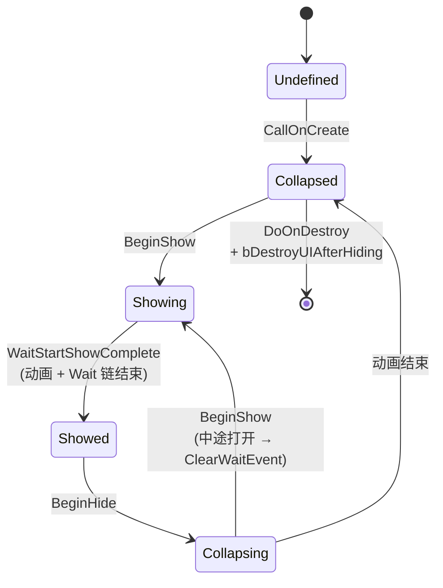
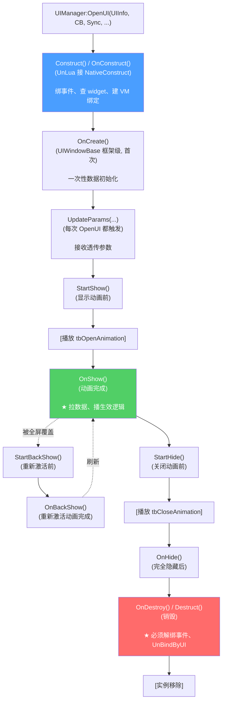
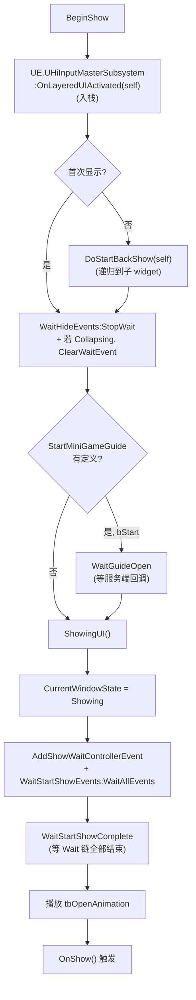
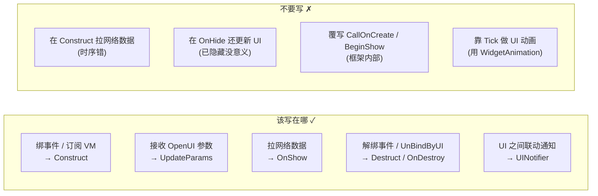

# UIWindowBase 生命周期

`UIWindowBase` 是所有 2D 全功能窗口的基类,**它定义了一套远比 UMG 原生 NativeConstruct/NativeDestruct 更丰富的生命周期方法**:9 个可覆写阶段方法,加上 5 个状态值组成的状态机。本页用最少的话讲清楚每个阶段在什么时候触发、应该写什么代码、不能写什么。源码:`Content/Script/ui/uiframework/ui_window_base.lua`[^49]。

## 状态机:CurrentWindowState 的 5 个值

```lua
local WindowState = {
    Undefined  = -1,
    Collapsed  = 0,
    Showing    = 1,
    Showed     = 2,
    Collapsing = 3,
}
```



**关键陷阱**:`Collapsing` 期间 `BeginShow`,`UIWindowBase` 会调 `WaitHideEvents:ClearWaitEvent`,使后续 OnShow 与对应的 OnHide 配对(防止状态错乱)[^49]。

## 9 个可覆写阶段方法

源码注释明确划出"↓ 可覆写的生命周期函数,其他内部函数非必要禁止覆写 ↓"边界[^49]:



| 方法 | 触发时机 | 写代码用途 |
|------|---------|----------|
| `Construct()` / `OnConstruct()` | UMG `NativeConstruct`(同一 hook 两种命名,新代码用 `Construct`) | 绑事件、查子 widget、建 VM 绑定 |
| `OnCreate()` | 首次创建,`Construct` 之后 | 一次性数据初始化(全生命周期不变的) |
| `UpdateParams(...)` | 每次 OpenUI 都触发,接收透传参数 | 接收打开参数 |
| `StartShow()` | 显示动画前 | 准备显示 |
| `OnShow()` | 显示动画完成 | **拉网络数据 / 播放生效逻辑** |
| `StartHide()` | 关闭动画前 | 通知开始关闭 |
| `OnHide()` | 完全隐藏后 | 资源回收准备 |
| `StartBackShow()` | 被覆盖后重新激活前 | 非首次显示触发 |
| `OnBackShow()` | 重新激活动画完成 | 刷新数据 |
| `OnDestroy()` / `Destruct()` | 销毁时 | 资源销毁、**解绑事件 / UnBindByUI** |
| `RefreshPanel()` | 其他界面关闭后,可见界面收到 | 数据刷新 |

`Tick(MyGeometry, InDeltaTime)` 是 UMG 自带每帧回调,**HiGame 项目极少使用**(改用 `WidgetAnimation` 或 `SetTimerOnce`)。

## 子 Widget 也走完整生命周期 — DoOnCreate 递归

`UIWindowBase` 持有 `tbSubUserWidget` 数组,所有阶段方法**递归到子 widget**[^49]:

```lua
function UIWindowBase:DoOnCreate(widget)
    if widget.OnCreate then widget:OnCreate() end
    if widget.tbSubUserWidget ~= nil and #widget.tbSubUserWidget > 0 then
        for _, subUserWidget in pairs(widget.tbSubUserWidget) do
            if subUserWidget.DoOnCreate then
                subUserWidget:DoOnCreate(subUserWidget)
            end
        end
    end
end
```

`DoStartBackShow` / `DoOnShow` / `DoOnHide` / `DoOnDestroy` 都按这个模式分发。意义:嵌套 UserWidget(继承 `UIWidgetBase`)也能拿到 `OnCreate / OnShow / OnHide / OnDestroy` 回调。

## CallOnCreate 干了什么

不要覆写它,但要知道它做了哪些事:

```lua
function UIWindowBase:CallOnCreate()
    self:SetVisibility(UE.ESlateVisibility.Collapsed)
    self.CurrentWindowState = WindowState.Collapsed

    self.WaitStartShowEvents = UIEventContainer.new()  -- 等待 closeOtherUI 等
    self.WaitShowEvents      = UIEventContainer.new()  -- 等待自身动画
    self.WaitHideEvents      = UIEventContainer.new()  -- 等待关闭动画

    self.FocusReceivedHandlers = {}
    self.FocusLostHandlers     = {}
    self.tbDynamicSubWidget    = {}

    self:DoOnCreate(self)
    UIManager.UINotifier:UINotify(UIEventDef.UICreate, self)
end
```

三个 `WaitEventContainer` 是后续生命周期等待的容器,详见 [8. UI 事件原语与 UINotifier](8.%20UI%20事件原语与%20UINotifier.md)。

## BeginShow / WaitStartShowComplete 内部流程

`BeginShow` 在 `Collapsed` 或 `Collapsing` 时进入:



参考 [9. 输入系统](9.%20输入系统.md) 了解 `OnLayeredUIActivated` 的栈管理细节。

## 写代码记忆点



详见 [12. 常见陷阱与自检清单](12.%20常见陷阱与自检清单.md)。

## 与 LGUIWindowBase 的关系

3D 世界 UI 的 `LGUIWindowBase` **方法名完全一致**,但实现独立(隐藏方式不同 — `SetActorScale3D(0,0,0) + SetActorHiddenInGame(true)`,而非 `SetVisibility`)。详见 [5. 2D vs 3D 双轨](5.%202D%20vs%203D%20双轨.md)。

[^49]: [[higame-ui-window-lifecycle|HiGame UIWindowBase 生命周期 + UIInfo 配置]] · 本地代码考古

## Sources

| # | Title | Raw Note | Original |
|---|-------|----------|----------|
| 49 | UIWindowBase 生命周期 + UIInfo 配置 | [[higame-ui-window-lifecycle]] | p4://Content/Script/ui/uiframework/ui_window_base.lua |
