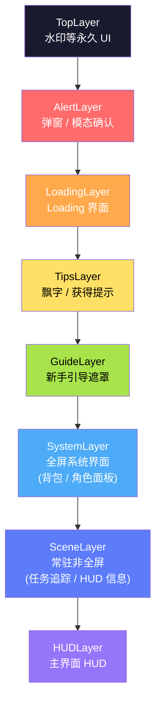
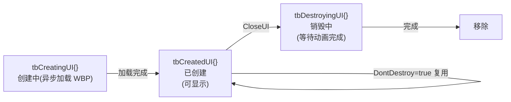
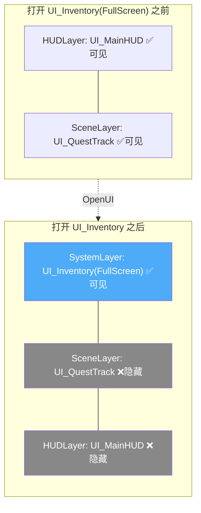
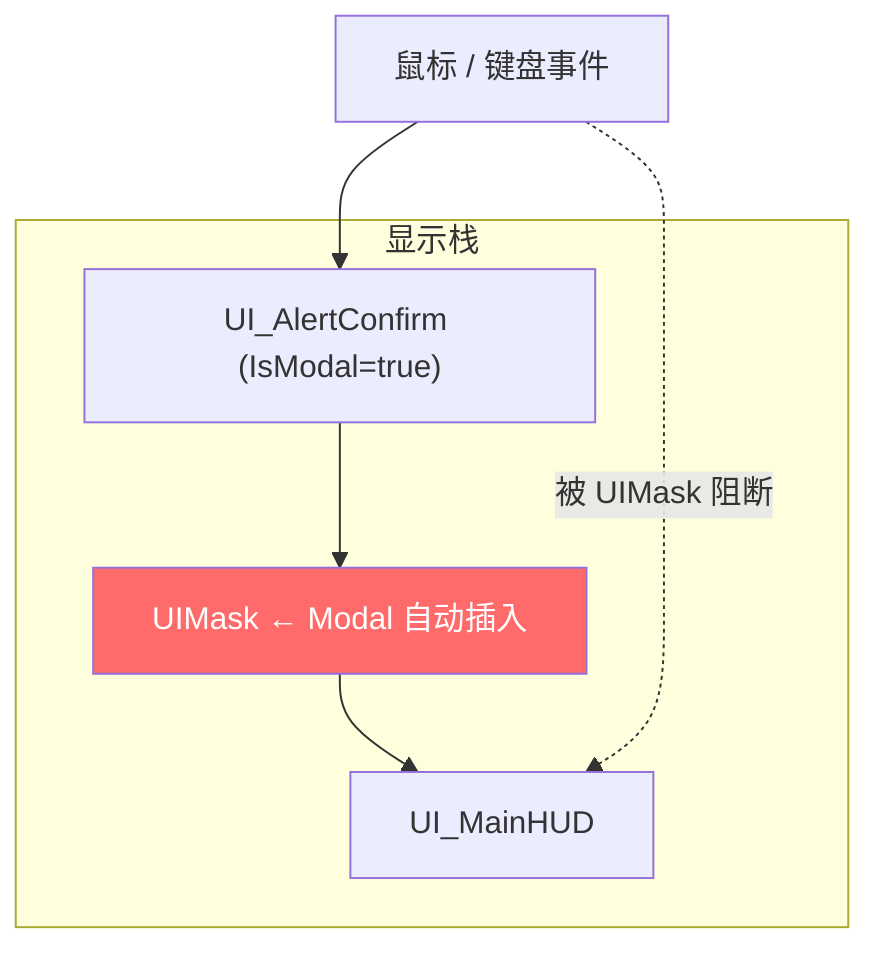
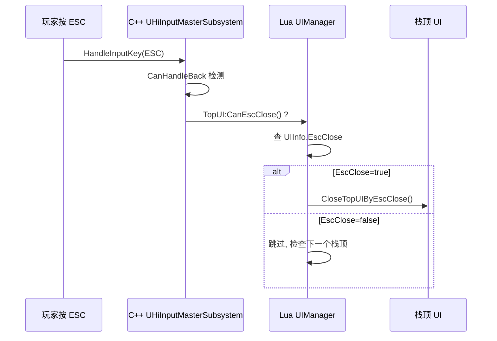
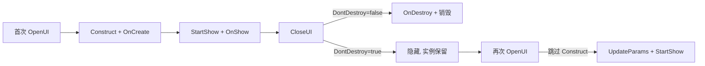
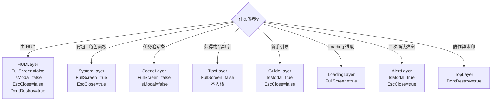

# UI 栈与 Layer

`UIManager` 不是把所有 UI 摊在同一个 viewport 上的简单容器。它通过 **8 层独立栈 + ZOrder 深度管理 + FullScreen 自动覆盖 + Modal 输入屏蔽** 四层机制,精确管理几百个 UI 同时存在的场景。本页讲清楚 8 层 Layer 各自的语义、FullScreen 与 Modal 的差异、ESC 关闭从栈顶找的规则[^48][^49]。

## 8 层 UI 栈 — 一个层一个栈

`ui_window_stack_manager` 维护 **8 个相互独立的栈**,每个栈优先级固定,栈内按打开顺序压栈/出栈[^48]。优先级从高到低:



UI 实例归属哪个 Layer,**只取决于 [`UIInfo.UILayer`](4.%20UIInfo%20配置与%20DataTable%20注册.md)** 配置(详见下页)。Lua 不需要也不应该手动管理 Layer。

## 三个互相独立的状态字典

每个 UI 实例同一时刻只能在三个状态之一,由 UIManager 用三张表管理[^48]:



`UIWindowContainer` 是每个槽位的状态机壳,持有 `UIInfo, UIInstance, Promise, Args`[^48]。

## FullScreen — 自动隐藏下层

`UIInfo.FullScreen=true` 的 UI 一打开,自动把**下层所有已打开的可见 UI 隐藏**;关闭时,逐层恢复到下一个 FullScreen 为止[^48][^49]。



> **隐藏 ≠ 销毁**:被隐藏的 UI 还在内存中,关闭 FullScreen 后会触发 `StartBackShow → OnBackShow` 回调让数据自动刷新(参考 [2. UIWindowBase 生命周期](2.%20UIWindowBase%20生命周期.md))。

## Modal — 输入屏蔽

`UIInfo.IsModal=true` 与 `FullScreen` **正交**(可同时存在或单独存在)。Modal 在 `IngameLayerManager` 中插入一个 `UIMask` widget,**阻断下层所有输入**[^48]。



| 配置 | 视觉效果 | 输入效果 |
|------|---------|---------|
| 普通 UI | 正常显示 | 正常透传 |
| `FullScreen=true` | 下层 UI 隐藏 | 下层 UI 不可见也不收输入 |
| `IsModal=true` | 下层 UI 仍可见(如果没 FullScreen) | UIMask 阻断下层输入 |
| 同时 `FullScreen + IsModal` | 下层隐藏 + Modal mask | 全屏阻断 |

输入屏蔽更精细的策略(`Ignore/Accept/Reject/LowLevel`)见 [9. 输入系统](9.%20输入系统.md)。

## ESC 关闭 — 从栈顶找第一个 EscClose=true

按下 ESC 后,流程:



业务代码自定义 Back 行为时,覆写 `OnReturn`:

```lua
function MyWindow:OnReturn()
    -- 自定义 Back 逻辑(例如先弹"确定退出?"二次确认)
end
```

## ZOrder — 同 Layer 内的深度

同一 Layer 内,可能有多个 UI 同时打开(例如 SystemLayer 上既开了背包又开了商店)。`uiDepthMgr` 按打开顺序分配 ZOrder,后开的盖在先开的上面[^48]。Lua 一般无需关心 ZOrder,只在做"始终置顶""临时提到最前"时才用 `UIManager:BringToFront(ui)`。

## DontDestroy — UI 实例池

`UIInfo.DontDestroy=true` 的 UI **关闭时不真正销毁**,UIManager 把实例留在 `tbCreatedUI{}` 中,下次 `OpenUI` 直接复用并触发 `UpdateParams + StartShow`(跳过 Construct)。适合频繁开关的 HUD 或大数据 UI[^49]。



## Layer × 配置组合速查



详细字段语义见下一页 [4. UIInfo 配置与 DataTable 注册](4.%20UIInfo%20配置与%20DataTable%20注册.md)。

[^48]: [[higame-ui-framework-overview|HiGame UI Lua 框架架构]] · 本地代码考古
[^49]: [[higame-ui-window-lifecycle|HiGame UIWindowBase 生命周期 + UIInfo 配置]] · 本地代码考古

## Sources

| # | Title | Raw Note | Original |
|---|-------|----------|----------|
| 48 | HiGame UI 框架架构 | [[higame-ui-framework-overview]] | p4://Content/Script/ui/ |
| 49 | UIWindowBase 生命周期 + UIInfo 配置 | [[higame-ui-window-lifecycle]] | p4://Content/Script/ui/uiframework/ui_window_base.lua |
