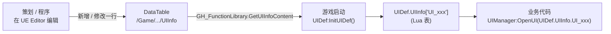
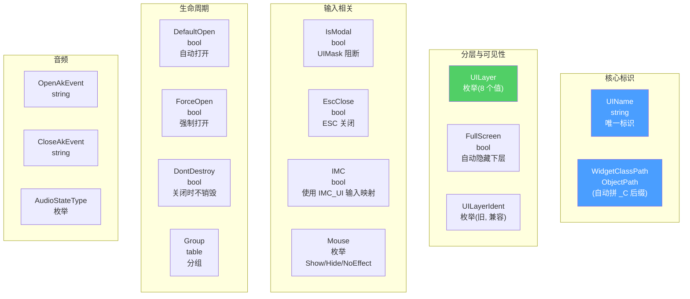
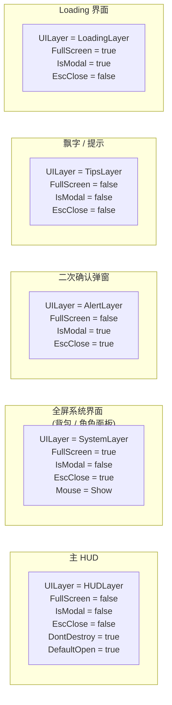
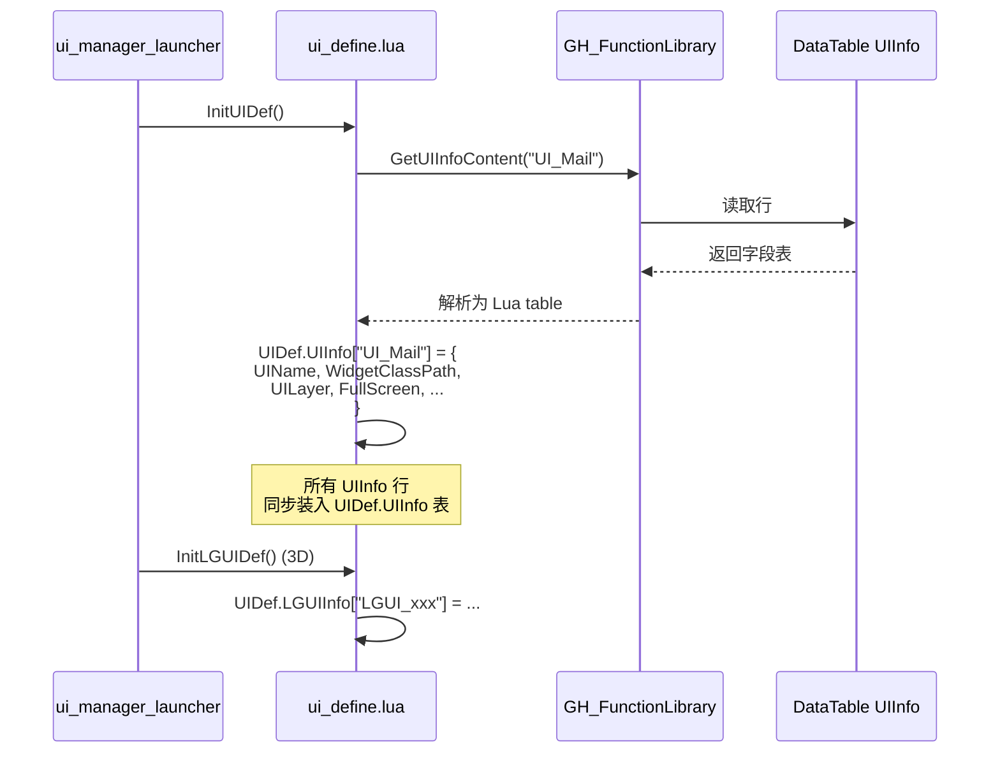
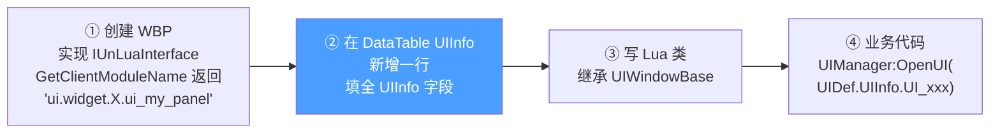

# UIInfo 配置与 DataTable 注册

每个 UI 必须先在 UE DataTable `/Game/CP0032305_GH/Blueprints/DT/UIInfo` 中注册一行,运行时通过 `GH_FunctionLibrary.GetUIInfoContent` 读取并由 `ui/uiframework/ui_define.lua:InitUIDef()` 组装成 `UIDef.UIInfo["UI_xxx"]` 表[^49]。本页给出**所有可配字段的完整说明**,以及典型场景的推荐配置。

## 注册流程总图



3D LGUI 界面则注册到 **`LGUIInfo` DataTable**,流程一致。

## UIInfo 字段总表



### 核心标识

| 字段 | 类型 | 说明 |
|------|------|------|
| `UIName` | string | UI 唯一标识(如 `"UI_Mail"`)。**必须唯一**,Lua 业务代码用它打开 |
| `WidgetClassPath` | ObjectPath | WBP 蓝图路径(运行时自动拼 `_C` 后缀)|

### 分层与可见性

| 字段 | 类型 | 说明 |
|------|------|------|
| `UILayer` | `Enum_UILayerNew` | 8 个值之一:`SceneLayer/SystemLayer/GuideLayer/LoadingLayer/TopLayer/TipsLayer/AlertLayer/HUDLayer`(详见 [3. UI 栈与 Layer](3.%20UI%20栈与%20Layer.md)) |
| `UILayerIdent` | `Enum_UILayer` | 旧层级枚举(兼容老代码,新 UI 用 `UILayer`) |
| `FullScreen` | bool | 是否全屏(触发自动隐藏下层) |

### 输入相关

| 字段 | 类型 | 说明 |
|------|------|------|
| `IsModal` | bool | 是否模态(自动插入 `UIMask` 阻断下层输入) |
| `EscClose` | bool | ESC 是否关闭(走 `CanEscClose → CloseTopUIByEscClose`) |
| `IMC` | bool | 是否使用 `IMC_UI` 输入映射(EnhancedInput Mapping Context) |
| `Mouse` | `Enum_UIMouseVisibility` | 鼠标行为(Show/Hide/NoEffect) |

### 生命周期与池化

| 字段 | 类型 | 说明 |
|------|------|------|
| `DefaultOpen` | bool | 是否随游戏自动打开(用于 HUD) |
| `ForceOpen` | bool | 强制打开(无视某些前置条件) |
| `DontDestroy` | bool | 关闭时不销毁,实例池化复用(详见 [3. UI 栈与 Layer](3.%20UI%20栈与%20Layer.md)) |
| `Group` | table | UI 分组(`Communication`/`Sequence` 等),用于互斥关闭 |

### 音频

| 字段 | 类型 | 说明 |
|------|------|------|
| `OpenAkEvent` | string | 打开 Wwise 事件 |
| `CloseAkEvent` | string | 关闭 Wwise 事件 |
| `AudioStateType` | `Enum_EUIAudioStateType` | 音频状态类型(由 `ui_audio_state_manager` 处理) |

## 典型场景配置组合



## ui_define.lua 内部做了什么

启动时序:



业务代码引用方式:

```lua
local UIDef     = require('ui.uiframework.ui_define')
local UIManager = require('ui.uiframework.ui_manager')

UIManager:OpenUI(UIDef.UIInfo.UI_Mail)
-- 或动态名字:
UIManager:OpenUIByName("UI_Mail")
```

## 注册新 UI 的步骤(Cookbook 摘要)

完整流程见 [11. 新 UI Cookbook 与真实模板](11.%20新%20UI%20Cookbook%20与真实模板.md)。最关键的两步:



## 陷阱

- **UIName 不唯一**:UIManager 状态字典冲突,后开的覆盖先开的实例引用,可能导致 close 不掉
- **WidgetClassPath 拼了 `_C` 后缀**:不要拼,框架会自动拼
- **UILayer 选错**:HUD 类 UI 配成 `AlertLayer` 会一直浮在最上层挡视线
- **FullScreen + 不该全屏的 UI**:每次打开都把 HUD 隐了

[^49]: [[higame-ui-window-lifecycle|HiGame UIWindowBase 生命周期 + UIInfo 配置]] · 本地代码考古

## Sources

| # | Title | Raw Note | Original |
|---|-------|----------|----------|
| 49 | UIWindowBase 生命周期 + UIInfo 配置 | [[higame-ui-window-lifecycle]] | p4://Content/CP0032305_GH/Blueprints/DT/UIInfo |
