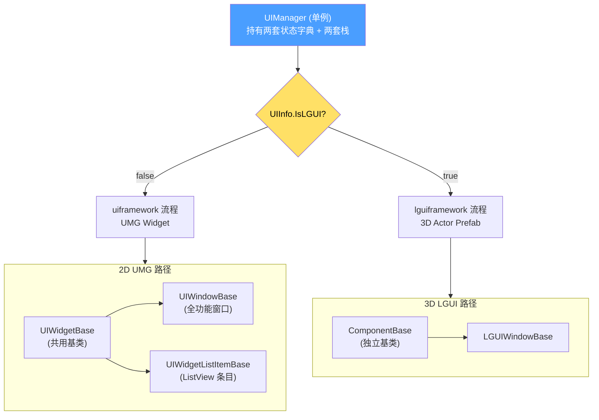
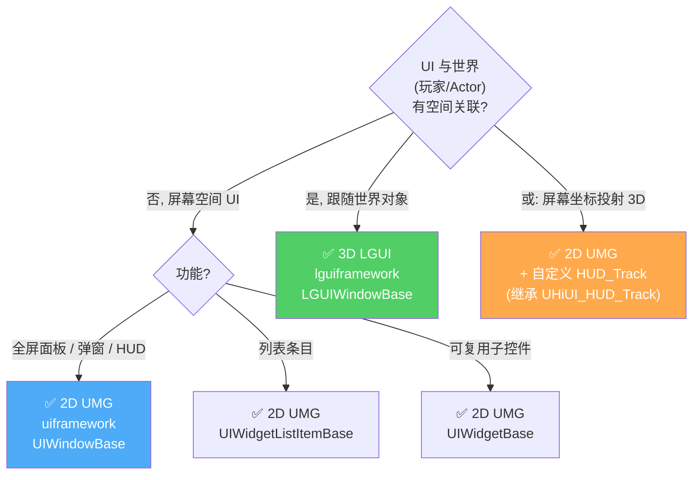
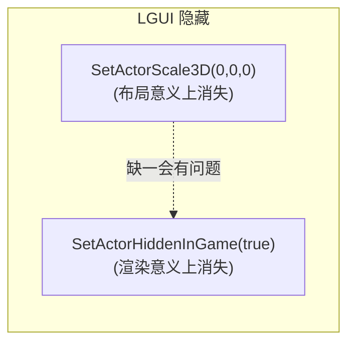
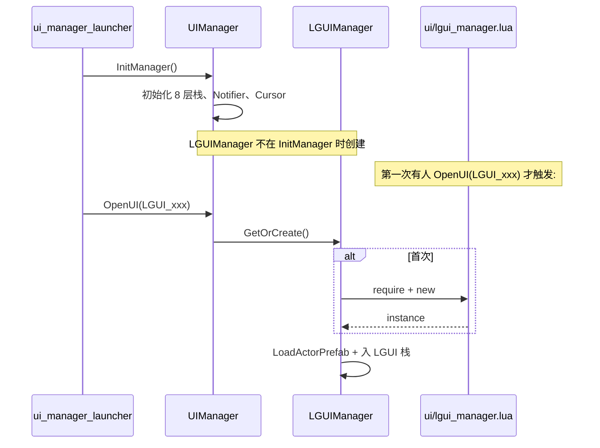

# 2D vs 3D 双轨(uiframework vs lguiframework)

很多新人会以为 `lguiframework` 是替代 `uiframework` 的新框架。**这是误解**。两者是**两种渲染模式**,共用同一个 `UIManager`,通过 `UIInfo.IsLGUI` 标志区分流程,生命周期方法名甚至都完全一致[^48]。本页解释它们各自的语义、应该选哪个、以及代码层面的实际差异。

## 共用 UIManager,两种实现



## 关键差异表

| 维度 | uiframework (2D UMG) | lguiframework (3D LGUI) |
|------|----------------------|------------------------|
| **基类** | `UIWindowBase ← UIWidgetBase` | `LGUIWindowBase ← ComponentBase` |
| **渲染** | UMG Widget,`AddToViewport` | 3D 场景 Actor prefab |
| **隐藏方式** | `SetVisibility(Collapsed)` | `SetActorScale3D(0,0,0) + SetActorHiddenInGame(true)` |
| **配置表** | `UIDef.UIInfo["UI_xxx"]` | `UIDef.LGUIInfo["LGUI_xxx"]` |
| **DataTable** | `/Game/.../UIInfo` | `/Game/.../LGUIInfo` |
| **生命周期方法名** | `OnCreate/UpdateParams/StartShow/...` | **完全相同**(独立实现) |
| **典型场景** | 全屏面板 / 弹窗 / HUD / 列表 | 角色头顶血条 / 世界标记 / 3D 菜单 |
| **栈** | uiStackManager 8 层 | LGUIManager 单独栈 |
| **Modal** | 在 IngameLayerManager 插入 UIMask | 不适用(3D 空间) |
| **打开 API** | `UIManager:OpenUI` | 同上(自动路由到 LGUI 流程) |

## 选哪个?决策树



> "屏幕坐标投射 3D"不是 LGUI — 它是 UMG widget 的位置由 C++ `UHiUI_HUD_Track` 计算后赋值,本质仍是 UMG。详见 [10. C++ 与 Lua 边界](10.%20C%2B%2B%20与%20Lua%20边界.md)。

## 隐藏机制为什么不同?

UMG widget 是 Slate 渲染管线的一部分,设 `SetVisibility(Collapsed)` 就完全脱离布局并停止接收输入。LGUI 则是**真实 3D 场景中的 Actor**(prefab),不能简单"隐藏",项目选用了**双管齐下**[^48]:



**只设 Scale=0**:Actor 仍参与某些计算(碰撞、Tick),性能浪费。**只设 HiddenInGame**:子组件可能仍然交互。两者一起才彻底"看不见、摸不着"。

## LGUIManager 是延迟加载的



意义:**没用 3D LGUI 的项目部分(例如纯 PvP 大厅),内存里根本不会出现 LGUIManager**。

## 生命周期一致 — 但代码独立

`LGUIWindowBase` 自己实现了一套 `OnCreate/UpdateParams/StartShow/OnShow/.../OnDestroy`,**方法名与 `UIWindowBase` 完全一致**,这是项目刻意的 API 对齐设计。这意味着:

- AI 写 LGUI 时可以套用 UIWindowBase 的[生命周期模板](2.%20UIWindowBase%20生命周期.md)
- 但 `LGUIWindowBase` 不能直接 `require('ui.uiframework.ui_window_base')`,要 `require('ui.lguiframework.lgui_window_base')`
- MVVM 仍然共用 `ui/uiframework/mvvm/`(这套是渲染无关的)

## 业务代码怎么打开 LGUI?

```lua
local UIDef     = require('ui.uiframework.ui_define')
local UIManager = require('ui.uiframework.ui_manager')

-- 跟 2D 用法一样, UIInfo.IsLGUI 由 DataTable 决定走哪条路
UIManager:OpenUI(UIDef.LGUIInfo.LGUI_NPCAvatar, function(panel)
    panel:Bind(npcActor)
end)
```

## 关键文件

- `Content/Script/ui/lguiframework/lgui_window_base.lua` — 3D 窗口基类
- `Content/Script/ui/lgui_manager.lua` — 3D 加载器
- DataTable: `/Game/CP0032305_GH/Blueprints/DT/LGUIInfo`
- `Content/Script/ui/components/mineral_hp_widget.lua` — 3D 组件样例(继承 `UI3DComponent`)

[^48]: [[higame-ui-framework-overview|HiGame UI Lua 框架架构]] · 本地代码考古

## Sources

| # | Title | Raw Note | Original |
|---|-------|----------|----------|
| 48 | HiGame UI 框架架构 | [[higame-ui-framework-overview]] | p4://Content/Script/ui/lguiframework/ |
