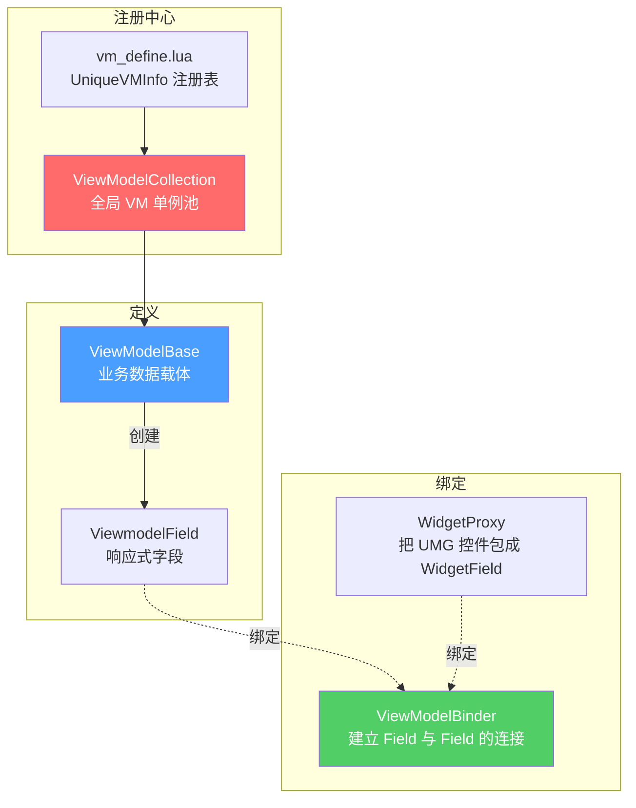
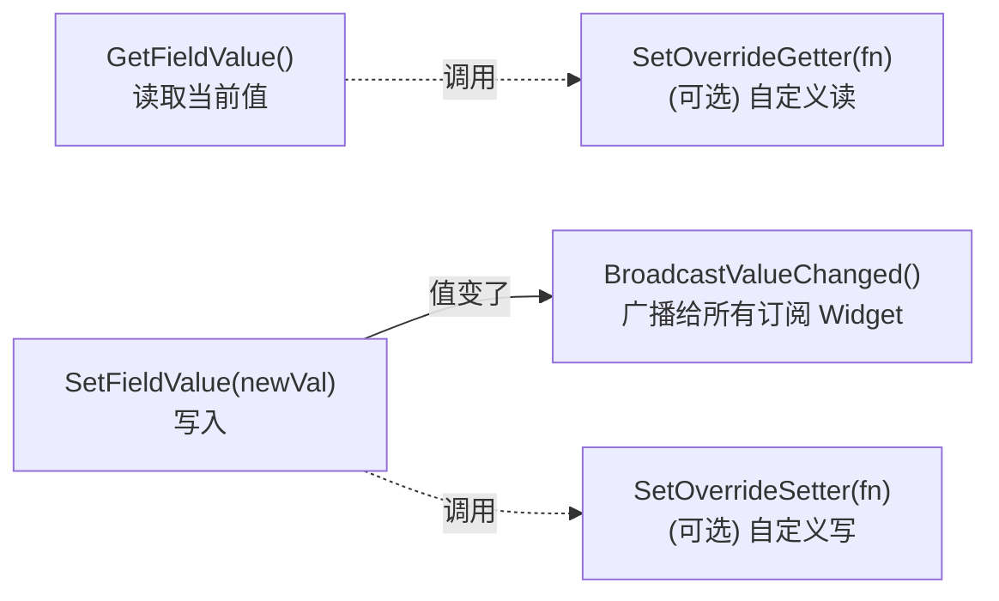
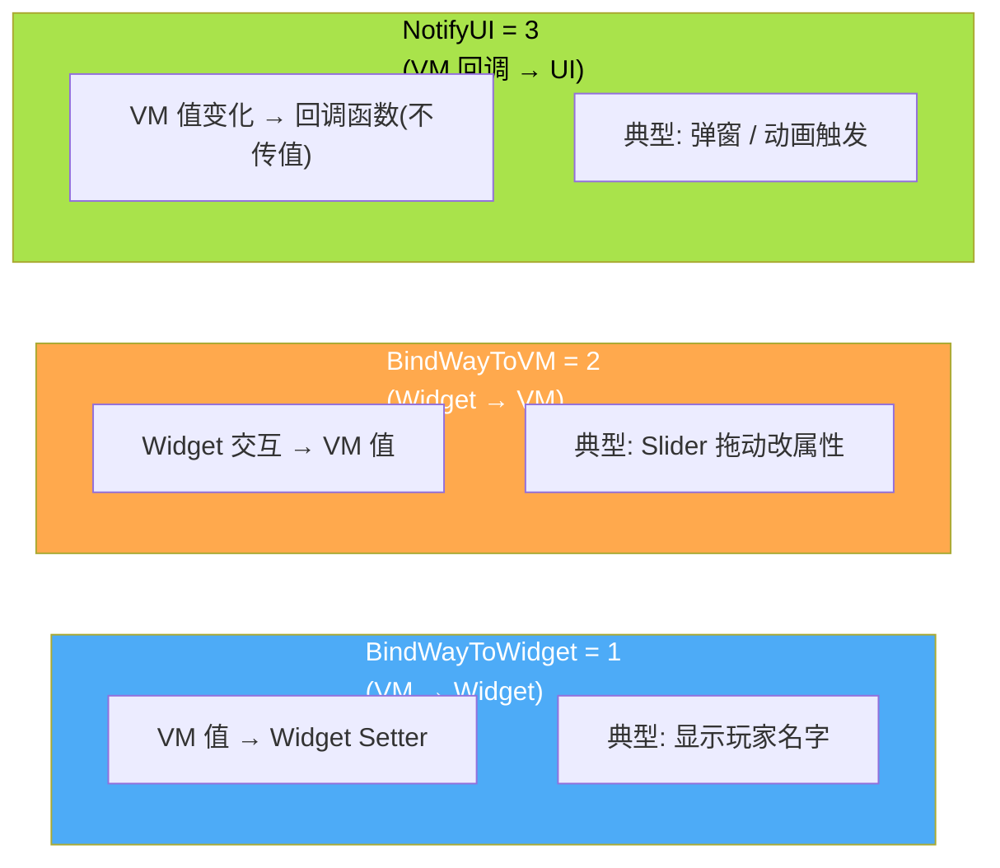
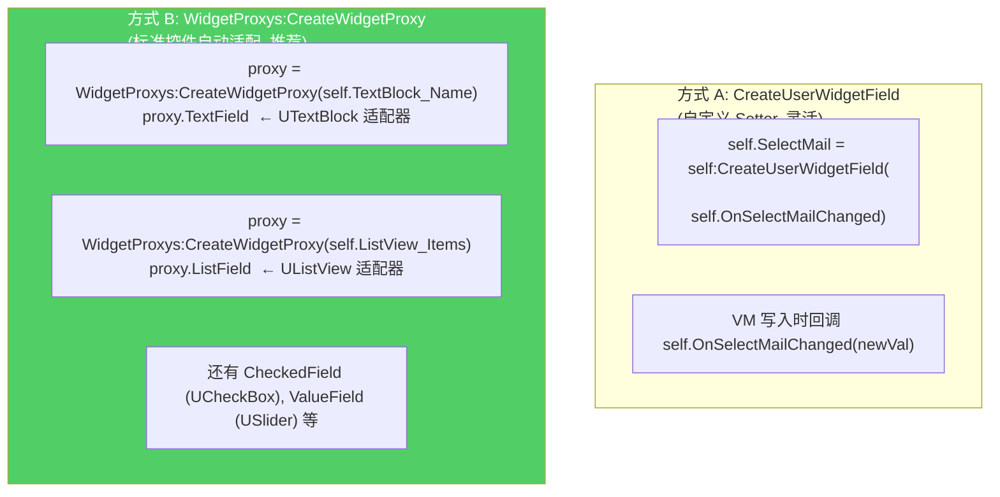
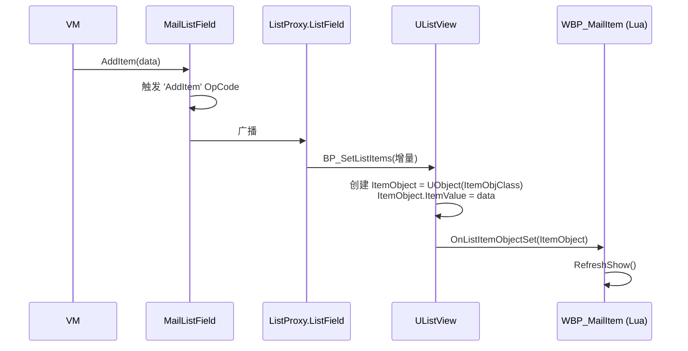
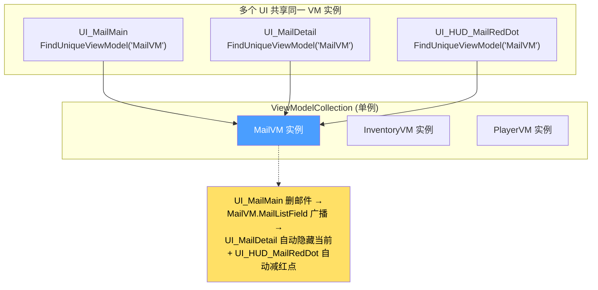
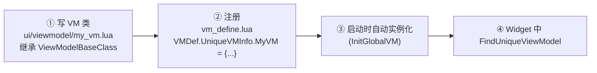

# MVVM 数据绑定

HiGame UI 的核心**数据-表现解耦**机制,实现在 `ui/uiframework/mvvm/`。它**不是双向绑定**,而是显式的三种 BindWay(VM→UI / UI→VM / Notify),通过 `ViewModelBase + ViewmodelField + ViewModelBinder + WidgetProxy + ViewModelCollection` 五件套协作[^50]。本页讲清楚每件套的接口、ListView 怎么数据驱动、跨 UI 怎么共享数据。

## 五件套总览



## ViewModelBase — 业务数据载体

```lua
-- 创建单值字段
self.PlayerName = self:CreateVMField('default')

-- 创建数组字段(驱动 ListView/TileView)
self.ItemList = self:CreateVMArrayField({})
```

返回值分别为 `ViewmodelField` 和 `ViewmodelFieldArray`。VM 的职责是**持有数据、对外暴露 Field、通过 IRPC 拉数据**;**不负责显示**。

## VMField — 响应式字段



源码核心逻辑[^50]:

```lua
function VMField:SetFieldValue(newVal)
    if newVal ~= self.FieldValue then
        self.FieldValue = newVal
        self:BroadcastValueChanged()
    end
end
```

`==` 比较隐含一个限制:**复杂 table 引用相同时即使内容变了也不会触发广播**。需要用 `SetFieldValue(deepcopy(t))` 或重写 `SetOverrideSetter` 强制广播。

## ViewModelBinder — 三种 BindWay

`viewmodel_binder.lua` L155-158 定义[^50]:

```lua
ViewModelBinder:BindViewModel(widgetField, vmField, BindWay)
```



| 常量 | 值 | 数据流向 | 何时立即同步 |
|---|---|---|---|
| `BindWayToWidget` | 1 | VM → Widget | 立即用 VM 值初始化 Widget |
| `BindWayToVM`     | 2 | Widget → VM | 立即用 Widget 值初始化 VM |
| `NotifyUI`        | 3 | VM → UI 回调 | 不立即同步,只回调 |

**解绑** — `Destruct` 时必调:

```lua
ViewModelBinder:UnBindByUI(self, true)        -- 一键解绑该 UI 上所有绑定
ViewModelBinder:UnBindByViewModel(vm)         -- 解绑 VM 上的所有
ViewModelBinder:UnBindByWidgetField(field)    -- 解绑单个 WidgetField
```

不解绑会导致**热更后旧 self 残留 + GC 不回收**。

## Widget 侧创建可绑定 Field

两种方式:



## ListView 数据驱动 — 必须读

最常用,也是性能最敏感的部分。**不要每次全量 SetItems**,要用增量 OpCode:

```lua
-- ============ VM 侧 ============
local ViewModelBaseClass = require('ui.uiframework.mvvm.viewmodel_base')
local M = Class(ViewModelBaseClass)

function M:ctor()
    Super(M).ctor(self)
    self.MailListField = self:CreateVMArrayField({})
end

function M:Add(item)
    self.MailListField:AddItem(item)            -- 增量 OpCode
end

function M:Remove(id)
    self.MailListField:RemoveItemIf(function(field)
        return field:GetFieldValue().ID == id
    end)
end

-- ============ Widget 侧 ============
function MailUI:Construct()
    self.MailList = WidgetProxys:CreateWidgetProxy(self.ListView_Mail)
    ViewModelBinder:BindViewModel(
        self.MailList.ListField,
        self.MailVM.MailListField,
        ViewModelBinder.BindWayToWidget)
end
```

`UListViewProxy:SetListItems` 内部为每条数据**创建一个 UObject**(`ItemObjClass`),设 `obj.ItemValue = data`,然后调用 `BP_SetListItems`。每个条目 Widget 在 `OnListItemObjectSet(ListItemObject)` 中接收数据[^50]:

```lua
-- WBP_MailItem 对应 lua
function MailItem:OnListItemObjectSet(ListItemObject)
    self.Info  = ListItemObject.ItemValue.FieldValue
    self.ID    = self.Info.ID
    self.Title = self.Info.Title
    RefreshShow(self)
end
```



## ViewModelCollection — 全局单例池 + 跨 UI 通信

VM 在 `ui/viewmodel/vm_define.lua` 集中声明[^50]:

```lua
-- vm_define.lua
VMDef.UniqueVMInfo.MailVM = {
    UniqueName = 'MailVM',
    ViewModelClassPath = 'ui.viewmodel.mail_vm',
}
```

启动时 `ViewModelCollection:InitGlobalVM()` 全部实例化。Widget 通过单例引用获取:

```lua
self.MailVM = ViewModelCollection:FindUniqueViewModel(VMDef.UniqueVMInfo.MailVM.UniqueName)
```

**关键好处**:多个 UI 拿到的 `MailVM` 是**同一个实例**。一处改 Field,所有绑定到该 Field 的 UI 都自动刷新 → 这就是跨 UI 通信的标准机制。



## 完整示例 — Mail 主面板

`Content/Script/ui/widget/Mail/ui_mainmail.lua`[^50]:

```lua
local UIWindowBase  = require('ui.uiframework.ui_window_base')
local WidgetProxys  = require('ui.uiframework.mvvm.ui_widget_proxy')
local ViewModelBinder     = require('ui.uiframework.mvvm.viewmodel_binder')
local ViewModelCollection = require('ui.uiframework.mvvm.viewmodel_collection')

local M = UnLua.Class(UIWindowBase)

function M:Construct()
    self.MailList   = WidgetProxys:CreateWidgetProxy(self.ListView_Mail)
    self.SelectMail = self:CreateUserWidgetField(self.ClickMail)
    self.MailVM     = ViewModelCollection:FindUniqueViewModel(
                          VMDef.UniqueVMInfo.MailVM.UniqueName)

    ViewModelBinder:BindViewModel(self.SelectMail,
                                  self.MailVM.SelectInfo,
                                  ViewModelBinder.BindWayToWidget)
    ViewModelBinder:BindViewModel(self.MailList.ListField,
                                  self.MailVM.MailListField,
                                  ViewModelBinder.BindWayToWidget)

    self.WBP_ComBtn_Delete.OnClicked:Add(self, DeleteCurMail)
end

function M:OnShow()
    self.MailVM:SetOwner(self)
end

function M:Destruct()
    ViewModelBinder:UnBindByUI(self, true)
    self.WBP_ComBtn_Delete.OnClicked:Remove(self, DeleteCurMail)
end

return M
```

## 注册新 VM 的步骤



## 陷阱

| 陷阱 | 后果 | 正确做法 |
|---|---|---|
| Destruct 没解绑 | 热更后旧 self 残留 | `ViewModelBinder:UnBindByUI(self, true)` |
| ListView 用 SetItems 全量刷新 | 滚动闪烁、卡顿 | `AddItem` / `RemoveItemIf` 增量 |
| VM 中持有 UI 引用 | 循环引用 → 不能 GC | VM 只持数据,UI 主动订阅 |
| 复杂 table 同引用 SetFieldValue | 不广播(`==` 相等) | 创建新 table 或重写 OverrideSetter |
| 用全局变量代替 VM | 时序问题、刷新不一致 | 一律走 `FindUniqueViewModel` |

[^50]: [[higame-ui-mvvm|HiGame MVVM(ViewModel + Field + Binder + WidgetProxy + Collection)]] · 本地代码考古

## Sources

| # | Title | Raw Note | Original |
|---|-------|----------|----------|
| 50 | HiGame MVVM 框架 | [[higame-ui-mvvm]] | p4://Content/Script/ui/uiframework/mvvm/ |
