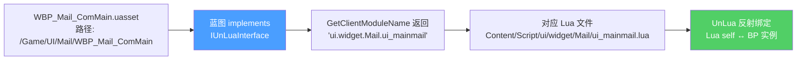
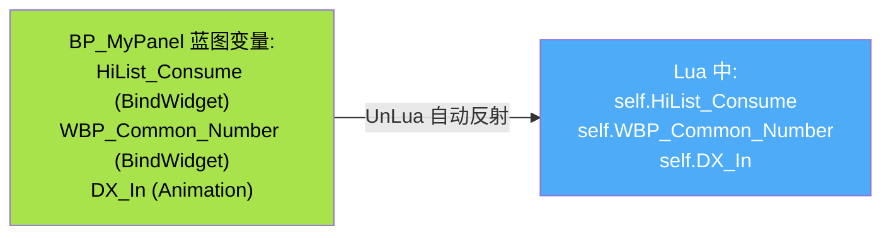
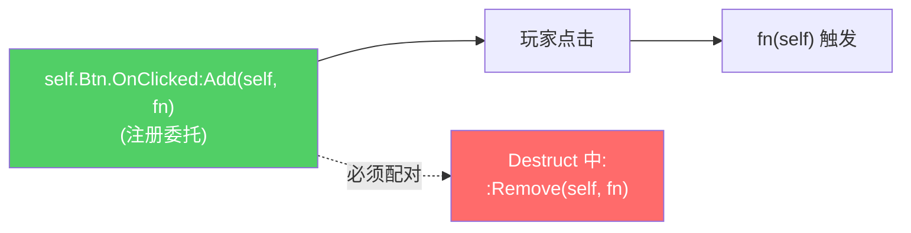
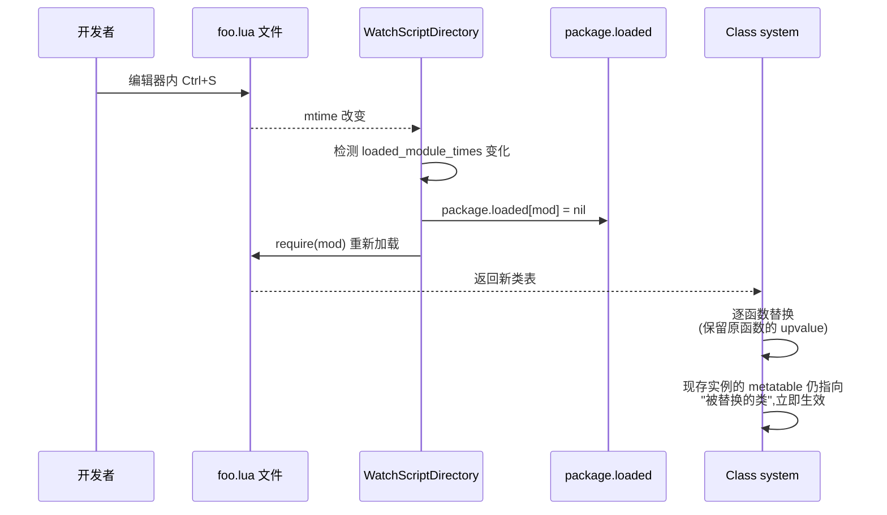
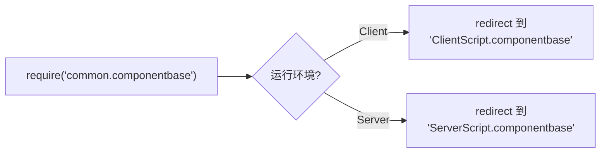

# UnLua 绑定与热更新

UnLua 是公司自研的 Lua 与 UE 互操作插件,把每个 WBP 蓝图与一个 Lua 模块绑定在一起,实现 BlueprintImplementableEvent 落到 Lua、子 Widget 自动注入、热更新等能力。本页讲清楚 HiGame 项目里的具体绑定方式、Lua 类怎么写、子控件怎么访问、热更新原理[^51]。

## 配置 — DefaultUnLuaSettings.ini

```ini
ModuleLocatorClass=/Script/CoreUObject.Class'/Script/UnLua.LuaModuleLocator'
EnvLocatorClass=...LuaEnvLocator_HiGame   ; 自定义 CS 分离 EnvLocator
```

`ModuleLocatorClass=LuaModuleLocator` 表示**按蓝图实现的 `IUnLuaInterface` 返回的字符串路径**定位 Lua 模块。`LuaEnvLocator_HiGame` 是项目自定义的环境隔离器,实现客户端 / 服务端 Lua 环境分离。

## 蓝图 ↔ Lua 路径映射



**CS 分离模式**(项目使用): `GetModuleName` 留空,只填 `GetClientModuleName`(纯客户端 UI)。如果某个 UI 要在客户端和 DS 都用(几乎不会),才填 `GetModuleName`。

## Lua 类声明 — 两种写法

```lua
-- 写法 A: 继承 UIWindowBase (推荐, 全功能窗口)
local UIWindowBase = require('ui.uiframework.ui_window_base')
local M = UnLua.Class(UIWindowBase)

-- 写法 B: 无父类 (简单子控件 / ListItem)
local M = UnLua.Class()
```

**文件末尾必须 `return M`**。

> 知识点:`UnLua.Class` 与 `_G.Class` 是**同一个函数**(`Class.lua` L381-382),完全等价。新代码直接用 `UnLua.Class` 更明确。

## 子 Widget 自动绑定

蓝图中标记 `BindWidget` 的 UPROPERTY,Lua 中通过**同名属性 self.WidgetName 直接访问,无需声明**[^51]:



**多层嵌套用点号链**:

```lua
self.WBP_Common_Number.Slider_Number   -- 嵌套子 UserWidget 的子 widget
```

## 生命周期方法对应

| Lua 方法 | UE 入口 | 说明 |
|---|---|---|
| `Construct()` / `OnConstruct()` | `UUserWidget::NativeConstruct` | 项目两种命名都存在,**新代码用 `Construct`** |
| `Destruct()` / `OnDestruct()` | `UUserWidget::NativeDestruct` | 必须解绑事件 |
| `Tick(MyGeometry, InDeltaTime)` | 引擎每帧 | 极少用 |
| `OnShow()` / `OnHide()` | `UIWindowBase` 框架级 | 见 [2. 生命周期](2.%20UIWindowBase%20生命周期.md) |

## 按钮 OnClicked — 标准写法

UnLua 把 UMG 委托映射成 Lua 上的可调用对象,接口是 `:Add` / `:Remove`:

```lua
function M:Construct()
    self.Button_Click.OnClicked:Add(self, self.OnClickHandler)
end

function M:Destruct()
    self.Button_Click.OnClicked:Remove(self, self.OnClickHandler)
end

function M:OnClickHandler()
    -- 业务逻辑
end
```



> **关键陷阱**:`Destruct` 中**必须**调 `:Remove`。否则:
> - 热更后旧 self 残留,新 self 注册的回调不生效
> - GC 不能回收旧 self,内存泄漏

## 热更新原理

文件:`Content/Script/CommonScript/UnLua/HotReload.lua`[^51]



**核心机制**:
1. `WatchScriptDirectory` 监听 `Content/Script/` 下所有 .lua 文件的修改时间(mtime)
2. 检测到变化:`package.loaded[mod] = nil` → 重新 `require`
3. 拿到新类后**逐函数替换**到旧类的 metatable 中,**保留 upvalue**
4. 已存在的实例无需重建,立即生效

### 远程 Hotfix

```lua
-- 服务器下发结构: { ModuleName, FunctionName, PatchCode }
-- 走 reload_patches 入口, 精确修复单个函数, 不重建整个类
```

适合线上紧急修 bug,不破坏现有状态。

### `_G.UnLuaHotReload` — C++ 调用入口

`InitEnv.lua` 中:

```lua
_G.UnLuaHotReload = UnLuaHotReload
```

C++ 引擎可通过 `_G.UnLuaHotReload()` 主动触发(例如编辑器命令、控制台命令)。

## 三层目录的 Lua 环境隔离

`LuaEnvLocator_HiGame` 自定义环境隔离器把 Client / Server Lua VM 分开,避免双端 require 冲突。Module 路径重定向表(在 `CommonScript/UnLua/HotReload.lua` 中)解决"同一 require 路径在 Client / Server 走不同实现":



UI 代码几乎只在客户端跑,**通常无需关心环境重定向**,除非引用 `actors/common/` 这类双端组件。

## 完整最小模板

```lua
-- WBP_Example_Main.lua
local UIWindowBase = require('ui.uiframework.ui_window_base')
local UIManager    = require('ui.uiframework.ui_manager')

---@type WBP_Example_Main_C
local M = UnLua.Class(UIWindowBase)

function M:Construct()
    self.Btn_Confirm.OnClicked:Add(self, self.OnConfirmClicked)
    self.Btn_Close.OnClicked:Add(self, self.OnCloseClicked)
    self.Txt_Title:SetText("Hello")
end

function M:Destruct()
    self.Btn_Confirm.OnClicked:Remove(self, self.OnConfirmClicked)
    self.Btn_Close.OnClicked:Remove(self, self.OnCloseClicked)
end

function M:OnShow()
    self:PlayAnimation(self.DX_In, 0, 1, UE.EUMGSequencePlayMode.Forward, 1, false)
end

function M:OnConfirmClicked()
    -- 业务
end

function M:OnCloseClicked()
    UIManager:ReturnUI(self)
end

return M
```

## 陷阱

| 陷阱 | 后果 | 正确做法 |
|---|---|---|
| WBP 没 implements IUnLuaInterface | Lua 类不绑定,所有方法不触发 | 蓝图 implements + 填 `GetClientModuleName` |
| Lua 路径写错(大小写、点号 vs 斜杠) | UnLua 找不到模块,报错 | 严格按 `ui.widget.Mail.ui_mainmail` 形式 |
| 文件末尾忘记 `return M` | UnLua 拿不到类,绑定失败 | 永远以 `return M` 结尾 |
| Construct 中**没**先 `Super(M).Construct(self)` | 父类初始化跳过 | 大部分情况父类有需要时手动调 |
| 在 ServerScript 写 UI | DS 不实例化 UI,代码不跑 | 一律落 `ui/` 或 `ClientScript/` |
| 热更后回调丢失 | Destruct 没解绑 | `:Add` 配对 `:Remove` |

[^51]: [[higame-ui-unlua-and-events|HiGame UnLua 绑定 + UI 事件原语 + UINotifier]] · 本地代码考古

## Sources

| # | Title | Raw Note | Original |
|---|-------|----------|----------|
| 51 | HiGame UnLua 绑定与事件 | [[higame-ui-unlua-and-events]] | p4://Config/DefaultUnLuaSettings.ini |
