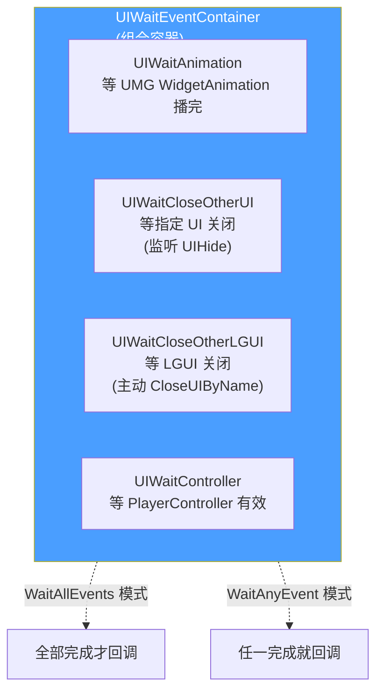
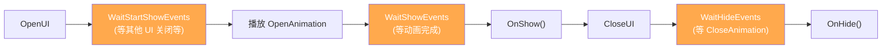
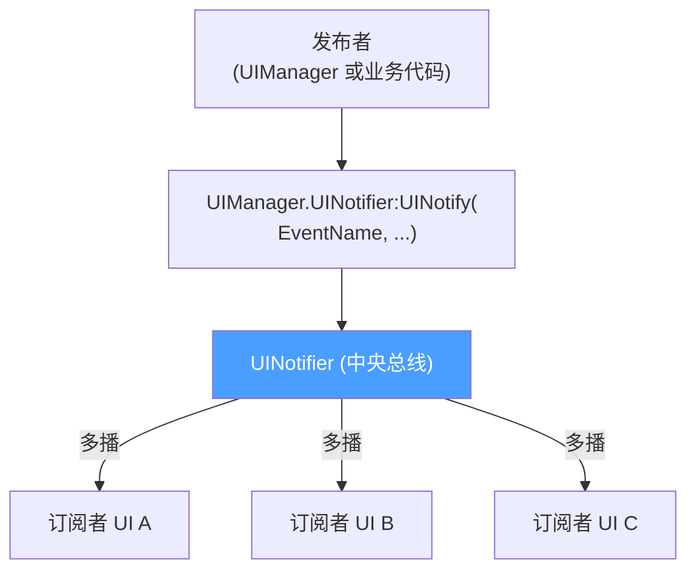
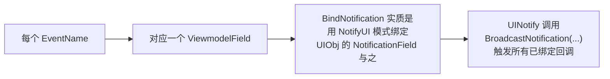

# UI 事件原语与 UINotifier

`UIWindowBase` 的生命周期不是简单的"调用方法",而是**等一组异步事件全部完成才能进入下个阶段**。例如"打开新 UI 之前先等其他 UI 关闭、等动画播完、等 PlayerController 就绪"。HiGame 用一组 `UIWaitXxx` 原语 + `UIWaitEventContainer` 容器统一这套等待机制;UI 之间的交叉通信则用 `UINotifier` 事件总线[^51]。

## 五个 Wait 原语

文件目录:`Content/Script/ui/uiframework/ui_event/`



| 类 | 文件 | 用途 |
|---|---|---|
| `UIWaitAnimation` | `ui_wait_animation.lua` | 等 UMG `WidgetAnimation` 播放完毕 |
| `UIWaitCloseOtherUI` | `ui_wait_close_others.lua` | 等指定 UI 关闭(监听 `UIHide` 通知) |
| `UIWaitCloseOtherLGUI` | `ui_wait_close_lgui.lua` | 等 LGUI 关闭,**主动** `CloseUIByName` 并等回调 |
| `UIWaitController` | `ui_wait_controller.lua` | 等 PlayerController 有效(UI 开启时 Controller 尚未就绪) |
| `UIWaitEventContainer` | `ui_wait_event_container.lua` | 容器组合,提供 `WaitAllEvents` / `WaitAnyEvent` 两种模式 |

## UIWaitAnimation 接口

```lua
local UIWaitAnimation = require('ui.uiframework.ui_event.ui_wait_animation')

local waitAnim = UIWaitAnimation.new(self)
waitAnim:SetWaitAnimation(
    self.ShowAnimation,    -- WidgetAnimation 引用
    bPlayWhenActive,        -- 激活时是否自动播
    startTime,              -- 起始时间
    playMode,               -- UE.EUMGSequencePlayMode
    speed                   -- 倍速
)
```

`UIWindowBase` 内部用三个 `UIWaitEventContainer` 串起整个生命周期:



## UIWaitEventContainer 用例

```lua
local UIEventContainer = require('ui.uiframework.ui_event.ui_wait_event_container')
local UIWaitAnimation  = require('ui.uiframework.ui_event.ui_wait_animation')
local UIWaitController = require('ui.uiframework.ui_event.ui_wait_controller')

local container = UIEventContainer.new()

local waitCtrl = UIWaitController.new(self)
container:AddWaitEvent(waitCtrl)

local waitAnim = UIWaitAnimation.new(self)
waitAnim:SetWaitAnimation(self.ShowAnimation)
container:AddWaitEvent(waitAnim)

container:WaitAllEvents(self, self.OnAllReady, true)

-- 当 PlayerController 就绪 + 动画播完后, 自动调 self:OnAllReady()
```

`WaitAllEvents` 第三个参数 `true` 表示**事件未注册时立即触发**(规避竞态)。

## UINotifier — UI 事件总线

文件:`Content/Script/ui/uiframework/ui_notifier.lua`



### 接口

```lua
-- 注册监听
UIManager.UINotifier:BindNotification(EventName, UIObj, fnDelegate)

-- 取消单个
UIManager.UINotifier:UnbindNotification(UIObj, fnDelegate)

-- 取消 UIObj 上所有监听 (Destruct 时建议)
UIManager.UINotifier:UnbindAllNotification(UIObj)

-- 广播
UIManager.UINotifier:UINotify(EventName, ...)
```

### 标准事件名(`ui_event_def.lua`)

| EventName | 触发时机 |
|---|---|
| `UICreate`     | UI 实例首次创建时 |
| `UIShow`       | UI 进入显示动画时 |
| `UIAfterShow`  | UI 显示动画完成 |
| `UIHide`       | UI 进入隐藏 |
| `UIDestroy`    | UI 销毁 |

业务代码也可以**自定义事件名**广播。

### 实现细节(为什么是 ViewmodelField)



意义:`UINotifier` **复用了 MVVM 的 NotifyUI 绑定机制**,而非另起炉灶。

## 用例

### 监听其他 UI 的关闭

```lua
function MyUI:Construct()
    UIManager.UINotifier:BindNotification(
        UIEventDef.UIHide, self,
        function(ownerProxy, closedUI)
            if closedUI:GetUIName() == "UI_Inventory" then
                self:OnInventoryClosed()
            end
        end)
end

function MyUI:Destruct()
    UIManager.UINotifier:UnbindAllNotification(self)
end
```

### 业务自定义事件

```lua
-- 发布
UIManager.UINotifier:UINotify('OnPlayerLevelUp', newLevel, oldLevel)

-- 订阅
UIManager.UINotifier:BindNotification('OnPlayerLevelUp', self,
    function(ownerProxy, newLevel, oldLevel)
        self:PlayLevelUpAnimation()
    end)
```

## Notifier vs MVVM — 何时用哪个?

```mermaid
flowchart TD
    Q1{要传的是<br/>数据状态<br/>还是事件?}

    Q1 -->|数据(玩家名/血量/物品列表)| MVVM["✅ MVVM<br/>VM 持有 Field<br/>UI 订阅"]

    Q1 -->|一次性事件<br/>(关卡完成/拾取物品/升级)| NOTIFIER["✅ UINotifier<br/>UINotify 广播"]

    Q1 -->|UI 之间生命周期联动<br/>(等关闭/等显示)| EVENTS["✅ UI Wait 原语<br/>+ UINotifier 标准事件"]

    style MVVM fill:#4dabf7,color:#fff
    style NOTIFIER fill:#51cf66,color:#fff
    style EVENTS fill:#ffa94d,color:#fff
```

**简化原则**:
- **数据可重读** → MVVM(订阅方迟到也能拿到当前值)
- **事件不能错过** → Notifier(广播一次,所有订阅者都收到)
- **跨 UI 调度** → Wait 原语(等条件齐再继续)

## 陷阱

| 陷阱 | 后果 | 正确做法 |
|---|---|---|
| Destruct 没 UnbindAllNotification | 旧 self 残留 | 配套调用 |
| 用 Notifier 传"当前值"(状态) | 迟到的订阅者拿不到 | 改用 MVVM |
| WaitAnimation 等的 anim 是 nil | 等不到事件,卡住 | 检查 anim 引用,必要时跳过 |
| Wait 链漏调用 `WaitStartShowComplete` 内部 | 卡在 Showing 不进 Showed | 走框架默认流程,不要覆写内部方法 |

[^51]: [[higame-ui-unlua-and-events|HiGame UnLua 绑定 + UI 事件原语 + UINotifier]] · 本地代码考古

## Sources

| # | Title | Raw Note | Original |
|---|-------|----------|----------|
| 51 | HiGame UnLua + 事件 | [[higame-ui-unlua-and-events]] | p4://Content/Script/ui/uiframework/ui_event/ |
