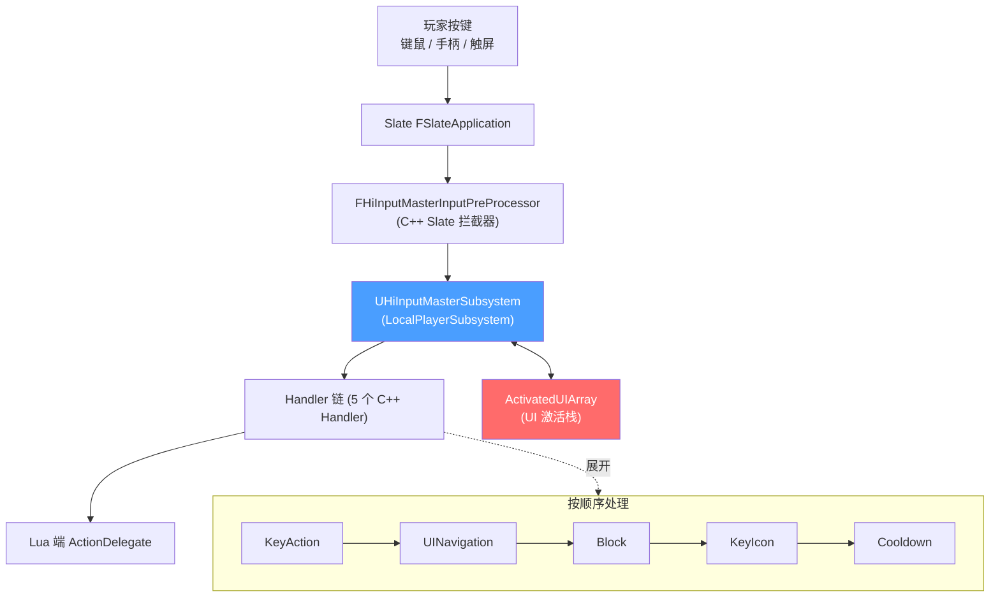
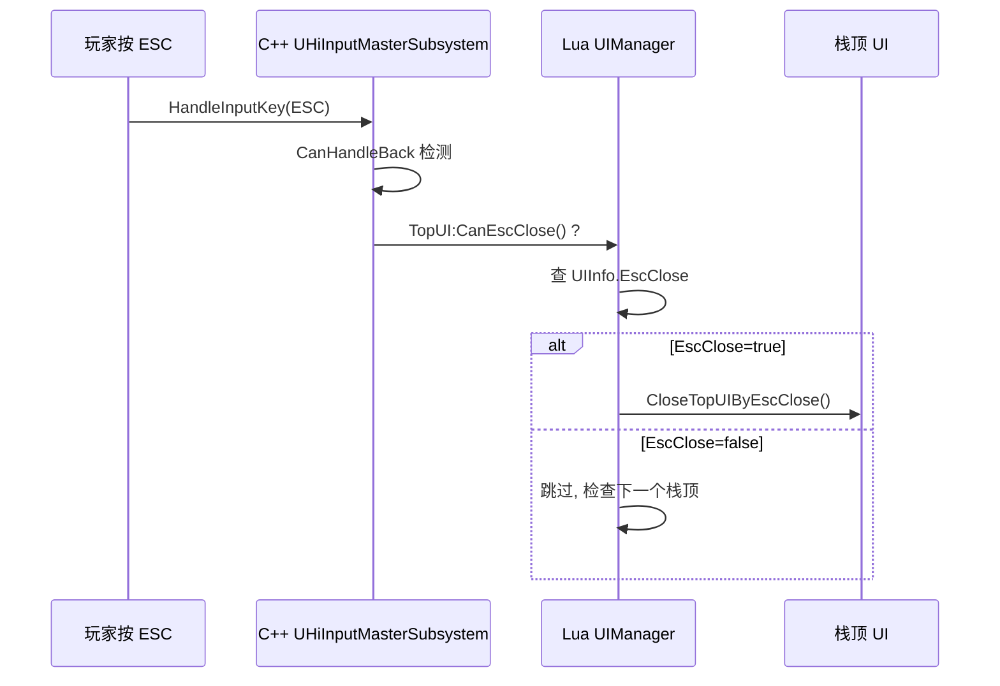
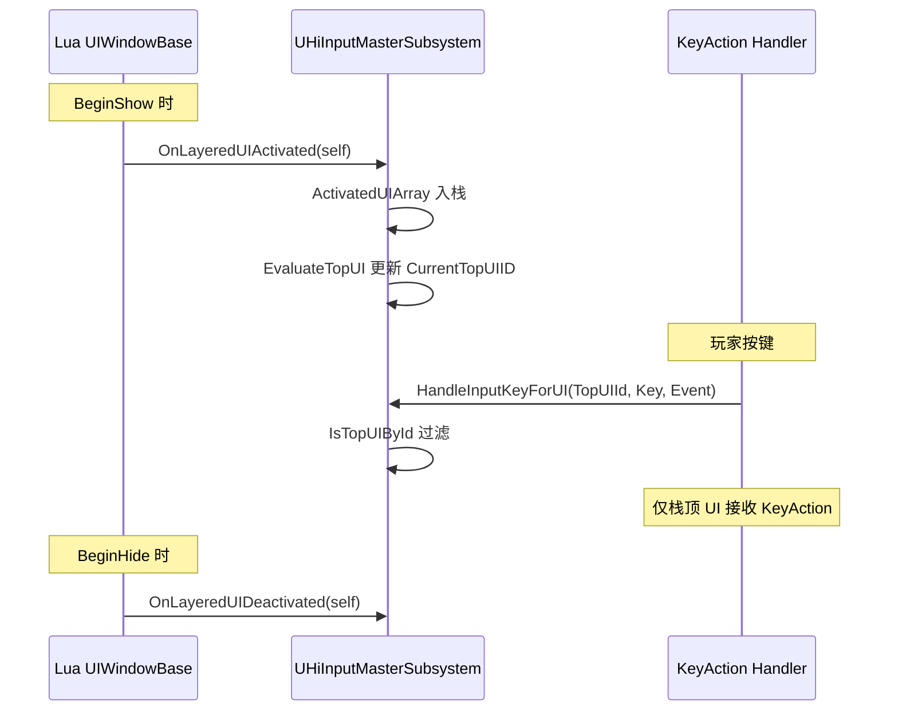
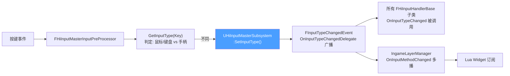
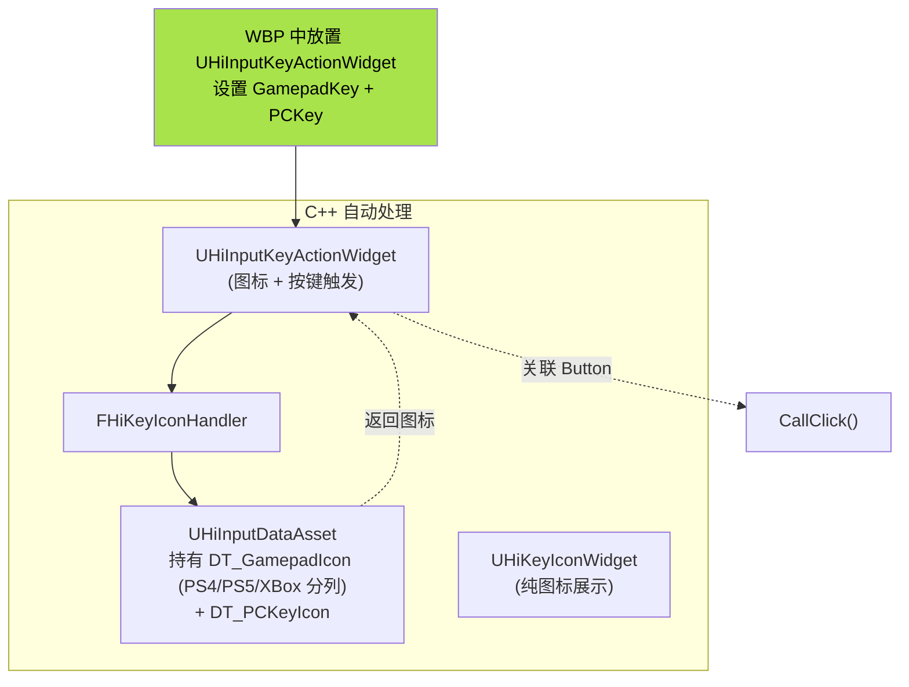
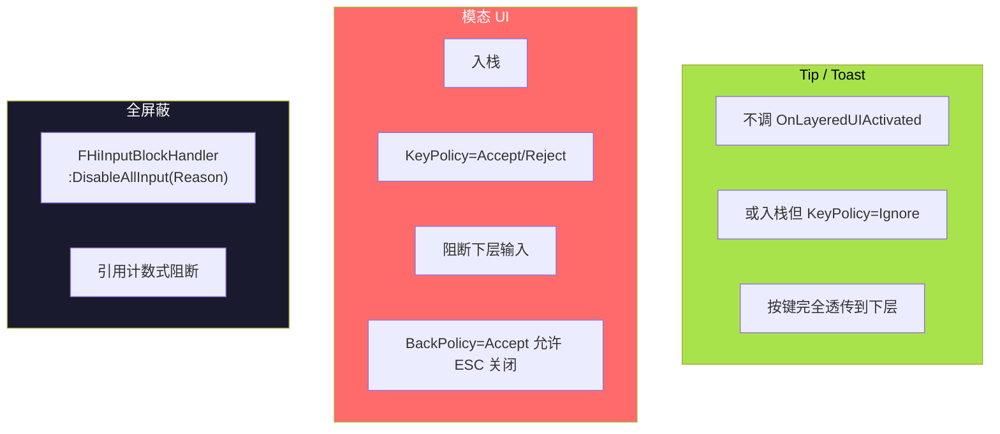

# 输入系统 — 键鼠 / 手柄 / ESC / UI 激活栈

HiGame 完全自研了一套 UI 输入系统(**不是** UE CommonUI),核心是 `UHiInputMasterSubsystem` + `IngameLayerManager` + Lua 端 `input_define`。Lua 不监听 KeyCode,而是**通过 EnhancedInput Action 名注册回调**;ESC / Back 走 `UIInfo.EscClose` 自动机制;按键提示图标在 WBP 中放 `UHiInputKeyActionWidget` 即可,引擎根据当前设备自动切换图标[^52]。本页讲清楚整套机制。

## 整体架构



## Lua 监听按键 — Action 名注册

**机制**:Lua 通过 EnhancedInput Action 名注册回调,**不直接监听 KeyCode**。这样设备切换、按键重映射都能 work。

### 配置文件

`Content/Script/ui/uiframework/input_define.lua`[^52]:
- `DefaultUIAction` 表:所有 UI 可用 Action 名,映射到 `IA_UI_*` InputAction 资产
- `ActionEvent` 枚举:`Triggered / Started / Completed / Canceled`(对应 EnhancedInput 的 Trigger State)

### 注册 API

```lua
local InputDef = require('ui.uiframework.input_define')

UIManager:RegisterActionDelegate(
    UIObj, fnDelegate, ActionName, ActionEventType)

-- Destruct 必须反注册
UIManager:UnRegisterActionDelegate(
    UIObj, ActionName, ActionEventType)
```

### 示例:监听手柄 Y 按钮

```lua
function MyUI:Construct()
    UIManager:RegisterActionDelegate(
        self, self.OnYButtonPressed,
        InputDef.DefaultUIAction.Button_Top,    -- IA_UI_Button_Top
        InputDef.ActionEvent.Started)
end

function MyUI:Destruct()
    UIManager:UnRegisterActionDelegate(
        self,
        InputDef.DefaultUIAction.Button_Top,
        InputDef.ActionEvent.Started)
end

function MyUI:OnYButtonPressed()
    -- 业务逻辑
end
```

## ESC / Back 关闭机制

**不需手写监听**,设 `UIInfo.EscClose=true` 即可。底层流程[^52]:



业务代码自定义 Back 逻辑(例如先弹"确定退出?"二次确认):

```lua
function MyWindow:OnReturn()
    UIManager:OpenUI(UIDef.UIInfo.UI_ConfirmExit, function(confirm)
        if confirm then
            UIManager:CloseUI(self, true)
        end
    end)
    return true   -- 返回 true 阻止默认关闭
end
```

## UI 激活栈 — TopUI 判定

C++ 端 `UHiInputMasterSubsystem`[^52]:

| 接口 | 作用 |
|---|---|
| `ActivatedUIArray: TArray<TWeakObjectPtr<UUserWidget>>` | 有序栈 |
| `OnLayeredUIActivated(UUserWidget*)` | 入栈(由 Lua `BeginShow` 调) |
| `OnLayeredUIDeactivated(UUserWidget*)` | 出栈(由 Lua `BeginHide`/`BeginDestroy`/`CloseMyself` 调) |
| `EvaluateTopUI()` | 计算 `CurrentTopUIID` |
| `IsTopUI()` / `IsTopUIById()` | 判定栈顶 |
| `FOnLayeredUIActivationChangedEvent` | 广播栈变化 |



**关键性质**:KeyAction 分发**仅对栈顶生效** — 这是模态/非模态行为差异的根源。

## 输入设备切换通知



### Lua 订阅设备切换

```lua
function MyUI:Construct()
    UIManager.IngameLayerManager.OnInputMethodChanged
        :Add(self, self.OnInputMethodChanged)
end

function MyUI:OnInputMethodChanged(NewInputType)
    -- NewInputType: UE.ECommonInputType.MouseAndKeyboard / Gamepad
    if NewInputType == UE.ECommonInputType.Gamepad then
        self.MousePromptCanvas:SetVisibility(UE.ESlateVisibility.Collapsed)
        self.GamepadPromptCanvas:SetVisibility(UE.ESlateVisibility.Visible)
    else
        -- 反之
    end
end
```

## KeyMap / KeyIcon / KeyAction 三位一体

**配置按键提示无需写 Lua**,在 WBP 中放置 `UHiInputKeyActionWidget`,引擎自动:
1. 通过 `FHiKeyIconHandler` 查 `DT_GamepadIcon` / `DT_PCKeyIcon` 表获取图标
2. 设备切换时自动调 `OnInputTypeChanged` 切换 Slot 可见性
3. 按键按下时自动找关联 Button 执行 `CallClick()`



| 类 | 职责 |
|---|---|
| `UHiInputKeyActionWidget` | 绑定 `GamepadKey` + `PCKey`,自动切换显示,按键触发 `CallClick()` |
| `UHiKeyIconWidget`        | 纯图标展示,按设备类型自动切 Gamepad/Keyboard Slot |
| `FHiKeyIconHandler`       | 查 `DT_GamepadIcon` / `DT_PCKeyIcon` DataTable 获图标 |
| `UHiInputDataAsset`       | 持有图标 DataTable,按平台分列 |
| `input_define.DefaultUIAction` | Action 名 → IA 资产名映射 |

## Tip vs 模态 UI 输入屏蔽

策略枚举 `EHiInputMasterUIHandleKeyPolicy`[^52]:

| 策略 | 含义 |
|---|---|
| `Ignore`   | 透传按键到下层 |
| `Accept`   | 接收 |
| `Reject`   | 阻塞(不传递) |
| `LowLevel` | 接收但最低优先级 |

### 配置方式

| 方式 | 说明 |
|------|------|
| `DT_InputKeysExcludedLayeredWidgets` | 按 UI 蓝图名配置 `KeyPolicy + BackPolicy` |
| `DT_InputKeysExcludedLayer`          | 按 Layer 名配置 |
| 运行时 API                            | `SetLayeredUIKeyPolicy(UI, Policy)` / `SetLayeredUIBackPolicy(UI, Policy)` |

### 实际差异



### 全局快捷键 — bIgnoreAnyViewportWidgets

```lua
-- 在 WBP 的 KeyActionWidget 上设置 bIgnoreAnyViewportWidgets=true
-- 该按键无视栈顶判断, 始终响应
```

适用于:截图键、控制台、引擎调试快捷键等。

## 陷阱

| 陷阱 | 后果 | 正确做法 |
|---|---|---|
| 监听 KeyCode | 设备切换/重映射失效 | 用 `RegisterActionDelegate` + Action 名 |
| 没有反注册 ActionDelegate | 热更/GC 泄漏 | Destruct 配套 `UnRegisterActionDelegate` |
| 模态 UI 没设 `IsModal=true` | 下层仍能接收输入 | UIInfo 配置 `IsModal=true` |
| Tip 入栈了 | 阻断主 HUD 操作 | 不调 `OnLayeredUIActivated` 或 `KeyPolicy=Ignore` |
| 全局快捷键放普通 Button | 栈顶过滤后不响应 | 用 KeyActionWidget + `bIgnoreAnyViewportWidgets=true` |
| 切换设备后 UI 提示图标错乱 | 没订阅 OnInputMethodChanged | 在 Construct 中订阅,Destruct 反订阅 |

[^52]: [[higame-ui-input-and-navigation|HiGame UI 输入系统(键鼠/手柄/ESC/KeyAction/KeyIcon) + UI 激活栈]] · 本地代码考古

## Sources

| # | Title | Raw Note | Original |
|---|-------|----------|----------|
| 52 | HiGame UI 输入系统 | [[higame-ui-input-and-navigation]] | p4://Source/HiGame/Public/UINavigation/ |
