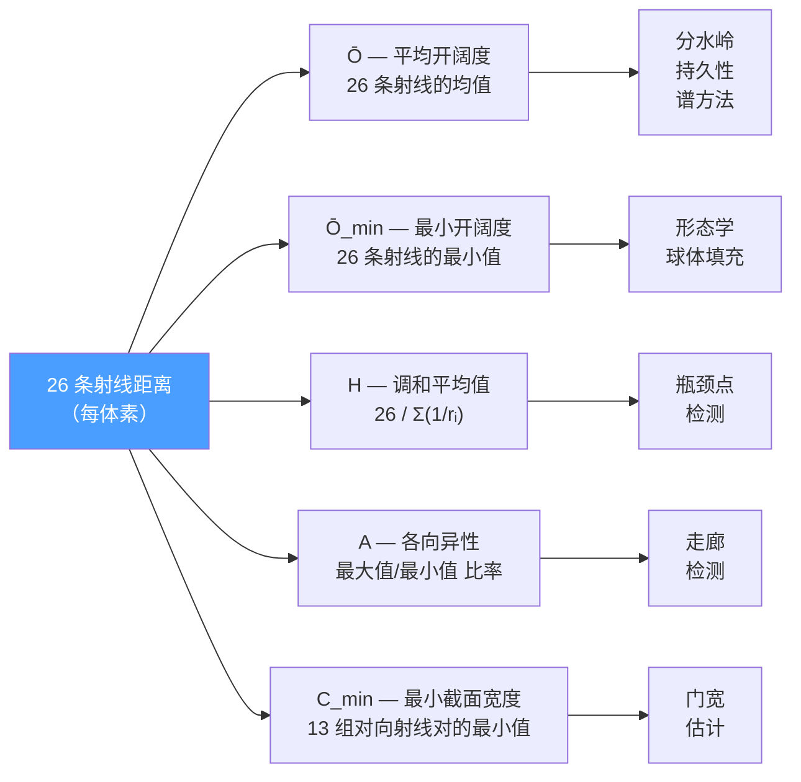
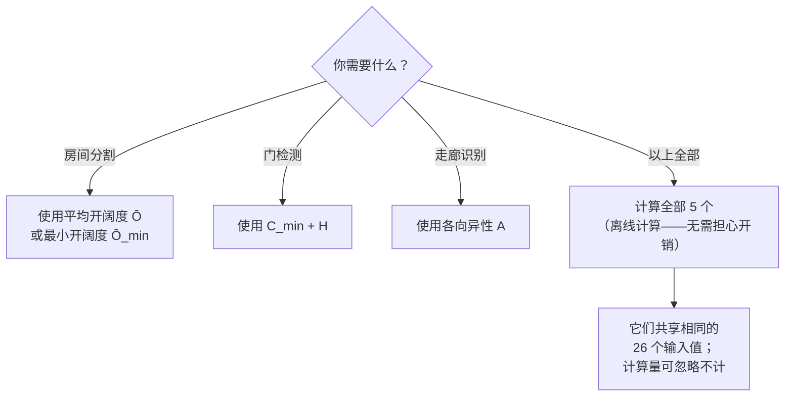

# 射线距离到标量场的转换

每个体素存储的 26 方向射线距离是一种信息丰富但维度较高的表示。在任何分割算法运行之前，必须将其归约为一个或多个**标量场**——即每个体素对应一个标量值，用于编码空间属性，例如"该体素有多开阔？"或"此处通道有多宽？"。标量场的选择直接决定了后续可用的算法种类及其效果。

## 由 26 条射线派生的五种标量场



### 标量场 1：平均开阔度 (Ō)

```
Ō(v) = (1/26) · Σᵢ ray_distance_i(v)
```

**捕捉的信息**：整体空旷程度。房间中心处值较高，走廊中等，墙壁附近和门口处极低。其行为与环境光遮蔽（Ambient Occlusion）类似——研究表明，AO 场在分离相连腔体方面**优于纯距离变换**[^13]。

**最适用于**：[分水岭分割](3. Watershed 分割.md)、[拓扑持久性](5. 拓扑持久性分割.md)、[谱聚类](6. 谱聚类分割.md)亲和度。

### 标量场 2：最小开阔度 (Ō_min)

```
Ō_min(v) = min_i(ray_distance_i(v))
```

**捕捉的信息**：最受约束的方向——近似于**到最近墙壁的距离**，等价于欧氏距离变换（EDT）。房间中心的体素 Ō_min ≈ 房间最小维度的一半。

**最适用于**：[形态学腐蚀](2. 形态学分割.md)（用作二值阈值）、[球体填充](4. 球填充分割.md)（球体半径 = Ō_min）。

### 标量场 3：调和平均值 (H)

```
H(v) = 26 / Σᵢ (1 / ray_distance_i(v))
```

**捕捉的信息**：类似于平均开阔度，但**对任何短射线施加严重惩罚**。单面近墙就会主导调和平均值，使其对狭窄通道极为敏感。即使只有一条射线较短，H 也会被拉向该短距离附近。

**最适用于**：[瓶颈点检测](7. 瓶颈点检测.md)——门口处 H 会产生剧烈下降，比在 Ō 中更容易通过阈值识别。

### 标量场 4：方向各向异性 (A)

```
A(v) = max_i(ray_distance_i(v)) / min_i(ray_distance_i(v))
```

**捕捉的信息**：局部空间的形状。各向同性空间（房间）的 A ≈ 1–3。细长空间（走廊）的 A ≫ 3。角落体素的 A 也可能较高，但可通过绝对最小开阔度进行过滤。

**最适用于**：[走廊分类](8. 走廊分类.md)——最直接的指标。

| 空间类型 | A（典型值） | Ō_min（典型值） |
|----------|------------|-----------------|
| 房间中心 | 1–2 | 较大（>2m） |
| 走廊中心 | 5–20 | 较小（0.5–1.5m） |
| 门口 | 3–8 | 很小（<0.5m） |
| 靠墙区域 | 2–10 | 很小（<0.3m） |

### 标量场 5：最小截面宽度 (C_min)

对 26 个方向中的 13 组对向射线对分别计算：

```
C_j(v) = ray_distance_j(v) + ray_distance_opposite_j(v)
C_min(v) = min_j(C_j(v))
```

**捕捉的信息**：该体素在任意方向上的**最窄通道宽度**。门口体素的 C_min ≈ 门宽（0.8–1.0m）。房间中心体素的 C_min ≈ 房间最小维度。

**最适用于**：直接进行[门宽估计](7. 瓶颈点检测.md)——对 C_min < 1.2m 设置阈值即可找到所有门级别的瓶颈。

## 如何选择合适的标量场



由于目标是离线计算，**建议计算全部五种标量场**。每个体素的额外开销可忽略不计（仅对已在内存中的 26 个值执行若干算术运算）。不同的后续阶段将使用不同的标量场。

## UE5 实现备注

26 个方向对应三维网格中的 26 个邻居（6 个面邻居 + 12 个棱邻居 + 8 个角邻居）。C_min 所用的 13 组对向射线对如下：
- 3 组面对：+X/-X、+Y/-Y、+Z/-Z
- 6 组棱对：(+X+Y)/(-X-Y)、(+X-Y)/(-X+Y)、(+X+Z)/(-X-Z)、(+X-Z)/(-X+Z)、(+Y+Z)/(-Y-Z)、(+Y-Z)/(-Y+Z)
- 4 组角对：(+X+Y+Z)/(-X-Y-Z)、(+X+Y-Z)/(-X-Y+Z)、(+X-Y+Z)/(-X+Y-Z)、(+X-Y-Z)/(-X+Y+Z)

棱方向和角方向的射线距离在汇总前应**按实际欧氏距离进行归一化**（棱方向 ×√2，角方向 ×√3），以使其与面方向的距离具有可比性。

[^9]: [[chokepoint-detection|瓶颈点检测方法]]
[^10]: [[corridor-detection|走廊检测方法]]
[^13]: [[ao-openness-field|射线距离开放度场]]

## Sources

| # | Title | Raw Note | Original |
|---|-------|----------|----------|
| 9 | 瓶颈点检测方法 | [[chokepoint-detection]] | — |
| 10 | 走廊检测方法 | [[corridor-detection]] | — |
| 13 | 射线距离开放度场 | [[ao-openness-field]] | — |
