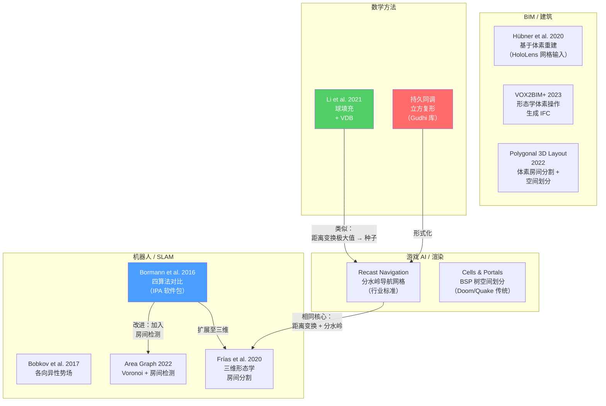
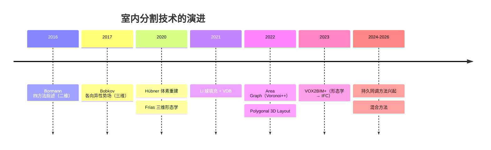

# 学术综述：室内空间分割（2017–2026）

本页梳理了基于体积/体素数据的室内空间分割的学术全景，聚焦于确定性（非机器学习）方法。该领域横跨三个社区——BIM/建筑、机器人 SLAM 和游戏 AI——各自侧重不同，但在技术路线上日趋交汇。

## 文献关系图

## 按方法分类的关键论文

### 形态学 / 距离变换

| 论文 | 年份 | 核心贡献 | 输入类型 |
|-------|------|-----------------|------------|
| Bormann et al. (ICRA) | 2016 | 对比四种算法；发布 IPA ROS 软件包 | 二维栅格 |
| Frías et al. (ISPRS) | 2020 | 将形态学方法扩展至完整三维体素 | 三维点云 |
| VOX2BIM+ (PFG) | 2023 | 三维形态学操作 + 参数化墙体重建 → IFC | 三维点云 |

### 基于体素的重建

| 论文 | 年份 | 核心贡献 | 输入类型 |
|-------|------|-----------------|------------|
| Hübner et al. (ISPRS J.) | 2020 | 天花板→地面拉伸；多类体素标签；墙面开洞检测 | 三角网格 |
| Polygonal 3D Layout (IJGI) | 2022 | 体素房间分割 + 空间划分用于室内重建 | 三维点云 |

### 球填充 / 距离场

| 论文 | 年份 | 核心贡献 | 输入类型 |
|-------|------|-----------------|------------|
| Li et al. (IJGI) | 2021 | VDB 球填充；拓扑图作为附带输出自动生成 | 三维点云 |

### 基于图的方法

| 论文 | 年份 | 核心贡献 | 输入类型 |
|-------|------|-----------------|------------|
| Bobkov et al. (ICME) | 2017 | 各向异性势场；凹性感知；对非曼哈顿布局鲁棒 | 三维点云 |
| Area Graph (Springer) | 2022 | Voronoi + 动态房间检测；防止过分割；开源 | 二维栅格 |

### 工业实践

| 系统 | 来源 | 核心贡献 |
|--------|--------|-----------------|
| Recast Navigation | 开源 | 基于分水岭的区域构建；游戏导航网格行业标准 |
| Cells & Portals | id Software (1993) | BSP 树空间划分；基于门道的可见性剔除 |

## 观察到的趋势（2017–2026）

### 趋势一：从二维到真正的三维
早期方法（Bormann 2016）将数据投影为二维平面图。现代方法（Frías 2020、Hübner 2020）直接在三维体素上操作，能够处理多层建筑、倾斜天花板和夹层结构。

### 趋势二：体素表征占据主导
体素是首选的中间表征——它们为形态学操作提供规则网格，支持高效邻域查询，并天然兼容距离场。即使从点云开始的方法，也会先执行体素化。

### 趋势三：确定性方法仍具竞争力
尽管深度学习革命已席卷各领域，室内分割中表现最好的方法依然是确定性的。基于机器学习的方法（如 PointNet 系列）需要训练数据，且对新建筑类型泛化能力差。几何/拓扑方法开箱即用。

### 趋势四：输出日趋丰富
论文越来越多地致力于不仅生成区域标签，还同时产出：
- 拓扑图（球填充）
- 门道几何（BSP、持久同调）
- BIM 就绪模型（VOX2BIM+）
- 可导航网络（Area Graph）

## 开放问题

1. **开放式空间分割**：没有任何确定性方法能很好地处理模糊边界。谱聚类是有潜力的方向，但需要精心设计亲和函数。
2. **参数自动选择**：大多数方法有 2-5 个需要手动调节的参数。持久同调是例外（仅 1 个参数），但不一定适合所有布局。
3. **动态场景**：所有被调研的方法都是静态的——无法处理家具重新布置或临时隔断。当前的做法是离线重新运行。
4. **评估标准**：目前尚无针对三维室内分割的标准基准数据集。每篇论文使用各自的数据集和指标，使得横向比较十分困难。

## 开源实现

| 名称 | 语言 | 包含方法 | 链接 |
|------|----------|---------|------|
| ipa_room_segmentation | C++/ROS | 形态学、距离变换、Voronoi、语义 | [GitHub](https://github.com/ipa320/ipa_coverage_planning) |
| Area Graph | C++ | Voronoi + 房间检测 | [GitHub](https://github.com/STAR-Center/areaGraph) |
| MAORIS | C++ | 地图分割 | [GitHub](https://github.com/MalcolmMielle/maoris) |
| Gudhi | C++/Python | 持久同调 | [gudhi.inria.fr](https://gudhi.inria.fr/) |
| Recast Navigation | C++ | 分水岭导航网格 | [GitHub](https://github.com/recastnavigation/recastnavigation) |
| OpenVDB | C++ | 稀疏体素网格、距离场 | [GitHub](https://github.com/AcademySoftwareFoundation/openvdb) |

## Sources

| # | Title | Accessed |
|---|-------|----------|
| 1 | [IPA Room Segmentation (Bormann et al.)](https://blog.csdn.net/jucat/article/details/138755341) | 2026-04-18 |
| 2 | [Hübner et al. Voxel-Based Reconstruction](https://ar5iv.labs.arxiv.org/html/2002.07689) | 2026-04-18 |
| 5 | [Frías et al. 3D Morphological](https://isprs-archives.copernicus.org/articles/XLIV-4-W1-2020/49/2020/) | 2026-04-18 |
| 7 | [Li et al. Sphere Packing](https://www.mdpi.com/2220-9964/10/11/739) | 2026-04-18 |
| 15 | [Area Graph](https://springer.iq-technikum.de/article/10.1007/s11370-021-00392-5) | 2026-04-18 |
| 16 | [Bobkov et al. Anisotropic Potential Fields](https://ieeexplore.ieee.org/document/8019484) | 2026-04-18 |
| 19 | Recast Navigation | 2026-04-18 |
| 18 | Cells-and-Portals via BSP Trees | 2026-04-18 |
