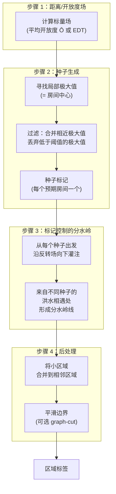
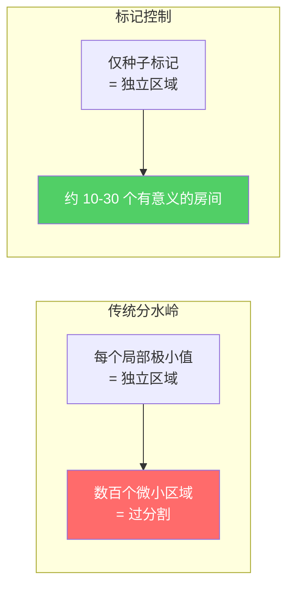

# 分水岭分割

分水岭分割将[开放度场](1. 射线距离到标量场.md)视为一个地形表面：房间中心是山峰，墙壁是山谷，门口是山峰之间的鞍部。从每个峰顶"灌水"会形成汇水盆地，盆地在门口处交汇，从而自然地将空间划分为各个房间。这与 Recast Navigation 内部构建 NavMesh 区域时所使用的算法相同[[19]](#sources)。

## 核心算法

## 为什么使用标记控制？

传统（无标记）分水岭会在反转场中**为每个局部极小值产生一个区域**。室内场景中存在成千上万的微小局部变化，导致严重的过分割。标记控制的分水岭用一组精选的种子标记取代所有局部极小值[[6]](#sources)。

## 详细步骤

### 步骤 1：计算标量场

使用[平均开放度 Ō](1. 射线距离到标量场.md) 或[最小开放度 Ō_min](1. 射线距离到标量场.md)。两者均可使用，但 Ō 因整合了全部 26 个方向的信息，能捕获更多空间上下文。

### 步骤 2：种子生成

**局部极大值检测**：如果一个体素的场值大于其全部 26 个邻居，则为局部极大值。在建筑中，每个房间通常产生 1-3 个局部极大值（中心处，以及 L 形房间可能出现的次峰）。

**合并相近极大值**：将半径 R 范围内的极大值归为一个种子。R 应约为预期最小房间尺寸的一半。

**阈值过滤**：丢弃场值低于阈值的极大值——这些对应的是小壁龛、储物间或走廊段，而非房间。

**替代方案：IPA 阈值扫描**[[1]](#sources)：
1. 将阈值 t 从高到低扫描
2. 在每个 t 值处，统计不连通分量数 C(t)
3. 随着 t 降低：C 增大（更多空间被打开）
4. 当 t 经过门口的 DT 值时：两个房间合并 → C 减小
5. **最优 t* = argmax C(t)** —— 自动找到分离最多房间的阈值

### 步骤 3：分水岭灌注

反转标量场（使峰值变为盆地）。从每个种子标记向外进行洪水填充。当来自不同种子的洪水碰撞时，形成分水岭边界。该边界自然沿着房间之间的脊线延伸——在几何上穿过门口和墙壁。

**实现方式**：基于反转场值的优先队列（最小堆）。按高度递增顺序处理体素。每个体素继承最先到达它的种子的标签。

### 步骤 4：后处理

**区域合并**：将面积小于 `minRegionArea` 的区域合并到其最大邻居中。Recast 使用体素单元为单位的 `minRegionArea = 8` 和 `mergeRegionArea = 20`[[19]](#sources)。

**边界优化**：分水岭边界在体素分辨率下可能呈锯齿状。可选的 graph-cut 能量最小化方法可对其进行平滑处理（参见 [CGAL 的方法](1. 射线距离到标量场.md)，采用 alpha-expansion[[3]](#sources)）。

## 与其他方法的关联

分水岭方法与[形态学分割](2. 形态学分割.md)和[拓扑持久性](5. 拓扑持久性分割.md)密切相关：

- **形态学方法**等价于使用单一全局阈值的分水岭
- **持久性**是具有数学严格框架的分水岭，用于选择保留哪些合并事件

## 参数

| 参数 | 典型值 | 作用 |
|------|--------|------|
| 标量场 | Ō 或 Ō_min | 分水岭操作的目标场 |
| 种子合并半径 | 1–2m | 将相近的局部极大值归组 |
| 最小种子高度 | 0.5–1.0m | 过滤噪声峰值 |
| minRegionArea | 4–8 m² | 合并微小区域 |
| mergeRegionArea | 10–20 m² | 对小空间进行积极合并 |

## 优势与局限

| 方面 | 评估 |
|------|------|
| **不规则形状** | ✅ 自然处理 L 形、弧形房间 |
| **多尺度房间** | ✅ 每个房间在其自身尺度上获得种子 |
| **门口检测** | ✅ 边界自然在门口处穿越 |
| **过分割** | ⚠️ 需要仔细的种子生成或后期合并 |
| **开放式空间** | ❌ 在没有墙壁的地方，边界位置不明确 |
| **参数数量** | ⚠️ 比形态学方法参数更多，但鲁棒性更强 |

## 参考来源

| # | Title | Accessed |
|---|-------|----------|
| 1 | [IPA Room Segmentation Algorithms (Bormann et al.)](https://blog.csdn.net/jucat/article/details/138755341) | 2026-04-18 |
| 6 | Watershed 3D Distance Field Room Segmentation | 2026-04-18 |
| 19 | Recast Navigation Watershed-Based NavMesh | 2026-04-18 |
| 3 | [CGAL SDF-Based Mesh Segmentation](https://doc.cgal.org/5.6/Surface_mesh_segmentation/index.html) | 2026-04-18 |
