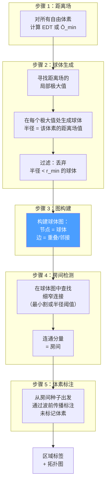
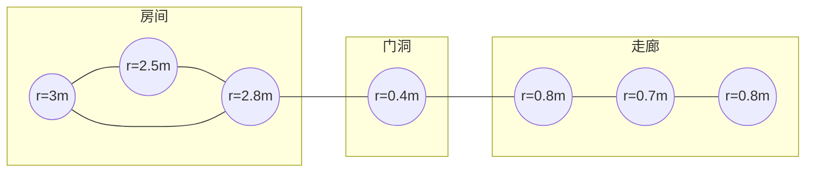
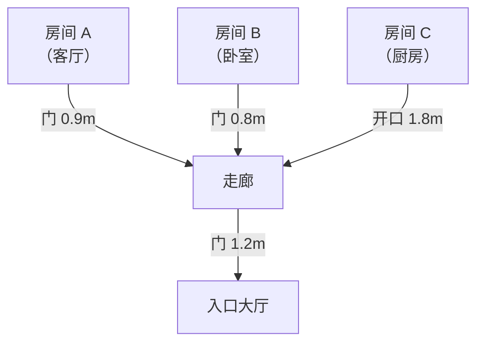

# 球体填充分割

球体填充法用最大内切球填充室内空旷空间。房间表现为**大球的密集簇**，走廊表现为**小球的链式结构**，门洞则表现为**微小球体的细窄桥接**。球体连通图直接编码了建筑的房间拓扑——房间、连接关系和门洞宽度——作为分割过程的自然副产物[[7]](#sources)。

## 核心算法

## 为什么球体适用于室内空间

- **房间**：大型重叠球体 → 密集子图，半径大
- **门洞**：一到两个微小球体 → 弱连接，半径小
- **走廊**：中等球体的链状结构 → 线性子图，半径适中

球体图本质上是一个**加权区域邻接图（RAG）**，其中边权编码了通道宽度。

## 详细步骤

### 步骤 1：距离场
对每个体素计算 Ō_min（26 条射线距离的最小值）。这近似于该点处最大内切球的半径。也可以计算真正的三维 EDT——但 Ō_min 已在烘焙数据中直接可用。

### 步骤 2：球体生成
在距离场的每个局部极大值处放置一个球体：球心 = 极大值位置，半径 = 该处的距离场值。**并非每个体素都会产生球体**——只有局部极大值处才会。因此生成的球体数量远少于体素总数。

过滤半径小于 r_min 的球体以消除噪声。典型的 r_min = 0.2–0.3m。

### 步骤 3：图构建
当两个球体重叠（球心距离 < 半径之和）或相邻（在小容差范围内）时，它们之间建立连边。边权 = min(radius_A, radius_B)，或二者之间的瓶颈宽度。

### 步骤 4：通过图分析检测房间
门洞在球体图中表现为**瓶颈边**——即两端球体半径都较小的边。有两种处理方法：

1. **半径阈值法**：切断所有 min(radius_A, radius_B) < door_threshold（约 0.5m）的边。连通分量即为房间。
2. **最小割法**：如需更精细的处理，在图中寻找最小权割。详见[咽喉点检测](7. 瓶颈点检测.md)。

### 步骤 5：波前传播
从房间种子（球体簇）出发，使用按到最近种子球体表面距离排序的优先队列，将标签扩展到所有自由体素。不同房间的扩展前沿在类 Voronoi 边界处交汇。

## VDB 数据结构

对于大型建筑，可使用 **OpenVDB** 构建球体图[[7]](#sources)：
- 稀疏层次化网格——仅为非空区域分配内存
- 高效的距离场计算和局部极大值检测
- 能够以可控的内存处理数百万体素

## 拓扑图附加价值

与其他分割方法不同，球体填充天然地将**拓扑图**作为副产物生成：

每条边携带**瓶颈宽度**（房间间路径上的最小球体半径）。这对音频传播和可见性查询有直接用途。

## 参数

| Parameter | Typical Value | Role |
|-----------|--------------|------|
| r_min | 0.2–0.3m | 保留球体的最小半径 |
| Door threshold | 0.4–0.6m | 低于此半径的连接被判定为"门洞" |
| Overlap tolerance | 0.1m | 邻接检测的松弛量 |

## 优势与局限

| 方面 | 评估 |
|------|------|
| **真三维** | ✅ 可处理多层、夹层、中庭等结构 |
| **拓扑图** | ✅ 免费副产物——对下游应用极具价值 |
| **非曼哈顿** | ✅ 适用于任意墙体几何形状 |
| **门洞宽度** | ✅ 瓶颈宽度是图的固有属性 |
| **复杂度** | ⚠️ 比形态学方法更复杂——需要图构建 + 图分析 |
| **开放式空间** | ❌ 大型开放空间会产生大量重叠球体，缺乏明确的切割点 |
| **VDB 依赖** | ⚠️ 配合 OpenVDB 效果最佳，但基于简单数组的实现也可行 |

## Sources

| # | Title | Accessed |
|---|-------|----------|
| 7 | [Sphere Packing for 3D Room Segmentation (Li et al. 2021)](https://www.mdpi.com/2220-9964/10/11/739) | 2026-04-18 |
| 6 | Watershed 3D Distance Field Room Segmentation | 2026-04-18 |
