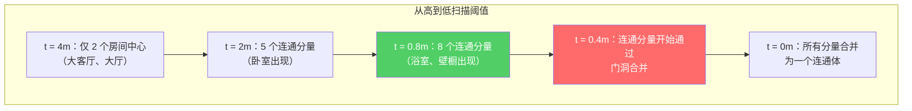
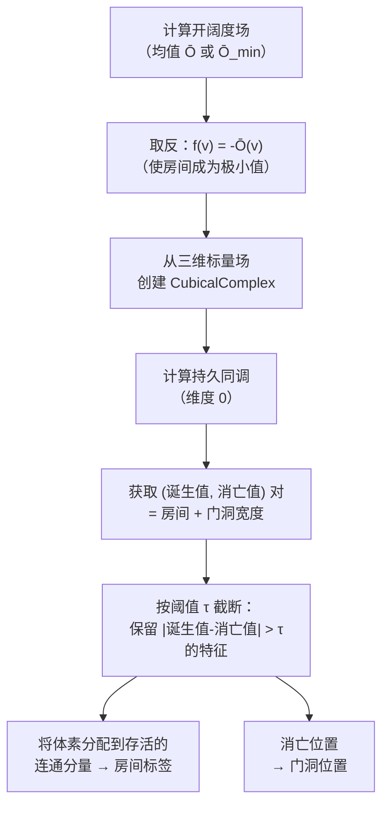

# 拓扑持久性在空间分割中的应用

拓扑持久性是室内空间分割中数学原理最为严谨的方法。它不需要人工选择阈值，而是扫描**所有可能的阈值**，精确记录房间何时出现、何时合并。其结果是一张**持久性图**——一份完整的、按重要性排序的房间与门洞列表。仅需一个可解释参数（持久性阈值 ≈ 最小门洞宽度）即可控制输出<sup>[[8]](#sources)</sup>。

## 核心概念：合并树



随着阈值在[开阔度场](1. 射线距离到标量场.md)中从高到低扫描：
- **连通分量诞生**——当一个新的局部极大值出现时（= 房间中心）
- **连通分量消亡**——当它通过狭窄通道与另一个分量合并时（= 门洞）
- 每个房间拥有一个 **(诞生值, 消亡值)** 对：诞生值 = 房间中心的开阔度，消亡值 = 连接到相邻房间的门洞处的开阔度

## 持久性图

```mermaid
quadrantChart
    title Persistence Diagram (schematic)
    x-axis "Death (doorway openness)" 0 --> 4
    y-axis "Birth (room center openness)" 0 --> 5
    "Living Room": [0.3, 4.5]
    "Bedroom 1": [0.4, 3.2]
    "Bedroom 2": [0.4, 2.8]
    "Kitchen": [0.5, 3.5]
    "Bathroom": [0.3, 1.5]
    "Closet": [0.3, 0.8]
    "Noise": [0.6, 0.7]
```

- **远离对角线**（高持久性 = |诞生值 - 消亡值|）→ 稳健的房间
- **靠近对角线**（低持久性）→ 噪声或不显著的子空间
- **消亡值**直接表示门洞的开阔度（≈ 门洞宽度的一半）

**唯一的参数**：设定持久性阈值 τ，仅保留持久性 > τ 的特征。这等价于"忽略任何窄于 τ 的空间边界"。

## 算法步骤



### 第 1 步：标量场预处理
计算[均值开阔度 Ō](1. 射线距离到标量场.md)并取反，使房间中心成为局部极小值（这是下水平集持久性的惯例）。

### 第 2 步：立方复形构建
使用 Gudhi 库<sup>[[17]](#sources)</sup>：
```python
import gudhi
cubical = gudhi.CubicalComplex(
    dimensions=[nx, ny, nz],
    top_dimensional_cells=(-openness_field).flatten()
)
```

### 第 3 步：持久同调计算
```python
persistence = cubical.persistence()
pairs = cubical.persistence_intervals_in_dimension(0)
# pairs[i] = (birth_i, death_i)
# birth = 房间中心处的 -开阔度
# death = 该房间合并时门洞处的 -开阔度
```

### 第 4 步：过滤与标注
仅保留持久性 > τ 的配对。每一个存活的配对代表一个房间。**诞生位置**即为房间中心；**消亡位置**即为门洞。

## 与分水岭算法的关系

持久同调的合并树**就是**标记控制[分水岭](3. Watershed 分割.md)隐式构建的合并树。关键区别如下：

| 方面 | 分水岭 | 持久性 |
|------|--------|--------|
| **参数** | 种子点选择启发式 | 单一阈值 τ |
| **门洞信息** | 隐含在边界位置中 | 显式的 (诞生值, 消亡值) |
| **排序** | 无天然的门洞排序 | 门洞按持久性排序 |
| **理论基础** | 算法层面 | 代数拓扑 |

## 持久性阈值 τ 的选择

对于取反后的开阔度场：
- τ > 2m → 仅保留非常大的房间（会遗漏卧室）
- τ ≈ 0.5–1.0m → 典型的房间分割
- τ < 0.3m → 每个角落都被视为独立房间

实用经验法则：将 τ 设为你希望识别的最小门洞宽度的一半。对于标准的 ~0.8m 门，τ ≈ 0.4m。

## 计算复杂度

| 网格规模 | 近似耗时 | 内存占用 |
|----------|----------|----------|
| 100³ = 100万体素 | ~1 秒 | ~50 MB |
| 200³ = 800万体素 | ~5 秒 | ~400 MB |
| 500³ = 1.25亿体素 | ~30 秒 | ~6 GB |

立方复形持久性计算的时间复杂度**近似线性**于体素数量<sup>[[17]](#sources)</sup>。

## 优势与局限

| 方面 | 评价 |
|------|------|
| **原理严谨** | ✅ 无临时启发式规则；仅一个可解释参数 |
| **门洞排序** | ✅ 自动按重要性对所有瓶颈进行排序 |
| **多尺度** | ✅ 天然处理大小差异悬殊的房间 |
| **噪声鲁棒性** | ✅ 短命特征即为噪声，自动被过滤 |
| **实现难度** | ⚠️ 需要 Gudhi 库（C++ 内核，附 Python 绑定） |
| **易理解性** | ❌ 不如形态学方法直观；调试可能较困难 |
| **体素分配** | ⚠️ 需要额外步骤将持久性特征映射回体素标签 |

## Sources

| # | Title | Accessed |
|---|-------|----------|
| 8 | Topological Persistence for Indoor Space Segmentation | 2026-04-18 |
| 17 | [Gudhi Persistent Homology for Cubical Complexes](https://gudhi.inria.fr/) | 2026-04-18 |
