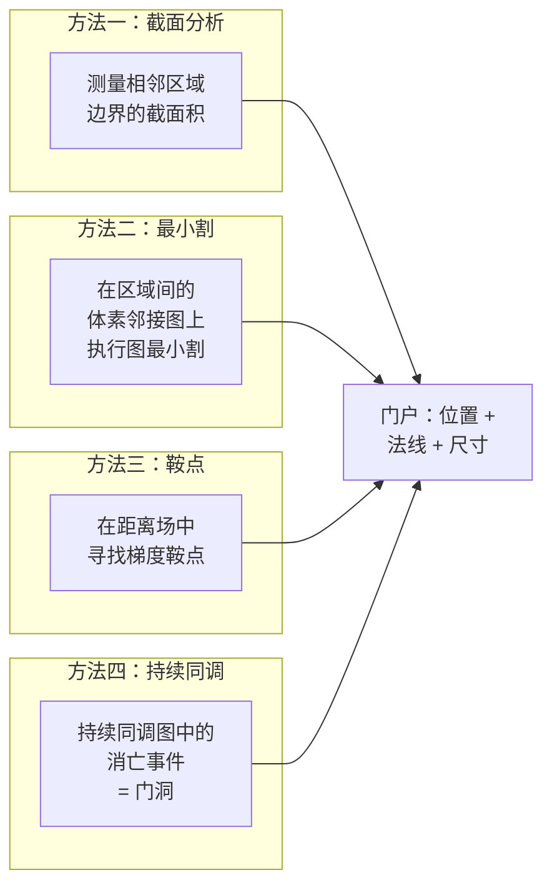
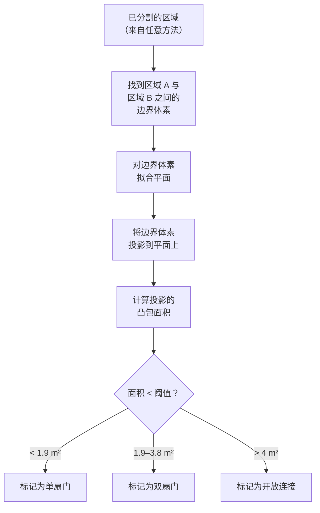
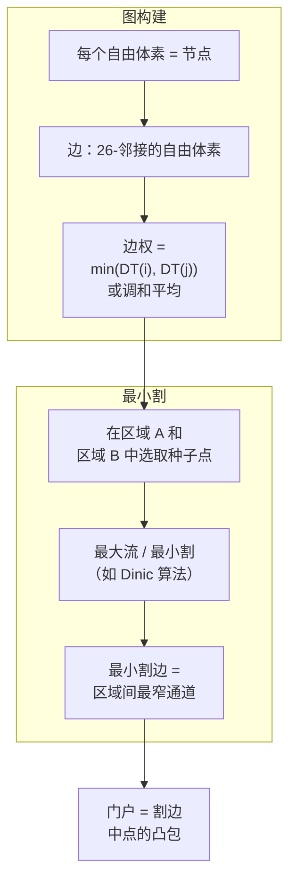
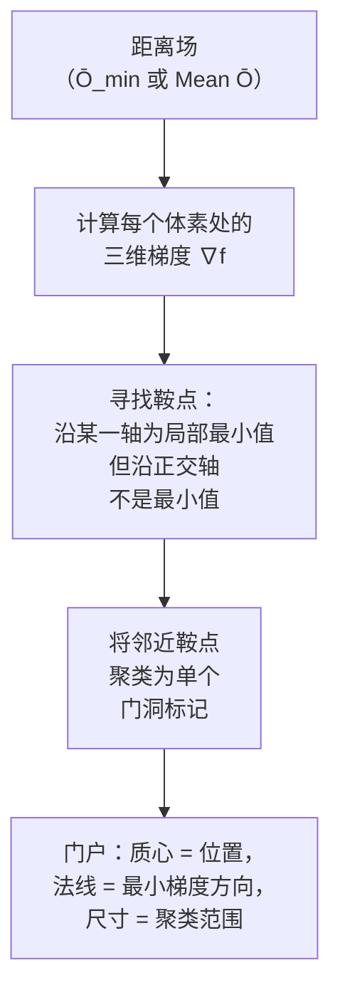
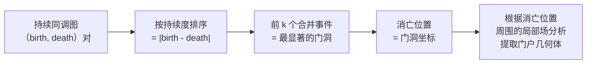

# 瓶颈点检测

在[将空间分割为区域](3. Watershed 分割.md)之后，需要找到这些区域之间的连接处——门、开口和通道。本页介绍四种瓶颈点检测方法，从最简单到最严谨依次排列。每种方法都会生成**门户几何体（Portal Geometry）**：每个开口的位置、朝向和近似尺寸[^9]。

## 四种方法概览



## 方法一：截面积分析

最简单的方法。分割完成后，检查每对相邻区域之间的边界。



**建筑参考值**：

| Opening Type | 典型宽度 × 高度 | 截面积 |
|-------------|----------------------|-------------------|
| 单扇门 | 0.9m × 2.1m | ~1.9 m² |
| 双扇门 | 1.8m × 2.1m | ~3.8 m² |
| 走廊入口 | 2.0–3.0m × 2.5m | 5–7.5 m² |
| 开放拱门 | 不定 | > 4 m² |

在 10cm 体素分辨率下，一扇单门对应约 190 个体素的截面积。

## 方法二：基于图的最小割

比截面分析更加鲁棒。构建一个以通道宽度为边权的图，然后求解最小割[^9]。



**实际流程**：
1. 使用任意方法进行过分割（[分水岭](3. Watershed 分割.md)、[形态学](2. 形态学分割.md)）
2. 构建**区域邻接图（RAG）**：节点 = 区域，边 = 邻接关系
3. 对 RAG 中的每条边，计算两个区域之间的最小割
4. 最小割容量 < 门洞阈值 → 判定为门洞
5. 门户几何体 = 割面的凸包

## 方法三：距离场鞍点

**无需预先分割**即可工作——直接从标量场检测门洞[^9]。



**鞍点定义**：一个体素满足以下条件：
- 距离场沿某一方向为**局部最小值**（穿过门洞的方向——即狭窄维度）
- 距离场沿垂直方向**不是最小值**（房间在两侧延伸）

这等价于该体素处的 Hessian 矩阵具有**混合符号的特征值**——一个负值（谷方向 = 门洞宽度）、两个正值（山脊方向 = 房间范围）。

**优势**：可在分割之前直接处理原始数据。也可作为[标记控制分水岭](3. Watershed 分割.md)的种子输入。

## 方法四：拓扑持续同调

最严谨的方法——使用[持续同调](5. 拓扑持久性分割.md)自动识别并排序所有瓶颈[^8]。

持续同调图中的每个合并事件对应一个门洞：
- **消亡值** = 门洞处的开阔度（≈ 通道宽度的一半）
- **消亡位置** = 门洞的空间坐标
- **持续度** = 分隔的显著程度（高 = 明确的房间边界，低 = 次要壁龛）



**门户几何体提取**：在每个消亡位置，分析开阔度场的局部截面，确定门的宽度、高度和法线方向。

## 最小截面指标捷径

如果已有 [C_min 场](1. 射线距离到标量场.md)（13 对对向射线中的最小截面），可通过简单阈值检测门洞：

```
doorway_voxels = { v : C_min(v) < 1.2m }
```

然后将邻近的门洞体素聚类为独立的门洞标记。这是最快的方法，直接利用预烘焙的射线数据。

## 方法对比

| 方法 | 是否需要预先分割？ | 精度 | 鲁棒性 | 复杂度 |
|--------|--------------------------|-----------|-----------|------------|
| 截面分析 | 是 | 良好 | 适用于简单布局 | O(边界大小) |
| 最小割 | 是 | 优秀 | 适用于所有布局 | O(V·E)（每对区域） |
| 鞍点 | **否** | 良好 | 适用于多数布局 | O(N) |
| 持续同调 | **否** | 优秀 | 适用于所有布局 | O(N log N) |
| C_min 阈值 | **否** | 中等 | 适用于标准门洞 | O(N) |

[^8]: [[topological-persistence|拓扑持久性分割]]
[^9]: [[chokepoint-detection|瓶颈点检测方法]]

## Sources

| # | Title | Raw Note | Original |
|---|-------|----------|----------|
| 8 | 拓扑持久性分割 | [[topological-persistence]] | — |
| 9 | 瓶颈点检测方法 | [[chokepoint-detection]] | — |
