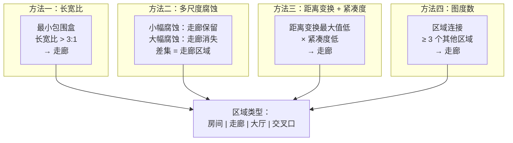
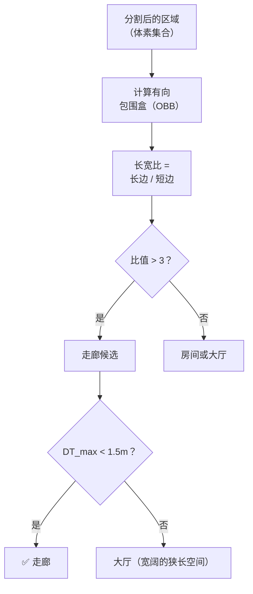
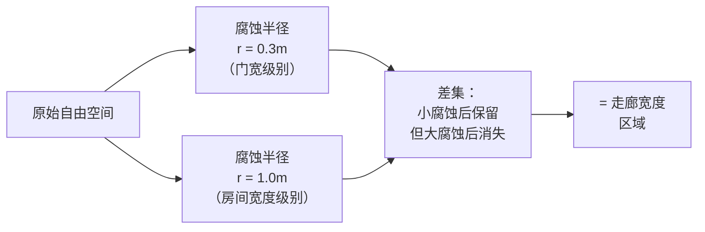
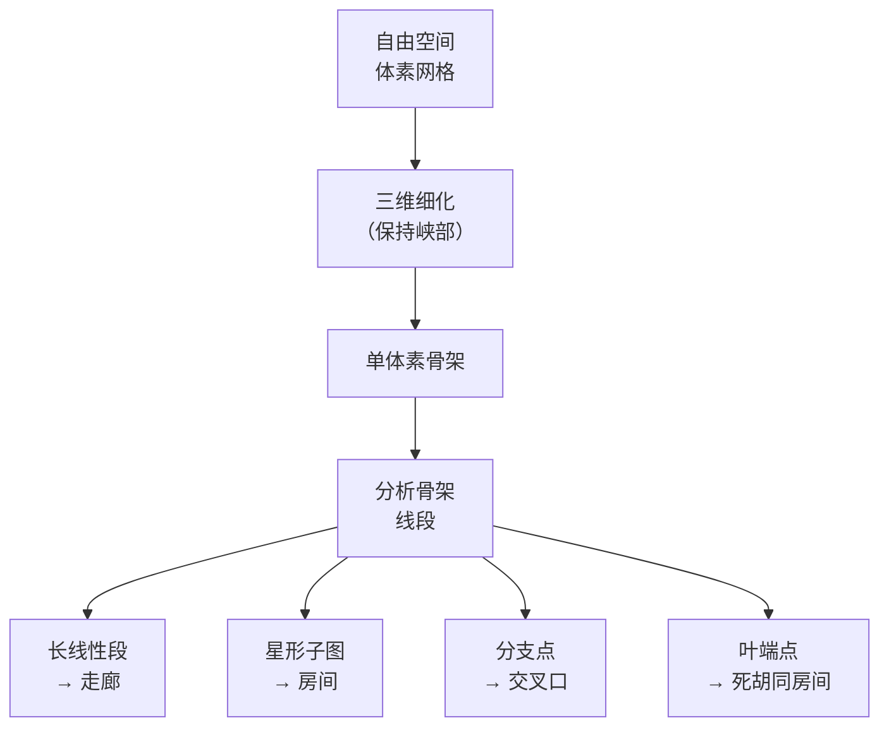
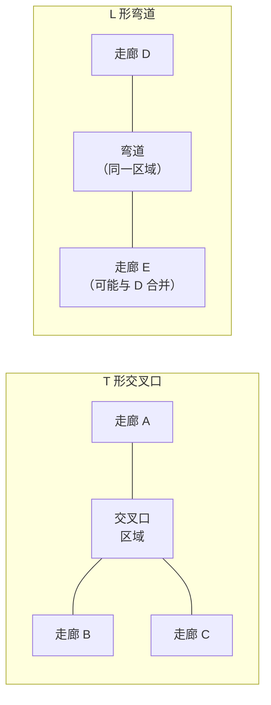
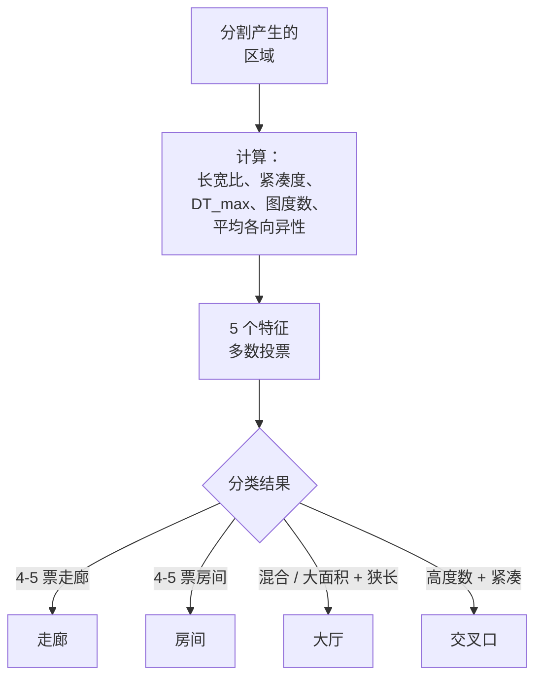

# 走廊分类

分割产生区域标签后，需要为每个区域指定**类型**：房间、走廊、大厅、交叉口等。走廊是建筑中最具辨识度的类型——狭长、窄小、连接多个空间。本页介绍四种检测方法，以及如何处理分支走廊和 T 形交叉口<sup>[[10]](#sources)</sup>。

## 四种检测方法



## 分类指标

以下五个几何特征可以可靠地区分房间和走廊<sup>[[10]](#sources)</sup>：

| 特征 | 房间（典型值） | 走廊（典型值） | 公式 |
|------|---------------|---------------|------|
| **长宽比** | < 2:1 | **> 3:1** | OBB 长边 / OBB 短边 |
| **紧凑度** | > 0.05 | **< 0.02** | 面积 / 周长² |
| **距离变换最大值** | 大（> 2m） | **小（< 1.5m）** | 区域内 max(Ō_min) |
| **图度数** | 1–2 | **≥ 3** | 相邻区域数量 |
| **截面方差** | 高 | **低** | var(沿骨架的 Ō_min) |

**建议**：使用 **3 个以上特征投票** 进行稳健分类。任何单一特征都存在失败情况。

## 方法一：长宽比分析（最可靠）



二次距离变换检查可以防止宽阔的狭长空间（如会议室、展厅）被误分类为走廊。

## 方法二：多尺度腐蚀差分



走廊在小幅腐蚀（比门宽）后会保留，但在大幅腐蚀（比房间窄）后会消失。这两次腐蚀结果的差集可以隔离出走廊宽度的空间。

## 方法三：基于骨架的分析

自由空间的[三维骨架](1. 射线距离到标量场.md)天然编码了建筑拓扑结构<sup>[[14]](#sources)</sup>：



**骨架分类规则**：
- **线性段**（低曲率，长度 > 3× 宽度）→ 走廊
- **星形子图**（多条短分支汇聚于中心）→ 房间
- **分支点**（骨架图中度数 ≥ 3）→ 交叉口区域
- **叶节点**（度数 1）→ 死胡同房间或储藏间

## T 形交叉口与分支走廊



**处理策略**：
1. 检测骨架分支点 → 标记为**交叉口区域**
2. 在每个分支点处将走廊拆分为独立的线性段
3. 每个线性段 = 独立的走廊子区域
4. 分支点区域 = 交叉口区域（通常为小型方形/圆形区域）
5. L 形弯道（双向分支且角度 < 120°）可保持为单一走廊

## 方法四：各向异性场

[各向异性场 A](1. 射线距离到标量场.md) 提供了最直接的走廊信号：

```
A(v) = max(ray_distances) / min(ray_distances)
```

- 走廊体素：A ≫ 3（沿一个方向长，垂直方向窄）
- 房间体素：A ≈ 1–2（各方向大致相等）
- 靠墙体素：A ≫ 1 但 Ō_min 很低（需过滤掉）

**流程**：阈值 A > 3 且 Ō_min > 0.3m → 走廊候选体素。聚类为连通区域 → 走廊区域。

## 综合分类流程



## Sources

| # | Title | Accessed |
|---|-------|----------|
| 10 | Corridor Detection Methods | 2026-04-18 |
| 14 | 3D Skeleton Extraction for Indoor Buildings | 2026-04-18 |
| 13 | AO/Openness Field from Ray Distances | 2026-04-18 |
