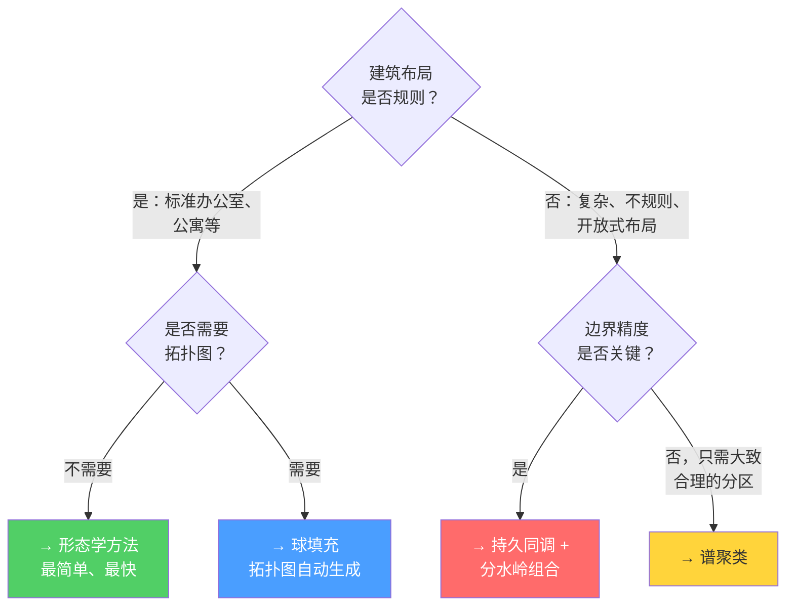

# 方法对比

本页对五种分割方法进行系统性对比，帮助你根据具体室内场景选择最合适的方案。没有任何一种方法在所有场景中都占优——最佳选择取决于建筑的特征和你对输出结果的需求。

## 决策矩阵



## 完整对比表

| 评估维度 | 形态学 | 分水岭 | 球填充 | 持久同调 | 谱聚类 |
|-----------|:---:|:---:|:---:|:---:|:---:|
| **实现复杂度** | ⭐ 简单 | ⭐⭐ 中等 | ⭐⭐ 中等 | ⭐⭐⭐ 复杂 | ⭐⭐⭐ 复杂 |
| **需调参数量** | 2-3 | 3-5 | 3-4 | **1** | 3-4 |
| **规则布局** | ✅ 优秀 | ✅ 良好 | ✅ 良好 | ✅ 良好 | ✅ 良好 |
| **不规则形状** | ❌ 差 | ✅ 良好 | ✅ 良好 | ✅ 优秀 | ✅ 良好 |
| **开放式空间** | ❌ 失败 | ⚠️ 较弱 | ⚠️ 较弱 | ⚠️ 较弱 | ✅ 最佳 |
| **多层 / 三维** | ⚠️ 需谨慎 | ✅ 良好 | ✅ 优秀 | ✅ 良好 | ✅ 良好 |
| **门道检测** | 隐式 | 隐式 | ✅ 内置 | ✅ 带排序 | 需后处理 |
| **拓扑图** | 无 | 无 | ✅ 自动生成 | 部分 | 无 |
| **自动房间计数** | 否（迭代式） | 否（基于种子） | 半自动 | ✅ **是** | ✅ **是**（特征间隙） |
| **速度（100万体素）** | ~1s | ~2s | ~5s | ~1s | ~10s (Nyström) |
| **外部依赖** | 无 | 无 | 可选 OpenVDB | Gudhi | ARPACK/scipy |

## 推荐组合方案

为获得最佳效果，建议**组合使用**多种方法，而非仅依赖单一方法：

### 组合 A：简单 & 稳健（推荐起步方案）
```
形态学分割 → 瓶颈点检测（C_min 阈值） → 走廊分类（长宽比）
```
- 活动部件最少
- 对 80% 的标准建筑效果良好
- 建议从此方案起步，效果不佳时再升级

### 组合 B：理论严谨 & 完备
```
拓扑持久性（分割 + 门道排序） → 波前扩展（体素分配） → 走廊分类（各向异性）
```
- 仅需一个参数（持久性阈值）
- 门道按重要性排序
- 理论基础最完善

### 组合 C：完整拓扑
```
球填充（分割 + 拓扑图） → 最小割（门道细化） → 骨架化（走廊/房间分类）
```
- 输出最丰富（区域标签 + 拓扑图 + 门道几何）
- 实现最复杂
- 最适合需要门道图的下游音频/渲染系统

### 组合 D：自适应
```
谱聚类（初始分割） → 截面分析（门道检测） → 特征投票（分类）
```
- 最适合几何启发式方法失效的建筑（开放式办公室、展览空间）
- 参数最多，但对模糊情况处理最好

## 性能概览


## 失败模式分析

了解每种方法何时会失效有助于选择：

| 方法 | 失败模式 | 症状 | 缓解措施 |
|--------|-------------|---------|------------|
| 形态学 | 结构元素过大 | 小房间消失 | 多尺度方案：尝试多种结构元素尺寸 |
| 形态学 | 门道尺寸不一 | 部分门道未切断，另一些被过度腐蚀 | 改用分水岭 |
| 分水岭 | 无明显局部极大值 | 过度分割 | 使用持久同调进行种子选择 |
| 球填充 | 大型开放中庭 | 大量尺寸相近的球，无明确切分点 | 对该区域追加谱聚类 |
| 持久同调 | 超长走廊 | 可能无法形成独立连通分量 | 先按各向异性预分类走廊，再分割房间 |
| 谱聚类 | 亲和函数设计不当 | 聚类结果无意义 | 迭代优化亲和函数设计；使用距离变换加权 |

## Sources

| # | Title | Accessed |
|---|-------|----------|
| 1 | [IPA Room Segmentation Algorithms](https://blog.csdn.net/jucat/article/details/138755341) | 2026-04-18 |
| 5 | [3D Morphological Room Segmentation](https://isprs-archives.copernicus.org/articles/XLIV-4-W1-2020/49/2020/) | 2026-04-18 |
| 7 | [Sphere Packing for 3D Room Segmentation](https://www.mdpi.com/2220-9964/10/11/739) | 2026-04-18 |
| 8 | Topological Persistence for Indoor Space Segmentation | 2026-04-18 |
| 12 | Graph Laplacian Affinity Matrix Construction | 2026-04-18 |
