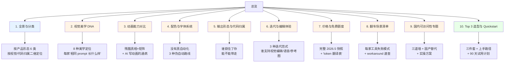
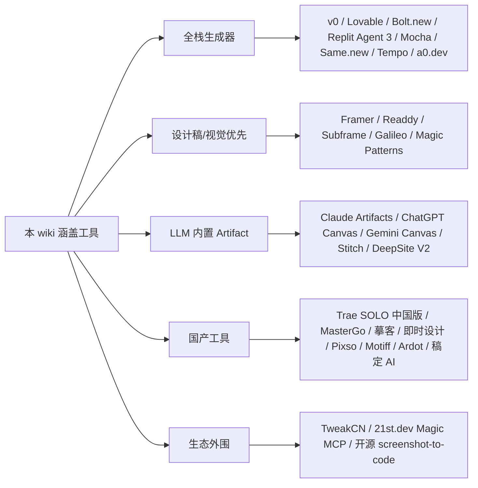

# LLM 网页生成工具选型指南（视觉优先 · 2026.5）— 总览

> 在 2026 年 5 月这个时间点，"用 LLM 一句话生成好看网页"已经不是稀缺能力，而是一个挤满 20+ 工具的红海。这份 wiki 帮你**绕开市场宣传，挑出 1-2 个真的能直接用的工具**，重点关注视觉质量、动画能力、配色排版、价格与国内可访问性。
>
> **目标读者**：已具备前端基础、熟悉 LLM 工具生态，但没系统对比过这一批 webgen 工具的实际产出质量、动画能力和价格的人。

## 知识地图

## 页面目录

### 基础地图
- [1. 全景与分类](wiki/1.%20全景与分类.md) — 把 20+ 工具按 6 类切清楚，二维定位选型权衡

### 8 个评估维度
- [2. 视觉美学 DNA](wiki/2.%20视觉美学%20DNA.md) — Framer 电影感 / v0 shadcn / Readdy 国风等 8 种调性
- [3. 动画能力对比](wiki/3.%20动画能力对比.md) — Framer Motion / GSAP / Three.js 谁能驾驭
- [4. 配色与字体系统](wiki/4.%20配色与字体系统.md) — 没有"自动配色"，三种伪自动化路线
- [5. 输出形态与代码归属](wiki/5.%20输出形态与代码归属.md) — Framer 锁定 / v0 Vercel 锁 / Bolt 自由
- [6. 迭代与编辑体验](wiki/6.%20迭代与编辑体验.md) — prompt-only / element-level / 多模态 三大范式
- [7. 价格与免费额度](wiki/7.%20价格与免费额度.md) — 12 家完整价格快照 + 隐藏成本
- [8. 翻车场景清单](wiki/8.%20翻车场景清单.md) — 每家工具的失败模式 + workaround 速查
- [9. 国内可访问性专题](wiki/9.%20国内可访问性专题.md) — 国内三道墙 + 国产替代 7 家

### 选型与上手
- [10. Top 3 选型与 Quickstart](wiki/10.%20Top%203%20选型与%20Quickstart.md) — Framer + Trae SOLO + Claude Artifacts 三件套 + prompt 模板

## 覆盖范围

| 关键问题 | 由以下页面解答 |
|----------|--------------|
| Q1 视觉质量第一梯队 + 美学 DNA | [2. 视觉美学 DNA](wiki/2.%20视觉美学%20DNA.md) |
| Q2 动画能力对比 | [3. 动画能力对比](wiki/3.%20动画能力对比.md) |
| Q3 配色 / 字体自动化质量 | [4. 配色与字体系统](wiki/4.%20配色与字体系统.md) |
| Q4 输出形态 | [5. 输出形态与代码归属](wiki/5.%20输出形态与代码归属.md) |
| Q5 迭代体验 | [6. 迭代与编辑体验](wiki/6.%20迭代与编辑体验.md) |
| Q6 价格与免费额度 2026.5 | [7. 价格与免费额度](wiki/7.%20价格与免费额度.md) |
| Q7 翻车场景 | [8. 翻车场景清单](wiki/8.%20翻车场景清单.md) |
| Q8 国内访问性 + 国产替代 | [9. 国内可访问性专题](wiki/9.%20国内可访问性专题.md) |
| ★ 个人选型最终建议 | [10. Top 3 选型与 Quickstart](wiki/10.%20Top%203%20选型与%20Quickstart.md) |

## 工具清单（覆盖 20+）

## 三件套快速结论

> 基于"a 选型 + 视觉优先 + 直接使用 + 个人兴趣"的偏好：
>
> - 🥇 **Framer** (Mini $5/月年付)：视觉天花板 + 动画原生 + 直接发布
> - 🥈 **Trae SOLO 中国版** (永久免费)：国内零阻力 + 中文 prompt + 代码可带走
> - 🥉 **Claude Artifacts** (含在 Pro $20)：复杂 demo / 数据可视化首选
>
> 详见 [10. Top 3 选型与 Quickstart](wiki/10.%20Top%203%20选型与%20Quickstart.md)。

## 质量说明

- **总页面数**：10
- **总参考来源数**：3 个 synthesis 笔记，覆盖 40+ URLs
- **关键 raw 笔记**：
  - [[v0-lovable-bolt-2026-comparison]] — 三大主流欧美工具
  - [[framer-readdy-trae-and-china-tools]] — Framer / Readdy / Trae 与国产工具
  - [[webgen-tools-animation-color-and-china-access]] — 动画 / 配色 / 国内访问深度
- **价格快照锚定**：2026 年 5 月
- **最后更新**：2026-05-16

## 已知局限

| 项目 | 说明 |
|------|------|
| Lovable 2.0 字体配对的官方机制 | 用 InfoQ 推断（无 changelog 原文） |
| Readdy 中文站访问体验 | 依赖知乎 / 网易实测，未独立验证 |
| Stitch 国内可用性 | 推断需代理（withgoogle.com 域），未实测 |
| 价格 | 2026.5 快照，未来变动需重新核对 |

[^61]: [[v0-lovable-bolt-2026-comparison|Lovable / Bolt.new / v0 — 2026 Pricing, Output, and Failure Modes]]
[^62]: [[framer-readdy-trae-and-china-tools|Framer / Readdy / Trae SOLO / 国产 AI 网页生成工具关键事实]]
[^63]: [[webgen-tools-animation-color-and-china-access|补充工具 + 动画/配色系统深度细节]]
