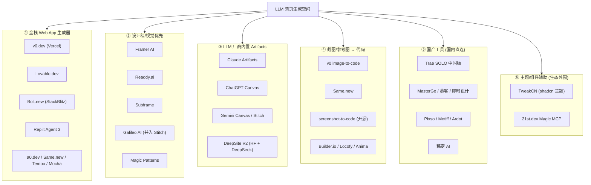
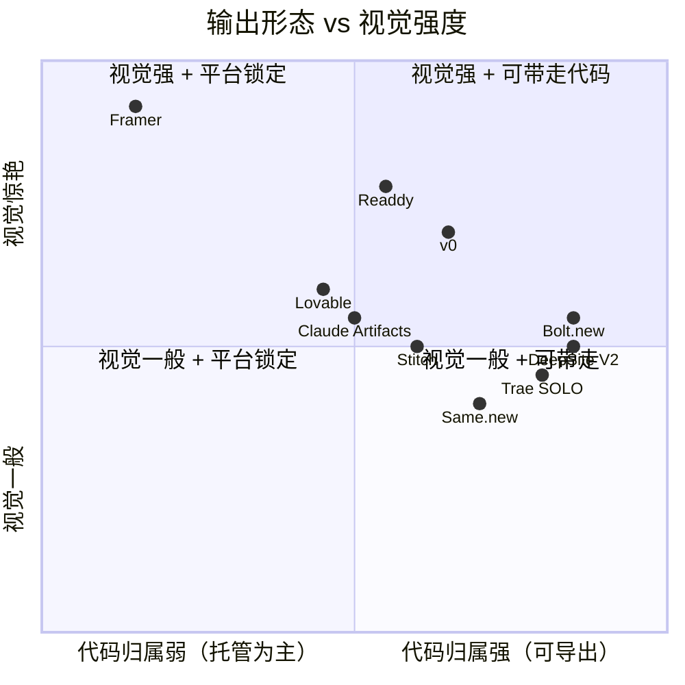
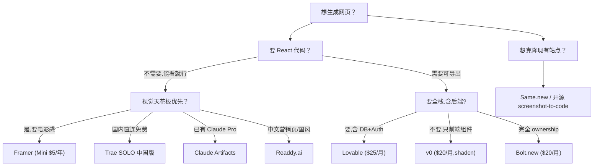
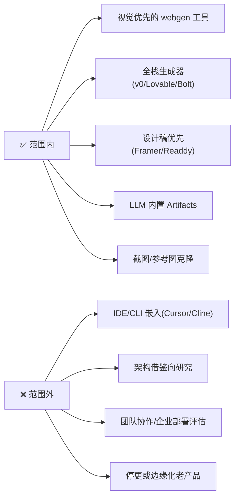

# 全景与分类

LLM 网页生成工具在 2025-2026 经历了一场寒武纪爆发。本页先把这个空间按"产品形态"切成 6 个簇，让你一眼看清谁和谁是同一类、谁和谁是反向。后续页面会沿着 8 个评估维度展开对比。

## 按产品形态分类

## 按"输出形态 vs 视觉强度"二维定位

最终选型的核心矛盾：**视觉越强 → 代码归属越弱**。下图是这一权衡的具象化。

> **关键观察**：第一象限（视觉强 + 可带走）几乎是空的。Framer 视觉最强但平台锁定；Readdy 是少数视觉好且能导出 React/Vue 的产品；Bolt 代码最自由但视觉相对粗糙。

## 决策树（先用这棵树初筛）

## 本研究的 8 个评估维度

| # | 维度 | 在哪一页 |
|---|------|---------|
| Q1 | 视觉美学 DNA | [2. 视觉美学 DNA.md](2.%20视觉美学%20DNA.md) |
| Q2 | 动画能力 | [3. 动画能力对比.md](3.%20动画能力对比.md) |
| Q3 | 配色 / 字体自动化 | [4. 配色与字体系统.md](4.%20配色与字体系统.md) |
| Q4 | 输出形态 / 代码归属 | [5. 输出形态与代码归属.md](5.%20输出形态与代码归属.md) |
| Q5 | 迭代 / 编辑体验 | [6. 迭代与编辑体验.md](6.%20迭代与编辑体验.md) |
| Q6 | 价格 / 免费额度 | [7. 价格与免费额度.md](7.%20价格与免费额度.md) |
| Q7 | 翻车场景 | [8. 翻车场景清单.md](8.%20翻车场景清单.md) |
| Q8 | 国内访问 | [9. 国内可访问性专题.md](9.%20国内可访问性专题.md) |
| ★ | 最终选型 + Quickstart | [10. Top 3 选型与 Quickstart.md](10.%20Top%203%20选型与%20Quickstart.md) |

## 范围边界

## 一句话定位（每个工具）

| 工具 | 一句话 |
|------|--------|
| **Framer** | 2026 视觉天花板，代价是平台锁定[^62] |
| **v0** | shadcn 极简风格的"组件级"工业标准[^61] |
| **Lovable** | 一句话出全栈 MVP，含 DB + Auth + Stripe[^61] |
| **Bolt.new** | Claude 加持的浏览器 IDE，代码自由但易爆 token[^61] |
| **Readdy.ai** | 蓝湖出海产品，营销页 / 国风首选[^62] |
| **Trae SOLO 中国版** | 字节出品，国内直连永久免费[^62] |
| **Claude Artifacts** | Pro 用户已有的"额外能力"，单文件强大[^63] |
| **DeepSite V2** | DeepSeek 加持，HuggingFace 上完全免费[^62] |
| **Stitch** | Google Gemini 3 加持，Material 风格 + 语音改图[^63] |
| **Same.new** | URL/截图一键克隆现有网站[^63] |

[^61]: [[v0-lovable-bolt-2026-comparison|Lovable / Bolt.new / v0 — 2026 Pricing, Output, and Failure Modes]]
[^62]: [[framer-readdy-trae-and-china-tools|Framer / Readdy / Trae SOLO / 国产 AI 网页生成工具关键事实]]
[^63]: [[webgen-tools-animation-color-and-china-access|补充工具 + 动画/配色系统深度细节]]

## Sources

| # | Title | Raw Note |
|---|-------|----------|
| 61 | v0/Lovable/Bolt 2026 综合对比 | [[v0-lovable-bolt-2026-comparison]] |
| 62 | Framer/Readdy/Trae & 国产工具 | [[framer-readdy-trae-and-china-tools]] |
| 63 | 动画/配色系统 + 补充工具 | [[webgen-tools-animation-color-and-china-access]] |
