# Top 3 选型与 Quickstart

基于 8 个维度的分析，针对你的偏好（**a 选型 / 视觉好 / 直接用 / 个人兴趣**），下面是最终推荐的三件套 + 上手路径。

## 推荐三件套

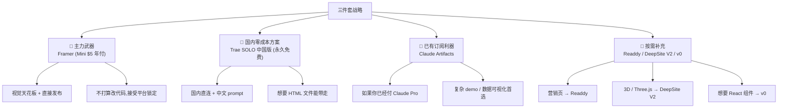

## 三件套覆盖能力

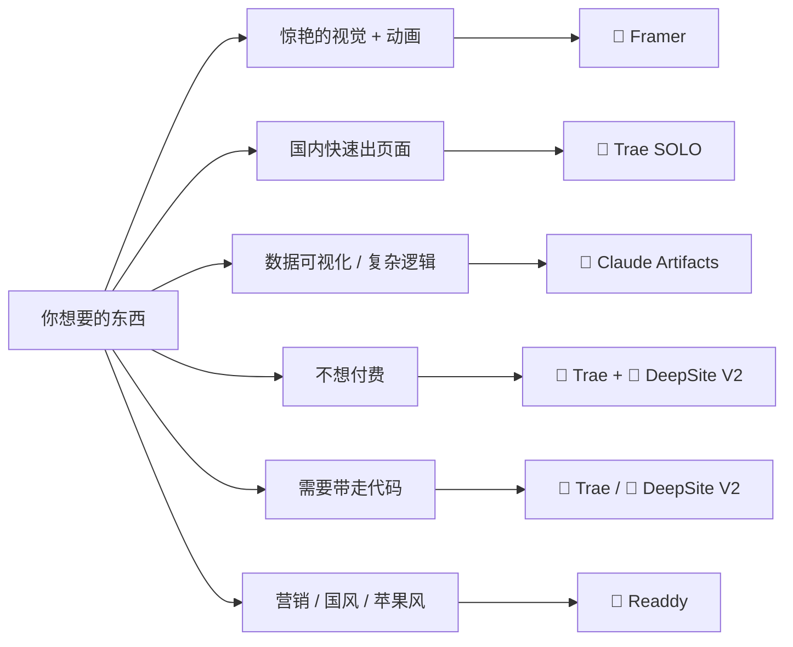

## 🥇 Framer Quickstart

### 为什么选它

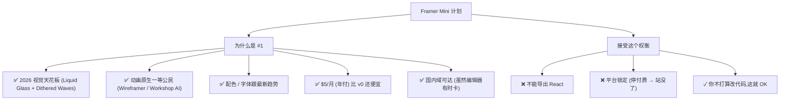

### 上手路径（30 分钟）

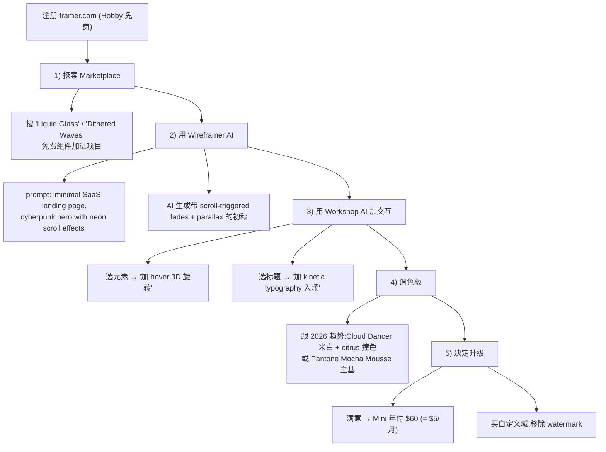

### 三个 prompt 模板

```
"Create a minimal SaaS hero with frosted glass card,
 dark mode, large 72px headline 'Build websites 10x faster',
 subtitle 'AI-generated cinematic experiences',
 CTA buttons 'Get started' (citrus yellow) and 'See demo' (ghost),
 scroll-triggered parallax background with subtle dithered waves"

"Photographer portfolio: full-bleed hero video,
 grid gallery with hover scale + caption fade-in,
 contact section with form, smooth scroll between sections,
 typeface: serif headlines (Playfair) + sans body (Inter)"

"Personal blog with kinetic typography:
 each headline animates in word-by-word on scroll,
 dark mode default, accent color #ff7b8e,
 sticky reading progress indicator,
 smooth page transitions between articles"
```

## 🥈 Trae SOLO 中国版 Quickstart

### 为什么选它

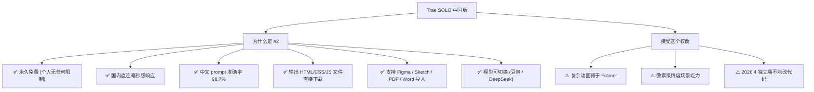

### 上手路径

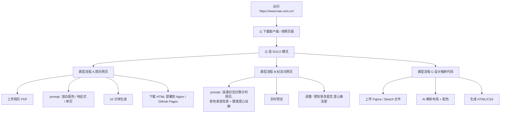

### Trae 中文 prompt 范本

```
"做一个个人作品集网站,深色基调 + 米黄强调色,
首页是大字号 'Hi, 我是 XX' + 一句副标题,
作品按瀑布流展示,鼠标悬停时图片缓慢放大并显示标题"

"做一个倒计时纪念日页面,粉色到紫色渐变背景,
中央显示'距离 XX 还有 N 天 N 小时 N 分 N 秒',
背景有缓慢下落的爱心,响应式适配手机"

"把这张 Figma 设计稿转成响应式网页,
保留原配色和间距,标题用 Inter 字体,
按钮 hover 时有 0.3s 缓动放大效果"
```

## 🥉 Claude Artifacts Quickstart

### 为什么选它

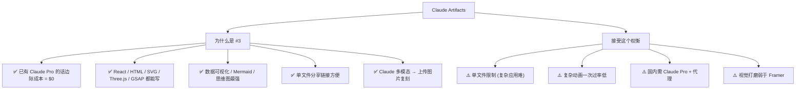

### 上手路径

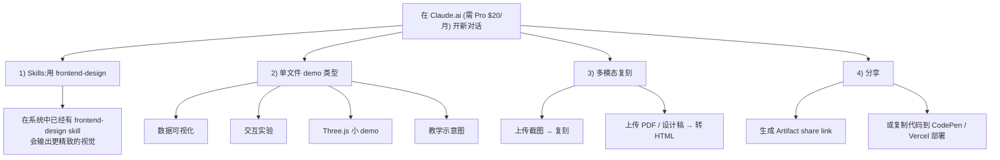

### Artifact 三类杀手场景

| 场景 | 为什么 Artifact 强 |
|------|-----------------|
| **数据可视化** | SVG / D3.js / Recharts 能直接跑，调色对比度精确 |
| **交互教学 demo** | 单文件 + 实时预览 + 多轮迭代 |
| **复杂概念示意图** | Mermaid 原生，diagram 一次过率高 |
| **算法可视化** | Canvas / SVG 实时演示，搭配 Claude 解释 |

## 三件套组合工作流

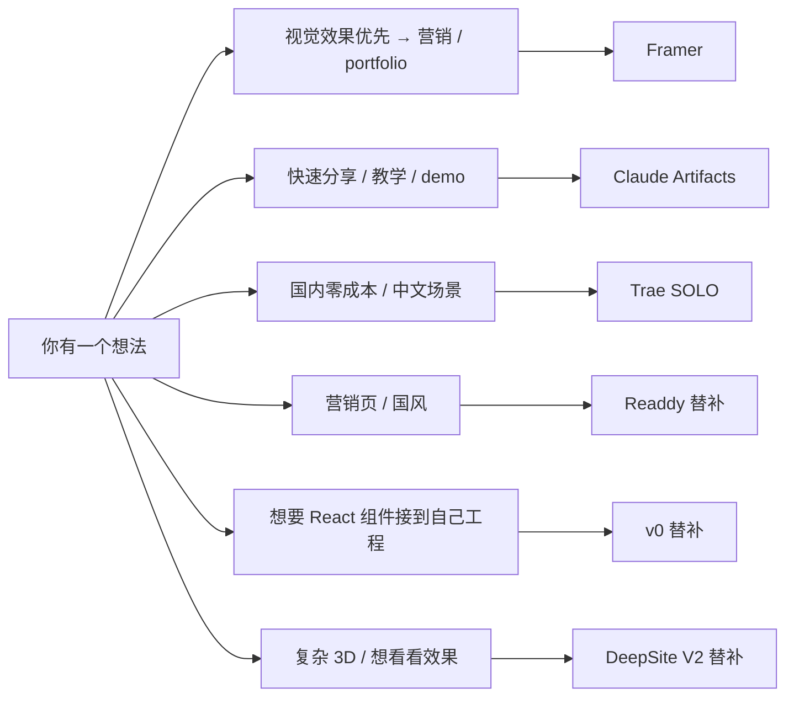

## 三个月预算

| 方案 | 月费 | 你能做的 |
|------|------|---------|
| **极简** | $0 | Trae 中国版 + DeepSite V2 |
| **轻装** | $5 | + Framer Mini 年付 |
| **平衡** | $25 | + Claude Pro $20 (拿到 Artifacts) |
| **进阶** | $45 | + v0 $20 (shadcn 组件) |
| **全套** | $80 | + Lovable Pro $25 (全栈 MVP 时用) |

## 90 天试用计划

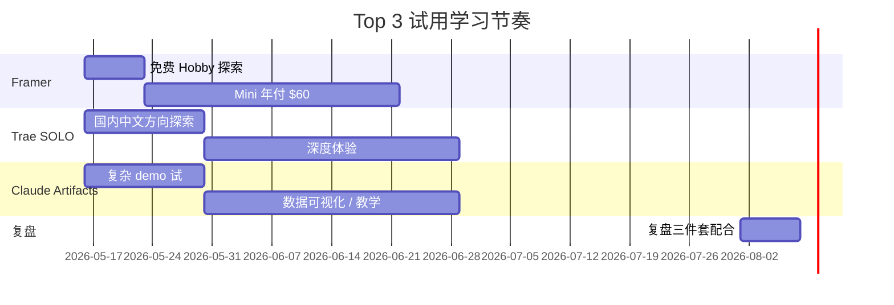

## 何时该升级 / 替换

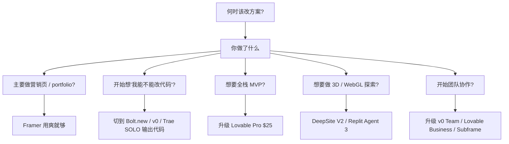

## 终极一句话

> **Framer 给你"看到的视觉天花板"，Trae 给你"国内的零阻力体验"，Claude Artifacts 给你"已经付费的边际能力"——三件套合起来覆盖 80% 个人选型场景，剩下 20% 用 Readdy / DeepSite V2 / v0 按场景补充。**

## 关联阅读

- 视觉对比：[2. 视觉美学 DNA.md](2.%20视觉美学%20DNA.md)
- 动画对比：[3. 动画能力对比.md](3.%20动画能力对比.md)
- 价格细节：[7. 价格与免费额度.md](7.%20价格与免费额度.md)
- 国内访问：[9. 国内可访问性专题.md](9.%20国内可访问性专题.md)

[^61]: [[v0-lovable-bolt-2026-comparison|Lovable / Bolt.new / v0 — 2026 Pricing, Output, and Failure Modes]]
[^62]: [[framer-readdy-trae-and-china-tools|Framer / Readdy / Trae SOLO / 国产 AI 网页生成工具关键事实]]
[^63]: [[webgen-tools-animation-color-and-china-access|补充工具 + 动画/配色系统深度细节]]

## Sources

| # | Title | Raw Note |
|---|-------|----------|
| 61 | v0/Lovable/Bolt 2026 | [[v0-lovable-bolt-2026-comparison]] |
| 62 | Framer/Readdy/Trae | [[framer-readdy-trae-and-china-tools]] |
| 63 | 动画/配色 深度 | [[webgen-tools-animation-color-and-china-access]] |
