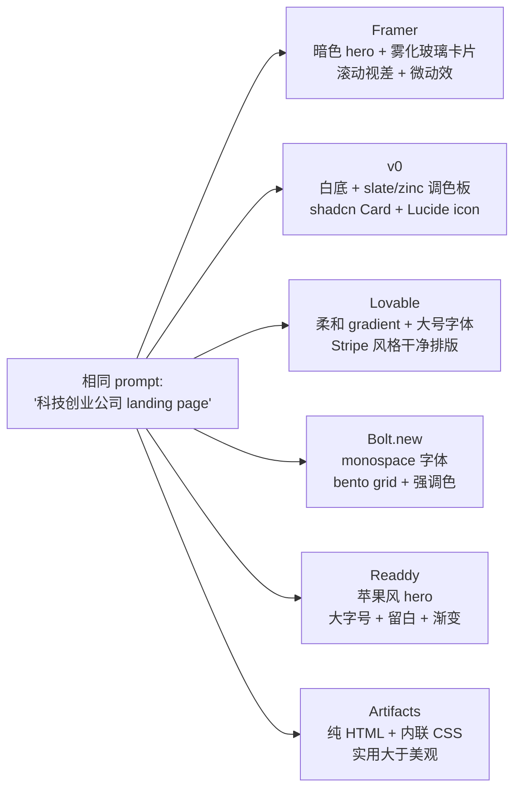
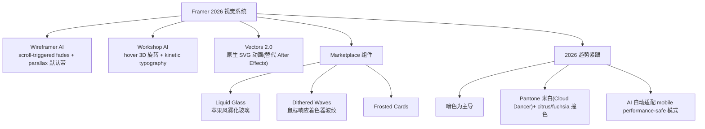
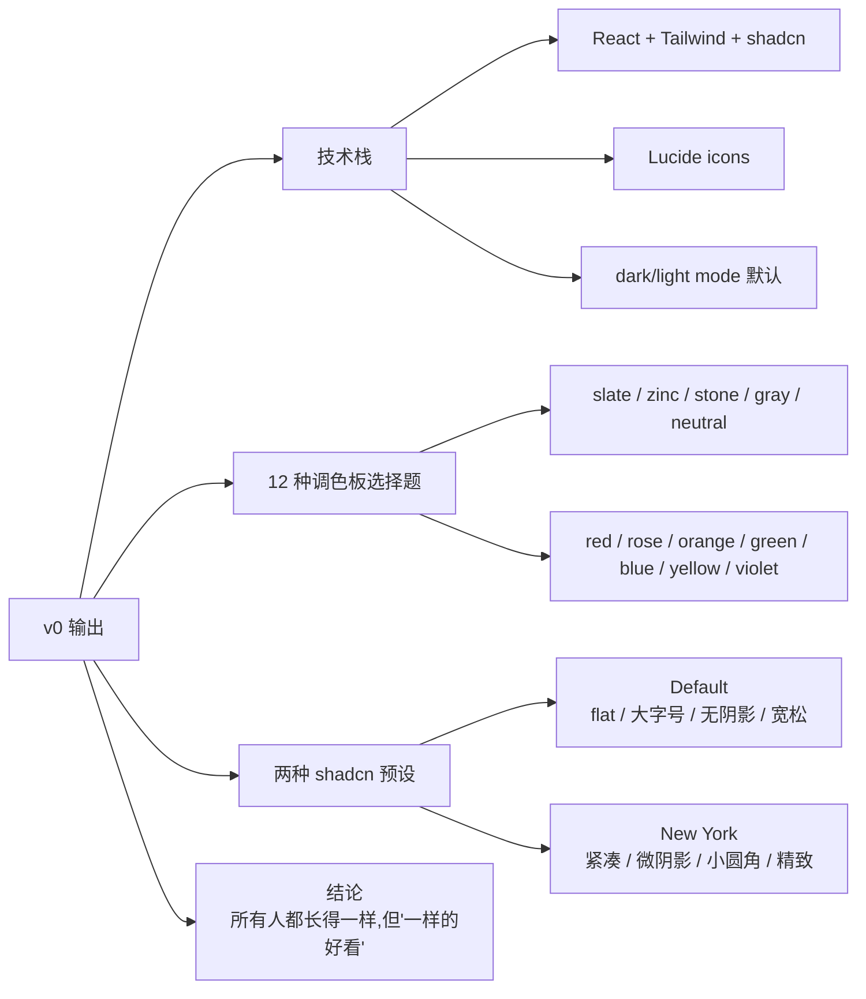
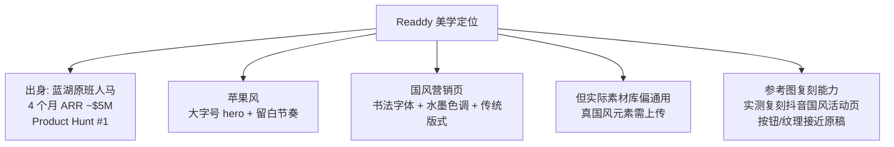
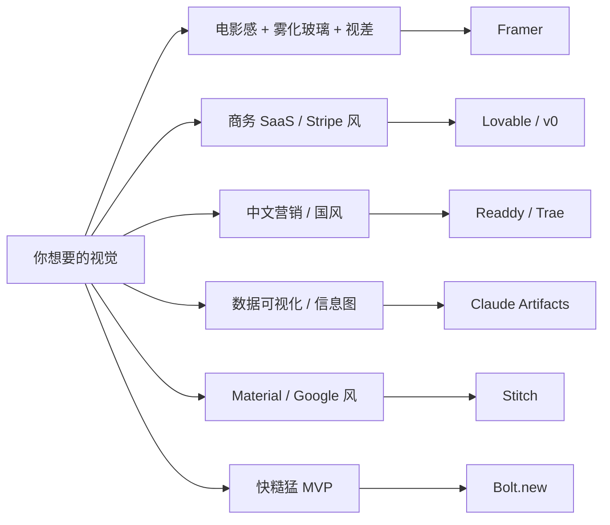

# 视觉美学 DNA

每个 AI 网页生成工具背后都有一套"默认审美"。它不是 prompt 写得好就能颠覆的，而是模型 + 设计系统 + 训练数据共同决定的"基因"。如果你的目标和工具的 DNA 对齐，1 个 prompt 就出活；如果错配，10 轮调优都救不回来。

## 八种美学 DNA 速览

```mermaid
flowchart TB
    subgraph S1["电影感 / Premium"]
        Framer["Framer<br/>Liquid Glass + Dithered Waves<br/>scroll parallax + 暗色"]
    end
    subgraph S2["极简 / 工程师审美"]
        V0["v0<br/>shadcn 默认 + Tailwind<br/>flat / New York 双风格"]
    end
    subgraph S3["产品化 / 干净"]
        Lovable["Lovable<br/>polished, production-ready<br/>auto-refactor 一致性"]
    end
    subgraph S4["速度 / Hacker"]
        Bolt["Bolt.new<br/>monospace 字体 + muted tones<br/>'fast, energetic'"]
    end
    subgraph S5["营销 / 出海中文"]
        Readdy["Readdy<br/>苹果风 + 国风水墨<br/>留白 / 字体节奏"]
    end
    subgraph S6["Material / Google"]
        Stitch["Stitch<br/>Material Design<br/>Vibe Design 多变体"]
    end
    subgraph S7["中文 / 本土"]
        Trae["Trae SOLO<br/>中文 prompt 直觉<br/>国内技术栈适配"]
    end
    subgraph S8["可视化 / 数据"]
        Artifacts["Claude Artifacts<br/>SVG/Mermaid 强<br/>偏功能向不偏审美"]
    end
```

## 每家的"默认会画成什么样"

## Framer：唯一真正"电影感"的工具

Framer 在 2026 的视觉差异化几乎是断崖式的[^62]。它的 AI 模块不只是"写代码"，而是把电影/动画工业的审美直接喂进了网页：

**实测口径**[^62]："`cyberpunk portfolio with neon scroll effects`" 这种描述能直接出可上线的视觉，省 ~35% 手动响应式调试。

## v0：shadcn 主义者

v0 没有"原创美学"，它就是 shadcn/ui 的 AI 包装[^61]。这点是优点也是局限：

> 在第三方评级中 v0 的前端代码质量被打到 ⭐⭐⭐⭐⭐（最高）[^61]，但代价是审美高度同质化。

## Lovable：production-ready 干净美学

Lovable 不像 Framer 那样追求电影感，也不像 v0 那样统一为 shadcn。它的口号是"polished, production-ready"——更接近 Stripe / Linear / Vercel 这一档商务 SaaS 的视觉标准[^61]：

- "beautiful UI components"、"smooth interactions" 是反复出现的描述
- 通过 prompt 能切风格："calm, wellness-inspired" / "muted earth tones" / "bold, expressive"[^61]
- AI 会**自动 refactor 来保证视觉一致性**——这点是和 Bolt 最大差异

## Bolt：速度优先的 hacker 风

Bolt 的视觉调性来自 Claude 3.5 Sonnet 的"直接生成"——少了 Lovable 的 auto-refactor 美化层[^61]：

- "fast, energetic" 设计，"hacker-like vibe"
- 实测案例：Dockit 落地页用 monospace 字体 + muted tones[^61]
- LaunchKit 模板风格：模块化 bento grid、devtools 风
- 适合：MVP 速度 > 视觉完美度

## Readdy：出海中文 + 国风营销

Readdy 是这一批工具里**唯一在中文设计美学上有显著差异化**的[^62]：

## Stitch：Google Material 系

Google Stitch 由 Gemini 3.1 Pro/Flash 驱动，主打 Material Design[^63]：

- 风格倾向 Google 内部产品（Material You 那一档）
- "Vibe Design"：抽象 prompt（如 `cyberpunk aesthetic`）→ 多个变体并列
- 完全免费 (400 credits/天)，但输出常需设计师再修改

## Trae SOLO：中文场景的本土化美学

Trae 没有"鲜明的视觉风格"，它的差异化在**理解中文 prompt**[^62]：

- "粉色渐变背景 + 飘落爱心动画" 这种中式描述能准确出图
- 中文注释准确率 98.7%（字节官方数据，需打折）
- 支持上传 PDF/Word 提取内容直接生成网页（简历类场景特化）
- 视觉质量：简单网页 8.5/10，复杂交互 6.5/10

## Claude Artifacts：功能向，不向审美投票

Claude Artifacts 是这堆里最"工具化"的一个[^63]：

- 强项：SVG / Mermaid / 数据可视化 / 时间轴 / 思维导图
- 弱项：复杂视觉效果（玻璃质感、不规则渐变、精细插图）
- 输出"功能准确性 > 美学打磨"
- 但能写 React / HTML / Three.js / GSAP，技术上限高

## 选型映射

## 关联阅读

- 视觉强但代码弱：详见 [5. 输出形态与代码归属.md](5.%20输出形态与代码归属.md)
- 视觉风格能不能 prompt 到位：详见 [6. 迭代与编辑体验.md](6.%20迭代与编辑体验.md)

[^61]: [[v0-lovable-bolt-2026-comparison|Lovable / Bolt.new / v0 — 2026 Pricing, Output, and Failure Modes]]
[^62]: [[framer-readdy-trae-and-china-tools|Framer / Readdy / Trae SOLO / 国产 AI 网页生成工具关键事实]]
[^63]: [[webgen-tools-animation-color-and-china-access|补充工具 + 动画/配色系统深度细节]]

## Sources

| # | Title | Raw Note |
|---|-------|----------|
| 61 | v0/Lovable/Bolt 2026 综合对比 | [[v0-lovable-bolt-2026-comparison]] |
| 62 | Framer/Readdy/Trae & 国产工具 | [[framer-readdy-trae-and-china-tools]] |
| 63 | 动画/配色系统 + 补充工具 | [[webgen-tools-animation-color-and-china-access]] |
