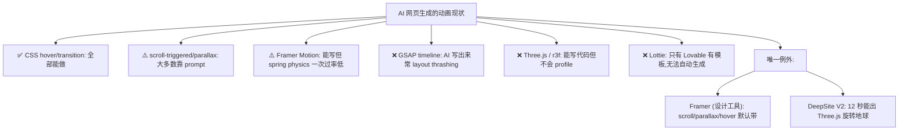
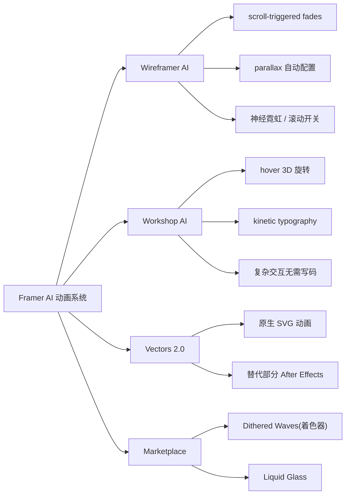
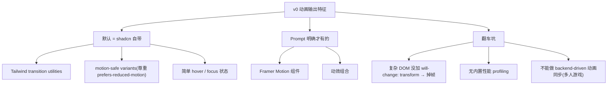
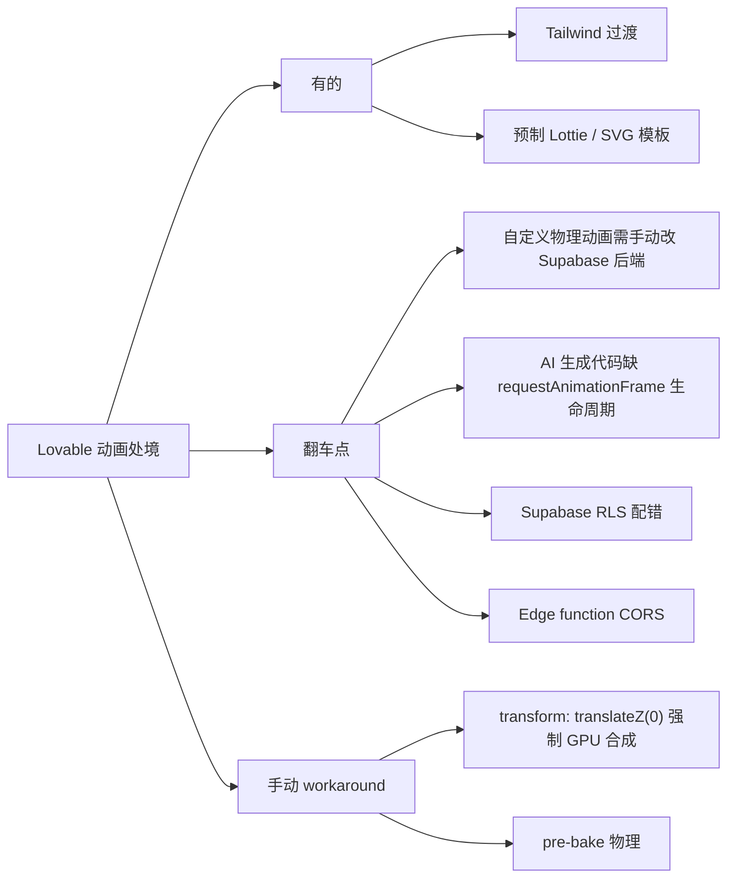
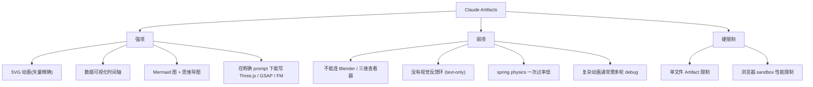
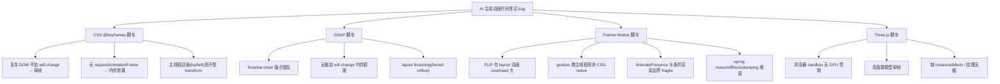
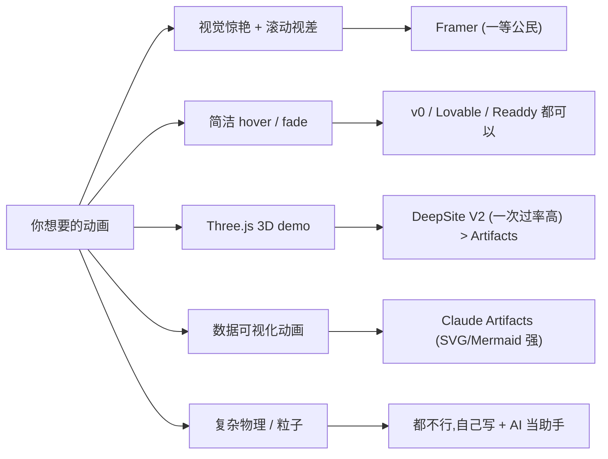

# 动画能力对比

"AI 一句话出动画"是这批工具的**集体痛点**。本页拆解每家工具的动画默认输出、实际能驾驭的动画库、和最容易翻车的边界。

## 残酷真相图

## 各工具动画能力矩阵

| 工具 | 默认输出 | 支持的库 | scroll/parallax | 物理动画 | 复杂 3D |
|------|----------|----------|----------------|----------|---------|
| **Framer** | 视差 + 滚动联动 + hover 3D | 自研 | ✅ 默认带 | ✅ Workshop AI | ⚠️ 需手设 |
| **v0** | shadcn 默认 motion-safe | Tailwind + Framer Motion | ⚠️ 需 prompt | ❌ | ❌ |
| **Lovable** | Tailwind transition + 模板 Lottie/SVG | Lottie/SVG/Tailwind | ⚠️ 需 prompt | ❌ 需手动改 | ❌ |
| **Bolt.new** | Claude 写啥就是啥 | 任意 | ⚠️ 不稳 | ❌ WebContainer 限制 | ❌ 无 GPU 控制 |
| **Readdy** | CSS hover (glow / scale) | CSS only | ❌ 实测无证据 | ❌ | ❌ |
| **Trae SOLO** | 中文 prompt 友好的 CSS keyframes | CSS / Three.js | ⚠️ 需 prompt | ❌ | ⚠️ |
| **Claude Artifacts** | SVG / HTML 动画 / 数据可视化时间轴 | 任意（Three.js / GSAP / FM） | ⚠️ 需多轮 | ❌ 不会 profile | ⚠️ 一次过率低 |
| **Stitch** | Material ripple / transition | Material Motion | ⚠️ | ❌ | ❌ |
| **DeepSite V2** | DeepSeek 写代码 + Tailwind | 任意 | ✅ 较稳 | ⚠️ | ✅ 12s 出 Three.js |
| **Replit Agent 3** | 自带浏览器测试动画 | 任意（含 r3f） | ✅ | ✅ "动态智能"帧级优化 | ✅ |

## Framer：把动画当一等公民

Framer 是这批里**唯一能"一句话出复杂动画"的工具**[^62]，但代价是平台锁定（详见 [5. 输出形态与代码归属.md](5.%20输出形态与代码归属.md)）。

## v0：保守但稳的 motion-safe

## Bolt.new：Claude 加持但被 WebContainer 锁住

Bolt 的动画上限取决于 Claude 3.5 Sonnet[^61]，但它的执行环境（StackBlitz WebContainer，浏览器内 Node.js）有硬限制：

- **没有 GPU 硬件加速控制** → 粒子系统、复杂着色器卡顿
- "Prompt size limit exceeded" 报错频繁
- Netlify OOM 部署失败常见
- 优化路径：拆分小模块；Lottie 用 `renderer: 'canvas'`[^61]

## Lovable：模板 Lottie，无物理引擎

## Claude Artifacts：技术上限最高的"教练"

Artifacts 不是"动画生成器"——它是"会写动画代码的 LLM"[^63]：

## DeepSite V2 的"动画特例"

实测中**最快出复杂动画的反而是 DeepSite V2**——HuggingFace 上的 DeepSeek R1-0528 加持版本[^62]：

- **8 秒**生成响应式咖啡店官网
- **12 秒**生成 Three.js 旋转地球（含星空特效）
- 自动引入 TailwindCSS + Font Awesome
- 完全免费、开源、可导出 HTML

## Replit Agent 3：唯一会"测试动画"的工具

Replit Agent 3 是 2026 末新势力[^63]：

- 单次自治运行 200 分钟
- 自带浏览器验证：会自己 click / form submit / 看动画播放
- 用"dynamic intelligence"帧级优化动画渲染
- 直接支持 react-three-fiber 项目导入

但代价是定位偏"长链路 agent"——不适合"我只想要个好看 landing page"。

## AI 写动画的通病清单

来源：[^61][^63]，及综合 BeautifulCode、QDStaff 多家性能博客整理。

## 实战建议

## 关联阅读

- 视觉风格选型：详见 [2. 视觉美学 DNA.md](2.%20视觉美学%20DNA.md)
- 配色字体的"非自动化"现状：详见 [4. 配色与字体系统.md](4.%20配色与字体系统.md)
- 翻车场景全集：详见 [8. 翻车场景清单.md](8.%20翻车场景清单.md)

[^61]: [[v0-lovable-bolt-2026-comparison|Lovable / Bolt.new / v0 — 2026 Pricing, Output, and Failure Modes]]
[^62]: [[framer-readdy-trae-and-china-tools|Framer / Readdy / Trae SOLO / 国产 AI 网页生成工具关键事实]]
[^63]: [[webgen-tools-animation-color-and-china-access|补充工具 + 动画/配色系统深度细节]]

## Sources

| # | Title | Raw Note |
|---|-------|----------|
| 61 | v0/Lovable/Bolt 2026 | [[v0-lovable-bolt-2026-comparison]] |
| 62 | Framer/Readdy/Trae | [[framer-readdy-trae-and-china-tools]] |
| 63 | 动画/配色 深度 | [[webgen-tools-animation-color-and-china-access]] |
