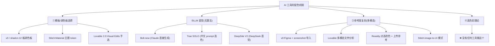
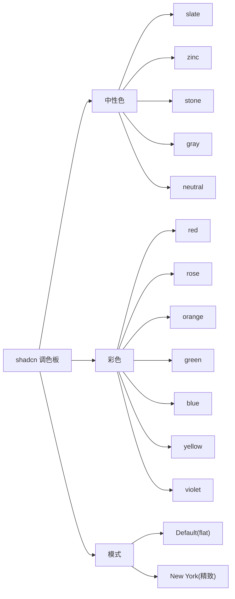
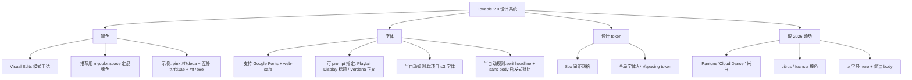
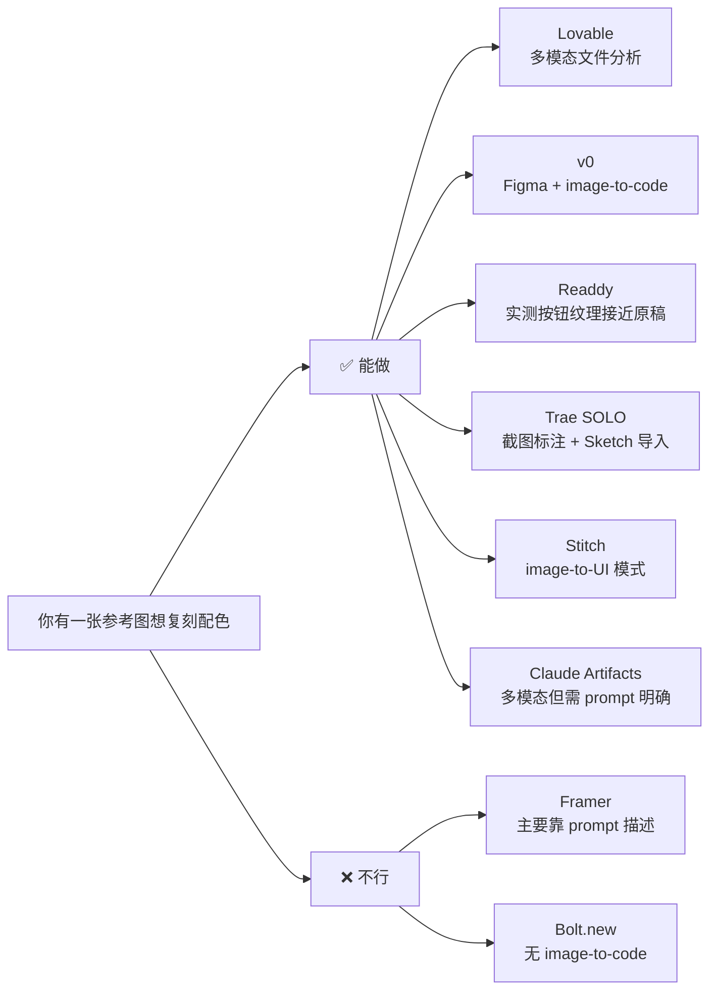
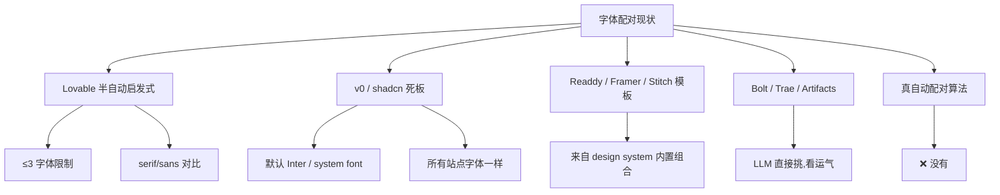

# 配色与字体系统

> **残酷真相**：截至 2026.5，**没有任何 AI 网页生成工具真的应用色彩理论 + 字体配对算法**。它们要么是"调色板选择题"，要么是"模型直觉"，要么是"启发式规则"。这一页解释为什么、各家走的什么路、以及如何**绕开**这个限制。

## 三种"伪自动化"路线



## v0 / shadcn 生态：12 板选择题

shadcn 的设计哲学是"give you defaults, not opinions"——给你 12 个调色板，自己挑[^61][^63]：



**结果是同质化**：所有 v0 + shadcn 站点远看都长得差不多。优点是稳，缺点是没"个性"。

> 想破局？用 **TweakCN**（AI 驱动的 shadcn 主题编辑器）：自然语言改色 / 圆角 / 字号，导出 CSS 变量到 shadcn 项目[^63]。

## Lovable 2.0 Visual Edits：半自动启发式

Lovable 是这批里**唯一在字体配对上做了启发式规则**的工具[^63]：



## Readdy：点选 + 参考图

Readdy 的配色不来自算法，但**编辑体验最接近设计师工具**[^62]：

- **Point-to-point editing**：点任意元素改色（"红渐变 → 靛青"）
- 选区改配色 / 替换图文 / 加纹样
- 上传参考图复刻：实测复刻抖音国风活动页，按钮和纹理接近原稿
- 暗色切换瞬时换板
- 每次编辑保存为新版本可对比回滚

但 review 中**未发现真正的"参考图色彩提取算法"** —— 它是 LLM 看图后的"再生"而非"提取"。

## 复刻参考图配色：哪个工具能做？



> **实操建议**：要"复刻配色"时，最稳的路径不是依赖工具的"自动复刻"，而是：
> 1. 用 Coolors / Adobe Color 提取参考图主色板
> 2. 把 hex 值喂给工具的 prompt（"primary: #f7deda, accent: #ff7b8e"）
> 3. 让工具按你给定的 token 生成

## 字体配对：有的"看起来自动"，没的"真自动"



## 2026 配色趋势锚点（参考用）

工具不会替你做色彩理论，但你可以让 prompt 跟趋势：

| 来源 | 趋势 |
|------|------|
| Pantone 2026 | Cloud Dancer 米白主基 + citrus / fuchsia 撞色[^63] |
| Framer 默认 | 暗色 dominance + Liquid Glass 雾化质感[^62] |
| 国风营销页 | 水墨色调 + 书法字体 + 留白节奏[^62] |
| 商务 SaaS | 柔和 gradient + neutrals + accent color[^61] |

## 实战 prompt 模板（绕开"工具不懂色彩"）

```
1. 给定主色 + 辅色 + 强调色 hex 值
2. 给定字体名 (Google Fonts 名)
3. 给定大字号 hero 期望大小 (e.g., 72px)
4. 给定 spacing token (8px 网格)
5. 给定参考站点 URL 或截图
```

把"色彩理论"自己做完再喂给 AI，比期望它"自动配色"靠谱 10 倍。

## 关联阅读

- 视觉风格的根：详见 [2. 视觉美学 DNA.md](2.%20视觉美学%20DNA.md)
- 怎么把这些规则交给工具：详见 [6. 迭代与编辑体验.md](6.%20迭代与编辑体验.md)

[^61]: [[v0-lovable-bolt-2026-comparison|Lovable / Bolt.new / v0 — 2026 Pricing, Output, and Failure Modes]]
[^62]: [[framer-readdy-trae-and-china-tools|Framer / Readdy / Trae SOLO / 国产 AI 网页生成工具关键事实]]
[^63]: [[webgen-tools-animation-color-and-china-access|补充工具 + 动画/配色系统深度细节]]

## Sources

| # | Title | Raw Note |
|---|-------|----------|
| 61 | v0/Lovable/Bolt 2026 | [[v0-lovable-bolt-2026-comparison]] |
| 62 | Framer/Readdy/Trae | [[framer-readdy-trae-and-china-tools]] |
| 63 | 动画/配色 深度 | [[webgen-tools-animation-color-and-china-access]] |
