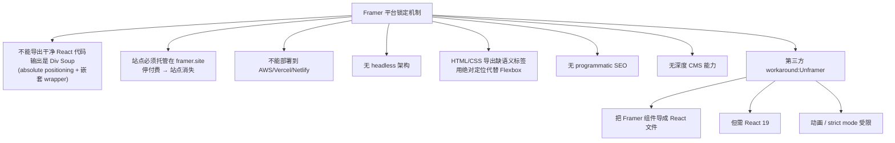
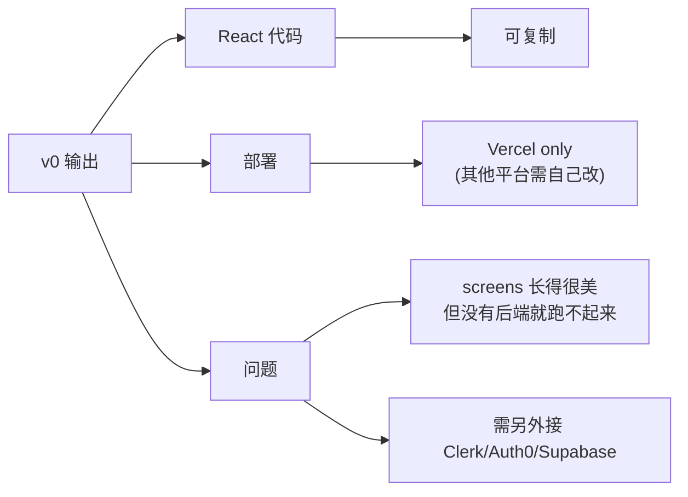
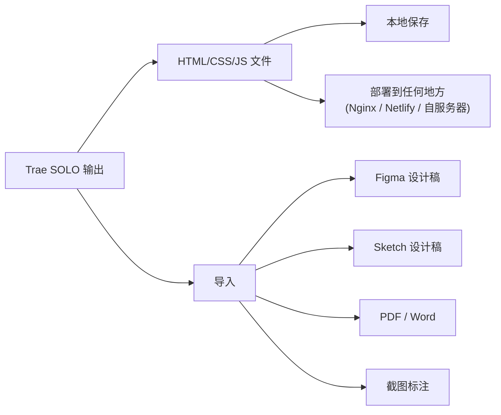
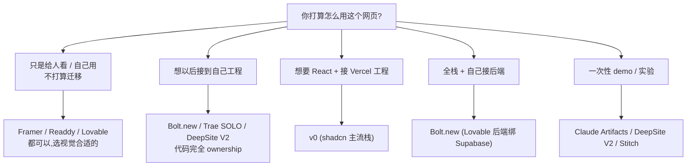

# 输出形态与代码归属

"代码归属"决定了你能不能带着作品离开这个工具。这是**选型时最易被低估、长期最重要**的维度。本页拆解每家工具到底输出了什么、谁锁住了你。

## 输出形态光谱

```mermaid
flowchart LR
    L["🔒 完全锁定"] -->|"只剩托管站"| L1["Framer"]
    L1 -->|"Pro 才能 GitHub"| LL1["Lovable<br/>(GitHub sync,非完整导出)"]
    LL1 -->|"必须 Vercel 部署"| M1["v0"]
    M1 -->|"Netlify/Vercel 二选一"| M2["Bolt.new"]
    M2 -->|"R/V/HTML 导出"| F1["Readdy"]
    F1 -->|"HTML 文件直接下载"| F2["DeepSite V2"]
    F2 -->|"完全本地代码"| F3["开源 screenshot-to-code"]
    F3 -->|"国内服务器 + 代码可下"| F4["Trae SOLO"]
    F4 -->|"Material/Tailwind/JSX 导出"| F5["Stitch"]
    F5 -->|"自带工程化"| F6["Subframe"]

    classDef lock fill:#ffcccc
    classDef partial fill:#ffe6cc
    classDef free fill:#ccffcc
    class L1,LL1,M1 lock
    class M2,F1,F5 partial
    class F2,F3,F4,F6 free
```

## 输出形态对比表

| 工具 | 托管 URL | 自定义域 | 代码导出 | Figma 导出 | 平台锁定 |
|------|----------|----------|----------|-----------|----------|
| **Framer** | ✅ framer.site | Mini+ | ❌ "Div Soup"，无 React | — | 🔒 强 |
| **v0** | Vercel | Vercel only | React 复制 | ✅ Figma 导入 | ⚠️ Vercel 锁 |
| **Lovable** | ✅ 一键部署 | Pro+ | ⚠️ GitHub sync(非完整) | ✅ Figma 导入 | ⚠️ 中等 |
| **Bolt.new** | Netlify/Vercel | ✅ | ✅ GitHub push | ❌ | 🆓 弱 |
| **Readdy** | ✅ 自定义域 | ✅ | ✅ HTML/CSS, React, Vue | ✅ | 🆓 弱 |
| **Trae SOLO** | 本地 / 自部署 | 自定义 | ✅ HTML/CSS/JS | 含 Figma 导入 | 🆓 无 |
| **Claude Artifacts** | Claude 内嵌 + 分享链接 | ❌ | ✅ 复制代码 | ❌ | ⚠️ 单文件限制 |
| **Stitch** | — | — | ✅ HTML/Tailwind + JSX + Figma | ✅ Standard 模式 | 🆓 弱 |
| **DeepSite V2** | HuggingFace | 自部署 | ✅ HTML 直接下载 | ❌ | 🆓 无 |
| **Subframe** | — | — | ✅ React + Tailwind code 或 CLI | ❌ | 🆓 无 |
| **Same.new** | Netlify | ✅ | ✅ React/Vue/vanilla | ❌ | 🆓 弱 |

## Framer 的 walled garden

Framer 是这批里**锁定最严的工具**[^62]：

> **接受这个权衡**：Framer 给你 2026 视觉天花板，代价是"作品永远住在 Framer"。如果你的目标是"做出好看的页面分享出去"，这个权衡可接受；如果你的目标是"积累一个能带走的 portfolio"，慎选。

## v0 的 Vercel 锁

v0 的代码可以复制走，但部署路径只有 Vercel[^61]：

## Lovable 的"GitHub sync,但不是完整导出"

这是 Lovable 经常被忽略的坑[^61]：

> **GitHub sync ≠ 完整导出**。Lovable 把代码同步到 GitHub 仓库，但项目运行依赖 Lovable 平台的 build 系统、Supabase 配置、环境变量。"代码在那里"≠ "你能在别处跑起来"。

## Bolt.new：相对自由

Bolt 是这批里**代码归属相对最干净**的[^61]：

- StackBlitz WebContainer 跑 Node.js → 你看到的就是你能跑的
- 部署到 Netlify 或 Vercel 二选一
- GitHub push 完整代码
- 自定义域名

但代价：token 易爆（详见 [7. 价格与免费额度.md](7.%20价格与免费额度.md)）。

## Readdy：意外的自由

Readdy 虽然主托管，但导出能力比预期强[^62]：

- HTML/CSS/JS 默认输出
- **React + Vue 代码导出**（Starter+ 计划）
- **Figma 文件导出**（Starter+ 计划）
- 自定义域名 hosting
- GitHub Copilot 集成

## Trae SOLO：完全自由

Trae 中国版的输出最"原始"[^62]：

## Claude Artifacts 的"单文件限制"

Artifacts 的特殊形态[^63]：

- 输出是单个 React/HTML 工件，运行在 Claude 的 sandbox 里
- 可以复制代码到本地继续改
- 可以分享 Artifact 链接（Pro/Enterprise 计划）
- **但天生不是多文件项目** — 复杂应用会遇到组织瓶颈

## Stitch 的双轨导出

Google Stitch 设计 → 代码的桥很短[^63]：

| 模式 | Figma 导出 | 代码导出 |
|------|----------|----------|
| Standard Mode | ✅ auto-layout + 图层组 + color variables | ✅ HTML/Tailwind + JSX |
| Sketch-to-UI | ❌ | ⚠️ |
| Voice Canvas | ❌ | ⚠️ |

## 决策树：按代码归属选

## 关联阅读

- 价格中常被忽略的"导出限制"：详见 [7. 价格与免费额度.md](7.%20价格与免费额度.md)
- 翻车场景里的"导出失败"：详见 [8. 翻车场景清单.md](8.%20翻车场景清单.md)

[^61]: [[v0-lovable-bolt-2026-comparison|Lovable / Bolt.new / v0 — 2026 Pricing, Output, and Failure Modes]]
[^62]: [[framer-readdy-trae-and-china-tools|Framer / Readdy / Trae SOLO / 国产 AI 网页生成工具关键事实]]
[^63]: [[webgen-tools-animation-color-and-china-access|补充工具 + 动画/配色系统深度细节]]

## Sources

| # | Title | Raw Note |
|---|-------|----------|
| 61 | v0/Lovable/Bolt 2026 | [[v0-lovable-bolt-2026-comparison]] |
| 62 | Framer/Readdy/Trae | [[framer-readdy-trae-and-china-tools]] |
| 63 | 动画/配色 深度 | [[webgen-tools-animation-color-and-china-access]] |
