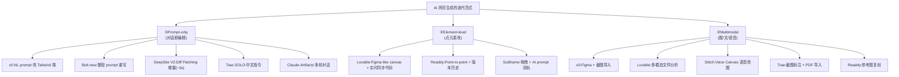
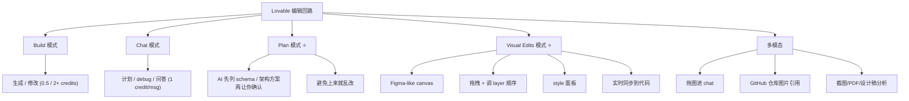
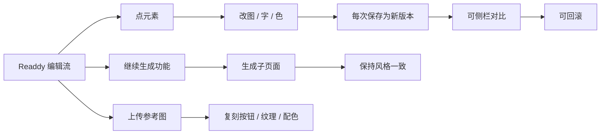
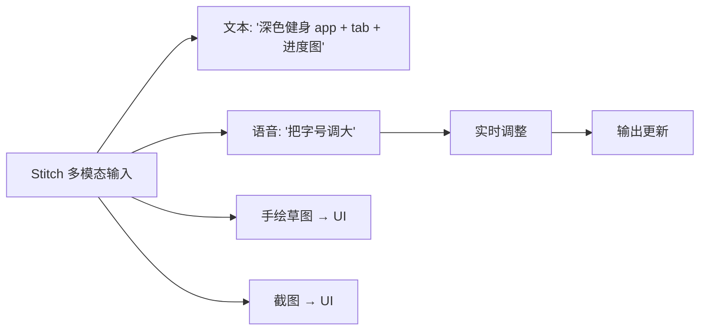
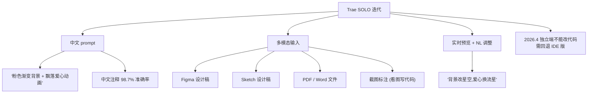
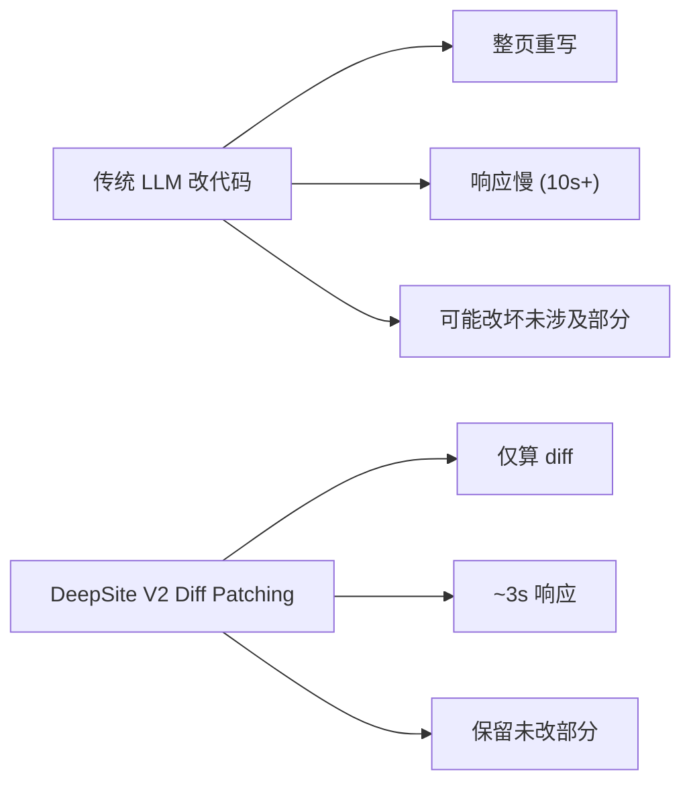
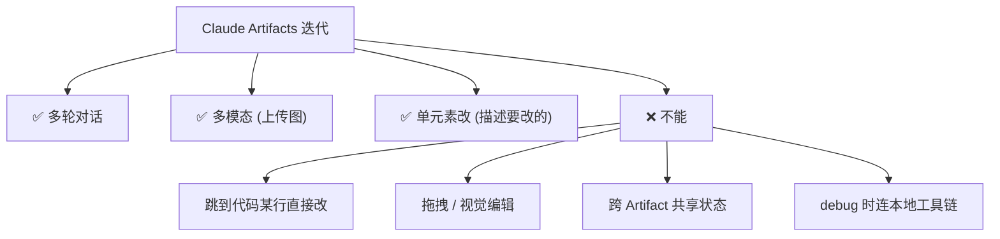
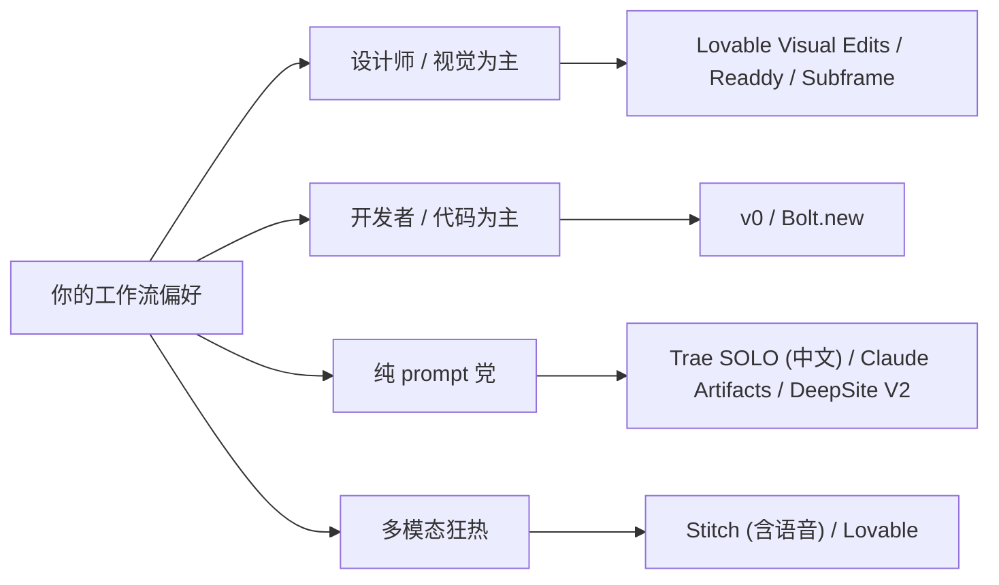

# 迭代与编辑体验

视觉漂亮的初稿一文不值——能不能"改成你要的样子"才是工具的真功夫。本页拆解每家工具的迭代回路：是 prompt-only、还是 element-level、还是 Figma 级 WYSIWYG？

## 三种迭代范式

## 每家迭代体验对比

| 工具 | 元素级编辑 | 拖拽 / 视觉编辑 | 多轮对话 | 上传参考图 | 版本历史 | 语音 |
|------|------------|----------------|---------|-----------|---------|------|
| **v0** | ⚠️ prompt 选元素 | ❌ | ✅ | ✅ Figma+screenshot | ⚠️ | ❌ |
| **Lovable** | ✅ 点选+chat | ✅ Figma-like canvas | ✅ Plan Mode | ✅ 拖拽进 chat | ✅ | ❌ |
| **Bolt.new** | ❌ | ❌ | ✅ | ❌ | GitHub commit | ❌ |
| **Readdy** | ✅ 点选 | ⚠️ 部分 | ✅ | ✅ | ✅ 每编辑一版 | ❌ |
| **Trae SOLO** | ⚠️ 截图标注 | ❌ | ✅ 中文 | ✅ Figma/Sketch/PDF | IDE 版本 | ❌ |
| **Stitch** | ⚠️ | ❌ | ✅ | ✅ image-to-UI | ⚠️ | ✅ Voice Canvas |
| **Framer** | ✅ Framer 编辑器原生 | ✅ | ⚠️ | ❌ | ✅ | ❌ |
| **Claude Artifacts** | ❌ 整体重写 | ❌ | ✅ | ✅ Claude 多模态 | ✅ Claude 历史 | ❌ |
| **DeepSite V2** | ⚠️ Diff Patching | ❌ | ✅ | ❌ | ⚠️ | ❌ |
| **Subframe** | ✅ 拖拽 + AI | ✅ 完整画布 | ✅ | ❌ | ✅ | ❌ |

## Lovable：迭代体验最丰富

Lovable 在 2025 引入 Visual Edits 后，迭代体验已经追上设计工具[^61][^63]：

**Plan Mode** 是 Lovable 的差异化核心：在做大改前先让 AI 输出"我打算改 schema 这几张表 / 架构这样改"，避免"对话 100 次还没出 MVP"的窘境（用户实测：150 条消息没出 MVP 是常见情况[^61]）。

## Readdy：版本历史 + 点选

Readdy 的迭代设计学的是 Figma + Notion[^62]：

## v0：开发者风格的"prompt 即编辑"

v0 没有 WYSIWYG 编辑器，但精度高[^61][^63]：

- "选中 navbar，改成黑色"——AI 直接改对应 Tailwind 类
- 多轮对话有上下文记忆，但**跨文件依赖记不住**
- 最近支持 Figma 直接导入，导入后改了 v0 也跟着改
- 适合开发者：精准、可追溯、与 git 友好

## Stitch：语音改图（Voice Canvas）

Stitch 是这批里**唯一支持语音迭代**的工具[^63]：

但语音模式（和 sketch-to-UI）**不支持 Figma 导出**[^63]——只有 Standard Mode 才能完整导出。

## Trae SOLO 的中文友好迭代

Trae 的差异化在中文 prompt 的精度[^62]：

## Subframe：设计 / 代码同源画布

Subframe 是为"设计师 + 开发"团队做的[^62]：

- 拖拽组件 + AI prompt 双轨
- 设计师画 → 自动生成 React/Tailwind 代码
- pixel-perfect 输出
- 自定义组件可同步到代码
- $29/编辑器/月，免费档可探索

## "Diff Patching" 加速迭代（DeepSite V2 创新）

这个机制现在被多家工具借鉴。

## Claude Artifacts 的迭代局限

## 实战：迭代效率对比

| 任务 | v0 | Lovable | Bolt | Readdy |
|------|----|---------|------|--------|
| 改一个按钮颜色 | 1 prompt 30s | 点选改 5s | 1 prompt 60s | 点选改 5s |
| 加一个 hero section | 1 prompt 1min | 1 prompt 1min | 1 prompt 2min | 点 + Continue 30s |
| 复刻参考图 hero | Figma 导入然后改 | 拖图进 chat | 不支持 | 上传参考图 30s |
| 改全站配色 | 改 globals.css | 改 design tokens | 全文修改 prompt | 全局换主题 |
| 局部布局调整 | prompt 风险高 | Visual Edits 拖 | prompt 风险高 | 点选改 |

## 选型建议

## 关联阅读

- 配色 / 字体如何精确指挥 AI：详见 [4. 配色与字体系统.md](4.%20配色与字体系统.md)
- 迭代失败的经典翻车：详见 [8. 翻车场景清单.md](8.%20翻车场景清单.md)

[^61]: [[v0-lovable-bolt-2026-comparison|Lovable / Bolt.new / v0 — 2026 Pricing, Output, and Failure Modes]]
[^62]: [[framer-readdy-trae-and-china-tools|Framer / Readdy / Trae SOLO / 国产 AI 网页生成工具关键事实]]
[^63]: [[webgen-tools-animation-color-and-china-access|补充工具 + 动画/配色系统深度细节]]

## Sources

| # | Title | Raw Note |
|---|-------|----------|
| 61 | v0/Lovable/Bolt 2026 | [[v0-lovable-bolt-2026-comparison]] |
| 62 | Framer/Readdy/Trae | [[framer-readdy-trae-and-china-tools]] |
| 63 | 动画/配色 深度 | [[webgen-tools-animation-color-and-china-access]] |
