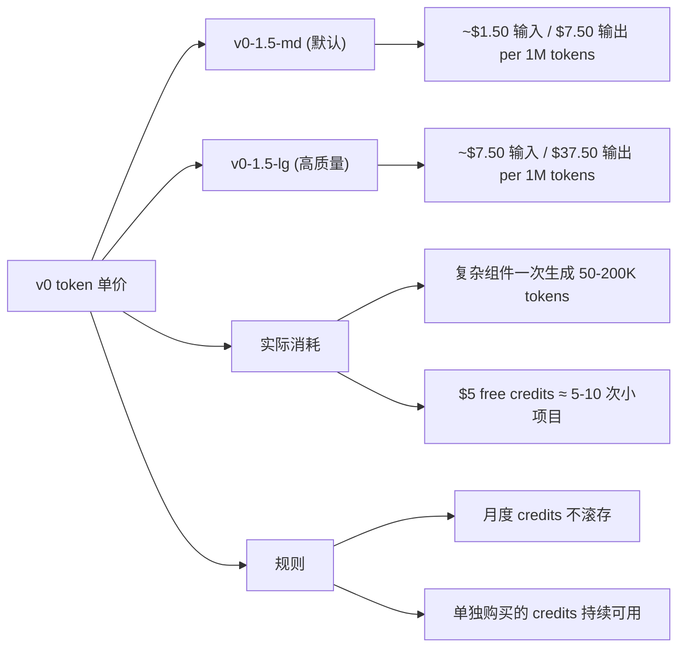
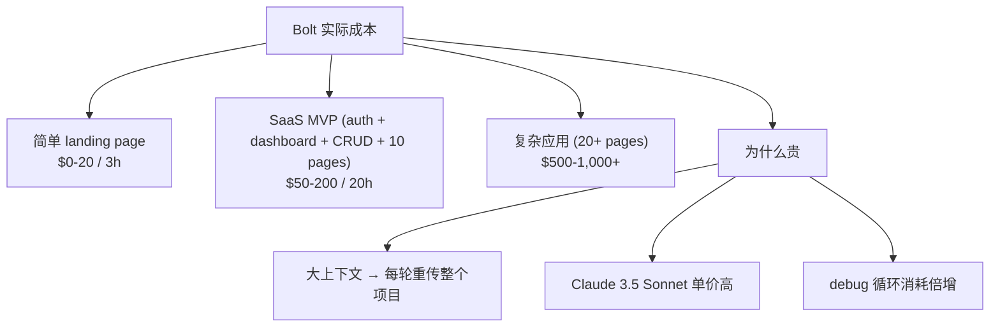
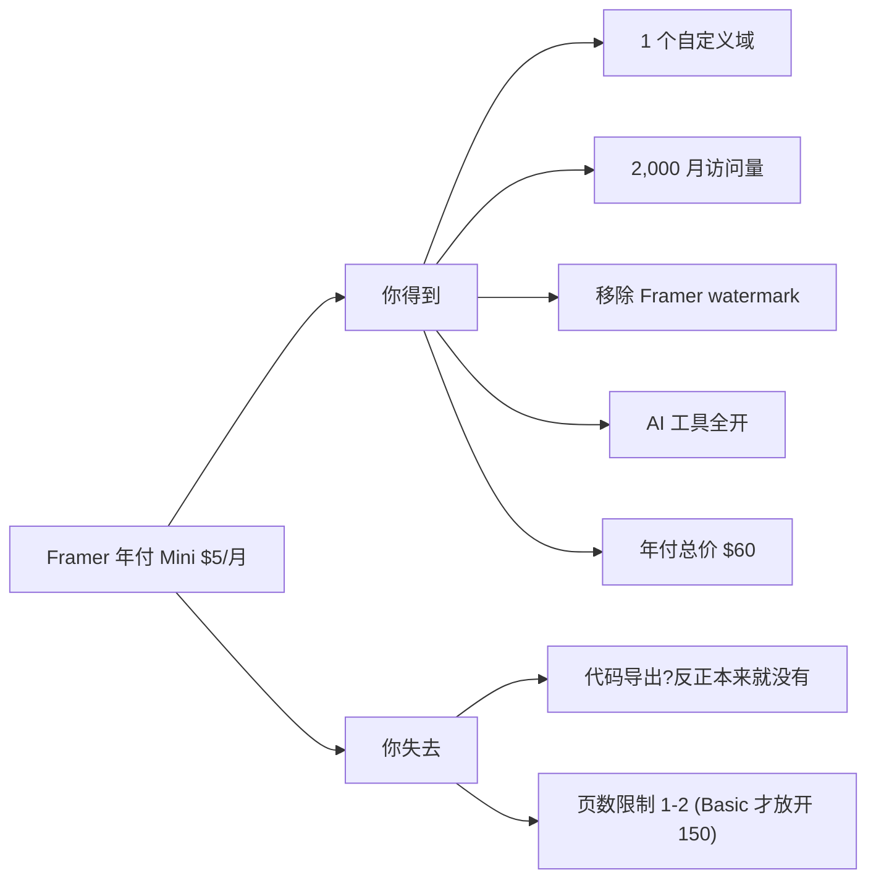
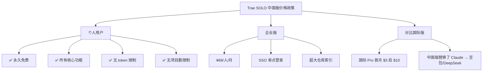
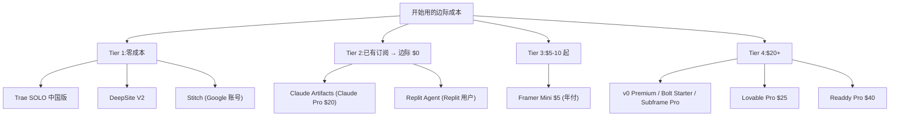
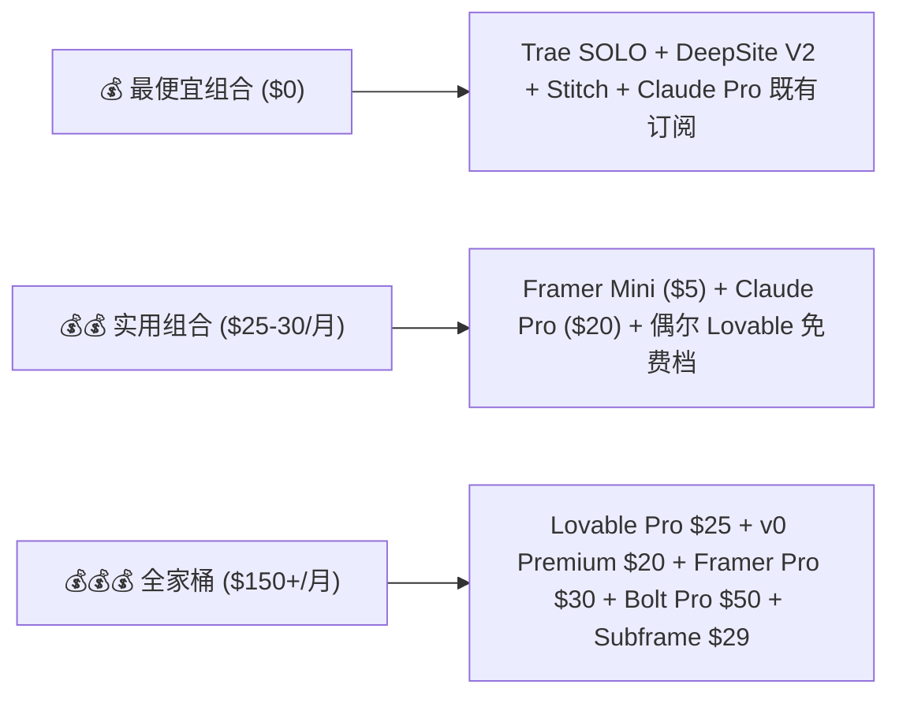
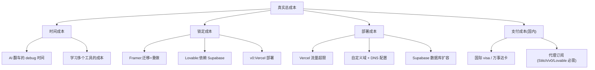

# 价格与免费额度

价格是这批工具最容易被遗忘但最常翻车的维度。本页给出 2026.5 的完整快照，并把 token / credit / 月费混乱单位统一翻译成"我每天能改几次"。

## 完整价格快照（2026.5）

| 工具 | 免费档 | 入门档 | 专业档 | 计费机制 | 月费起 |
|------|--------|--------|--------|---------|--------|
| **v0** | $0 ($5 credits) | Premium $20 ($20 credits) | Team $30/user | token 单价 | $20[^61] |
| **Bolt.new** | 150K tokens/天 | Starter $20 (10M) | Pro $50 (26M) | tokens 月度 | $20[^61] |
| **Lovable** | 5/天 (30/月 credits) | Pro $25 (100 + 5/天) | Business 高 | credits/操作 | $25[^61] |
| **Framer** | Hobby $0 (watermark) | Mini $5 yearly | Pro $30 | 无限创建 | $5/年付[^62] |
| **Readdy** | $0 (500 credits) | Starter ~$20-25 (5K) | Pro ~$40 (11K) | 50/页, 10/编辑 | $20[^62] |
| **Trae SOLO 中国版** | **永久免费** | — | 企业 ¥69/人/月 | 无限制 | ¥0[^62] |
| **Trae 国际版** | — | 首月 $3 后续 $10 | — | — | $3-10[^62] |
| **Claude Artifacts** | 含在 Claude 免费 | Pro $20 | — | Claude 主订阅 | $20[^63] |
| **Stitch** | **完全免费** (400/天 ≈ 12,450/月) | — | — | credits/天 | $0[^63] |
| **DeepSite V2** | **完全免费** | — | — | 无限 | $0[^62] |
| **Subframe** | $0 (1 项目 5 页) | Pro $29/编辑器/月 | — | 编辑器席位 | $29[^63] |
| **Magic Patterns** | trial | $19/月起 | — | — | $19[^63] |
| **Replit Agent** | Replit 免费 | Pro ~$15/月 | — | Replit 主订阅 | $15[^63] |

## 计费单位的"翻译表"

```mermaid
flowchart TB
    M["统一为'每日可生成次数'"]
    M --> Free["免费档"]
    Free --> F1["Trae 中国版:无限"]
    Free --> F2["Stitch:~30+ 个页面/天"]
    Free --> F3["DeepSite V2:无限"]
    Free --> F4["v0:$5 credits ≈ 几次小改"]
    Free --> F5["Lovable:5 次/天"]
    Free --> F6["Readdy:500 credits ≈ 10 页"]
    Free --> F7["Bolt:150K tokens ≈ 几个小项目"]

    M --> Paid20["$20-30 档"]
    Paid20 --> P1["v0 Premium:$20 credits"]
    Paid20 --> P2["Bolt Starter:10M tokens"]
    Paid20 --> P3["Lovable Pro:100 credits + 5/天"]
    Paid20 --> P4["Framer Pro:无限"]
    Paid20 --> P5["Readdy Starter:5,000 credits"]

    M --> ProBudget["$50+ 档"]
    ProBudget --> PR1["Bolt Pro:26M tokens"]
    ProBudget --> PR2["Bolt Business:55M"]
    ProBudget --> PR3["Bolt Enterprise:120M"]
    ProBudget --> PR4["Readdy Pro:11K credits"]
```

## v0：token 计费的不可预测

v0 在 2025.5 从无限制改成 token 计费引发开发者社区强烈反弹[^61]：

## Bolt.new：最容易爆 token 的工具

Bolt 价格档看起来便宜，但实测 token 消耗惊人[^61]：

> 实测口径："**1.3M tokens in a single day**" / "**$1,000+ on tokens just to fix code problems**"
>
> "Once projects exceed 15-20 components or require custom API integrations, context retention degrades noticeably"

## Lovable：credit 系统更"细粒度"

Lovable 的 credit 设计鼓励小步快跑[^61]：

| 操作 | 消耗 |
|------|------|
| 简单修改（改按钮颜色） | 0.5 credits |
| 完整应用结构生成 | 2+ credits |
| Chat 模式（计划/debug/问答） | 1 credit/message |

**额外福利**[^61]：2025 年起，每个工作区（**包括免费档**）每月获得 **$25 Cloud + $1 AI** 配额。

## Framer：年付 $5 的"超级性价比"

Framer Mini 计划是这批里**最便宜的"无限创建"档**[^62]：

> **诡异的事实**：Framer Mini $5/月 比大多数 $20/月 工具的免费档还慷慨——前提是接受平台锁定。

## Readdy：50 credits / 页的精算

Readdy 的 credit 消耗规则简单清晰[^62]：

| 操作 | 消耗 |
|------|------|
| 新生成（含 2 个设计选项） | 50 credits |
| 编辑 | 10 credits |

按这个规则换算：

| 计划 | 月费 | credits | 新页/月 | 编辑次数 |
|------|------|---------|---------|----------|
| Free | $0 | 500 | ≈10 | ≈50 |
| Starter | $20-25 | 5,000 | ≈100 | ≈500 |
| Pro | $40 | 11,000 | ≈220 | ≈1,100 |

## Trae SOLO 中国版：永久免费的国宝

## Stitch：另一个"免费就够用"的选项

[^63] 给的额度真的很足：

- **400 credits / 天 ≈ 12,450 credits / 月**
- 完全免费（截至 2026.5）
- 没有付费档可选

> 但有 trade-off：复杂项目 credits 消耗"不可预测"，可能某天突然不够。无团队协作功能。

## DeepSite V2：HuggingFace 的免费午餐

[^62]：

- 模型：DeepSeek R1-0528（开源）
- 平台：HuggingFace Spaces
- **完全免费，无注册门槛**
- 唯一成本：HF 域名国内访问偶尔不稳

## 性价比排序（按"开始用"的成本）

## 最便宜组合 vs 最贵组合

## 价格之外的隐藏成本

## 关联阅读

- 选哪个最划算（个人选型）：详见 [10. Top 3 选型与 Quickstart.md](10.%20Top%203%20选型与%20Quickstart.md)
- 国内访问 + 支付方案：详见 [9. 国内可访问性专题.md](9.%20国内可访问性专题.md)

[^61]: [[v0-lovable-bolt-2026-comparison|Lovable / Bolt.new / v0 — 2026 Pricing, Output, and Failure Modes]]
[^62]: [[framer-readdy-trae-and-china-tools|Framer / Readdy / Trae SOLO / 国产 AI 网页生成工具关键事实]]
[^63]: [[webgen-tools-animation-color-and-china-access|补充工具 + 动画/配色系统深度细节]]

## Sources

| # | Title | Raw Note |
|---|-------|----------|
| 61 | v0/Lovable/Bolt 2026 | [[v0-lovable-bolt-2026-comparison]] |
| 62 | Framer/Readdy/Trae | [[framer-readdy-trae-and-china-tools]] |
| 63 | 动画/配色 深度 | [[webgen-tools-animation-color-and-china-access]] |
