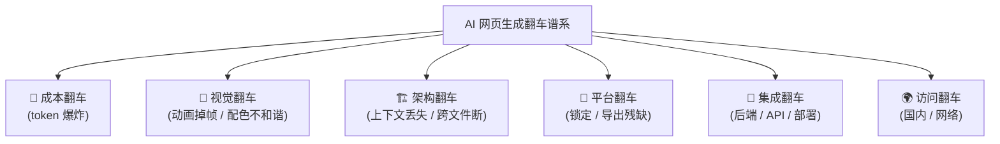
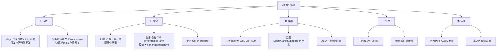
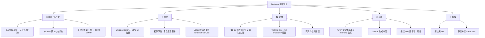
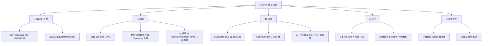
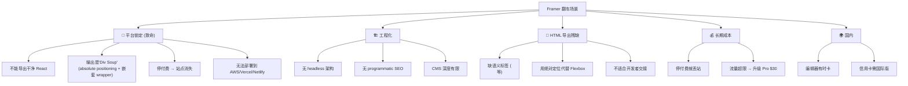
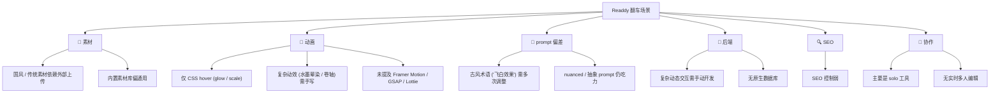
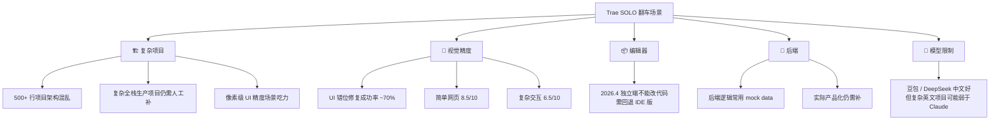
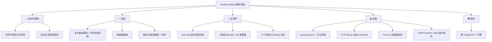
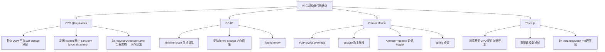
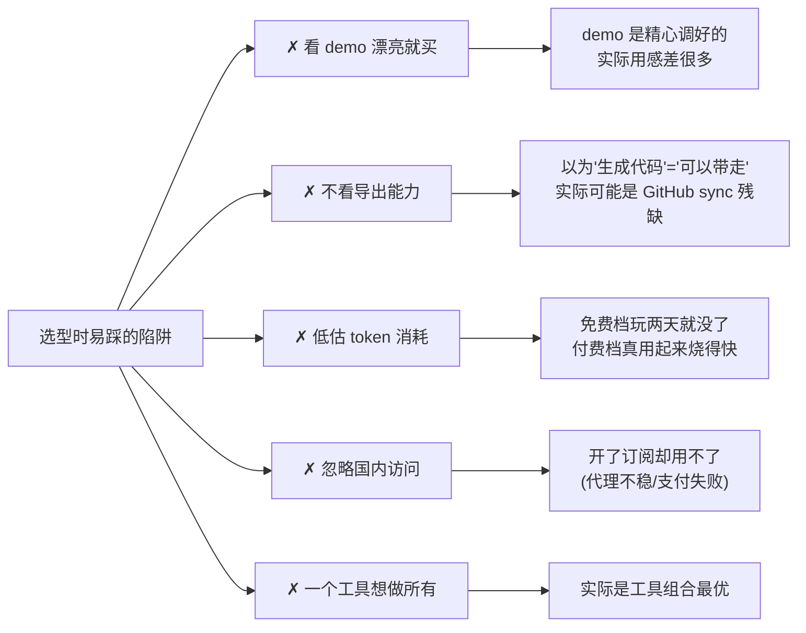

# 翻车场景清单

每个工具都会翻车，关键是**翻在你不打算用的地方**。本页按工具列出已被实测/社区验证的失败模式，帮你提前避开雷区。

## 翻车类型总览

## v0 翻车地图

来源：[^61][^63]

## Bolt.new 翻车地图

来源：[^61]

## Lovable 翻车地图

来源：[^61][^63]

## Framer 翻车地图

来源：[^62]

## Readdy 翻车地图

来源：[^62]

## Trae SOLO 翻车地图

来源：[^62]

## Claude Artifacts 翻车地图

来源：[^63]

## Stitch 翻车地图

来源：[^63]

| 翻车类型 | 具体表现 |
|----------|---------|
| 视觉 | 输出常需设计师再修改 |
| 协作 | 无团队协作功能 |
| credits | 复杂项目消耗不可预测 |
| 国内 | withgoogle.com 域，需代理 |
| 模式 | sketch-to-UI 和 voice 模式不支持 Figma 导出 |

## DeepSite V2 翻车地图

来源：[^62]

| 翻车类型 | 具体表现 |
|----------|---------|
| 复杂逻辑 | 物理引擎、游戏逻辑仍需手工优化 |
| prompt 偏差 | 首次生成偏差大，需多次调整 |
| 平台 | HuggingFace 域国内偶尔波动 |

## 跨工具的"AI 写动画"通病

## 常见翻车的 workaround 速查

| 翻车 | workaround |
|------|-----------|
| Lovable 物理动画 | `transform: translateZ(0)` 强制 GPU 合成；预 bake 物理 |
| Bolt 大项目 OOM | 拆模块 + Lottie 用 `renderer: 'canvas'` |
| v0 frame drop | 给关键元素加 `will-change: transform` |
| Bolt token 爆 | 切小项目 + 频繁开新 chat |
| Lovable 没出 MVP | 用 Plan Mode 先列方案再执行 |
| Framer 想要代码 | 试 Unframer (React 19 + 部分动画限制) |
| Readdy 国风弱 | 自备字体 + 上传参考图复刻 |
| Trae 复杂项目 | 切回 IDE 版 + 人工补后端 |
| Artifacts 多文件 | 拆成多 Artifact + 复制粘贴 |
| 国内访问 | 见 [9. 国内可访问性专题.md](9.%20国内可访问性专题.md) |

## 高频选型陷阱

## 关联阅读

- 价格陷阱细节：详见 [7. 价格与免费额度.md](7.%20价格与免费额度.md)
- 国内访问翻车：详见 [9. 国内可访问性专题.md](9.%20国内可访问性专题.md)

[^61]: [[v0-lovable-bolt-2026-comparison|Lovable / Bolt.new / v0 — 2026 Pricing, Output, and Failure Modes]]
[^62]: [[framer-readdy-trae-and-china-tools|Framer / Readdy / Trae SOLO / 国产 AI 网页生成工具关键事实]]
[^63]: [[webgen-tools-animation-color-and-china-access|补充工具 + 动画/配色系统深度细节]]

## Sources

| # | Title | Raw Note |
|---|-------|----------|
| 61 | v0/Lovable/Bolt 2026 | [[v0-lovable-bolt-2026-comparison]] |
| 62 | Framer/Readdy/Trae | [[framer-readdy-trae-and-china-tools]] |
| 63 | 动画/配色 深度 | [[webgen-tools-animation-color-and-china-access]] |
