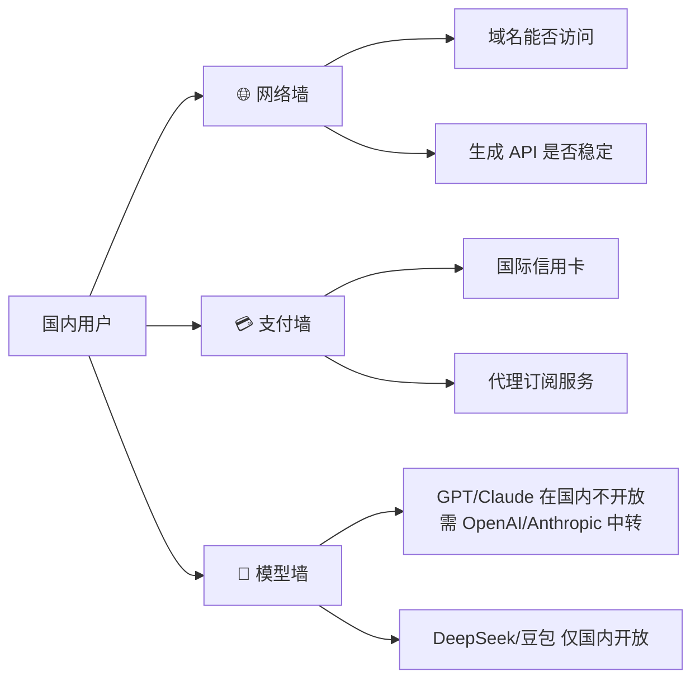
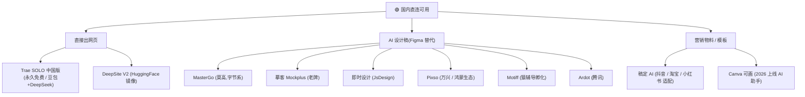
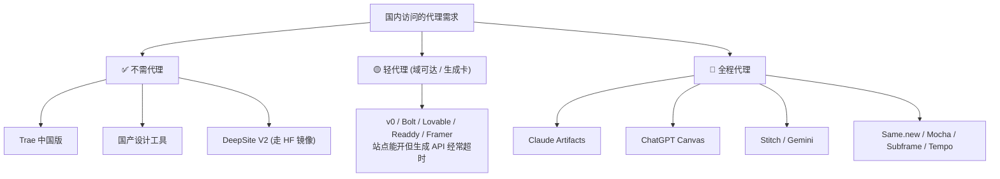
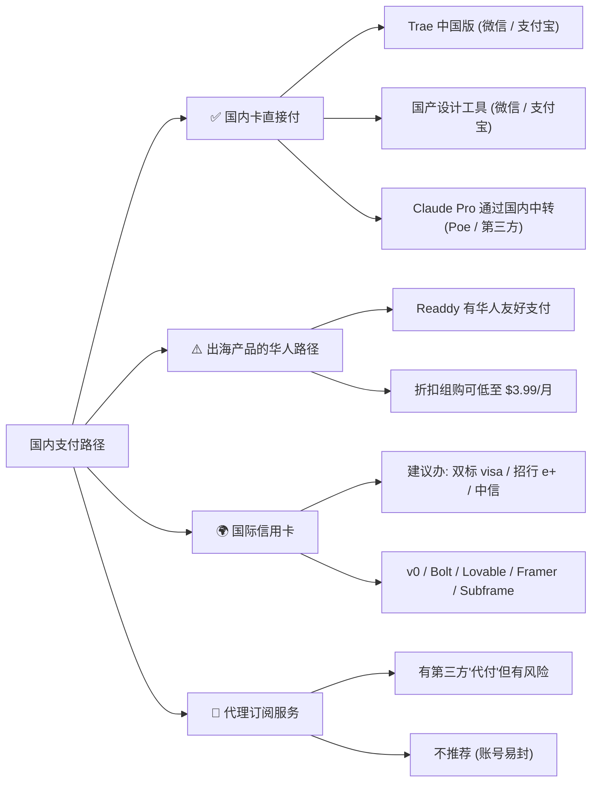
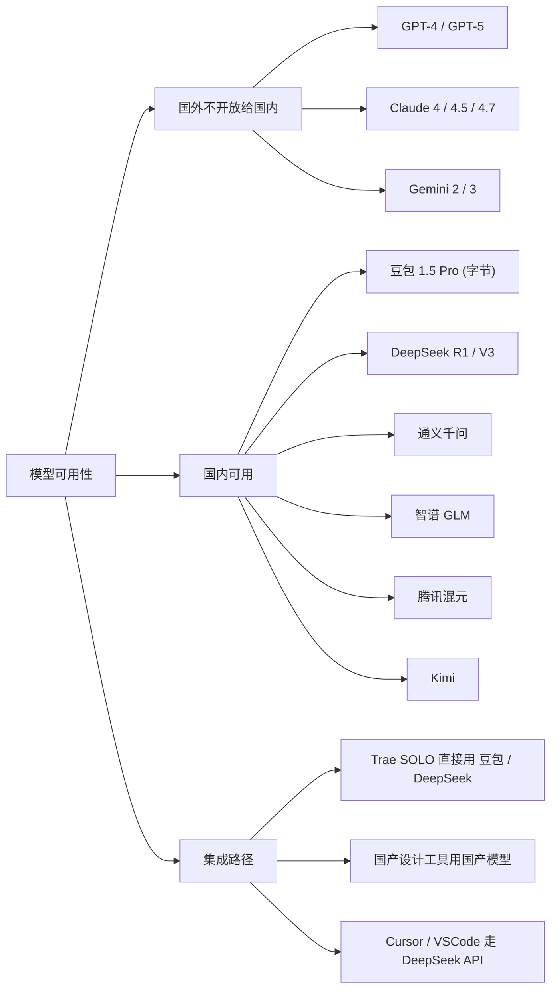
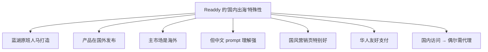
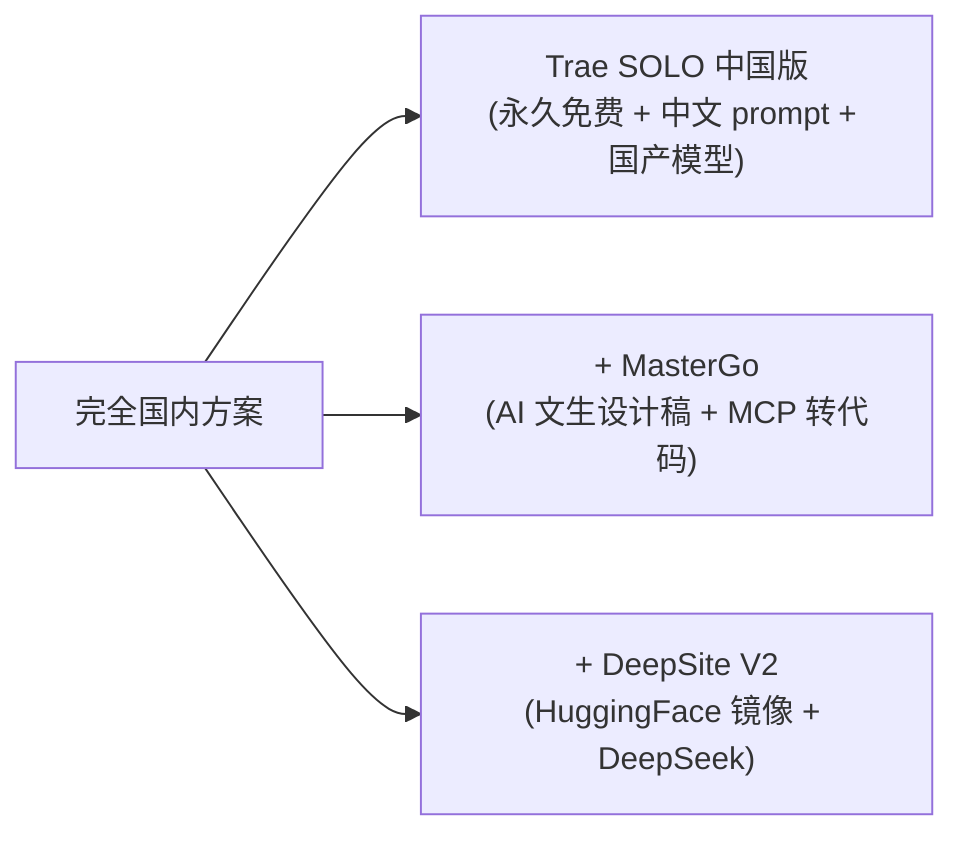
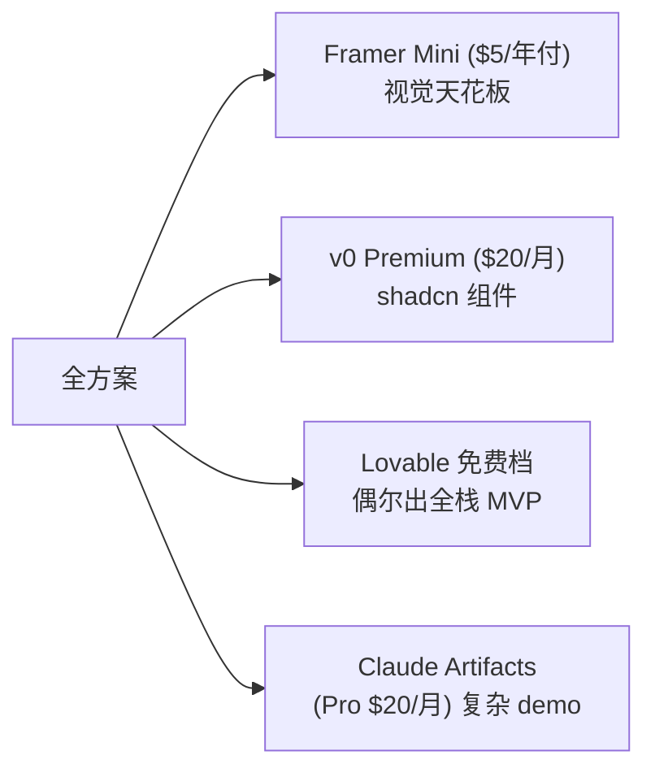
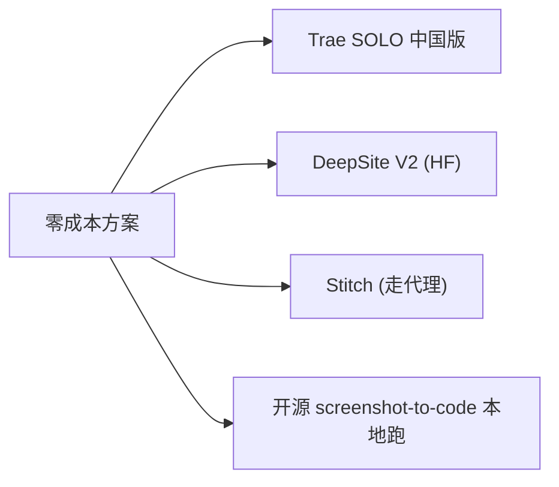

# 国内可访问性专题

国内开发者用这一批工具有三道墙：**网络墙 → 支付墙 → 模型墙**。本页给出每家工具的真实可达性 + 国产替代品矩阵 + 实操绕行方案。

## 三道墙

## 完整可访问性矩阵

| 工具 | 域名直连 | 生成 API 稳定 | 国内支付 | 模型 | 综合可用度 |
|------|---------|--------------|---------|------|----------|
| **Trae SOLO 中国版** | ✅ | ✅ 毫秒级 | ✅ 微信/支付宝 | 豆包 + DeepSeek | 🟢🟢🟢🟢🟢[^62] |
| **MasterGo / 摹客 / 即时设计 / Pixso / Motiff / Ardot / 稿定 AI** | ✅ | ✅ | ✅ | 国产 | 🟢🟢🟢🟢🟢[^62] |
| **DeepSite V2** | ⚠️ HF 域不稳 | ⚠️ | — (免费) | DeepSeek R1 | 🟡🟡🟡 |
| **Bolt.new** | ⚠️ StackBlitz 域可达 | ⚠️ 偶尔卡 | 需国际卡 | Claude 3.5 Sonnet | 🟡🟡 |
| **v0** | ⚠️ Vercel 域可达 | ⚠️ 卡 | 需国际卡 | v0 模型 | 🟡🟡 |
| **Lovable** | ⚠️ | ⚠️ | 需国际卡 | Claude+其他 | 🟡 |
| **Framer** | ⚠️ 编辑器卡 | ⚠️ | 需国际卡 | 自研 | 🟡 |
| **Readdy** | ⚠️ | ⚠️ | 出海产品有华人友好支付 | 多模型 | 🟡🟡 |
| **Claude Artifacts** | ❌ | ❌ | 需国际卡 | Claude | 🔴 (有 Pro 才行) |
| **ChatGPT Canvas** | ❌ | ❌ | 需国际卡 | GPT | 🔴 |
| **Gemini Canvas / Stitch** | ❌ | ❌ | 需 Google 账号 | Gemini | 🔴 |
| **Subframe / Magic Patterns / Same.new / Mocha / Tempo** | ❌ | ❌ | 需国际卡 | 多 | 🔴 |

来源：[^62][^63]

## 国内直连工具地图

来源：[^62]

## 国产 AI 设计工具特征对比

| 工具 | 出身 | 核心优势 | 出代码能力 |
|------|------|---------|----------|
| **MasterGo** | 字节系 | AI 文生设计稿 + MCP 转 HTML/Vue/React；500 人协同 | ✅ MCP 服务 |
| **摹客** | 老牌 | "小摹 AI" 多页设计稿；离线全流程；国风素材 | ⚠️ 标注切图 |
| **即时设计** | 国产 Figma 替代 | 一句话生成 UI（10s）；CSS/React 导出；蓝湖对接 | ✅ |
| **Pixso** | 万兴 | 鸿蒙生态适配；变量化设计系统 | ✅ |
| **Motiff** | 猿辅导 | AI 复制 / 布局；组件库管理 | ⚠️ |
| **Ardot** | 腾讯 | 文生 UI + 动态布局 | ⚠️ |
| **稿定 AI** | 稿定 | 抖音 / 淘宝 / 小红书 平台规范自动适配 | ❌ 平面物料 |

> **重要边界**：上面这些工具大多是 **Figma 替代** 或 **AI 设计稿**，而 **直接生成完整网页** 还要靠 Trae SOLO + DeepSite V2，或开源 screenshot-to-code 自部署。

## 各工具的"代理需求"

## 支付实操方案

## 模型墙与国产替代

## 国内出海产品的"诡异定位"

Readdy 是个有趣案例[^62]：

## 实操推荐路径（按用户场景）

### 场景 A：完全不用代理，国内一站式

### 场景 B：有代理 + 国际卡，全套都用

### 场景 C：极致零成本

## 国内访问技巧

| 技巧 | 适用场景 |
|------|---------|
| 用 HuggingFace 国内镜像 | DeepSite V2 |
| 关闭代理访问国产工具 | Trae / MasterGo / 摹客 等 |
| Cloudflare Pages 镜像自部署 | 开源 screenshot-to-code |
| 用 Poe / 第三方中转 | Claude Artifacts |
| 用 Cursor + DeepSeek API | 替代 v0 / Bolt 部分场景 |
| ChatGPT Plus 走 Apple ID | 绕开支付限制 |

## 关联阅读

- 工具间整体对比：详见 [1. 全景与分类.md](1.%20全景与分类.md)
- 价格视角：详见 [7. 价格与免费额度.md](7.%20价格与免费额度.md)
- 最终选型：详见 [10. Top 3 选型与 Quickstart.md](10.%20Top%203%20选型与%20Quickstart.md)

[^61]: [[v0-lovable-bolt-2026-comparison|Lovable / Bolt.new / v0 — 2026 Pricing, Output, and Failure Modes]]
[^62]: [[framer-readdy-trae-and-china-tools|Framer / Readdy / Trae SOLO / 国产 AI 网页生成工具关键事实]]
[^63]: [[webgen-tools-animation-color-and-china-access|补充工具 + 动画/配色系统深度细节]]

## Sources

| # | Title | Raw Note |
|---|-------|----------|
| 61 | v0/Lovable/Bolt 2026 | [[v0-lovable-bolt-2026-comparison]] |
| 62 | Framer/Readdy/Trae | [[framer-readdy-trae-and-china-tools]] |
| 63 | 动画/配色 深度 | [[webgen-tools-animation-color-and-china-access]] |
