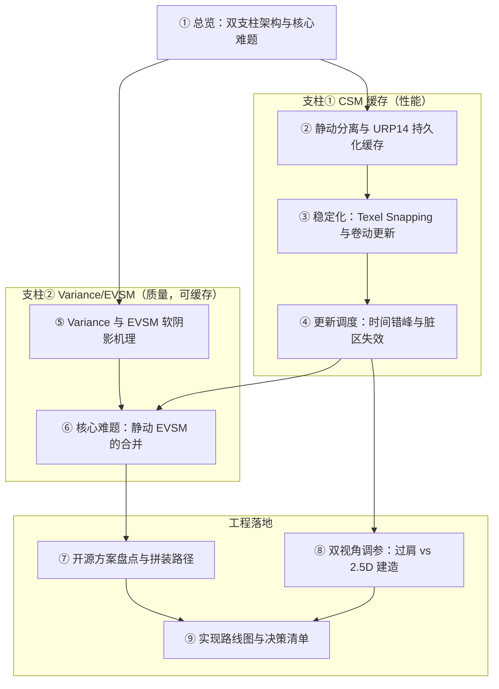

# URP14 阴影优化：CSM 缓存 + Variance/EVSM 软阴影 — 总览

> 面向**已精通 URP 渲染管线的资深工程师**。目标：在 **Unity 2022 LTS / URP 14（PC/主机，旧 ScriptableRenderPass + RTHandle）** 上，用 CSM 缓存省掉方向光阴影逐帧重渲（性能），用 Variance/EVSM 拿可缓存的软阴影（质量），并兼顾**第三人称过肩**与 **2.5D 建造**双视角。核心难题——也是本 wiki 最大的原创贡献——是「缓存静态 × EVSM 软滤波 × 动态叠加」三者的合并。
>
> ⚠️ 本 wiki 的 VSM = **Variance** Shadow Maps（矩滤波软阴影），**不是** UE5 的 Virtual Shadow Maps。

## 知识地图

## 页面目录

### 起点
- [1. 缓存式阴影优化总览：双支柱架构与核心难题](wiki/1.%20缓存式阴影优化总览：双支柱架构与核心难题.md) — 两根支柱、核心难题、阅读路线，先读这页

### 支柱① CSM 缓存（性能）
- [2. 静动分离与 URP14 持久化缓存](wiki/2.%20静动分离与%20URP14%20持久化缓存.md) — blit-then-render 的 min(depth)、持久化 RTHandle 生命周期、失效触发
- [3. 稳定化：Texel Snapping 与卷动更新](wiki/3.%20稳定化：Texel%20Snapping%20与卷动更新.md) — snap 公式、包围球旋转不变拟合、toroidal 环形寻址、卷动重渲边条
- [4. 更新调度：时间错峰与脏区失效](wiki/4.%20更新调度：时间错峰与脏区失效.md) — 远级轮转降频、按阈值/距离、2.5D 建筑增删的 scissor 脏区重渲

### 支柱② Variance/EVSM（质量）
- [5. Variance 与 EVSM 软阴影机理](wiki/5.%20Variance%20与%20EVSM%20软阴影机理.md) — 矩 + Chebyshev、漏光与抑制、ESM、EVSM4 取 min、精度选型、MSM 旁证
- [6. 核心难题：静动 EVSM 的合并](wiki/6.%20核心难题：静动%20EVSM%20的合并.md) — ★原创★ 可见性空间合并、min vs 乘、LVSM 分层、成本、归一化、接缝

### 工程落地
- [7. 开源方案盘点与拼装路径](wiki/7.%20开源方案盘点与拼装路径.md) — 无成品的结论、选型表、避坑、四块自拼路线
- [8. 双视角调参：过肩 vs 2.5D 建造](wiki/8.%20双视角调参：过肩%20vs%202.5D%20建造.md) — 两套相机的 cascade/分辨率/缓存策略/视角切换
- [9. 实现路线图与决策清单](wiki/9.%20实现路线图与决策清单.md) — 7 阶段建造顺序、决策树、参数基线、风险登记

## 覆盖范围

| 关键问题 | 由以下页面解答 |
|----------|---------------|
| Q1 静/动分离 + min-depth + 持久化 RTHandle | [2. 静动分离与持久化缓存](wiki/2.%20静动分离与%20URP14%20持久化缓存.md) |
| Q2 卷动更新 + texel snapping | [3. 稳定化](wiki/3.%20稳定化：Texel%20Snapping%20与卷动更新.md) |
| Q3 时间错峰 + 脏区失效 | [4. 更新调度](wiki/4.%20更新调度：时间错峰与脏区失效.md) |
| Q4 Variance/EVSM 实现机理 | [5. EVSM 机理](wiki/5.%20Variance%20与%20EVSM%20软阴影机理.md) |
| Q5 ★核心★ 静/动 EVSM 合并 | [6. 核心难题](wiki/6.%20核心难题：静动%20EVSM%20的合并.md) |
| Q6 开源方案盘点与推荐 | [7. 开源盘点与拼装](wiki/7.%20开源方案盘点与拼装路径.md) |
| Q7 双视角调参 | [8. 双视角调参](wiki/8.%20双视角调参：过肩%20vs%202.5D%20建造.md) |
| 落地顺序综合 | [9. 实现路线图](wiki/9.%20实现路线图与决策清单.md) |

## 质量说明

- **总页面数**: 9
- **总参考来源数**: 24 个独立来源，归入 4 篇 `raw/` synthesis 笔记（sources.yaml id 64–67）
- **检索约束**: WebSearch 工具本次全程不可用（400），全部经 WebFetch + DuckDuckGo HTML 完成，URL 均真实抓取
- **最大不确定项（务必知悉）**:
  - **Q5 静/动 EVSM 合并经补搜确认无任何文献先例 → 本 wiki 的合并算法是原创工程设计**，由保守上界 + EVSM4 内部 min 推导而来，落地需实测；"并排该乘 / 前后该 min"为几何推导
  - 原始 VSM(2006)/LVSM(2008) 全文未直取，经 GPU Gems 3 Ch.8（Lauritzen 本人执笔）间接覆盖
  - CryEngine GSM 一手缺失；具体城建游戏(Cities/Anno)阴影方案无一手；错峰 K 值/bias/c 等参数为工程默认，需目标机型标定
  - 多处标 ✱ 者为工程推断（正交单张大图、多帧插值切换、VSM page 降维 URP tile 脏表等）
- **最后更新**: 2026-06-28
