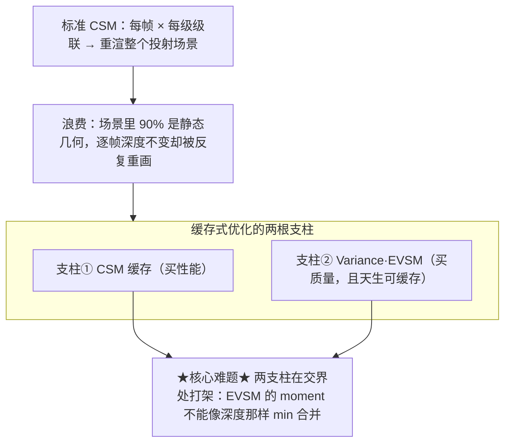
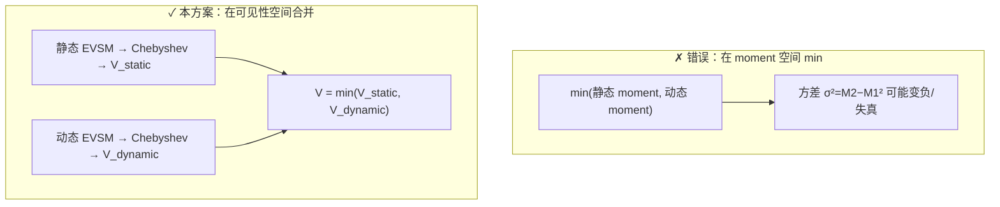

# 缓存式阴影优化总览：双支柱架构与核心难题

本 wiki 解决一个具体问题：在 **Unity 2022 LTS / URP 14（PC/主机，旧 ScriptableRenderPass + RTHandle）** 上，如何用「**CSM 缓存**」省掉方向光阴影的逐帧重渲开销，同时用「**Variance/EVSM**」拿到可缓存的软阴影质量，并兼顾**第三人称过肩**与 **2.5D 建造**两套相机视角。读完本页你会知道整套方案的两根支柱、它们在交界处的核心难题，以及该按什么顺序读后续页面。

> ⚠️ 术语澄清：本 wiki 的 **VSM = Variance Shadow Maps（矩滤波软阴影）**，**不是** UE5 的 Virtual Shadow Maps（稀疏虚拟纹理页缓存）。两者同名但完全不同，后者不在本课题范围。

## 为什么标准 CSM 贵

标准级联阴影图（CSM）每帧都要**从光源视角把整个投射场景重渲一遍，且每级级联各渲一次**。在一个有大量静态建筑/地形的场景里，绝大部分被重渲的几何**逐帧没有任何变化**——这就是被浪费的开销，也是所有缓存方案的出发点[^64]。

## 支柱①：CSM 缓存（性能）

核心思想：把**静态投射体**渲一次进缓存图、跨帧复用，只对**变化的部分**付出重渲代价。它由四个互相配合的机制组成，分别对应后续 [2](2. 静动分离与 URP14 持久化缓存.md)、[3](3. 稳定化：Texel Snapping 与卷动更新.md)、[4](4. 更新调度：时间错峰与脏区失效.md) 三页[^64]。

| 机制 | 解决什么 | 关键页 |
|---|---|---|
| 静/动分离 + 持久化 RTHandle | 静态不再逐帧重渲；跨帧持有缓存 RT | [第 2 页](2. 静动分离与 URP14 持久化缓存.md) |
| texel snapping + 卷动 | 让缓存图在相机移动下仍能复用、不抖动 | [第 3 页](3. 稳定化：Texel Snapping 与卷动更新.md) |
| 时间错峰 + 脏区失效 | 把"还得更新的部分"压到最小 | [第 4 页](4. 更新调度：时间错峰与脏区失效.md) |

## 支柱②：Variance / EVSM（质量，且天生可缓存）

标准深度阴影图**不能预滤波**（先平均深度再比较是错的）。VSM 改存深度的**前两阶矩** `(E[z], E[z²])`，矩是线性量，因此可以 blur / mipmap / MSAA，从而得到**软阴影**；EVSM 再对深度做指数翘曲来压制 VSM 的漏光。关键是：矩纹理就是一张**普通可滤波纹理**，所以"缓存静态阴影"在 EVSM 下变成"缓存一张静态 moment 纹理"，与缓存天然契合[^65]。详见 [第 5 页](5. Variance 与 EVSM 软阴影机理.md)。

## 核心难题：两支柱在交界处打架

标准深度图缓存可以「静态缓存 + 动态每帧 `min(depth)` 合并」，因为深度取 min 有物理意义（最近遮挡者胜）。但 **EVSM 的 moment 对 `min()` 没有物理意义**——对 `(warp, warp²)` 取 min 会破坏方差结构。本项目据此确定主攻方向：**静态 EVSM 与动态 EVSM 分开存两套 RT，在采样阶段合并各自算出的"可见性"，而不是合并矩**[^65]。

> 📌 **重要诚实声明**：2026-06-28 的补充检索**确认业界没有任何已发表技术**描述如何合并"分开存储的静/动 Variance/EVSM/moment 阴影图"。因此本方案的合并算法是**本项目的原创工程设计**，由两条文献事实推导而来（各路是保守可见性上界；EVSM4 自身就用 `min` 合并两个 Chebyshev 估计）。完整推导、误差分析与更"正确"的分层做法见 [第 6 页](6. 核心难题：静动 EVSM 的合并.md)[^65]。

## 工程现实：没有现成轮子

开源界**没有** URP14 上即插即用的 CSM 缓存或 EVSM 成品。最现实的路径是把四块拼起来自研，详见 [第 7 页](7. 开源方案盘点与拼装路径.md)[^66]。两套相机的调参差异极大（过肩高失效 vs 2.5D 高命中），详见 [第 8 页](8. 双视角调参：过肩 vs 2.5D 建造.md)[^67]。最终落地顺序与决策清单见 [第 9 页](9. 实现路线图与决策清单.md)。

## 阅读路线

[^64]: [[urp-csm-cache-mechanics|URP CSM 缓存机制（静动分离 / 卷动 / 错峰 / 脏区）]] — synthesis（13 来源，含 Insomniac SIGGRAPH 2012、Microsoft、Unreal VSM、Unity HDRP 文档，详见笔记）
[^65]: [[variance-evsm-and-static-dynamic-merge|Variance/EVSM 机理与静动 moment 合并]] — synthesis（11 来源，含 GPU Gems 3 Ch.8、TheRealMJP、ESM/MSM 论文，详见笔记）
[^66]: [[opensource-shadow-cache-evsm-survey|开源方案盘点：URP 阴影缓存 / VSM-EVSM]] — synthesis（15 来源，详见笔记）
[^67]: [[dual-view-shadow-tuning|双视角阴影调参：过肩 vs 2.5D 建造]] — synthesis（11 来源，详见笔记）

## Sources

| # | Title | Raw Note | Original |
|---|-------|----------|----------|
| 1 | URP CSM 缓存机制 | [[urp-csm-cache-mechanics]] | [Insomniac CSM Scrolling (SIGGRAPH 2012)](https://advances.realtimerendering.com/s2012/insomniac/Acton-CSM_Scrolling%28Siggraph2012%29.pdf) |
| 2 | Variance/EVSM 机理与静动合并 | [[variance-evsm-and-static-dynamic-merge]] | [GPU Gems 3 Ch.8 — Summed-Area VSM](https://developer.nvidia.com/gpugems/gpugems3/part-ii-light-and-shadows/chapter-8-summed-area-variance-shadow-maps) |
| 3 | 开源方案盘点 | [[opensource-shadow-cache-evsm-survey]] | [TheRealMJP/Shadows](https://github.com/TheRealMJP/Shadows) |
| 4 | 双视角阴影调参 | [[dual-view-shadow-tuning]] | [Microsoft — Cascaded Shadow Maps](https://learn.microsoft.com/en-us/windows/win32/dxtecharts/cascaded-shadow-maps) |
