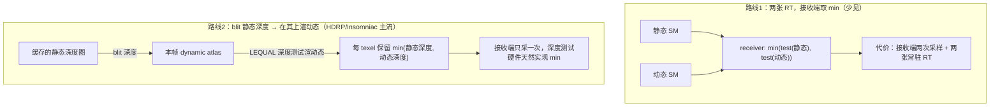
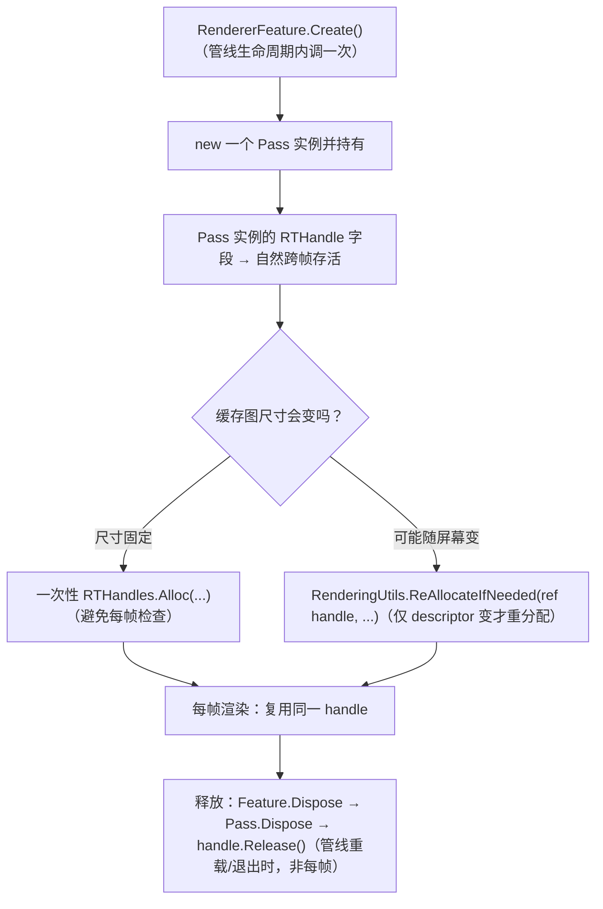
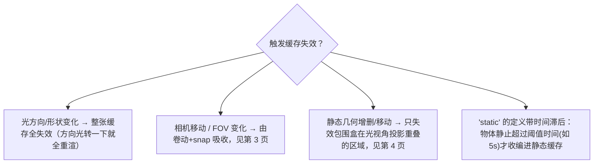

# 静动分离与 URP14 持久化缓存

CSM 缓存的第一块基石：把**静态投射体**渲一次进一张跨帧复用的缓存图，把**动态投射体**每帧叠加上去。本页讲清两件事——(1) 静态与动态阴影**怎么合并**（业界主流是「blit 静态深度 + 在其上渲动态」，而非接收端取 min），(2) URP14 旧 `ScriptableRenderPass` 路线下**怎么跨帧持有缓存 RT** 而不被帧末释放。这是 [总览](1. 缓存式阴影优化总览：双支柱架构与核心难题.md) 支柱①的起点。

## 两条合并路线：blit-then-render 才是主流

**关键洞察**：路线 2 里那一步 blit + 深度测试，**本质上就是 `min(depth)`**——blit 后 RT 里是静态遮挡者深度，动态投射体用 `LEQUAL`/`LESS` 渲入，只有比已有静态深度**更近**时才覆写，于是每个 texel 最终是 `min(静态, 动态)`，最近遮挡者胜出。因为深度测试硬件天然做 min，接收端只需采一次，比路线 1 省[^64]。

Unity HDRP 官方对此的原文是：开启 mixed cached 后「HDRP performs a blit from the cached shadow map to the dynamic atlas」，再「render dynamic shadow casters into their respective shadow maps each frame」，二者「composed together」。Insomniac 的描述是「Copy map to use as final shadow map for current frame」→「Render non-static geometry into final shadow map」——同一手法[^64]。

> 💡 **代价（Unity 明确点出）**：静态缓存图与 dynamic atlas **各占一份显存（内存翻倍）**；每个动态物体在它出现的每张阴影图里增加一个 draw call。维护两套相机缓存时这份双倍显存要算进预算[^64]。

HDRP 的开启范式（可照搬为 URP 自实现的概念模型）：方向光开 **Allow Mixed Cached Shadows** + 灯上勾 **Always draw dynamic** + 静态 Renderer 勾 **Static Shadow Caster**[^64]。

## URP14 持久化 RTHandle：靠对象生命周期，不靠特殊 API

缓存图必须**跨帧存活**。URP13/14（非 RenderGraph）的正确模式不是某个"持久化 API"，而是**让 RTHandle 字段挂在一个跨帧存活的对象上**——即 Pass 实例，而 Pass 由 RendererFeature 在 `Create()` 里 `new` 一次并复用[^64]。

落地要点与坑[^64]：

- **缓存阴影图尺寸固定**，所以用一次性 `RTHandles.Alloc(...)` 最合适，别用 `ReAllocateIfNeeded` 的每帧检查。
- **绝不在 `OnCameraCleanup` 里 `Release()`** 自有缓存 handle——这是最常见的"缓存被错误释放/VRAM 泄漏"根因。借来的 handle（如 `cameraColorTargetHandle`）只置 null 解引用，**不 Release**（你不拥有它）。
- `GetTemporaryRT`/`ReleaseTemporaryRT` 那套**不适用** RTHandle。
- `ReAllocateIfNeeded` 只会**放大不会缩小**（系统保留历史最大尺寸）；要缩小须显式 `Release()` 后重分配。色彩与深度不能共用一个 RTHandle（`depthBufferBits=0`）。

## 静态缓存何时失效

缓存的代价是要正确判断"什么时候缓存失效了"。三方来源（Insomniac / Unreal VSM / HDRP）高度一致[^64]：

- **光方向变化最致命**：Unreal 原文「Any movement or rotation of a light invalidates **all** cached pages for that light」——方向光只要转动，整张缓存全失效。所以昼夜系统应**只改光的颜色/强度，尽量不连续改方向**[^64]。
- **"static" 不等于"标记为静态"**：Insomniac 把 static 定义为「未移动超过 t 时间（如 5 秒）」，避免物体刚停就被收编、又马上要重渲。Unreal 对应 per-primitive 的 `Shadow Cache Invalidation Behavior` 枚举（Auto / Always / Rigid / Static）[^64]。
- **永不缓存类**：WPO/PDO 材质、骨骼动画、tessellation 这类逐帧不可预知的几何，必须当动态每帧重画[^64]。

> ⚠️ **Gap 提示**：路线 1 的接收端 `min(两张 SM)` 逐字代码没找到权威单页（主流都走 blit）；HDRP 的 blit 是否严格为深度拷贝、未被官方逐字确认——"blit 深度 + LEQUAL = min" 是据深度测试语义的合理推断，落地前建议读 HDRP `HDCachedShadowManager` 源码核对[^64]。

下一步：缓存图要能在相机移动下复用，前提是 **texel snapping 与卷动更新**，见 [第 3 页](3. 稳定化：Texel Snapping 与卷动更新.md)。

[^64]: [[urp-csm-cache-mechanics|URP CSM 缓存机制（静动分离 / 卷动 / 错峰 / 脏区）]] — synthesis（含 Insomniac SIGGRAPH 2012、Unity HDRP 文档、Unity Discussions RTHandle 帖、Unreal VSM 文档，详见笔记）

## Sources

| # | Title | Raw Note | Original |
|---|-------|----------|----------|
| 1 | URP CSM 缓存机制 | [[urp-csm-cache-mechanics]] | [HDRP Shadows 文档](https://docs.unity3d.com/Packages/com.unity.render-pipelines.high-definition@17.1/manual/Shadows-in-HDRP.html) · [URP RTHandle 用法](https://discussions.unity.com/t/urp-13-1-8-proper-rthandle-usage-in-a-renderer-feature/895405) |
