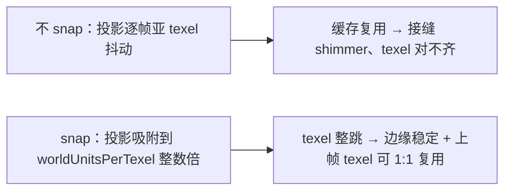
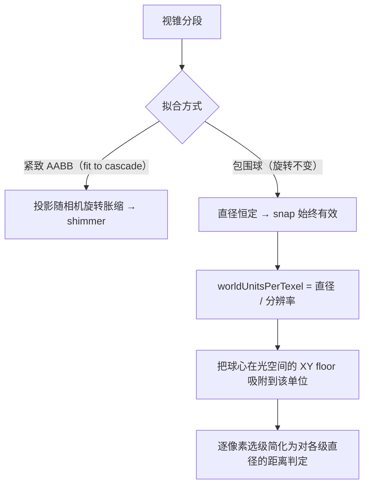
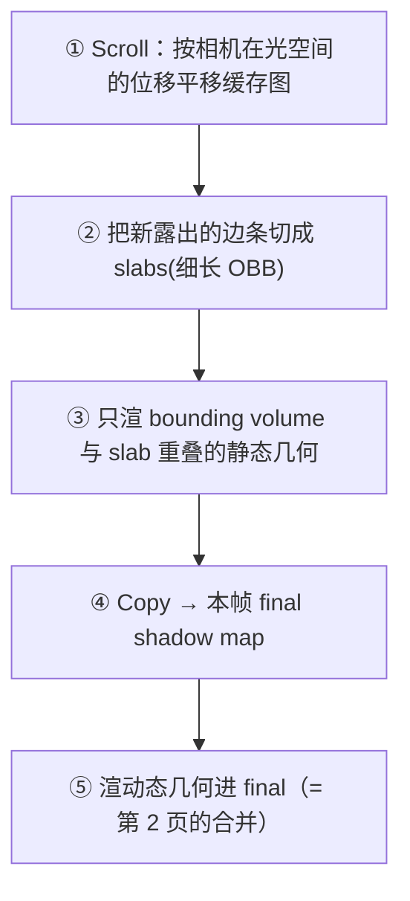
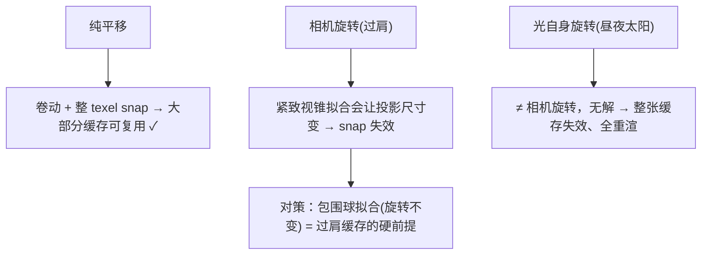

# 稳定化：Texel Snapping 与卷动更新

缓存阴影图要能在相机移动下**复用而不是整张重渲**，必须先解决两个问题：(1) **texel snapping**——把光的正交投影吸附到纹理栅格整数倍，让 texel 只能整 texel 跳，从而既防边缘 shimmer、又让上一帧 texel 能 1:1 对齐复用；(2) **卷动更新（toroidal/scrolling）**——相机移动时只重渲"新露出的边条"，其余区域环形寻址复用。这是 [静动分离](2. 静动分离与 URP14 持久化缓存.md) 能成立的前提。

## 为什么 snapping 是缓存的前提

相机一动，拟合视锥的光投影矩阵每帧重算，产生**亚 texel 抖动**；缓存图若不 snap，复用时静/动接缝处就会 shimmer。snapping 把投影原点量化到光空间纹理栅格整数倍，使 texel 栅格只能**整 texel 跳**[^64]。



**经典公式（Microsoft，对方向光正交投影）**——把正交边界 min/max 各 round 到 texel 大小整数倍[^64]：

```c
worldUnitsPerTexel = cascadeBound / shadowBufferSize;   // 一个 texel 覆盖的世界距离
orthoMin /= worldUnitsPerTexel; orthoMin = floor(orthoMin); orthoMin *= worldUnitsPerTexel;
orthoMax /= worldUnitsPerTexel; orthoMax = floor(orthoMax); orthoMax *= worldUnitsPerTexel;
```

两个硬约束：**投影尺寸必须每帧恒定**（否则 snap 无意义）；纹理宽高各**多 1 像素**防 snap 后采样越界[^64]。

## 旋转不变的包围球拟合（过肩视角必需）

过肩相机会持续**旋转**。若用紧致视锥 AABB 拟合，投影尺寸**随朝向胀缩** → texel 世界尺寸抖动 → snap 失效。解法是用**包围球**拟合：球的直径与相机朝向无关，投影范围旋转不变（代价是浪费部分纹理空间）[^64]。



Alex Tardif 的旋转不变 stable-fit 关键代码（含完整流程）[^64]：

```c
worldUnitsPerTexel = (sphereRadius * 2.0) / shadowMapResolution;   // 直径 / 分辨率
lightView  = LookAtLH(frustumCenter - lightDir*sphereRadius, frustumCenter, up);
centerLS   = TransformCoord(frustumCenter, lightView);             // 球心进光空间
centerLS.x = floor(centerLS.x / worldUnitsPerTexel) * worldUnitsPerTexel;  // 吸附 X
centerLS.y = floor(centerLS.y / worldUnitsPerTexel) * worldUnitsPerTexel;  // 吸附 Y
// z 不 snap；L/R/B/T = centerLS.xy ± sphereRadius，构造 OrthoOffCenter
```

这与 Microsoft「**fit to scene**（按最大尺寸 pad、尺寸恒定、可稳定 snap）vs **fit to cascade**（随朝向胀缩、更省分辨率但抖）」是同一动机的两种表述。过肩应选 fit-to-scene/包围球[^64]。

## 卷动更新：相机移动只重渲新边条

缓存的精髓是相机平移时**不整张重渲**，而是把缓存图按相机在光空间的位移"卷动"，只补画新露出的边条。这套来自 Insomniac SIGGRAPH 2012「CSM Scrolling」的流程[^64]：



相机运动是 3D，要分两类处理[^64]：

| 运动类型 | 处理 | 注意 |
|---|---|---|
| **Lateral（垂直光线的平移）** | 缓存图按 delta 做 UV 平移，点采样查上帧；新滚入区 clamp-to-border、color=1.0（全亮） | — |
| **Depth（平行光线的平移）** | 除平移外，**所有历史深度整体偏移** delta-camera-depth | near 处 clamp 到 0.0；far 处 1.0=clear 值与真实远点冲突需特判 |

效果：约 **70% 的静态几何不必重渲**（Insomniac 用 512×512）。几何 tile 越方正，与边条的重叠卷积越少、越省[^64]。

### 环形寻址（toroidal addressing）的底层数学

Insomniac 把卷动类比"2D bitmap scrolling"但没贴公式；其精确机制的权威出处是 Hoppe 的 GPU-Based Geometry Clipmaps（GPU Gems 2 Ch.2），阴影卷动与之同构[^64]：


- 采样 `uv = gridPos * (1/w,1/h) + originInTexture`，回绕交给采样器 wrap 模式[^64]。
- 重要副产物：**粗级别窗口内的相对运动指数级减小，所以粗级别极少需要更新**——这条直接支撑下一页「远级联可降频」的理论依据[^64]。

## 相机旋转带来的额外失效



要分清两种旋转：**相机旋转**可被包围球 + 卷动吸收；**光自身旋转**（昼夜）则让整张缓存失效，只能全重渲[^64]。

下一步：哪些"还要更新的部分"可以错峰、可以只更局部，见 [第 4 页](4. 更新调度：时间错峰与脏区失效.md)。

[^64]: [[urp-csm-cache-mechanics|URP CSM 缓存机制（静动分离 / 卷动 / 错峰 / 脏区）]] — synthesis（含 Insomniac CSM Scrolling、GPU Gems 2 Ch.2 Geometry Clipmaps、Microsoft Common Techniques / Cascaded Shadow Maps、Alex Tardif Shadow Mapping，详见笔记）

## Sources

| # | Title | Raw Note | Original |
|---|-------|----------|----------|
| 1 | URP CSM 缓存机制 | [[urp-csm-cache-mechanics]] | [Insomniac CSM Scrolling](https://advances.realtimerendering.com/s2012/insomniac/Acton-CSM_Scrolling%28Siggraph2012%29.pdf) · [Microsoft Improve Shadow Depth Maps](https://learn.microsoft.com/en-us/windows/win32/dxtecharts/common-techniques-to-improve-shadow-depth-maps) · [Alex Tardif](https://alextardif.com/shadowmapping.html) |
