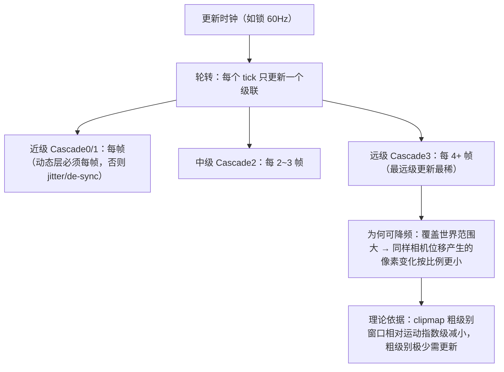
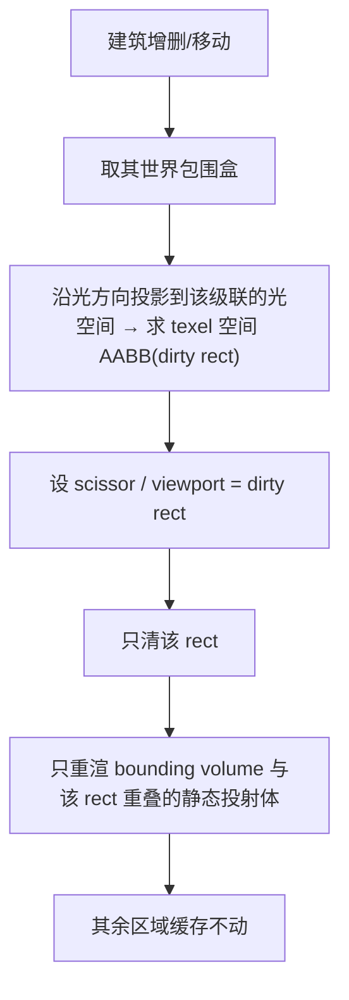
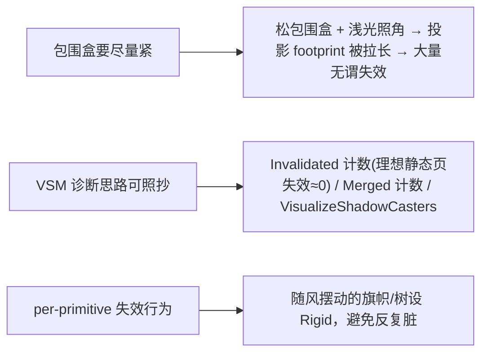

# 更新调度：时间错峰与脏区失效

缓存把"重渲哪些"压到最小后，最后一块是"**什么时候、更新多少**"。两个手段：(1) **时间错峰**——远级联覆盖范围大、降频更新肉眼不可见，按轮转/阈值/距离错帧；(2) **脏区失效**——2.5D 放置/拆除建筑时，只重渲被影响的那一小块而非整图。本页是 [稳定化](3. 稳定化：Texel Snapping 与卷动更新.md) 之后的收尾，直接服务 [双视角调参](8. 双视角调参：过肩 vs 2.5D 建造.md) 里的 2.5D 场景。

## 时间错峰：远级联降频

**机理而非拍脑袋**：远级联覆盖更大世界区域，同样的相机位移在它上面产生的像素级变化**按比例更小**，所以降频不可见。Hoppe 的 clipmap 结论同构印证：「the relative motion of the viewer within the windows decreases exponentially at coarser levels」[^64]。

三种触发策略，可组合[^64]：

| 策略 | 做法 | 来源支撑 |
|---|---|---|
| **固定每 K 帧** | 轮转计数器，近 K=1 / 中 K=2 / 远 K=4，按覆盖范围递增 | 社区实测（K 具体值需自测标定 ⚠️） |
| **按相机移动量阈值** | 平移/旋转超阈值才重渲；HDRP 暴露 `cachedShadowTranslationUpdateThreshold` / `cachedShadowAngleUpdateThreshold` | HDRP 文档 |
| **按距离** | 级联越远更新越稀（即 K 随级联序号递增） | 社区实测 |

> 📌 **"每帧"指哪一层**：这里被错峰的是**静态缓存层**；**动态投射体那一层（dynamic atlas）必须每帧**——少于每帧立刻出现可见 jitter 和 de-sync[^64]。

**可直接借用的 API（HDRP 范式）**：`RequestSubShadowMapRendering(shadowIndex)` 可**只刷新单个级联**，配合 `Update Mode = OnDemand` 实现自己的轮转调度器；整光刷新用 `RequestShadowMapRendering()`；`onDemandShadowRenderOnPlacement=false` 抑制首帧自动渲染、完全交给调度[^64]。

## 脏区失效：建筑增删只重渲局部

2.5D 建造时玩家频繁放置/拆除建筑。整图重渲是浪费——只需失效"被影响的那一小块"。这套思路的权威范式来自 Unreal VSM 的 page 级失效[^64]：

- **基础机制（Unreal 原文）**：「Shadow-casting geometry moving, being added, or removed invalidates **any pages that overlap its bounding box from the light's perspective**」——逐 page 失效，天然就是脏区粒度[^64]。
- **在 URP 单图缓存里落地**：URP 没有 page 系统，等价做法是**用 scissor rect / 局部 viewport 把失效矩形圈出，只在矩形内重渲受影响的静态投射体**。这和 Insomniac「render into exposed edges(slabs)」是同一种"只画一个轴对齐矩形"的手法，区别只是触发源从"相机卷动"换成"建筑包围盒的投影矩形"[^64]。

### 实现要点与诊断

> ⚠️ **2.5D 特别注意**：黄昏/低太阳角下，**建筑越高、光越斜，脏区拖得越长**（包围盒沿光方向投影被拉长）。这是 2.5D 缓存最现实的性能陷阱[^64][^67]。

> ⚠️ **Gap 提示**：「建筑增删 → 投影 dirty rect → scissor 局部重渲」这条完整链路是把 Insomniac「render into exposed edges」与 Unreal「per-page bounding-box 失效」两条一手机理**综合**出来的实现路径，逻辑自洽但无单一来源把它完整写在一处，落地需自测[^64]。

至此支柱①（CSM 缓存）的三块机制讲完。接下来转向支柱②的质量层：[Variance 与 EVSM 软阴影机理](5. Variance 与 EVSM 软阴影机理.md)。

[^64]: [[urp-csm-cache-mechanics|URP CSM 缓存机制（静动分离 / 卷动 / 错峰 / 脏区）]] — synthesis（含 Unity Discussions「HDRP Cached Shadows are good」实测、HDRP Shadow Update Mode 文档、Unreal VSM 文档、GPU Gems 2 clipmap，详见笔记）
[^67]: [[dual-view-shadow-tuning|双视角阴影调参：过肩 vs 2.5D 建造]] — synthesis（详见笔记）

## Sources

| # | Title | Raw Note | Original |
|---|-------|----------|----------|
| 1 | URP CSM 缓存机制 | [[urp-csm-cache-mechanics]] | [HDRP Cached Shadows 实测帖](https://discussions.unity.com/t/hdrp-cached-shadows-are-good/1673820) · [Unreal Virtual Shadow Maps](https://dev.epicgames.com/documentation/en-us/unreal-engine/virtual-shadow-maps-in-unreal-engine) |
| 4 | 双视角阴影调参 | [[dual-view-shadow-tuning]] | [Unreal VSM（脏区/双层）](https://dev.epicgames.com/documentation/en-us/unreal-engine/virtual-shadow-maps-in-unreal-engine) |
