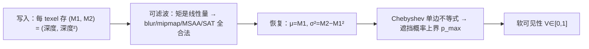
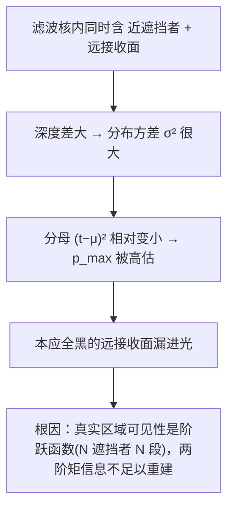
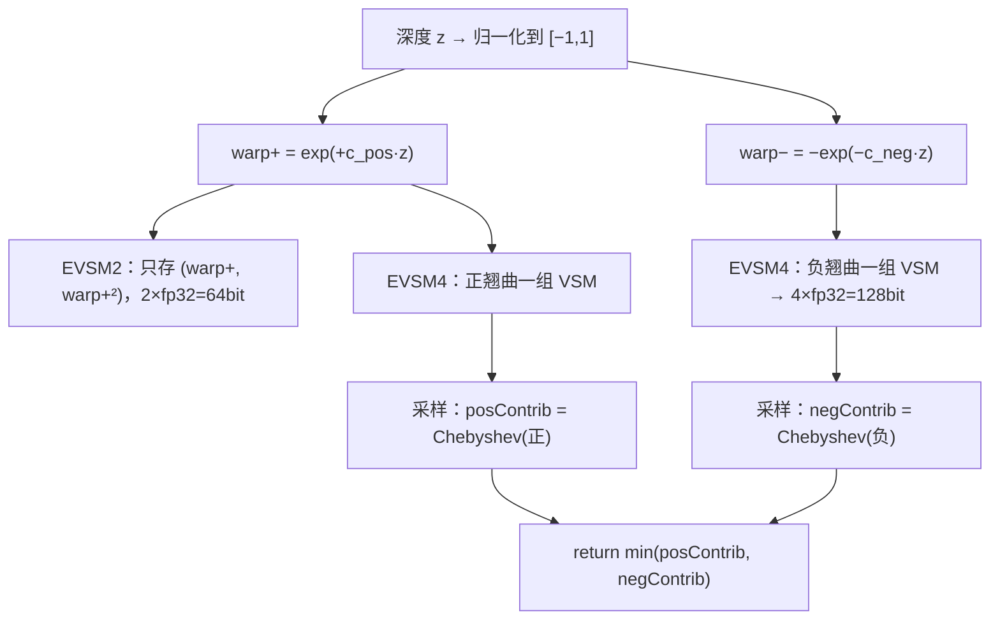
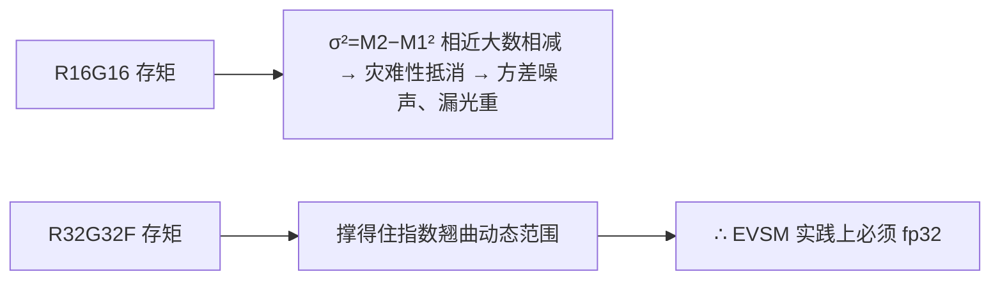
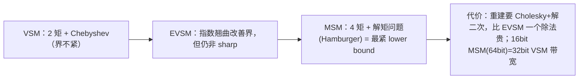

# Variance 与 EVSM 软阴影机理

支柱②的质量层。标准深度阴影图**不能预滤波**，所以软阴影只能靠 PCF 多次采样。**Variance Shadow Maps (VSM)** 改存深度的前两阶矩，使阴影图变成可 blur/mipmap 的普通纹理 → 天然软阴影、且**天然可缓存**（缓存静态阴影 = 缓存一张静态 moment 纹理）。代价是漏光（light bleeding），**EVSM** 用指数翘曲来压制它。本页讲透 VSM→ESM→EVSM 的机理与精度选型，是 [核心难题：静动 EVSM 合并](6. 核心难题：静动 EVSM 的合并.md) 的基础。

## VSM：矩 + Chebyshev 不等式



设片元光空间深度为 t，要估"滤波核内深度 ≥ t 的遮挡比例"。**单边 Chebyshev 不等式**给出上界[^65]：

```
μ  = E[x] = M1
σ² = E[x²] − E[x]² = M2 − M1²
t > μ：  P(x ≥ t) ≤ p_max = σ² / ( σ² + (t − μ)² )
t ≤ μ：  p_max = 1   （片元比平均遮挡者还近 → 全亮，天然软 bias）
```

关键性质：对**单个平面遮挡者 + 单个平面接收面**的理想情形，该不等式**取等号**，p_max 精确等于真实 PCF 结果[^65]。TheRealMJP 的教科书级实现[^65]：

```hlsl
float ChebyshevUpperBound(float2 moments, float mean, float minVariance, float lbr) {
    float variance = moments.y - moments.x*moments.x;   // σ² = M2 − M1²
    variance = max(variance, minVariance);              // 方差下限，挡 fp 噪声
    float d = mean - moments.x;
    float pMax = variance / (variance + d*d);           // Chebyshev
    pMax = ReduceLightBleeding(pMax, lbr);
    return (mean <= moments.x ? 1.0 : pMax);            // 单边
}
```

**为什么能预滤波而深度图不能**：矩 `(M1, M2)` 是线性量，对它们区域平均 = 合并后那块区域深度分布的矩。深度图则是"先平均再比较 ≠ 先比较再平均"，所以不行[^65]。写 M2 时用屏幕空间偏导补偿 texel 内深度斜率：`M2 = depth² + 0.25·(∂z/∂x)² + 0.25·(∂z/∂y)²`[^65]。

## 漏光（light bleeding）：VSM 的命门



成因：Chebyshev 只给**上界**不是真值；当一个核内"遮挡者-接收面距离 a"与"接收面间距离 b"之比 a/b 大时最严重，不采更多样本无法根除[^65]。三种抑制[^65]：

| 手段 | 做法 | 局限 |
|---|---|---|
| 方差下限 | `σ² = max(σ², minVariance)` | 只挡 fp 噪声，不解决物理漏光 |
| LBR 线性重映射 | `ReduceLightBleeding = Linstep(amount, 1, pMax)`，把 [0,amount] 尾巴压到 0 | amount 调太高会把真实半影压暗；MJP 用 ≈0.25 |
| 指数翘曲（→ EVSM） | 见下 | 从根上压制，但要高精度浮点 |

## ESM → EVSM：指数翘曲

**ESM** 把二值阴影测试用指数逼近，关键是**可分离**：`f(d,z) ≈ e^{−c(d−z)} = e^{−cd}·e^{cz}`，只需把 `e^{cz}` 写进阴影图并预滤波，采样时乘运行期才知道的 `e^{−cd}`。Annen 实测 c=80 对 fp32 最优；但 d−z<0（斜面/不连续/跨边界）时指数会爆炸，需 clamp 或 PCF fallback（典型仅 3~9% 像素）[^65]。

**EVSM = 先对深度指数翘曲、再跑 VSM**。把深度归一化到 [−1,1] 后做正负两个翘曲[^65]：



```hlsl
float2 GetEVSMExponents(float posExp, float negExp, uint fmt) {
    const float maxExponent = (fmt == SMFormat16Bit) ? 5.54 : 42.0;  // 防 fp 溢出
    return min(float2(posExp, negExp), maxExponent);
}
float2 WarpDepth(float depth, float2 e) {        // e = (c_pos, c_neg)
    depth = 2.0*depth - 1.0;                      // [0,1] → [−1,1]
    return float2( exp( e.x*depth ), -exp( -e.y*depth ) );  // (warp+, warp−)
}
// 采样：minVariance = (VSMBias*0.01 * e * warpedDepth)²（链式法则缩放）
// EVSM4: return min( Chebyshev(正), Chebyshev(负) );  EVSM2: 只用正
```

**为什么指数翘曲同时减漏光 + 改精度**：指数把深度差**放大**，漏光发生在 (t−μ) 被方差淹没时；翘曲后 `warp(t)−warp(μ)` 相对差变大、Chebyshev 分母变大、p_max 被压低。正翘曲对"接收面在遮挡者之后"那侧给紧界，负翘曲对另一侧给紧界，两路都是**保守上界**，取 `min` 仍是合法上界却同时吃到两侧紧度——这就是 EVSM4 比 EVSM2 漏光更少的原因[^65]。

> 🔑 这个 **「两个独立 Chebyshev 估计取 min」** 的逻辑，正是 [第 6 页](6. 核心难题：静动 EVSM 的合并.md) 合并静/动两路的直接范例。

## 精度选型



| 表示 | 通道/精度 | bit/texel | 备注 |
|---|---|---|---|
| VSM | RG16 / RG32F | 32 / 64 | 最轻 |
| EVSM2 | 2×fp32 | 64 | 单正翘曲 |
| **EVSM4** | 4×fp32 | **128** | 正负翘曲，质量最好，带宽重 |
| MSM(Hamburger4) | 4×16bit量化 / 4×fp32 | 64 / 128 | 见下 |

- **c 上限**：fp32≈42，fp16≈5.54（且 fp16 翘曲因子还需额外 clamp——旧版 MJP clamp 到 10.0 会让 fp16 溢出，是个 bug）[^65]。
- **bias**：VSM 与 32bit EVSM 用 VSMBias≈0.01 即可；16bit EVSM 要到 0.5[^65]。
- **级联接缝**：每级是独立 EVSM RT、深度范围不同 → 翘曲常数 c 与方差下限要随该级深度范围归一化（`WarpDepth` 先映射到 [−1,1] 即为此）；接缝处做 cascade 间 dither/blend，相邻级的 LBR/bias 要一致，否则缝处亮度跳变[^65]。

## 旁证：Moment Shadow Mapping（更紧的界）

MSM 把 VSM 推广到**四阶幂矩** `(E[z],E[z²],E[z³],E[z⁴])`，把"已知 m 个矩求 CDF 最紧 lower bound"形式化为广义矩问题（VSM 是 m=2 特例）。MSM 是**最紧 lower bound**、漏光少于 EVSM（EVSM 的界不 sharp）；4 矩能区分约 2 个 Dirac 分布，对"双遮挡面"重建可达精确[^65]。



> 💡 MSM 的"4 矩可重建≈2 个深度面"暗示：把静/动合并成**单套 MSM** 反而能更好处理"双遮挡面"——但 MSM 的矩同样不能 min 合并，仍要分两套各自重建再合并。这条线索在 [第 6 页](6. 核心难题：静动 EVSM 的合并.md) 讨论。

> ⚠️ **Gap 提示**：原始 VSM 论文（Donnelly & Lauritzen 2006）与 LVSM 原文（2008）全文未直取（punkuser.net DNS 失败），其推导经 GPU Gems 3 Ch.8（Lauritzen 本人执笔）与 MSM 论文转述间接覆盖[^65]。

[^65]: [[variance-evsm-and-static-dynamic-merge|Variance/EVSM 机理与静动 moment 合并]] — synthesis（含 GPU Gems 3 Ch.8 Summed-Area VSM、TheRealMJP/Shadows VSM.hlsl + 博客、Annen ESM (GI 2008)、Peters & Klein Moment Shadow Mapping (I3D 2015)，详见笔记）

## Sources

| # | Title | Raw Note | Original |
|---|-------|----------|----------|
| 2 | Variance/EVSM 机理与静动合并 | [[variance-evsm-and-static-dynamic-merge]] | [GPU Gems 3 Ch.8](https://developer.nvidia.com/gpugems/gpugems3/part-ii-light-and-shadows/chapter-8-summed-area-variance-shadow-maps) · [TheRealMJP Shadow Maps](https://therealmjp.github.io/posts/shadow-maps/) · [Moment Shadow Mapping (I3D 2015)](https://momentsingraphics.de/Media/I3D2015/MomentShadowMapping.pdf) |
