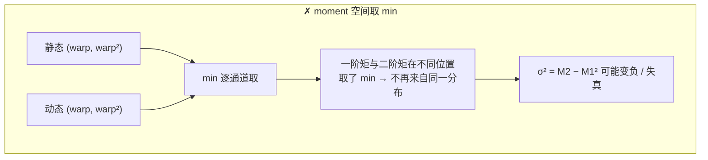
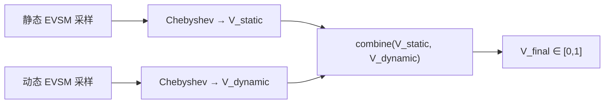
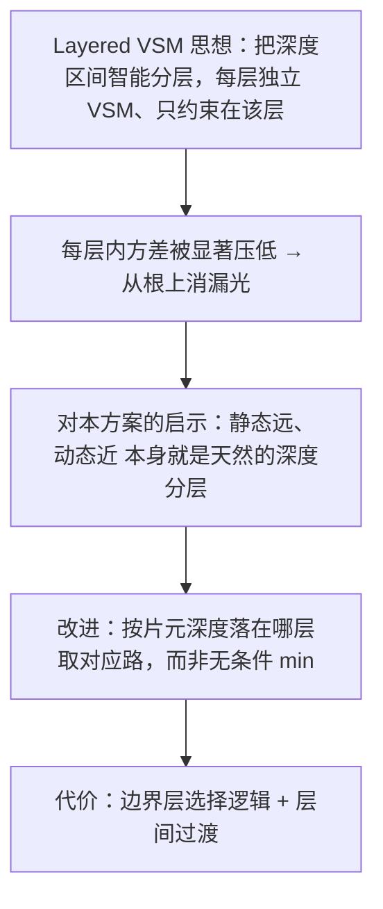
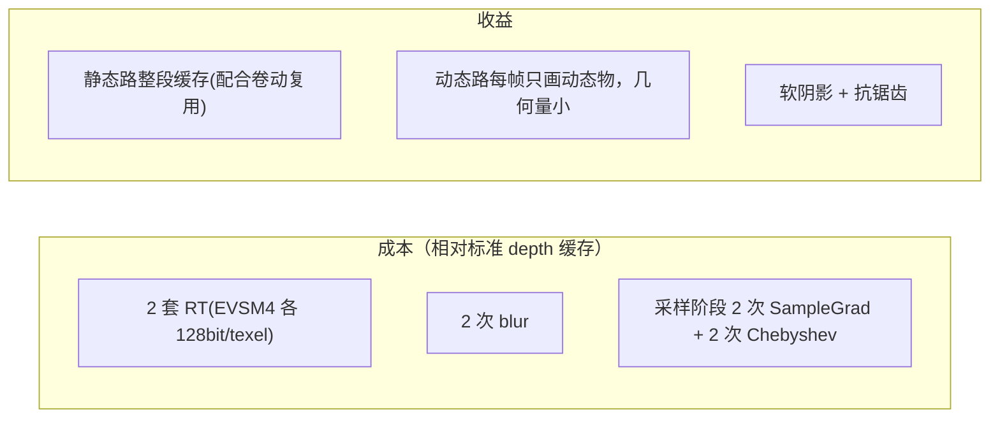
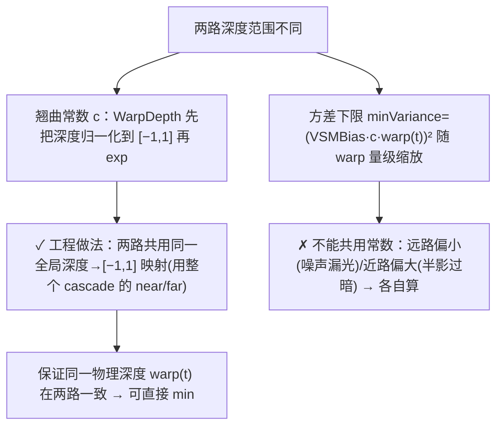
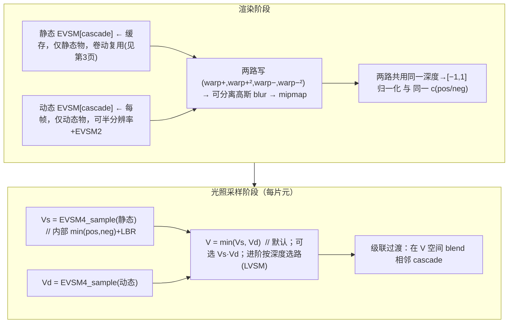

# 核心难题：静动 EVSM 的合并

这是整个项目的命门。标准深度图缓存可以「静态缓存 + 动态每帧 `min(depth)`」，因为深度取 min 有物理意义。但 **EVSM 的 moment 对 `min()` 没有物理意义**——本页推导出可行的合并方案：**静/动各存一套 EVSM，在采样阶段合并各自算出的"可见性"，而不是合并矩**。承接 [EVSM 机理](5. Variance 与 EVSM 软阴影机理.md)。

> 📌 **诚实声明（务必先读）**：2026-06-28 的补充检索**确认业界没有任何已发表技术**描述"如何合并分开存储的静/动 Variance/EVSM/moment 阴影图"。最接近的命中——Unreal「VSM Separate Static Caching」是 *Virtual* Shadow Maps（页式缓存深度，非 Variance）；LVSM/EVSM 的分层是为降漏光、不为静/动合成。**因此本页方案是本项目的原创工程设计**，由文献事实推导而来，落地需自测。下文逐条区分"文献可推导"与"纯推导"。

## 为什么不能在 moment 空间合并



深度的 min 有物理意义（最近遮挡者胜）；但 moment 的 min 把 M1、M2 在不同处各取最小，二者不再描述同一个深度分布，方差公式直接崩坏[^65]。**结论：能合并的不是矩，是各自跑完 Chebyshev 后的可见性标量。**

## 在可见性空间合并



对 EVSM4，每一路本身就是 `min(posContrib, negContrib)`（见 [第 5 页](5. Variance 与 EVSM 软阴影机理.md)），所以静/动合并是在两个**已各自 min 过**的标量之间再合并[^65]。

## min 还是乘？几何分析

**结论：默认用 `min(V_static, V_dynamic)`** ——它是"被任一路遮挡即遮挡"的保守合并，方向正确；但在半影区会偏暗，不是真实复合可见性。

```mermaid
flowchart TD
    Q{"两遮挡者在光圆盘上遮挡的方向"}
    Q -->|同一方向(一前一后)| A["正确 = min（后者被前者完全包含）→ min 精确 ✓"]
    Q -->|不同方向(并排双半影)| B["正确 = 相乘 V_s·V_d（独立部分遮挡叠加）"]
    B --> B2["min(V_s,V_d) ≥ V_s·V_d → min 在并排区偏亮(漏光方向)"]
    A --> R["推荐 min：'静态地面/墙 + 动态角色站前面'恰是一前一后，min 精确"]
    B2 --> R
```

两层论证[^65]：

1. **为什么 min 合理**：VSM/ESM/EVSM/LVSM 算的都是真实可见性的 **lower bound on shadow intensity（= upper bound on visibility）**，即"产生的阴影永不过黑"。最终物理可见性 = 被静态集合**且**被动态集合都不遮挡才可见；硬可见性（0/1）下 AND ≡ min。两路各是保守上界，min 后仍是合法上界（不放大漏光）。**EVSM4 内部 `min(posContrib, negContrib)` 就是同一逻辑的现成范例**——这是 min 方案最强的依据。
2. **min 的误差**：若两遮挡者遮挡光圆盘上**不同方向子立体角**（并排双半影），正确结果应是**相乘** `V_s·V_d`，而 `min ≥ 乘`，所以 min 在并排区偏亮。反过来，"一前一后"时 min 精确。乘法则相反：并排精确、前后会**过黑**（重复计同一遮挡）。两者都非普适正确，因为单凭两个标量无法知道两遮挡者在光圆盘的方位关系——这是 VSM"区域可见性是阶跃函数、两阶矩信息不足"局限的延伸。

> 取舍方向：**宁可微漏光不可过黑**（过黑会产生明显假接触阴影），与所有 VSM 类"never-too-dark"哲学一致；且最常见的"静态背景 + 动态角色"几何恰好是 min 精确的一前一后情形。
>
> ⚠️ 标注：「两路是上界、min 后仍是上界」有文献支撑；「并排该乘、前后该 min」是基于独立部分遮挡叠加的**合理推导**，无专门文献[^65]。

## 更"正确"的进阶：LVSM 式按深度分层



LVSM（Lauritzen & McCool 2008）把深度区间分层、每层独立 VSM 来降漏光；MSM 论文指出"忽略层间重叠时 LVSM 就是在解矩问题"。静态远/动态近天然分层——若让静态路覆盖远层、动态路覆盖近层，**按片元深度选路**比无条件 min 更接近正确，但实现更复杂[^65]。开源 LVSM 实现可参考 `szaboeme/layered_variance_shadow_maps`、EVSM 实现 `martincap.io`（均非 Unity、不带缓存）[^65]。

## 成本与收益



**动态那路可以更便宜**[^65]：

| 优化 | 可行性 | 注意 |
|---|---|---|
| 半分辨率 | ✓ 动态阴影边缘多在运动、对走样不敏感；min 自然吃到较粗动态遮挡 | — |
| 只存 EVSM2（正翘曲 64bit） | ✓ 省一半 | 质量损失主要在动态另一侧漏光，通常可接受 |
| 不做 blur | ✗ | EVSM 软阴影质量来自预滤波，不 blur 会让动态边缘比静态硬、风格不一致；可用更小核 |

## 两路深度范围不一致的处理

静态远、动态近，深度范围不同，必须小心归一化[^65]：



## 漏光与接缝是否被放大

- **漏光**：min 合并**不放大**单路已有漏光（取更黑的，方向是抑制）；唯一风险是上面"并排双半影偏亮"，温和、可用各路自己的 LBR 先压再 min。两路 LBR `amount` 应一致[^65]。
- **静/动接缝**：动态物脚下"接触阴影"处两路深度范围交叠，若归一化/bias 不一致，min 切换会亮度跳变或漏光带 → 两路共用归一化与 bias、接触区小范围 dither[^65]。
- **级联接缝**：每级各有静/动两套 EVSM，共 2×N 张图；cascade 过渡 blend 要在**可见性 V 空间** blend（不在矩空间），相邻级 c/LBR/bias 一致[^65]。

## 最终管线（实现指引）



精度：两路均 fp32（EVSM 必须），c_pos≤42 / c_neg 取 5 量级，LBR amount≈0.25，VSMBias≈0.01[^65]。

落地优先级与决策（含"先验证 min 再考虑分层"的稳妥顺序）见 [第 9 页](9. 实现路线图与决策清单.md)；为何开源界凑不出这套、得自拼，见 [第 7 页](7. 开源方案盘点与拼装路径.md)。

[^65]: [[variance-evsm-and-static-dynamic-merge|Variance/EVSM 机理与静动 moment 合并]] — synthesis（含 GPU Gems 3 Ch.8、TheRealMJP/Shadows、Moment Shadow Mapping I3D 2015、szaboeme LVSM 实现、martincap EVSM；2026-06-28 补搜确认静/动 EVSM 合并无文献先例，详见笔记）

## Sources

| # | Title | Raw Note | Original |
|---|-------|----------|----------|
| 2 | Variance/EVSM 机理与静动合并 | [[variance-evsm-and-static-dynamic-merge]] | [Moment Shadow Mapping (I3D 2015)](https://momentsingraphics.de/Media/I3D2015/MomentShadowMapping.pdf) · [TheRealMJP/Shadows](https://github.com/TheRealMJP/Shadows) · [szaboeme/LVSM](https://github.com/szaboeme/layered_variance_shadow_maps) |
